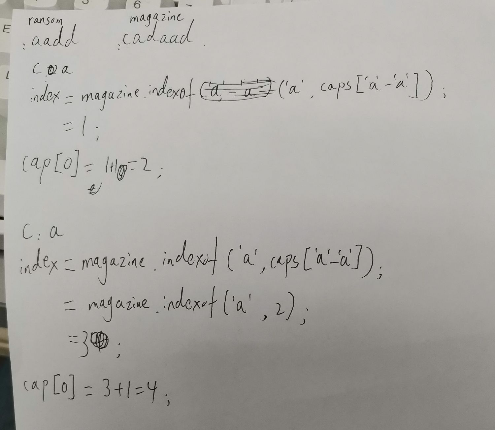

> 原文链接: https://leetcode-cn.com/problems/ransom-note


## 英文原文
<div><p>Given two stings <code>ransomNote</code> and <code>magazine</code>, return <code>true</code> if <code>ransomNote</code> can be constructed from <code>magazine</code> and <code>false</code> otherwise.</p>

<p>Each letter in <code>magazine</code> can only be used once in <code>ransomNote</code>.</p>

<p>&nbsp;</p>
<p><strong>Example 1:</strong></p>
<pre><strong>Input:</strong> ransomNote = "a", magazine = "b"
<strong>Output:</strong> false
</pre><p><strong>Example 2:</strong></p>
<pre><strong>Input:</strong> ransomNote = "aa", magazine = "ab"
<strong>Output:</strong> false
</pre><p><strong>Example 3:</strong></p>
<pre><strong>Input:</strong> ransomNote = "aa", magazine = "aab"
<strong>Output:</strong> true
</pre>
<p>&nbsp;</p>
<p><strong>Constraints:</strong></p>

<ul>
	<li><code>1 &lt;= ransomNote.length, magazine.length &lt;= 10<sup>5</sup></code></li>
	<li><code>ransomNote</code> and <code>magazine</code> consist of lowercase English letters.</li>
</ul>
</div>

## 中文题目
<div><p>为了不在赎金信中暴露字迹，从杂志上搜索各个需要的字母，组成单词来表达意思。</p>

<p>给你一个赎金信 (<code>ransomNote</code>) 字符串和一个杂志(<code>magazine</code>)字符串，判断 <code>ransomNote</code> 能不能由 <code>magazines</code> 里面的字符构成。</p>

<p>如果可以构成，返回 <code>true</code> ；否则返回 <code>false</code> 。</p>

<p><code>magazine</code> 中的每个字符只能在 <code>ransomNote</code> 中使用一次。</p>

<p>&nbsp;</p>

<p><strong>示例 1：</strong></p>

<pre>
<strong>输入：</strong>ransomNote = "a", magazine = "b"
<strong>输出：</strong>false
</pre>

<p><strong>示例 2：</strong></p>

<pre>
<strong>输入：</strong>ransomNote = "aa", magazine = "ab"
<strong>输出：</strong>false
</pre>

<p><strong>示例 3：</strong></p>

<pre>
<strong>输入：</strong>ransomNote = "aa", magazine = "aab"
<strong>输出：</strong>true
</pre>

<p>&nbsp;</p>

<p><strong>提示：</strong></p>

<ul>
	<li><code>1 &lt;= ransomNote.length, magazine.length &lt;= 10<sup>5</sup></code></li>
	<li><code>ransomNote</code> 和 <code>magazine</code> 由小写英文字母组成</li>
</ul>
</div>

## 通过代码
<RecoDemo>
</RecoDemo>


## 高赞题解
```

class Solution {

    public boolean canConstruct(String ransom, String magazine) {

        if (magazine.length() < ransom.length()) return false;

        int caps[] = new int[26];

        for (char c : ransom.toCharArray()) {

            int index = magazine.indexOf(c, caps[c - 'a']);

            if (index == -1)

                return false;

            caps[c - 97] = index + 1;

        }

        return true;

    }

}

```

这个写法真的很精妙，首先，是判定magazine的长度是否小于ransom，如果小于那么一定是false；之后，它实际上是遍历了ransom当中的所有字符，然后在caps中保存的并非是magazine中每类字母的个数，而是在对应当前字符c的magazine中每类字母应该遍历的起始位置，如果index == -1则表示在magazine中从caps指定的遍历位置开始没有找到一样的字符，则输出false；这个大佬的解题思路真的很有意思。

**本人新手，欢迎各位大佬的讨论和指正。**

这是我写的一个可能的运行过程，方便理解（ransom=aadd,magazine=cadaad）：




## 统计信息
| 通过次数 | 提交次数 | AC比率 |
| :------: | :------: | :------: |
|    82846    |    135713    |   61.0%   |

## 提交历史
| 提交时间 | 提交结果 | 执行时间 |  内存消耗  | 语言 |
| :------: | :------: | :------: | :--------: | :--------: |


## 相似题目
|                             题目                             | 难度 |
| :----------------------------------------------------------: | :---------: |
| [贴纸拼词](https://leetcode-cn.com/problems/stickers-to-spell-word/) | 困难|
