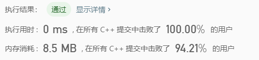

> 原文链接: https://leetcode-cn.com/problems/binary-watch


## 英文原文
<div><p>A binary watch has 4 LEDs on the top which represent the hours (0-11), and the 6 LEDs on the bottom represent the minutes (0-59). Each LED represents a zero or one, with the least significant bit on the right.</p>

<ul>
	<li>For example, the below binary watch reads <code>&quot;4:51&quot;</code>.</li>
</ul>

<p></p>

<p>Given an integer <code>turnedOn</code> which represents the number of LEDs that are currently on, return <em>all possible times the watch could represent</em>. You may return the answer in <strong>any order</strong>.</p>

<p>The hour must not contain a leading zero.</p>

<ul>
	<li>For example, <code>&quot;01:00&quot;</code> is not valid. It should be <code>&quot;1:00&quot;</code>.</li>
</ul>

<p>The minute must be consist of two digits and may contain a leading zero.</p>

<ul>
	<li>For example, <code>&quot;10:2&quot;</code> is not valid. It should be <code>&quot;10:02&quot;</code>.</li>
</ul>

<p>&nbsp;</p>
<p><strong>Example 1:</strong></p>
<pre><strong>Input:</strong> turnedOn = 1
<strong>Output:</strong> ["0:01","0:02","0:04","0:08","0:16","0:32","1:00","2:00","4:00","8:00"]
</pre><p><strong>Example 2:</strong></p>
<pre><strong>Input:</strong> turnedOn = 9
<strong>Output:</strong> []
</pre>
<p>&nbsp;</p>
<p><strong>Constraints:</strong></p>

<ul>
	<li><code>0 &lt;= turnedOn &lt;= 10</code></li>
</ul>
</div>

## 中文题目
<div><p>二进制手表顶部有 4 个 LED 代表<strong> 小时（0-11）</strong>，底部的 6 个 LED 代表<strong> 分钟（0-59）</strong>。每个 LED 代表一个 0 或 1，最低位在右侧。</p>

<ul>
	<li>例如，下面的二进制手表读取 <code>"3:25"</code> 。</li>
</ul>

<p></p>

<p><small><em>（图源：<a href="https://commons.m.wikimedia.org/wiki/File:Binary_clock_samui_moon.jpg">WikiMedia - Binary clock samui moon.jpg</a> ，许可协议：<a href="https://creativecommons.org/licenses/by-sa/3.0/deed.en">Attribution-ShareAlike 3.0 Unported (CC BY-SA 3.0)</a> ）</em></small></p>

<p>给你一个整数 <code>turnedOn</code> ，表示当前亮着的 LED 的数量，返回二进制手表可以表示的所有可能时间。你可以 <strong>按任意顺序</strong> 返回答案。</p>

<p>小时不会以零开头：</p>

<ul>
	<li>例如，<code>"01:00"</code> 是无效的时间，正确的写法应该是 <code>"1:00"</code> 。</li>
</ul>

<p>分钟必须由两位数组成，可能会以零开头：</p>

<ul>
	<li>例如，<code>"10:2"</code> 是无效的时间，正确的写法应该是 <code>"10:02"</code> 。</li>
</ul>

<p> </p>

<p><strong>示例 1：</strong></p>

<pre>
<strong>输入：</strong>turnedOn = 1
<strong>输出：</strong>["0:01","0:02","0:04","0:08","0:16","0:32","1:00","2:00","4:00","8:00"]
</pre>

<p><strong>示例 2：</strong></p>

<pre>
<strong>输入：</strong>turnedOn = 9
<strong>输出：</strong>[]
</pre>

<p> </p>

<p><strong>提示：</strong></p>

<ul>
	<li><code>0 <= turnedOn <= 10</code></li>
</ul>
</div>

## 通过代码
<RecoDemo>
</RecoDemo>


## 高赞题解



```

class Solution {

public:

    vector<string> readBinaryWatch(int num) {

        vector<string> res;

        //直接遍历  0:00 -> 12:00   每个时间有多少1

        for (int i = 0; i < 12; i++) {

            for (int j = 0; j < 60; j++) {

                if (count1(i) + count1(j) == num) {

                    res.push_back(to_string(i)+":"+

                                  (j < 10 ? "0"+to_string(j) : to_string(j)));

                }

            }

        }

        return res;

    }

    //计算二进制中1的个数

    int count1(int n) {

        int res = 0;

        while (n != 0) {

            n = n & (n - 1);

            res++;

        }

        return res;

    }

};

```


## 统计信息
| 通过次数 | 提交次数 | AC比率 |
| :------: | :------: | :------: |
|    55626    |    90363    |   61.6%   |

## 提交历史
| 提交时间 | 提交结果 | 执行时间 |  内存消耗  | 语言 |
| :------: | :------: | :------: | :--------: | :--------: |


## 相似题目
|                             题目                             | 难度 |
| :----------------------------------------------------------: | :---------: |
| [电话号码的字母组合](https://leetcode-cn.com/problems/letter-combinations-of-a-phone-number/) | 中等|
| [位1的个数](https://leetcode-cn.com/problems/number-of-1-bits/) | 简单|
