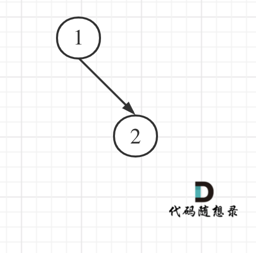

> 原文链接: https://leetcode-cn.com/problems/sum-of-left-leaves


## 英文原文
<div><p>Given the <code>root</code> of a binary tree, return the sum of all left leaves.</p>

<p>&nbsp;</p>
<p><strong>Example 1:</strong></p>

<pre>
<strong>Input:</strong> root = [3,9,20,null,null,15,7]
<strong>Output:</strong> 24
<strong>Explanation:</strong> There are two left leaves in the binary tree, with values 9 and 15 respectively.
</pre>

<p><strong>Example 2:</strong></p>

<pre>
<strong>Input:</strong> root = [1]
<strong>Output:</strong> 0
</pre>

<p>&nbsp;</p>
<p><strong>Constraints:</strong></p>

<ul>
	<li>The number of nodes in the tree is in the range <code>[1, 1000]</code>.</li>
	<li><code>-1000 &lt;= Node.val &lt;= 1000</code></li>
</ul>
</div>

## 中文题目
<div><p>计算给定二叉树的所有左叶子之和。</p>

<p><strong>示例：</strong></p>

<pre>
    3
   / \
  9  20
    /  \
   15   7

在这个二叉树中，有两个左叶子，分别是 9 和 15，所以返回 24</pre>

<p>&nbsp;</p>
</div>

## 通过代码
<RecoDemo>
</RecoDemo>


## 高赞题解


# 思路 

**首先要注意是判断左叶子，不是二叉树左侧节点，所以不要上来想着层序遍历。**

因为题目中其实没有说清楚左叶子究竟是什么节点，那么我来给出左叶子的明确定义：**如果左节点不为空，且左节点没有左右孩子，那么这个节点就是左叶子**

大家思考一下如下图中二叉树，左叶子之和究竟是多少？





**其实是0，因为这棵树根本没有左叶子！**

那么**判断当前节点是不是左叶子是无法判断的，必须要通过节点的父节点来判断其左孩子是不是左叶子。**


如果该节点的左节点不为空，该节点的左节点的左节点为空，该节点的左节点的右节点为空，则找到了一个左叶子，判断代码如下：

```
if (node->left != NULL && node->left->left == NULL && node->left->right == NULL) {
    左叶子节点处理逻辑
}
```

## 递归法

递归的遍历顺序为后序遍历（左右中），是因为要通过递归函数的返回值来累加求取左叶子数值之和。。

递归三部曲：

1. 确定递归函数的参数和返回值 

判断一个树的左叶子节点之和，那么一定要传入树的根节点，递归函数的返回值为数值之和，所以为int 

使用题目中给出的函数就可以了。

2. 确定终止条件 

依然是
```
if (root == NULL) return 0;
```

3. 确定单层递归的逻辑  

当遇到左叶子节点的时候，记录数值，然后通过递归求取左子树左叶子之和，和 右子树左叶子之和，相加便是整个树的左叶子之和。

代码如下：

```
int leftValue = sumOfLeftLeaves(root->left);    // 左
int rightValue = sumOfLeftLeaves(root->right);  // 右
                                                // 中
int midValue = 0;
if (root->left && !root->left->left && !root->left->right) { 
    midValue = root->left->val;
}
int sum = midValue + leftValue + rightValue;
return sum;

```


整体递归代码如下：

```
class Solution {
public:
    int sumOfLeftLeaves(TreeNode* root) {
        if (root == NULL) return 0;

        int leftValue = sumOfLeftLeaves(root->left);    // 左
        int rightValue = sumOfLeftLeaves(root->right);  // 右
                                                        // 中
        int midValue = 0;
        if (root->left && !root->left->left && !root->left->right) { // 中
            midValue = root->left->val;
        }
        int sum = midValue + leftValue + rightValue;
        return sum;
    }
};
```

以上代码精简之后如下：

```
class Solution {
public:
    int sumOfLeftLeaves(TreeNode* root) {
        if (root == NULL) return 0;
        int midValue = 0;
        if (root->left != NULL && root->left->left == NULL && root->left->right == NULL) {
            midValue = root->left->val;
        }
        return midValue + sumOfLeftLeaves(root->left) + sumOfLeftLeaves(root->right);
    }
};
```

## 迭代法 


本题使用了后序遍历啊，那么参考文章 [二叉树：听说递归能做的，栈也能做！](https://mp.weixin.qq.com/s/c_zCrGHIVlBjUH_hJtghCg)和[二叉树：前中后序迭代方式的写法就不能统一一下么？](https://mp.weixin.qq.com/s/WKg0Ty1_3SZkztpHubZPRg)中的写法，同样可以写出一个后序遍历的迭代法。

判断条件都是一样的，代码如下：

```

class Solution {
public:
    int sumOfLeftLeaves(TreeNode* root) {
        stack<TreeNode*> st;
        if (root == NULL) return 0;
        st.push(root);
        int result = 0;
        while (!st.empty()) {
            TreeNode* node = st.top();
            st.pop();
            if (node->left != NULL && node->left->left == NULL && node->left->right == NULL) {
                result += node->left->val;
            }
            if (node->right) st.push(node->right);
            if (node->left) st.push(node->left);
        }
        return result;
    }
};
```

# 总结 

这道题目要求左叶子之和，其实是比较绕的，因为不能判断本节点是不是左叶子节点。

此时就要通过节点的父节点来判断其左孩子是不是左叶子了。 

**平时我们解二叉树的题目时，已经习惯了通过节点的左右孩子判断本节点的属性，而本题我们要通过节点的父节点判断本节点的属性。**

希望通过这道题目，可以扩展大家对二叉树的解题思路。
## 其他语言版本

Java：

**递归**

```java
class Solution {
    public int sumOfLeftLeaves(TreeNode root) {
        if (root == null) return 0;
        int leftValue = sumOfLeftLeaves(root.left);    // 左
        int rightValue = sumOfLeftLeaves(root.right);  // 右
                                                       
        int midValue = 0;
        if (root.left != null && root.left.left == null && root.left.right == null) { // 中
            midValue = root.left.val;
        }
        int sum = midValue + leftValue + rightValue;
        return sum;
    }
}
```

**迭代**

```java
class Solution {
    public int sumOfLeftLeaves(TreeNode root) {
        if (root == null) return 0;
        Stack<TreeNode> stack = new Stack<> ();
        stack.add(root);
        int result = 0;
        while (!stack.isEmpty()) {
            TreeNode node = stack.pop();
            if (node.left != null && node.left.left == null && node.left.right == null) {
                result += node.left.val;
            }
            if (node.right != null) stack.add(node.right);
            if (node.left != null) stack.add(node.left);
        }
        return result;
    }
}
```


Python：
```Python
**递归**
# Definition for a binary tree node.
# class TreeNode:
#     def __init__(self, val=0, left=None, right=None):
#         self.val = val
#         self.left = left
#         self.right = right
class Solution:
    def sumOfLeftLeaves(self, root: TreeNode) -> int:
        self.res=0
        def areleftleaves(root):
            if not root:return
            if root.left and (not root.left.left) and (not root.left.right):self.res+=root.left.val
            areleftleaves(root.left)
            areleftleaves(root.right)
        areleftleaves(root)
        return self.res
```


**如果感觉题解对你有帮助，不要吝啬给一个👍吧！**

------------

**点击[我的头像](https://github.com/youngyangyang04/leetcode-master)**，查看力扣详细刷题攻略，你会发现相见恨晚！


## 统计信息
| 通过次数 | 提交次数 | AC比率 |
| :------: | :------: | :------: |
|    109779    |    186653    |   58.8%   |

## 提交历史
| 提交时间 | 提交结果 | 执行时间 |  内存消耗  | 语言 |
| :------: | :------: | :------: | :--------: | :--------: |
