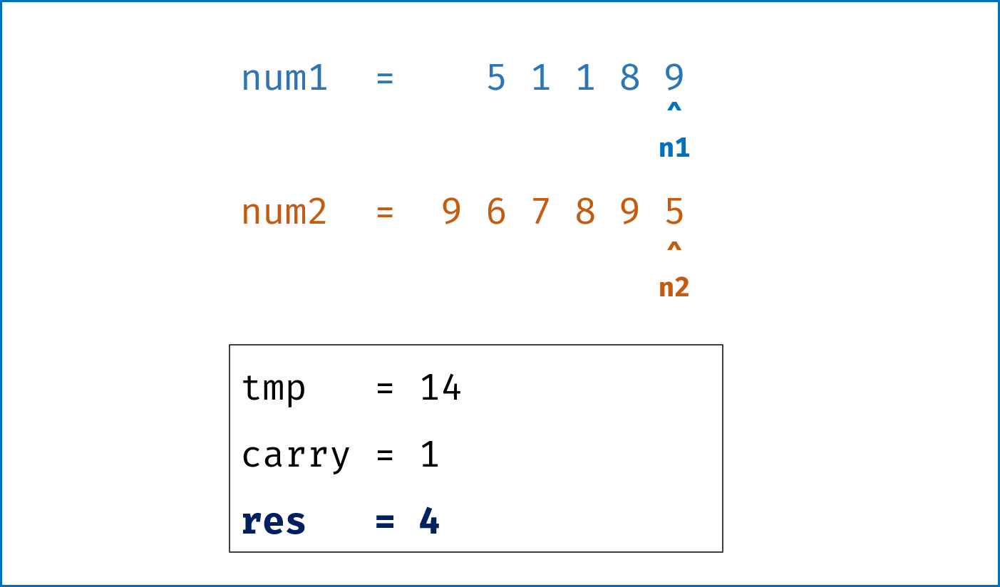

> 原文链接: https://leetcode-cn.com/problems/add-strings


## 英文原文
<div><p>Given two non-negative integers, <code>num1</code> and <code>num2</code> represented as string, return <em>the sum of</em> <code>num1</code> <em>and</em> <code>num2</code> <em>as a string</em>.</p>

<p>You must solve the problem without using any built-in library for handling large integers (such as <code>BigInteger</code>). You must also not convert the inputs to integers directly.</p>

<p>&nbsp;</p>
<p><strong>Example 1:</strong></p>

<pre>
<strong>Input:</strong> num1 = &quot;11&quot;, num2 = &quot;123&quot;
<strong>Output:</strong> &quot;134&quot;
</pre>

<p><strong>Example 2:</strong></p>

<pre>
<strong>Input:</strong> num1 = &quot;456&quot;, num2 = &quot;77&quot;
<strong>Output:</strong> &quot;533&quot;
</pre>

<p><strong>Example 3:</strong></p>

<pre>
<strong>Input:</strong> num1 = &quot;0&quot;, num2 = &quot;0&quot;
<strong>Output:</strong> &quot;0&quot;
</pre>

<p>&nbsp;</p>
<p><strong>Constraints:</strong></p>

<ul>
	<li><code>1 &lt;= num1.length, num2.length &lt;= 10<sup>4</sup></code></li>
	<li><code>num1</code> and <code>num2</code> consist of only digits.</li>
	<li><code>num1</code> and <code>num2</code> don&#39;t have any leading zeros except for the zero itself.</li>
</ul>
</div>

## 中文题目
<div><p>给定两个字符串形式的非负整数&nbsp;<code>num1</code> 和<code>num2</code>&nbsp;，计算它们的和并同样以字符串形式返回。</p>

<p>你不能使用任何內建的用于处理大整数的库（比如 <code>BigInteger</code>），&nbsp;也不能直接将输入的字符串转换为整数形式。</p>

<p>&nbsp;</p>

<p><strong>示例 1：</strong></p>

<pre>
<strong>输入：</strong>num1 = "11", num2 = "123"
<strong>输出：</strong>"134"
</pre>

<p><strong>示例 2：</strong></p>

<pre>
<strong>输入：</strong>num1 = "456", num2 = "77"
<strong>输出：</strong>"533"
</pre>

<p><strong>示例 3：</strong></p>

<pre>
<strong>输入：</strong>num1 = "0", num2 = "0"
<strong>输出：</strong>"0"
</pre>

<p>&nbsp;</p>

<p>&nbsp;</p>

<p><strong>提示：</strong></p>

<ul>
	<li><code>1 &lt;= num1.length, num2.length &lt;= 10<sup>4</sup></code></li>
	<li><code>num1</code> 和<code>num2</code> 都只包含数字&nbsp;<code>0-9</code></li>
	<li><code>num1</code> 和<code>num2</code> 都不包含任何前导零</li>
</ul>
</div>

## 通过代码
<RecoDemo>
</RecoDemo>


## 高赞题解
#### 解题思路：


- **算法流程：** 设定 `i`，`j` 两指针分别指向 `num1`，`num2` 尾部，模拟人工加法；

    - **计算进位：** 计算 `carry = tmp // 10`，代表当前位相加是否产生进位；

    - **添加当前位：** 计算 `tmp = n1 + n2 + carry`，并将当前位 `tmp % 10` 添加至 `res` 头部；

    - **索引溢出处理：** 当指针 `i`或`j` 走过数字首部后，给 `n1`，`n2` 赋值为 $0$，相当于给 `num1`，`num2` 中长度较短的数字前面填 $0$，以便后续计算。

    - 当遍历完 `num1`，`num2` 后跳出循环，并根据 `carry` 值决定是否在头部添加进位 $1$，最终返回 `res` 即可。


- **复杂度分析：**

    - 时间复杂度 $O(max(M,N))$：其中 $M$，$N$ 为 $2$ 数字长度，按位遍历一遍数字（以较长的数字为准）；

    - 空间复杂度 $O(1)$：指针与变量使用常数大小空间。


<,,,,,,,>


#### 代码：


```Python []

class Solution:

    def addStrings(self, num1: str, num2: str) -> str:

        res = ""

        i, j, carry = len(num1) - 1, len(num2) - 1, 0

        while i >= 0 or j >= 0:

            n1 = int(num1[i]) if i >= 0 else 0

            n2 = int(num2[j]) if j >= 0 else 0

            tmp = n1 + n2 + carry

            carry = tmp // 10

            res = str(tmp % 10) + res

            i, j = i - 1, j - 1

        return "1" + res if carry else res

```


```Java []

class Solution {

    public String addStrings(String num1, String num2) {

        StringBuilder res = new StringBuilder("");

        int i = num1.length() - 1, j = num2.length() - 1, carry = 0;

        while(i >= 0 || j >= 0){

            int n1 = i >= 0 ? num1.charAt(i) - '0' : 0;

            int n2 = j >= 0 ? num2.charAt(j) - '0' : 0;

            int tmp = n1 + n2 + carry;

            carry = tmp / 10;

            res.append(tmp % 10);

            i--; j--;

        }

        if(carry == 1) res.append(1);

        return res.reverse().toString();

    }

}

```

## 统计信息
| 通过次数 | 提交次数 | AC比率 |
| :------: | :------: | :------: |
|    160125    |    296444    |   54.0%   |

## 提交历史
| 提交时间 | 提交结果 | 执行时间 |  内存消耗  | 语言 |
| :------: | :------: | :------: | :--------: | :--------: |


## 相似题目
|                             题目                             | 难度 |
| :----------------------------------------------------------: | :---------: |
| [两数相加](https://leetcode-cn.com/problems/add-two-numbers/) | 中等|
| [字符串相乘](https://leetcode-cn.com/problems/multiply-strings/) | 中等|
| [数组形式的整数加法](https://leetcode-cn.com/problems/add-to-array-form-of-integer/) | 简单|
