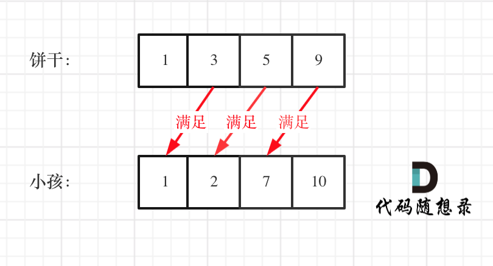

> 原文链接: https://leetcode-cn.com/problems/assign-cookies


## 英文原文
<div><p>Assume you are an awesome parent and want to give your children some cookies. But, you should give each child at most one cookie.</p>

<p>Each child <code>i</code> has a greed factor <code>g[i]</code>, which is the minimum size of a cookie that the child will be content with; and each cookie <code>j</code> has a size <code>s[j]</code>. If <code>s[j] &gt;= g[i]</code>, we can assign the cookie <code>j</code> to the child <code>i</code>, and the child <code>i</code> will be content. Your goal is to maximize the number of your content children and output the maximum number.</p>

<p>&nbsp;</p>
<p><strong>Example 1:</strong></p>

<pre>
<strong>Input:</strong> g = [1,2,3], s = [1,1]
<strong>Output:</strong> 1
<strong>Explanation:</strong> You have 3 children and 2 cookies. The greed factors of 3 children are 1, 2, 3. 
And even though you have 2 cookies, since their size is both 1, you could only make the child whose greed factor is 1 content.
You need to output 1.
</pre>

<p><strong>Example 2:</strong></p>

<pre>
<strong>Input:</strong> g = [1,2], s = [1,2,3]
<strong>Output:</strong> 2
<strong>Explanation:</strong> You have 2 children and 3 cookies. The greed factors of 2 children are 1, 2. 
You have 3 cookies and their sizes are big enough to gratify all of the children, 
You need to output 2.
</pre>

<p>&nbsp;</p>
<p><strong>Constraints:</strong></p>

<ul>
	<li><code>1 &lt;= g.length &lt;= 3 * 10<sup>4</sup></code></li>
	<li><code>0 &lt;= s.length &lt;= 3 * 10<sup>4</sup></code></li>
	<li><code>1 &lt;= g[i], s[j] &lt;= 2<sup>31</sup> - 1</code></li>
</ul>
</div>

## 中文题目
<div><p>假设你是一位很棒的家长，想要给你的孩子们一些小饼干。但是，每个孩子最多只能给一块饼干。</p>

<p>对每个孩子 <code>i</code>，都有一个胃口值 <code>g[i]</code><sub>，</sub>这是能让孩子们满足胃口的饼干的最小尺寸；并且每块饼干 <code>j</code>，都有一个尺寸 <code>s[j]</code><sub> </sub>。如果 <code>s[j] >= g[i]</code>，我们可以将这个饼干 <code>j</code> 分配给孩子 <code>i</code> ，这个孩子会得到满足。你的目标是尽可能满足越多数量的孩子，并输出这个最大数值。</p>
 

<p><strong>示例 1:</strong></p>

<pre>
<strong>输入:</strong> g = [1,2,3], s = [1,1]
<strong>输出:</strong> 1
<strong>解释:</strong> 
你有三个孩子和两块小饼干，3个孩子的胃口值分别是：1,2,3。
虽然你有两块小饼干，由于他们的尺寸都是1，你只能让胃口值是1的孩子满足。
所以你应该输出1。
</pre>

<p><strong>示例 2:</strong></p>

<pre>
<strong>输入:</strong> g = [1,2], s = [1,2,3]
<strong>输出:</strong> 2
<strong>解释:</strong> 
你有两个孩子和三块小饼干，2个孩子的胃口值分别是1,2。
你拥有的饼干数量和尺寸都足以让所有孩子满足。
所以你应该输出2.
</pre>

<p> </p>

<p><strong>提示：</strong></p>

<ul>
	<li><code>1 <= g.length <= 3 * 10<sup>4</sup></code></li>
	<li><code>0 <= s.length <= 3 * 10<sup>4</sup></code></li>
	<li><code>1 <= g[i], s[j] <= 2<sup>31</sup> - 1</code></li>
</ul>
</div>

## 通过代码
<RecoDemo>
</RecoDemo>


## 高赞题解
> **点击上方关注「代码随想录」，算法路上不迷路！**

## 思路 

**不少同学对贪心算法还处于朦胧状态，我特意录了一期视频，讲一讲[贪心算法理论基础](https://www.bilibili.com/video/BV1WK4y1R71x)**，这里详细介绍了我们做贪心算法的时候常遇到的问题，相信结合本篇题解，会对你学习贪心有所帮助。


为了了满足更多的小孩，就不要造成饼干尺寸的浪费。

大尺寸的饼干既可以满足胃口大的孩子也可以满足胃口小的孩子，那么就应该优先满足胃口大的。

**这里的局部最优就是大饼干喂给胃口大的，充分利用饼干尺寸喂饱一个，全局最优就是喂饱尽可能多的小孩**。

可以尝试使用贪心策略，先将饼干数组和小孩数组排序。

然后从后向前遍历小孩数组，用大饼干优先满足胃口大的，并统计满足小孩数量。

如图：



这个例子可以看出饼干9只有喂给胃口为7的小孩，这样才是整体最优解，并想不出反例，那么就可以撸代码了。


C++代码整体如下：

```C++
// 时间复杂度：O(nlogn)
// 空间复杂度：O(1)
class Solution {
public:
    int findContentChildren(vector<int>& g, vector<int>& s) {
        sort(g.begin(), g.end());
        sort(s.begin(), s.end());
        int index = s.size() - 1; // 饼干数组的下表
        int result = 0;
        for (int i = g.size() - 1; i >= 0; i--) {
            if (index >= 0 && s[index] >= g[i]) {
                result++;
                index--;
            }
        }
        return result;
    }
};
```

从代码中可以看出我用了一个index来控制饼干数组的遍历，遍历饼干并没有再起一个for循环，而是采用自减的方式，这也是常用的技巧。

有的同学看到要遍历两个数组，就想到用两个for循环，那样逻辑其实就复杂了。

**也可以换一个思路，小饼干先喂饱小胃口**

代码如下：

```C++
class Solution {
public:
    int findContentChildren(vector<int>& g, vector<int>& s) {
        sort(g.begin(),g.end());
        sort(s.begin(),s.end());
        int index = 0;
        for(int i = 0;i < s.size();++i){
            if(index < g.size() && g[index] <= s[i]){
                index++;
            }
        }
        return index;
    }
};
```

## 总结

这道题是贪心很好的一道入门题目，思路还是比较容易想到的。

文中详细介绍了思考的过程，**想清楚局部最优，想清楚全局最优，感觉局部最优是可以推出全局最优，并想不出反例，那么就试一试贪心**。

## 其他语言版本


Java：
```java
class Solution {
    public int findContentChildren(int[] g, int[] s) {
        Arrays.sort(g);
        Arrays.sort(s);
        int start = 0;
        int count = 0;
        for (int i = 0; i < s.length && start < g.length; i++) {
            if (s[i] >= g[start]) {
                start++;
                count++;
            }
        }
        return count;
    }
}
```

Python：
```python3
class Solution:
    def findContentChildren(self, g: List[int], s: List[int]) -> int:
        g.sort()
        s.sort()
        res = 0
        for i in range(len(s)):
            if res <len(g) and s[i] >= g[res]:  #小饼干先喂饱小胃口
                res += 1
        return res
```
Go：

Javascript:
```Javascript

var findContentChildren = function(g, s) {
    g = g.sort((a, b) => a - b)
    s = s.sort((a, b) => a - b)
    let result = 0
    let index = s.length - 1
    for(let i = g.length - 1; i >= 0; i--) {
        if(index >= 0 && s[index] >= g[i]) {
            result++
            index--
        }
    } 
    return result
};

```


**如果感觉题解对你有帮助，不要吝啬给一个👍吧！**

------------

**大家好，我是Carl，点击[我的头像](https://mp.weixin.qq.com/s/_DzddsMeQW5JPI6qoC7ARQ)**，查看力扣详细刷题攻略，你会发现相见恨晚！


## 统计信息
| 通过次数 | 提交次数 | AC比率 |
| :------: | :------: | :------: |
|    164792    |    286176    |   57.6%   |

## 提交历史
| 提交时间 | 提交结果 | 执行时间 |  内存消耗  | 语言 |
| :------: | :------: | :------: | :--------: | :--------: |
