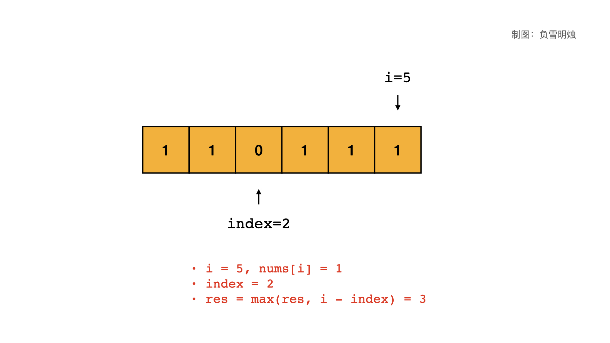

> 原文链接: https://leetcode-cn.com/problems/max-consecutive-ones


## 英文原文
<div><p>Given a binary array <code>nums</code>, return <em>the maximum number of consecutive </em><code>1</code><em>&#39;s in the array</em>.</p>

<p>&nbsp;</p>
<p><strong>Example 1:</strong></p>

<pre>
<strong>Input:</strong> nums = [1,1,0,1,1,1]
<strong>Output:</strong> 3
<strong>Explanation:</strong> The first two digits or the last three digits are consecutive 1s. The maximum number of consecutive 1s is 3.
</pre>

<p><strong>Example 2:</strong></p>

<pre>
<strong>Input:</strong> nums = [1,0,1,1,0,1]
<strong>Output:</strong> 2
</pre>

<p>&nbsp;</p>
<p><strong>Constraints:</strong></p>

<ul>
	<li><code>1 &lt;= nums.length &lt;= 10<sup>5</sup></code></li>
	<li><code>nums[i]</code> is either <code>0</code> or <code>1</code>.</li>
</ul>
</div>

## 中文题目
<div><p>给定一个二进制数组， 计算其中最大连续 1 的个数。</p>

<p> </p>

<p><strong>示例：</strong></p>

<pre>
<strong>输入：</strong>[1,1,0,1,1,1]
<strong>输出：</strong>3
<strong>解释：</strong>开头的两位和最后的三位都是连续 1 ，所以最大连续 1 的个数是 3.
</pre>

<p> </p>

<p><strong>提示：</strong></p>

<ul>
	<li>输入的数组只包含 <code>0</code> 和 <code>1</code> 。</li>
	<li>输入数组的长度是正整数，且不超过 10,000。</li>
</ul>
</div>

## 通过代码
<RecoDemo>
</RecoDemo>


## 高赞题解
各位题友大家好！ 今天是 **[@负雪明烛](/u/fuxuemingzhu/)** 坚持日更的第 **22** 天。今天力扣上的每日一题是「[485. 最大连续1的个数](https://leetcode-cn.com/problems/max-consecutive-ones/)」。

# 解题思路


今天的题目简单，我们直接分析思路：


1. 可以对数组遍历一次，遍历时需要保存遇到的最后一个 $0$ 的位置 $index$；
2. 如果遍历到 $i$ 位置的数字是 $0$，那么更新 $index$ 为当前位置 $i$；
3. 如果遍历到 $i$ 位置的数字是 $1$，那么当前区间内共有 $i - index$ 个连续的 $1$；
4. 记录遍历过程中所有连续的 $1$ 的长度的最大值。

对于题目给出的示例 `[1,1,0,1,1,1]`，我做了动图帮助理解：


动图对应的 PPT 如下，可以逐步点击观看：

<,,,,,,,,,,,>


# 代码


代码中的 $index$ 保存的是遍历到的最后的一个 $0$ 的位置，其默认值是 $-1$。


python 代码如下：


```python
class Solution(object):
    def findMaxConsecutiveOnes(self, nums):
        """
        :type nums: List[int]
        :rtype: int
        """
        index = -1
        res = 0
        for i, num in enumerate(nums):
            if num == 0:
                index = i
            else:
                res = max(res, i - index)
        return res
```

- 时间复杂度：$O(N)$
- 空间复杂度：$O(1)$


# 刷题心得


今天的题也是个滑动窗口，但是我们只用保存最后一个 0 出现的位置就行，没必要套用双指针模板。

----


OK，以上就是 [@负雪明烛](https://leetcode-cn.com/u/fuxuemingzhu/) 写的今天题解的全部内容了，如果你觉得有帮助的话，**求赞、求关注、求收藏**。如果有疑问的话，请在下面评论，我会及时解答。


**关注我**，你将不会错过我的精彩动画题解、面试题分享、组队刷题活动，进入主页 [@负雪明烛](https://leetcode-cn.com/u/fuxuemingzhu/) 右侧有刷题组织，从此刷题不再孤单。


祝大家牛年大吉！AC 多多，Offer 多多！我们明天再见！

## 统计信息
| 通过次数 | 提交次数 | AC比率 |
| :------: | :------: | :------: |
|    129476    |    212902    |   60.8%   |

## 提交历史
| 提交时间 | 提交结果 | 执行时间 |  内存消耗  | 语言 |
| :------: | :------: | :------: | :--------: | :--------: |


## 相似题目
|                             题目                             | 难度 |
| :----------------------------------------------------------: | :---------: |
| [最大连续1的个数 II](https://leetcode-cn.com/problems/max-consecutive-ones-ii/) | 中等|
| [最大连续1的个数 III](https://leetcode-cn.com/problems/max-consecutive-ones-iii/) | 中等|
