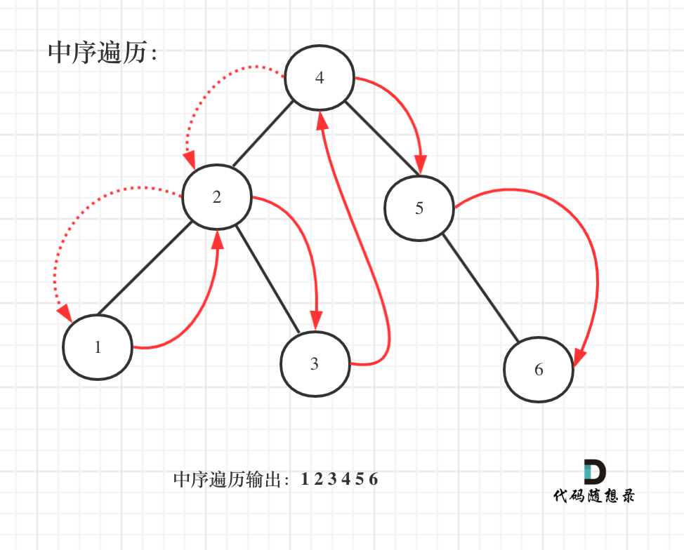

> 原文链接: https://leetcode-cn.com/problems/find-mode-in-binary-search-tree


## 英文原文
<div><p>Given the <code>root</code> of a binary search tree (BST) with duplicates, return <em>all the <a href="https://en.wikipedia.org/wiki/Mode_(statistics)" target="_blank">mode(s)</a> (i.e., the most frequently occurred element) in it</em>.</p>

<p>If the tree has more than one mode, return them in <strong>any order</strong>.</p>

<p>Assume a BST is defined as follows:</p>

<ul>
	<li>The left subtree of a node contains only nodes with keys <strong>less than or equal to</strong> the node&#39;s key.</li>
	<li>The right subtree of a node contains only nodes with keys <strong>greater than or equal to</strong> the node&#39;s key.</li>
	<li>Both the left and right subtrees must also be binary search trees.</li>
</ul>

<p>&nbsp;</p>
<p><strong>Example 1:</strong></p>

<pre>
<strong>Input:</strong> root = [1,null,2,2]
<strong>Output:</strong> [2]
</pre>

<p><strong>Example 2:</strong></p>

<pre>
<strong>Input:</strong> root = [0]
<strong>Output:</strong> [0]
</pre>

<p>&nbsp;</p>
<p><strong>Constraints:</strong></p>

<ul>
	<li>The number of nodes in the tree is in the range <code>[1, 10<sup>4</sup>]</code>.</li>
	<li><code>-10<sup>5</sup> &lt;= Node.val &lt;= 10<sup>5</sup></code></li>
</ul>

<p>&nbsp;</p>
<strong>Follow up:</strong> Could you do that without using any extra space? (Assume that the implicit stack space incurred due to recursion does not count).</div>

## 中文题目
<div><p>给定一个有相同值的二叉搜索树（BST），找出 BST 中的所有众数（出现频率最高的元素）。</p>

<p>假定 BST 有如下定义：</p>

<ul>
	<li>结点左子树中所含结点的值小于等于当前结点的值</li>
	<li>结点右子树中所含结点的值大于等于当前结点的值</li>
	<li>左子树和右子树都是二叉搜索树</li>
</ul>

<p>例如：<br>
给定 BST <code>[1,null,2,2]</code>,</p>

<pre>   1
    \
     2
    /
   2
</pre>

<p><code>返回[2]</code>.</p>

<p><strong>提示</strong>：如果众数超过1个，不需考虑输出顺序</p>

<p><strong>进阶：</strong>你可以不使用额外的空间吗？（假设由递归产生的隐式调用栈的开销不被计算在内）</p>
</div>

## 通过代码
<RecoDemo>
</RecoDemo>


## 高赞题解
#### 解题思路：

#### 暴力统计法

这看到这道题目，最直观的方法一定是把这个树都遍历了，用 `map` 统计频率，用 `vector` 排个序，最后出去前面高频的元素。

其实这是可以的，也是有效的，面试中时间紧张，可能快速的把这个方法实现出来，后面在考虑满满优化。


至于用前中后序那种遍历也不重要，因为就是要全遍历一遍，怎么个遍历法都行，层序遍历都没毛病！


```C++ []
class Solution {
private:

void searchBST(TreeNode* cur, unordered_map<int, int>& map) { // 前序遍历
    if (cur == NULL) return ;
    map[cur->val]++; // 统计元素频率
    searchBST(cur->left, map);
    searchBST(cur->right, map);
    return ;
}
bool static cmp (const pair<int, int>& a, const pair<int, int>& b) {
    return a.second > b.second;
}
public:
    vector<int> findMode(TreeNode* root) {
        unordered_map<int, int> map;
        vector<int> result;
        if (root == NULL) return result;
        searchBST(root, map);
        vector<pair<int, int>> vec(map.begin(), map.end());
        sort(vec.begin(), vec.end(), cmp); // 给频率排个序
        result.push_back(vec[0].first);
        for (int i = 1; i < vec.size(); i++) {
            if (vec[i].second == vec[0].second) result.push_back(vec[i].first);
            else break;
        }
        return result;
    }
};
```

**这种方法的缺点是没有利用上二叉搜索树这一特性**，如果用这种方法，这道题就可以是普通的二叉树就行了，反正都要全撸一遍统计频率。

##### 中序遍历 


既然是搜索树，它就是有序的，如何有序呢？ 

**搜索树在中序遍历的过程中，就是有序序列，所以此时的问题相当于 给出如果给出一个有序数组，求最大频率的元素集合。** 

**所以我们要采用中序遍历！**

如图：




中序遍历代码如下：

```
    void searchBST(TreeNode* cur) {
        if (cur == NULL) return ;
        searchBST(cur->left);       // 左
        （处理节点）                // 中
        searchBST(cur->right);      // 右
        return ;
    }
```

遍历有序数组的元素出现频率，从头遍历，那么一定是相邻两个元素作比较，要是数组的话，好搞，在树上怎么搞呢？ 

需要弄一个指针指向前一个节点，这样每次 `cur`（当前节点）才能和 `pre`（前一个节点）作比较。

而且初始化的时候 `pre = NULL`，这样当 `pre` 为 `NULL` 时候，我们就知道这是比较的第一个元素，然后再给 `pre` 赋值即 `pre = cur`;

代码如下：

```
        if (pre == NULL) { // 第一个节点
            count = 1;
        } else if (pre->val == cur->val) { // 与前一个节点数值相同
            count++;
        } else { // 与前一个节点数值不同
            count = 1;
        }
        pre = cur; // 更新上一个节点
```

此时又有问题了，因为要求最大频率的元素集合，直观想的想法是要先遍历一遍找出频率最大的次数 `maxCount`，然后在重新遍历一遍再把出现频率为 `maxCount` 的元素放进集合。


那么如何只遍历一遍呢？

如果 频率 `count` 等于 `maxCount`，当然要把这个元素加入到结果集中（以下代码为 `result` 数组），代码如下：

```
        if (count == maxCount) { // 如果和最大值相同，放进result中
            result.push_back(cur->val);
        }
```

当时感觉这里有问题，`result` 怎么能轻易就把元素放进去了呢，万一，这个 `maxCount` 此时还不是真正最大值呢。

所以下面要做如下操作：

频率 `count` 大于 `maxCount` 的时候，不仅要更新 `maxCount`，而且要清空结果集（以下代码为 `result` 数组），因为结果集之前的元素都失效了。

```
        if (count > maxCount) { // 如果计数大于最大值
            maxCount = count;
            result.clear();     // 很关键的一步，不要忘记清空result，之前result里的元素都失效了
            result.push_back(cur->val);
        }
```

关键代码都讲完了，完整代码如下：


```
class Solution {
private:
    int count;
    int maxCount;
    TreeNode* pre;
    vector<int> result;
    void searchBST(TreeNode* cur) {
        if (cur == NULL) return ;

        searchBST(cur->left);       // 左
                                    // 中
        if (pre == NULL) { // 第一个节点
            count = 1;
        } else if (pre->val == cur->val) { // 与前一个节点数值相同
            count++;
        } else { // 与前一个节点数值不同
            count = 1;
        }
        pre = cur; // 更新上一个节点

        if (count == maxCount) { // 如果和最大值相同，放进result中
            result.push_back(cur->val);
        }

        if (count > maxCount) { // 如果计数大于最大值
            maxCount = count;
            result.clear();     // 很关键的一步，不要忘记清空result，之前result里的元素都失效了
            result.push_back(cur->val);
        }

        searchBST(cur->right);      // 右
        return ;
    }

public:
    vector<int> findMode(TreeNode* root) {
        int count = 0; // 记录元素出现次数
        int maxCount = 0;
        TreeNode* pre = NULL; // 记录前一个节点
        result.clear();

        searchBST(root);
        return result;
    }
};
```

此时的运行效率：


## 统计信息
| 通过次数 | 提交次数 | AC比率 |
| :------: | :------: | :------: |
|    71244    |    137971    |   51.6%   |

## 提交历史
| 提交时间 | 提交结果 | 执行时间 |  内存消耗  | 语言 |
| :------: | :------: | :------: | :--------: | :--------: |


## 相似题目
|                             题目                             | 难度 |
| :----------------------------------------------------------: | :---------: |
| [验证二叉搜索树](https://leetcode-cn.com/problems/validate-binary-search-tree/) | 中等|
