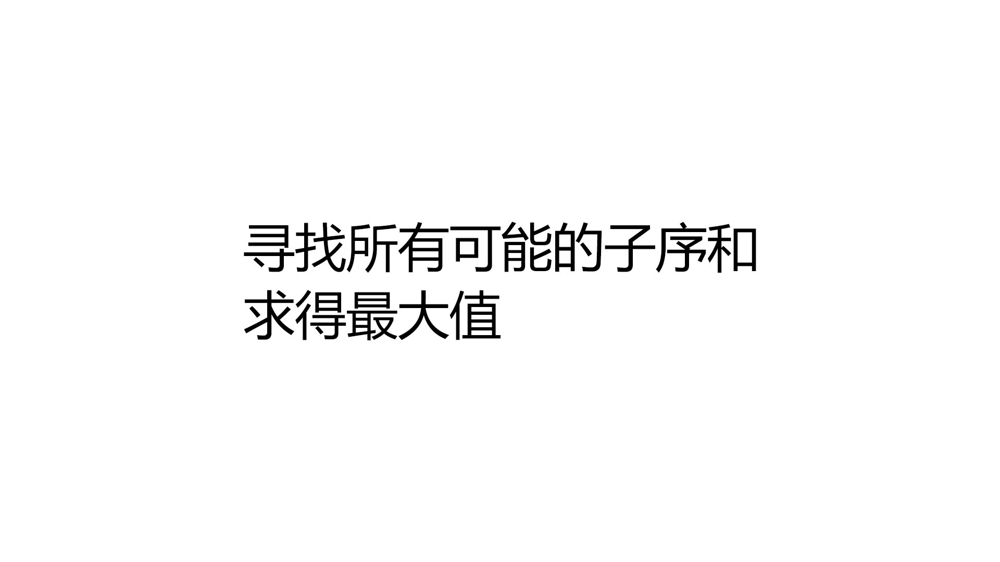
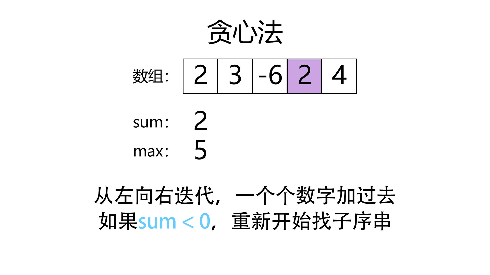

> 原文链接: https://leetcode-cn.com/problems/maximum-subarray


## 英文原文
<div><p>Given an integer array <code>nums</code>, find the contiguous subarray (containing at least one number) which has the largest sum and return <em>its sum</em>.</p>

<p>A <strong>subarray</strong> is a <strong>contiguous</strong> part of an array.</p>

<p>&nbsp;</p>
<p><strong>Example 1:</strong></p>

<pre>
<strong>Input:</strong> nums = [-2,1,-3,4,-1,2,1,-5,4]
<strong>Output:</strong> 6
<strong>Explanation:</strong> [4,-1,2,1] has the largest sum = 6.
</pre>

<p><strong>Example 2:</strong></p>

<pre>
<strong>Input:</strong> nums = [1]
<strong>Output:</strong> 1
</pre>

<p><strong>Example 3:</strong></p>

<pre>
<strong>Input:</strong> nums = [5,4,-1,7,8]
<strong>Output:</strong> 23
</pre>

<p>&nbsp;</p>
<p><strong>Constraints:</strong></p>

<ul>
	<li><code>1 &lt;= nums.length &lt;= 10<sup>5</sup></code></li>
	<li><code>-10<sup>4</sup> &lt;= nums[i] &lt;= 10<sup>4</sup></code></li>
</ul>

<p>&nbsp;</p>
<p><strong>Follow up:</strong> If you have figured out the <code>O(n)</code> solution, try coding another solution using the <strong>divide and conquer</strong> approach, which is more subtle.</p>
</div>

## 中文题目
<div><p>给你一个整数数组 <code>nums</code> ，请你找出一个具有最大和的连续子数组（子数组最少包含一个元素），返回其最大和。</p>

<p><strong>子数组 </strong>是数组中的一个连续部分。</p>

<p>&nbsp;</p>

<p><strong>示例 1：</strong></p>

<pre>
<strong>输入：</strong>nums = [-2,1,-3,4,-1,2,1,-5,4]
<strong>输出：</strong>6
<strong>解释：</strong>连续子数组&nbsp;[4,-1,2,1] 的和最大，为&nbsp;6 。
</pre>

<p><strong>示例 2：</strong></p>

<pre>
<strong>输入：</strong>nums = [1]
<strong>输出：</strong>1
</pre>

<p><strong>示例 3：</strong></p>

<pre>
<strong>输入：</strong>nums = [5,4,-1,7,8]
<strong>输出：</strong>23
</pre>

<p>&nbsp;</p>

<p><strong>提示：</strong></p>

<ul>
	<li><code>1 &lt;= nums.length &lt;= 10<sup>5</sup></code></li>
	<li><code>-10<sup>4</sup> &lt;= nums[i] &lt;= 10<sup>4</sup></code></li>
</ul>

<p>&nbsp;</p>

<p><strong>进阶：</strong>如果你已经实现复杂度为 <code>O(n)</code> 的解法，尝试使用更为精妙的 <strong>分治法</strong> 求解。</p>
</div>

## 通过代码
<RecoDemo>
</RecoDemo>


## 高赞题解


<,,,>


### 代码：


```

class Solution

{

public:

    int maxSubArray(vector<int> &nums)

    {

        //类似寻找最大最小值的题目，初始值一定要定义成理论上的最小最大值

        int max = INT_MIN;

        int numsSize = int(nums.size());

        for (int i = 0; i < numsSize; i++)

        {

            int sum = 0;

            for (int j = i; j < numsSize; j++)

            {

                sum += nums[j];

                if (sum > max)

                {

                    max = sum;

                }

            }

        }


        return max;

    }

};

```


<,,,,,,,,,,>


### 代码：

```

class Solution

{

public:

    int maxSubArray(vector<int> &nums)

    {

        //类似寻找最大最小值的题目，初始值一定要定义成理论上的最小最大值

        int result = INT_MIN;

        int numsSize = int(nums.size());

        //dp[i]表示nums中以nums[i]结尾的最大子序和

        vector<int> dp(numsSize);

        dp[0] = nums[0];

        result = dp[0];

        for (int i = 1; i < numsSize; i++)

        {

            dp[i] = max(dp[i - 1] + nums[i], nums[i]);

            result = max(result, dp[i]);

        }


        return result;

    }

};

```

```

class Solution

{

public:

    int maxSubArray(vector<int> &nums)

    {

        //类似寻找最大最小值的题目，初始值一定要定义成理论上的最小最大值

        int result = INT_MIN;

        int numsSize = int(nums.size());

        //因为只需要知道dp的前一项，我们用int代替一维数组

        int dp(nums[0]);

        result = dp;

        for (int i = 1; i < numsSize; i++)

        {

            dp = max(dp + nums[i], nums[i]);

            result = max(result, dp);

        }


        return result;

    }

};

```


<,,,,,,,,>

### 代码：


```

class Solution

{

public:

    int maxSubArray(vector<int> &nums)

    {

        //类似寻找最大最小值的题目，初始值一定要定义成理论上的最小最大值

        int result = INT_MIN;

        int numsSize = int(nums.size());

        int sum = 0;

        for (int i = 0; i < numsSize; i++)

        {

            sum += nums[i];

            result = max(result, sum);

            //如果sum < 0，重新开始找子序串

            if (sum < 0)

            {

                sum = 0;

            }

        }


        return result;

    }

};

```


<,,,,,,,,,,>


### 代码：


```

class Solution

{

public:

    int maxSubArray(vector<int> &nums)

    {

        //类似寻找最大最小值的题目，初始值一定要定义成理论上的最小最大值

        int result = INT_MIN;

        int numsSize = int(nums.size());

        result = maxSubArrayHelper(nums, 0, numsSize - 1);

        return result;

    }


    int maxSubArrayHelper(vector<int> &nums, int left, int right)

    {

        if (left == right)

        {

            return nums[left];

        }

        int mid = (left + right) / 2;

        int leftSum = maxSubArrayHelper(nums, left, mid);

        //注意这里应是mid + 1，否则left + 1 = right时，会无线循环

        int rightSum = maxSubArrayHelper(nums, mid + 1, right);

        int midSum = findMaxCrossingSubarray(nums, left, mid, right);

        int result = max(leftSum, rightSum);

        result = max(result, midSum);

        return result;

    }


    int findMaxCrossingSubarray(vector<int> &nums, int left, int mid, int right)

    {

        int leftSum = INT_MIN;

        int sum = 0;

        for (int i = mid; i >= left; i--)

        {

            sum += nums[i];

            leftSum = max(leftSum, sum);

        }


        int rightSum = INT_MIN;

        sum = 0;

        //注意这里i = mid + 1，避免重复用到nums[i]

        for (int i = mid + 1; i <= right; i++)

        {

            sum += nums[i];

            rightSum = max(rightSum, sum);

        }

        return (leftSum + rightSum);

    }

};

```


## 统计信息
| 通过次数 | 提交次数 | AC比率 |
| :------: | :------: | :------: |
|    765556    |    1383530    |   55.3%   |

## 提交历史
| 提交时间 | 提交结果 | 执行时间 |  内存消耗  | 语言 |
| :------: | :------: | :------: | :--------: | :--------: |


## 相似题目
|                             题目                             | 难度 |
| :----------------------------------------------------------: | :---------: |
| [买卖股票的最佳时机](https://leetcode-cn.com/problems/best-time-to-buy-and-sell-stock/) | 简单|
| [乘积最大子数组](https://leetcode-cn.com/problems/maximum-product-subarray/) | 中等|
| [数组的度](https://leetcode-cn.com/problems/degree-of-an-array/) | 简单|
| [最长湍流子数组](https://leetcode-cn.com/problems/longest-turbulent-subarray/) | 中等|
