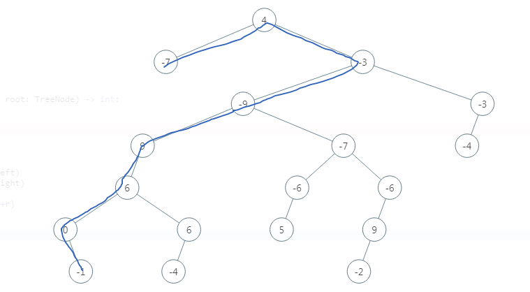

> 原文链接: https://leetcode-cn.com/problems/diameter-of-binary-tree


## 英文原文
<div><p>Given the <code>root</code> of a binary tree, return <em>the length of the <strong>diameter</strong> of the tree</em>.</p>

<p>The <strong>diameter</strong> of a binary tree is the <strong>length</strong> of the longest path between any two nodes in a tree. This path may or may not pass through the <code>root</code>.</p>

<p>The <strong>length</strong> of a path between two nodes is represented by the number of edges between them.</p>

<p>&nbsp;</p>
<p><strong>Example 1:</strong></p>

<pre>
<strong>Input:</strong> root = [1,2,3,4,5]
<strong>Output:</strong> 3
<strong>Explanation:</strong> 3 is the length of the path [4,2,1,3] or [5,2,1,3].
</pre>

<p><strong>Example 2:</strong></p>

<pre>
<strong>Input:</strong> root = [1,2]
<strong>Output:</strong> 1
</pre>

<p>&nbsp;</p>
<p><strong>Constraints:</strong></p>

<ul>
	<li>The number of nodes in the tree is in the range <code>[1, 10<sup>4</sup>]</code>.</li>
	<li><code>-100 &lt;= Node.val &lt;= 100</code></li>
</ul>
</div>

## 中文题目
<div><p>给定一棵二叉树，你需要计算它的直径长度。一棵二叉树的直径长度是任意两个结点路径长度中的最大值。这条路径可能穿过也可能不穿过根结点。</p>

<p>&nbsp;</p>

<p><strong>示例 :</strong><br>
给定二叉树</p>

<pre>          1
         / \
        2   3
       / \     
      4   5    
</pre>

<p>返回&nbsp;<strong>3</strong>, 它的长度是路径 [4,2,1,3] 或者&nbsp;[5,2,1,3]。</p>

<p>&nbsp;</p>

<p><strong>注意：</strong>两结点之间的路径长度是以它们之间边的数目表示。</p>
</div>

## 通过代码
<RecoDemo>
</RecoDemo>


## 高赞题解

### 1.不动脑筋的下场。。

看到树就是递归，然后看题目写着求直径，还可能穿过根节点，诶那岂不是`直径=左子树高度+右子树高度`

```
class Solution:
    def diameterOfBinaryTree(self, root: TreeNode) -> int:
        if not root:
            return 0
        
        return self.get_height(root.left) + self.get_height(root.right) 
    
    def get_height(self, root):
        if not root:
            return 0
        return max(self.get_height(root.left), self.get_height(root.right)) + 1
```
然后吭哧吭哧写完，瞎写了几个测试用例还刚好过了，一点提交，就美滋滋挂了...


一看错了的用例：
`[4,-7,-3,null,null,-9,-3,9,-7,-4,null,6,null,-6,-6,null,null,0,6,5,null,9,null,null,-1,-4,null,null,null,-2]`
可视化看看样子：




我找半天都是蓝色那条线最长，一直不理解为什么结果是8.....为什么888888888888888888，内心只想886

然后去看解析，好多也都是`直径=左子树高度+右子树高度`
我迷惑了，直接Google

看到别人的解题思路：
```
二叉树的直径：二叉树中从一个结点到另一个节点最长的路径，叫做二叉树的直径
采用分治和递归的思想：
    - 根节点为root的二叉树的直径 = max(root->left的直径，root->right的直径，root->left的最大深度+root->right的最大深度+1)
```
好吧，还是没看懂，但是至少我知道了好像。。题目是说**任意两个结点的路径**
那么至少我找到了答案的那条线，是红色的这个，路径长度为8而不是7：


继续Google看到：
```
二叉树上的任一“路径”上一定有一个结点是所有其他结点的祖先结点（因为“路径”是由一个个父子关系连接而成的），那么换个表述方法，对于任一结点，以此结点为根的diameter就可以表示为左子树高度 + 右子树高度，而二叉树的diameter就是所有结点为根的diameter中最大的那个。
```
好像还是没太懂，但看起来大概是每个结点的直径都要被保存，并每次进行比较更新，这样最长直径的root是红色圆圈里的点，此时它作为root结点的时候，左右子树的长度之和是最大的，所以重点是**任意一个结点，都要记录以此结点为根的直径情况：左子树高度+右子树高度**

### 2.多思考多思考。。。

好像懂了这个是什么意思了，那么我得需要一个值来保存我这个每次比较更新的最大直径值，用`self.max = 0`来初始化这个值
在每次获得一个节点的左子树和右子树的值的时候，都需要比较一下`self.max`和`左子树高度+右子树高度`的大小，把更大的保存下来
然后如何求左子树和右子树的高度呢，那就是经典的**递归求高度问题**：`max(depth(root.left), depth(root.right))+1`

于是就可以修改我的代码了：
```
class Solution:
    
    def __init__(self):
        self.max = 0
    
    def diameterOfBinaryTree(self, root: TreeNode) -> int:
        self.depth(root)
        
        return self.max
        
    def depth(self, root):
        if not root:
            return 0
        l = self.depth(root.left)
        r = self.depth(root.right)
        '''每个结点都要去判断左子树+右子树的高度是否大于self.max，更新最大值'''
        self.max = max(self.max, l+r)
        
        # 返回的是高度
        return max(l, r) + 1
        
```


## 统计信息
| 通过次数 | 提交次数 | AC比率 |
| :------: | :------: | :------: |
|    160657    |    289117    |   55.6%   |

## 提交历史
| 提交时间 | 提交结果 | 执行时间 |  内存消耗  | 语言 |
| :------: | :------: | :------: | :--------: | :--------: |
