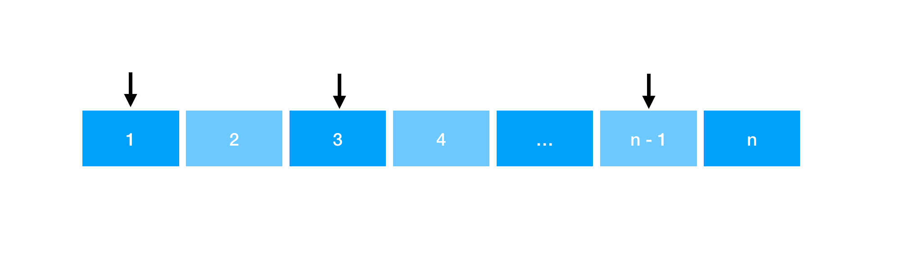
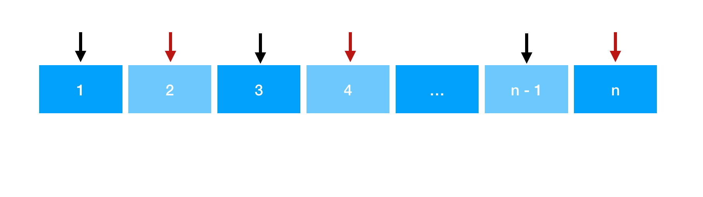
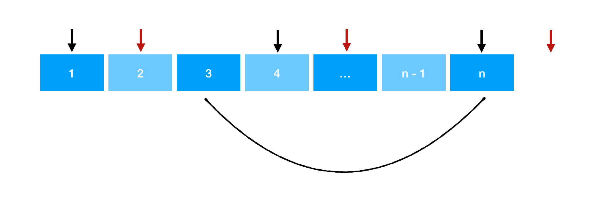

> 原文链接: https://leetcode-cn.com/problems/array-partition-i


## 英文原文
<div><p>Given an integer array <code>nums</code> of <code>2n</code> integers, group these integers into <code>n</code> pairs <code>(a<sub>1</sub>, b<sub>1</sub>), (a<sub>2</sub>, b<sub>2</sub>), ..., (a<sub>n</sub>, b<sub>n</sub>)</code> such that the sum of <code>min(a<sub>i</sub>, b<sub>i</sub>)</code> for all <code>i</code> is <strong>maximized</strong>. Return<em> the maximized sum</em>.</p>

<p>&nbsp;</p>
<p><strong>Example 1:</strong></p>

<pre>
<strong>Input:</strong> nums = [1,4,3,2]
<strong>Output:</strong> 4
<strong>Explanation:</strong> All possible pairings (ignoring the ordering of elements) are:
1. (1, 4), (2, 3) -&gt; min(1, 4) + min(2, 3) = 1 + 2 = 3
2. (1, 3), (2, 4) -&gt; min(1, 3) + min(2, 4) = 1 + 2 = 3
3. (1, 2), (3, 4) -&gt; min(1, 2) + min(3, 4) = 1 + 3 = 4
So the maximum possible sum is 4.</pre>

<p><strong>Example 2:</strong></p>

<pre>
<strong>Input:</strong> nums = [6,2,6,5,1,2]
<strong>Output:</strong> 9
<strong>Explanation:</strong> The optimal pairing is (2, 1), (2, 5), (6, 6). min(2, 1) + min(2, 5) + min(6, 6) = 1 + 2 + 6 = 9.
</pre>

<p>&nbsp;</p>
<p><strong>Constraints:</strong></p>

<ul>
	<li><code>1 &lt;= n &lt;= 10<sup>4</sup></code></li>
	<li><code>nums.length == 2 * n</code></li>
	<li><code>-10<sup>4</sup> &lt;= nums[i] &lt;= 10<sup>4</sup></code></li>
</ul>
</div>

## 中文题目
<div><p>给定长度为 <code>2n</code><strong> </strong>的整数数组 <code>nums</code> ，你的任务是将这些数分成 <code>n</code><strong> </strong>对, 例如 <code>(a<sub>1</sub>, b<sub>1</sub>), (a<sub>2</sub>, b<sub>2</sub>), ..., (a<sub>n</sub>, b<sub>n</sub>)</code> ，使得从 <code>1</code> 到 <code>n</code> 的 <code>min(a<sub>i</sub>, b<sub>i</sub>)</code> 总和最大。</p>

<p>返回该 <strong>最大总和</strong> 。</p>

<p> </p>

<p><strong>示例 1：</strong></p>

<pre>
<strong>输入：</strong>nums = [1,4,3,2]
<strong>输出：</strong>4
<strong>解释：</strong>所有可能的分法（忽略元素顺序）为：
1. (1, 4), (2, 3) -> min(1, 4) + min(2, 3) = 1 + 2 = 3
2. (1, 3), (2, 4) -> min(1, 3) + min(2, 4) = 1 + 2 = 3
3. (1, 2), (3, 4) -> min(1, 2) + min(3, 4) = 1 + 3 = 4
所以最大总和为 4</pre>

<p><strong>示例 2：</strong></p>

<pre>
<strong>输入：</strong>nums = [6,2,6,5,1,2]
<strong>输出：</strong>9
<strong>解释：</strong>最优的分法为 (2, 1), (2, 5), (6, 6). min(2, 1) + min(2, 5) + min(6, 6) = 1 + 2 + 6 = 9
</pre>

<p> </p>

<p><strong>提示：</strong></p>

<ul>
	<li><code>1 <= n <= 10<sup>4</sup></code></li>
	<li><code>nums.length == 2 * n</code></li>
	<li><code>-10<sup>4</sup> <= nums[i] <= 10<sup>4</sup></code></li>
</ul>
</div>

## 通过代码
<RecoDemo>
</RecoDemo>


## 高赞题解
## 贪心解法

我们先对数组进行排序。

由于每两个数，我们只能选择当前小的一个进行累加。

因此我们猜想应该从第一个位置进行选择，然后隔一步选择下一个数。这样形成的序列的求和值最大。

```java
class Solution {
    public int arrayPairSum(int[] nums) {
        int n = nums.length;
        Arrays.sort(nums);
        int ans = 0;
        for (int i = 0; i < n; i += 2) ans += nums[i];
        return ans;
    }
}
```
* 时间复杂度：$O(n\log{n})$
* 空间复杂度：$O(\log{n})$

***

## 证明

我们用反证法来证明下，为什么这样选择的序列的求和值一定是最大的：

猜想：对数组进行排序，从第一个位置进行选择，然后隔一步选择下一个数。这样形成的序列的求和值最大（下图黑标，代表当前被选择的数字）。



之所以我们能这么选择，是因为每一个被选择的数的「下一位位置」都对应着一个「大于等于」当前数的值（假设位置为 `k` ），使得当前数在 `min(a,b)` 关系中能被选择（下图红标，代表保证前面一个黑标能够被选择的辅助数）。



假如我们这样选择的序列求和不是最大值，那么说明至少我们有一个值选错了，应该选择更大的数才对。

那么意味着我们「某一位置」的黑标应该从当前位置指向更后的位置。

*PS. 因为要满足 min(a, b) 的数才会被累加，因此每一个红标右移（变大）必然导致原本所对应的黑标发生「同样程度 或 不同程度」的右移（变大）*

这会导致我们所有的红标黑标同时往后平移。

最终会导致我们最后一个黑标出现在最后一位，这时候最后一位黑标不得不与我们第 `k` 个位置的数形成一对。



我们看看这是求和序列的变化（ `k` 位置前的求和项没有发生变化，我们从 `k` 位置开始分析）：

1. 原答案 = `nums[k] + nums[k + 2] + ... + nums[n - 1]`
2. 调整后答案 = `nums[k + 1] + nums[k + 3] + ... + nums[n - 2] + min(nums[n], nums[k])`
由于 `min(nums[n], nums[k])` 中必然是 `nums[k]` 被选择。因此：
调整后答案 = `nums[k] + nums[k + 1] + nums[k + 3] + ... + nums[n - 2]`

显然从原答案的每一项都「大于等于」调整后答案的每一项，因此**不可能在「假想序列」中通过选择别的更大的数得到更优解，假想得证。**

***

## 为什么要「证明」或「理解证明」？

证明的意义在于，**你知道为什么这样做是对的**。

带来的好处是：

1. 一道「贪心」题目能搞清楚证明，那么同类的「贪心」题目你就都会做了。**否则就会停留在“我知道这道题可以这样贪心，别的题我不确定是否也能这样做”**。
2. 在「面试」阶段，**你可以很清晰讲解你的思路**。让面试官从你的「思维方式」上喜欢上你（ emmm 当然从颜值上也可以 :)
...

***

## 更多与证明/分析相关的题解：

[765. 情侣牵手](https://leetcode-cn.com/problems/couples-holding-hands/) : [【相信科学系列】为什么交换任意一个都是对的？：两种 100% 的解法：并查集 & 贪心](https://leetcode-cn.com/problems/couples-holding-hands/solution/liang-chong-100-de-jie-fa-bing-cha-ji-ta-26a6/)
[1579. 保证图可完全遍历](https://leetcode-cn.com/problems/remove-max-number-of-edges-to-keep-graph-fully-traversable/) : [【相信科学系列】为什么先处理公共边是对的？含贪心证明 + 数组模板 ~](https://leetcode-cn.com/problems/remove-max-number-of-edges-to-keep-graph-fully-traversable/solution/tan-xin-bing-cha-ji-shu-zu-shi-xian-jian-w7ko/)

[1631. 最小体力消耗路径](https://leetcode-cn.com/problems/path-with-minimum-effort/) : [【相信科学系列】反证法证明思路的合法性](https://leetcode-cn.com/problems/path-with-minimum-effort/solution/fan-zheng-fa-zheng-ming-si-lu-de-he-fa-x-ohby/)

[11. 盛最多水的容器](https://leetcode-cn.com/problems/container-with-most-water/) : [【刷穿LC】双指针+贪心解法【含证明】](https://leetcode-cn.com/problems/container-with-most-water/solution/shua-chuan-lc-shuang-zhi-zhen-tan-xin-ji-52gf/)

***

## 最后

**如果有帮助到你，请给题解点个赞和收藏，让更多的人看到 ~ ("▔□▔)/**

也欢迎你 [关注我](https://oscimg.oschina.net/oscnet/up-19688dc1af05cf8bdea43b2a863038ab9e5.png) 和 加入我们的[「组队打卡」](https://leetcode-cn.com/u/ac_oier/)小群 ，提供写「证明」&「思路」的高质量题解 


## 统计信息
| 通过次数 | 提交次数 | AC比率 |
| :------: | :------: | :------: |
|    93934    |    121079    |   77.6%   |

## 提交历史
| 提交时间 | 提交结果 | 执行时间 |  内存消耗  | 语言 |
| :------: | :------: | :------: | :--------: | :--------: |
