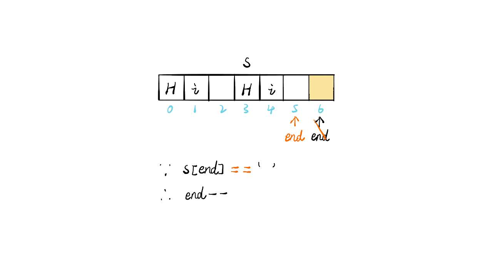
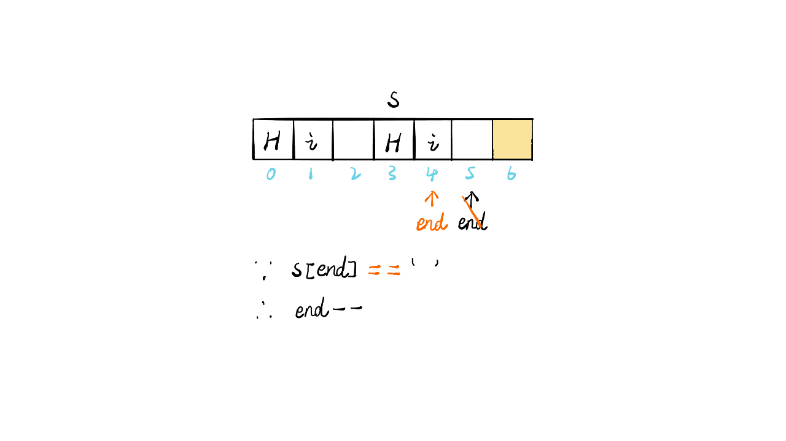
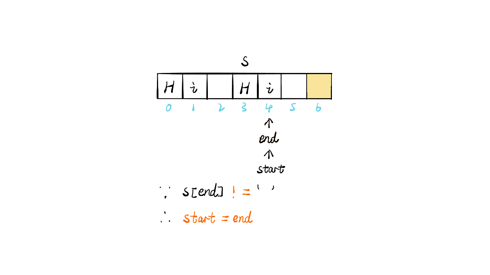
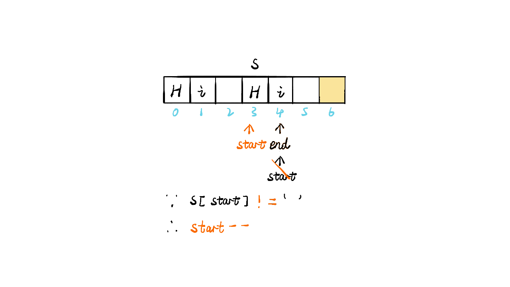
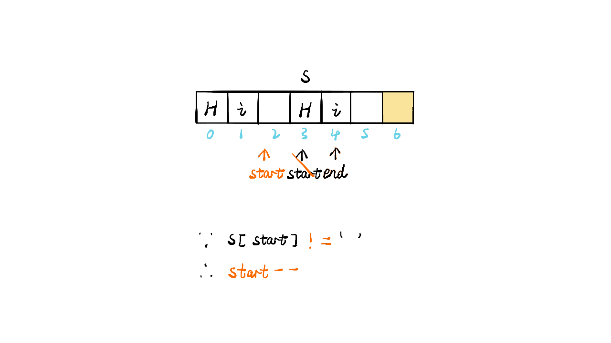
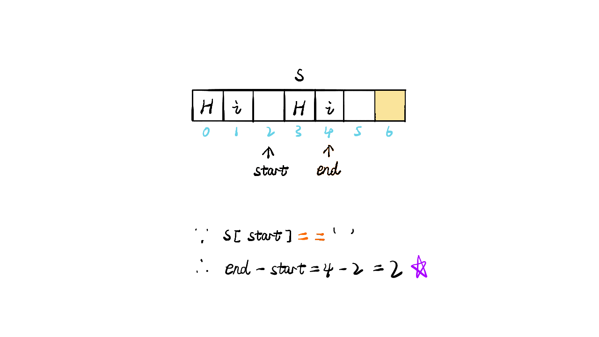

> 原文链接: https://leetcode-cn.com/problems/length-of-last-word


## 英文原文
<div><p>Given a string <code>s</code> consisting&nbsp;of some words separated by some number of spaces, return <em>the length of the <strong>last</strong> word in the string.</em></p>

<p>A <strong>word</strong> is a maximal substring consisting of non-space characters only.</p>

<p>&nbsp;</p>
<p><strong>Example 1:</strong></p>

<pre>
<strong>Input:</strong> s = &quot;Hello World&quot;
<strong>Output:</strong> 5
<strong>Explanation:</strong> The last word is &quot;World&quot; with length 5.
</pre>

<p><strong>Example 2:</strong></p>

<pre>
<strong>Input:</strong> s = &quot;   fly me   to   the moon  &quot;
<strong>Output:</strong> 4
<strong>Explanation:</strong> The last word is &quot;moon&quot; with length 4.
</pre>

<p><strong>Example 3:</strong></p>

<pre>
<strong>Input:</strong> s = &quot;luffy is still joyboy&quot;
<strong>Output:</strong> 6
<strong>Explanation:</strong> The last word is &quot;joyboy&quot; with length 6.
</pre>

<p>&nbsp;</p>
<p><strong>Constraints:</strong></p>

<ul>
	<li><code>1 &lt;= s.length &lt;= 10<sup>4</sup></code></li>
	<li><code>s</code> consists of only English letters and spaces <code>&#39; &#39;</code>.</li>
	<li>There will be at least one word in <code>s</code>.</li>
</ul>
</div>

## 中文题目
<div><p>给你一个字符串 <code>s</code>，由若干单词组成，单词前后用一些空格字符隔开。返回字符串中最后一个单词的长度。</p>

<p><strong>单词</strong> 是指仅由字母组成、不包含任何空格字符的最大子字符串。</p>

<p>&nbsp;</p>

<p><strong>示例 1：</strong></p>

<pre>
<strong>输入：</strong>s = "Hello World"
<strong>输出：</strong>5
</pre>

<p><strong>示例 2：</strong></p>

<pre>
<strong>输入：</strong>s = "   fly me   to   the moon  "
<strong>输出：</strong>4
</pre>

<p><strong>示例 3：</strong></p>

<pre>
<strong>输入：</strong>s = "luffy is still joyboy"
<strong>输出：</strong>6
</pre>

<p>&nbsp;</p>

<p><strong>提示：</strong></p>

<ul>
	<li><code>1 &lt;= s.length &lt;= 10<sup>4</sup></code></li>
	<li><code>s</code> 仅有英文字母和空格 <code>' '</code> 组成</li>
	<li><code>s</code> 中至少存在一个单词</li>
</ul>
</div>

## 通过代码
<RecoDemo>
</RecoDemo>


## 高赞题解
### 思路

- 标签：字符串遍历
- 从字符串末尾开始向前遍历，其中主要有两种情况
- 第一种情况，以字符串`"Hello World"`为例，从后向前遍历直到遍历到头或者遇到空格为止，即为最后一个单词`"World"`的长度`5`
- 第二种情况，以字符串`"Hello World   "`为例，需要先将末尾的空格过滤掉，再进行第一种情况的操作，即认为最后一个单词为`"World"`，长度为`5`
- 所以完整过程为先从后过滤掉空格找到单词尾部，再从尾部向前遍历，找到单词头部，最后两者相减，即为单词的长度
- 时间复杂度：O(n)，`n`为结尾空格和结尾单词总体长度

### 代码

```Java []
class Solution {
    public int lengthOfLastWord(String s) {
        int end = s.length() - 1;
        while(end >= 0 && s.charAt(end) == ' ') end--;
        if(end < 0) return 0;
        int start = end;
        while(start >= 0 && s.charAt(start) != ' ') start--;
        return end - start;
    }
}
```

```JavaScript []
/**
 * @param {string} s
 * @return {number}
 */
var lengthOfLastWord = function(s) {
    let end = s.length - 1;
    while(end >= 0 && s[end] == ' ') end--;
    if(end < 0) return 0;
    let start = end;
    while(start >= 0 && s[start] != ' ') start--;
    return end - start;
};
```


### 画解


<,,,,,,>

想看大鹏画解更多高频面试题，欢迎阅读大鹏的 LeetBook：[《画解剑指 Offer 》](https://leetcode-cn.com/leetbook/detail/illustrate-lcof/)，O(∩_∩)O

## 统计信息
| 通过次数 | 提交次数 | AC比率 |
| :------: | :------: | :------: |
|    266053    |    695240    |   38.3%   |

## 提交历史
| 提交时间 | 提交结果 | 执行时间 |  内存消耗  | 语言 |
| :------: | :------: | :------: | :--------: | :--------: |
