> 原文链接: https://leetcode-cn.com/problems/minimum-index-sum-of-two-lists


## 英文原文
<div><p>Suppose Andy and Doris want to choose a restaurant for dinner, and they both have a list of favorite restaurants represented by strings.</p>

<p>You need to help them find out their <b>common interest</b> with the <b>least list index sum</b>. If there is a choice tie between answers, output all of them with no order requirement. You could assume there always exists an answer.</p>

<p>&nbsp;</p>
<p><strong>Example 1:</strong></p>

<pre>
<strong>Input:</strong> list1 = [&quot;Shogun&quot;,&quot;Tapioca Express&quot;,&quot;Burger King&quot;,&quot;KFC&quot;], list2 = [&quot;Piatti&quot;,&quot;The Grill at Torrey Pines&quot;,&quot;Hungry Hunter Steakhouse&quot;,&quot;Shogun&quot;]
<strong>Output:</strong> [&quot;Shogun&quot;]
<strong>Explanation:</strong> The only restaurant they both like is &quot;Shogun&quot;.
</pre>

<p><strong>Example 2:</strong></p>

<pre>
<strong>Input:</strong> list1 = [&quot;Shogun&quot;,&quot;Tapioca Express&quot;,&quot;Burger King&quot;,&quot;KFC&quot;], list2 = [&quot;KFC&quot;,&quot;Shogun&quot;,&quot;Burger King&quot;]
<strong>Output:</strong> [&quot;Shogun&quot;]
<strong>Explanation:</strong> The restaurant they both like and have the least index sum is &quot;Shogun&quot; with index sum 1 (0+1).
</pre>

<p><strong>Example 3:</strong></p>

<pre>
<strong>Input:</strong> list1 = [&quot;Shogun&quot;,&quot;Tapioca Express&quot;,&quot;Burger King&quot;,&quot;KFC&quot;], list2 = [&quot;KFC&quot;,&quot;Burger King&quot;,&quot;Tapioca Express&quot;,&quot;Shogun&quot;]
<strong>Output:</strong> [&quot;KFC&quot;,&quot;Burger King&quot;,&quot;Tapioca Express&quot;,&quot;Shogun&quot;]
</pre>

<p><strong>Example 4:</strong></p>

<pre>
<strong>Input:</strong> list1 = [&quot;Shogun&quot;,&quot;Tapioca Express&quot;,&quot;Burger King&quot;,&quot;KFC&quot;], list2 = [&quot;KNN&quot;,&quot;KFC&quot;,&quot;Burger King&quot;,&quot;Tapioca Express&quot;,&quot;Shogun&quot;]
<strong>Output:</strong> [&quot;KFC&quot;,&quot;Burger King&quot;,&quot;Tapioca Express&quot;,&quot;Shogun&quot;]
</pre>

<p><strong>Example 5:</strong></p>

<pre>
<strong>Input:</strong> list1 = [&quot;KFC&quot;], list2 = [&quot;KFC&quot;]
<strong>Output:</strong> [&quot;KFC&quot;]
</pre>

<p>&nbsp;</p>
<p><strong>Constraints:</strong></p>

<ul>
	<li><code>1 &lt;= list1.length, list2.length &lt;= 1000</code></li>
	<li><code>1 &lt;= list1[i].length, list2[i].length &lt;= 30</code></li>
	<li><code>list1[i]</code> and <code>list2[i]</code> consist of spaces <code>&#39; &#39;</code> and English letters.</li>
	<li>All the stings of <code>list1</code> are <strong>unique</strong>.</li>
	<li>All the stings of <code>list2</code>&nbsp;are <strong>unique</strong>.</li>
</ul>
</div>

## 中文题目
<div><p>假设Andy和Doris想在晚餐时选择一家餐厅，并且他们都有一个表示最喜爱餐厅的列表，每个餐厅的名字用字符串表示。</p>

<p>你需要帮助他们用<strong>最少的索引和</strong>找出他们<strong>共同喜爱的餐厅</strong>。 如果答案不止一个，则输出所有答案并且不考虑顺序。 你可以假设总是存在一个答案。</p>

<p><strong>示例 1:</strong></p>

<pre><strong>输入:</strong>
[&quot;Shogun&quot;, &quot;Tapioca Express&quot;, &quot;Burger King&quot;, &quot;KFC&quot;]
[&quot;Piatti&quot;, &quot;The Grill at Torrey Pines&quot;, &quot;Hungry Hunter Steakhouse&quot;, &quot;Shogun&quot;]
<strong>输出:</strong> [&quot;Shogun&quot;]
<strong>解释:</strong> 他们唯一共同喜爱的餐厅是&ldquo;Shogun&rdquo;。
</pre>

<p><strong>示例 2:</strong></p>

<pre><strong>输入:</strong>
[&quot;Shogun&quot;, &quot;Tapioca Express&quot;, &quot;Burger King&quot;, &quot;KFC&quot;]
[&quot;KFC&quot;, &quot;Shogun&quot;, &quot;Burger King&quot;]
<strong>输出:</strong> [&quot;Shogun&quot;]
<strong>解释:</strong> 他们共同喜爱且具有最小索引和的餐厅是&ldquo;Shogun&rdquo;，它有最小的索引和1(0+1)。
</pre>

<p><strong>提示:</strong></p>

<ol>
	<li>两个列表的长度范围都在&nbsp;[1, 1000]内。</li>
	<li>两个列表中的字符串的长度将在[1，30]的范围内。</li>
	<li>下标从0开始，到列表的长度减1。</li>
	<li>两个列表都没有重复的元素。</li>
</ol>
</div>

## 通过代码
<RecoDemo>
</RecoDemo>


## 官方题解
#### 方法 1：使用哈希表 [Accepted]

在这种方法中，我们枚举 $list1$ 中的每一个字符串，遍历整个 $list2$ 一遍，对每一对字符串都进行比较。我们使用哈希表 $map$，它包含了形如 $(sum: list_{sum})$ 的元素。这里 $sum$ 是匹配元素的下标和，$list_{sum}$ 是下标和为 $sum$ 的匹配字符串列表。

这样，通过比较，一旦 $list1$ 中第 $i$ 个字符串和 $list2$ 中第 $j$ 个字符串匹配，如果 $sum$ 为 $i+j$ 的条目在 $map$ 中还没有，我们就加一个条目。如果已经存在，由于我们需要保存所有下标和相同的字符串对，所以我们将这对字符串保存到哈希表中。

最后我们遍历 $map$ 的键一遍，并找到下标和最小的字符串列表。

```Java []
public class Solution {
    public String[] findRestaurant(String[] list1, String[] list2) {
        HashMap < Integer, List < String >> map = new HashMap < > ();
        for (int i = 0; i < list1.length; i++) {
            for (int j = 0; j < list2.length; j++) {
                if (list1[i].equals(list2[j])) {
                    if (!map.containsKey(i + j))
                        map.put(i + j, new ArrayList < String > ());
                    map.get(i + j).add(list1[i]);
                }
            }
        }
        int min_index_sum = Integer.MAX_VALUE;
        for (int key: map.keySet())
            min_index_sum = Math.min(min_index_sum, key);
        String[] res = new String[map.get(min_index_sum).size()];
        return map.get(min_index_sum).toArray(res);
    }
}
```

**复杂度分析**

* 时间复杂度：$O(l_1*l_2*x)$。$list1$ 中的每个字符串都与 $list2$ 中的字符串进行了比较。$l_1$ 和 $l_2$ 是 $list1$ 和 $list2$ 列表的长度，$x$ 是字符串的平均长度。

* 空间复杂度：$O(l_1*l_2*x)$ 。最坏情况下，$list1$ 和 $list2$ 中所有字符串都相同，那么哈希表最大会变成 $l_1*l_2*x$，其中 $x$ 是字符串的平均长度。

#### 方法 2： 不使用哈希表 [Accepted]

**算法**

另一种也可以遍历不同 $sum$ (下标和)，并判断是否有字符串分别出现在 $list1$ 和 $list2$ 中且下标和为 $sum$。

现在我们知道下标和的值 $sum$ 数值范围从 $0$ 到 $m + n - 1$。这里 $m$ 和 $n$ 分别是 $list1$ 和 $list2$ 的长度，我们现在可以升序枚举 $sum$ ，对于每个 $sum$，我们遍历 $list1$，假设当前下标为 $i$，为了得到下标和 $sum$，$list2$ 中的下标 $j$ 为 $sum - i$。通过这样的办法，我们不需要遍历 $list2$，而可以直接通过计算得到在 $list2$ 中对应的下标。

对于每个 $sum$，我们遍历 $list1$ 的所有下标，一旦有 $list1$ 和 $list2$ 中的字符串匹配，就把匹配字符串放入一个 $res$ 列表中。

我们对 $sum$ 升序数组中所有值做相同的过程，对于每个 $sum$ 遍历完一遍 $list1$ 之后，我们检查 $res$ 列表是否为空。如果是空的，我们继续遍历下一个 $sum$ 数组。如果不为空，当前的 $res$ 就是最小下标和的数组。这是因为我们遍历 $sum$ 的顺序是升序的，所以第一个找到的列表就是结果列表。

下面的例子说明了这一过程：

<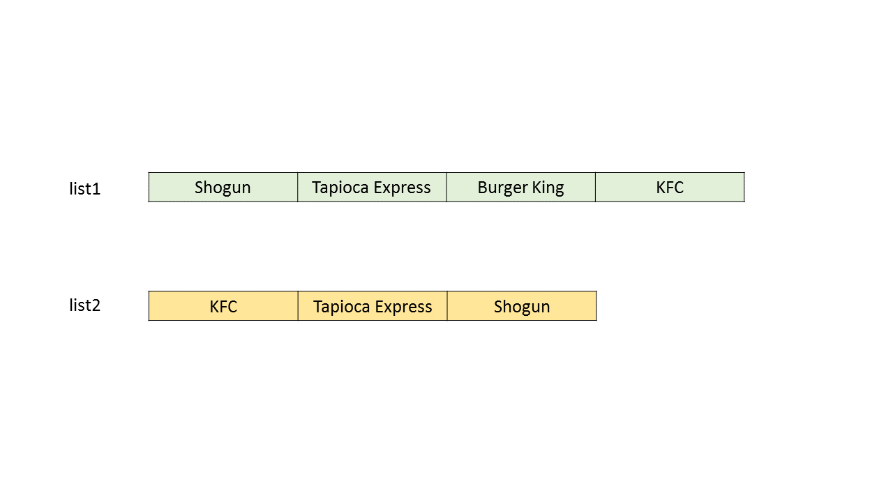,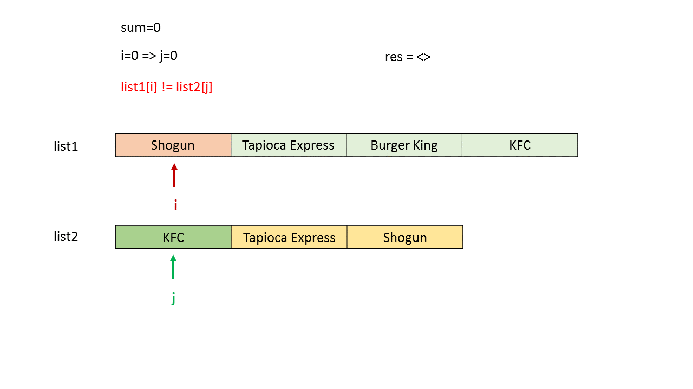,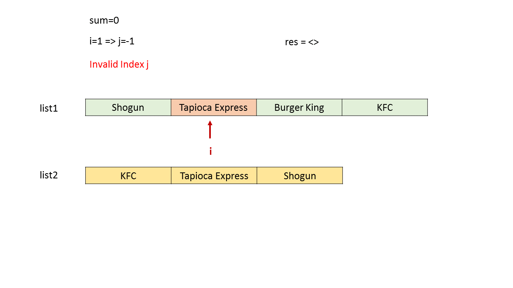,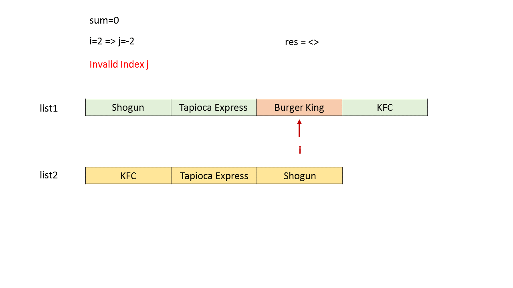,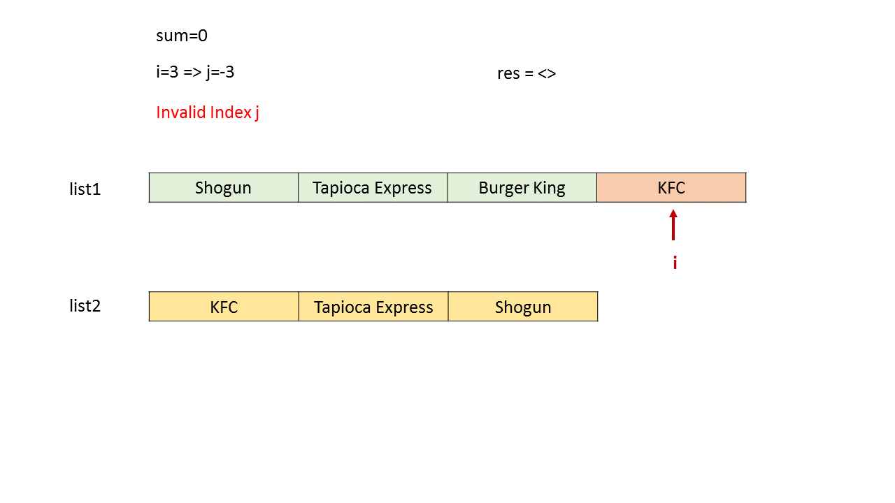,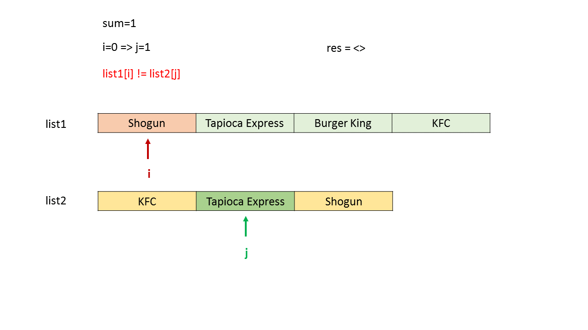,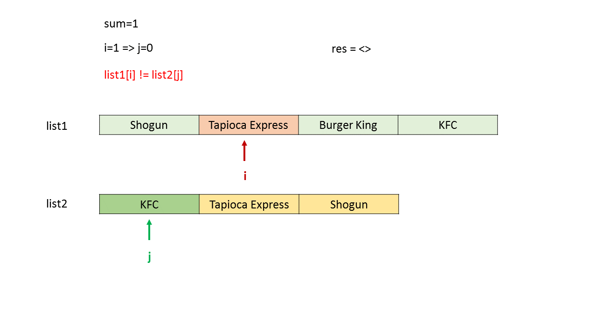,,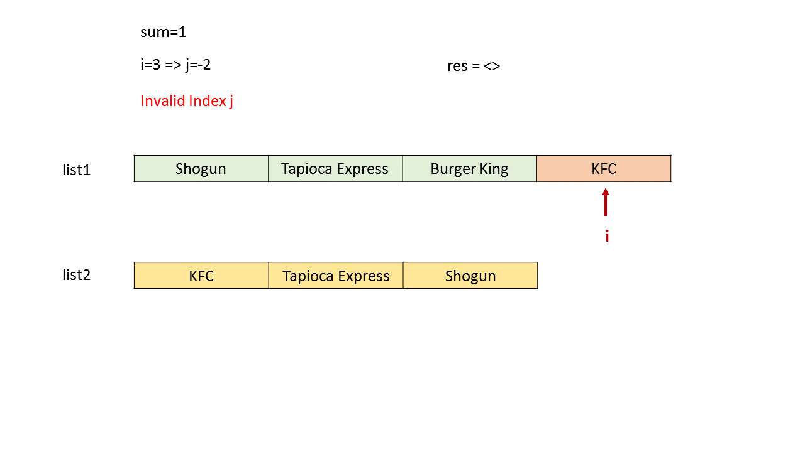,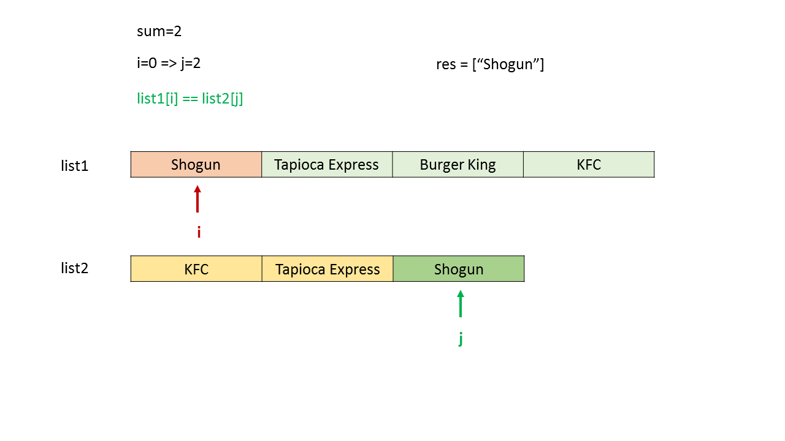,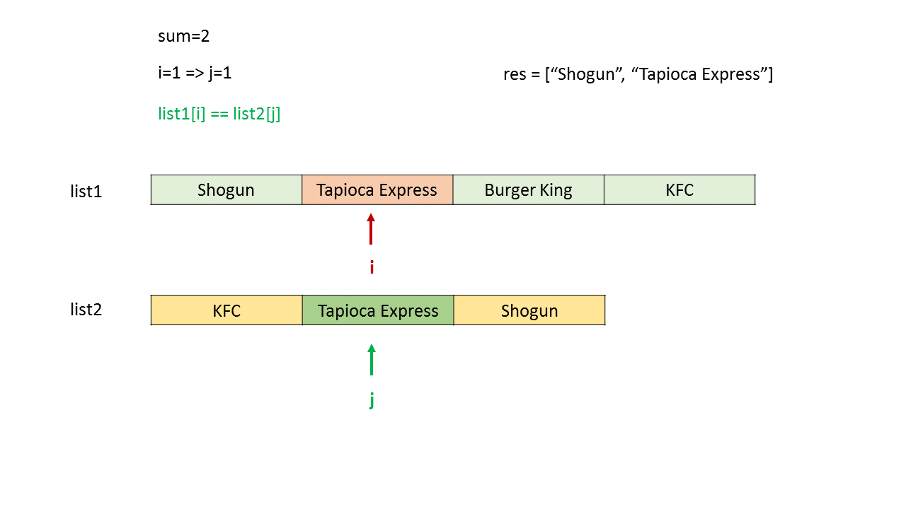,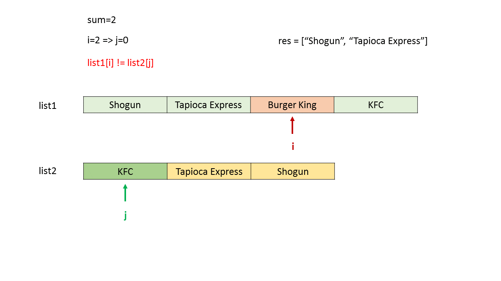,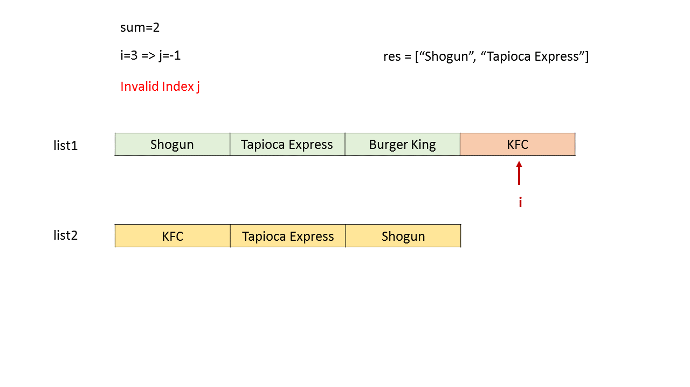,>

```Java []
public class Solution {
    public String[] findRestaurant(String[] list1, String[] list2) {
        List < String > res = new ArrayList < > ();
        for (int sum = 0; sum < list1.length + list2.length - 1; sum++) {
            for (int i = 0; i <= sum; i++) {
                if (i < list1.length && sum - i < list2.length && list1[i].equals(list2[sum - i]))
                    res.add(list1[i]);
            }
            if (res.size() > 0)
                break;
        }
        return res.toArray(new String[res.size()]);
    }
}
```

**复杂度分析**

* 时间复杂度：$O((l_1+l_2)^2*x)$。两重嵌套循环，每一层最多到 $l_1+l_2$，比较字符串需要花费 $x$ 的时间，这里 $x$ 是字符串的平均长度。

* 空间复杂度：$O(r*x)$。$res$ 是结果字符串列表，$r$ 是 $res$ 的长度。

#### 方法 3：使用哈希表（线性） [Accepted]

这个方法中我们换一种方法使用哈希表。首先我们遍历 $list1$ 一遍并为每个元素在哈希表 $map$ 中创建一个条目，格式为 $(list[i], i)$。这里 $i$ 是第 $i$ 个元素的下标，$list[i]$ 就是第 $i$ 个元素本身。这样我们就创建了一个从 $list1$ 中元素到它们下标的映射表。

现在我们遍历 $list2$，对于每一个元素 $list2[j]$，我们检查在 $map$ 中是否已经存在相同元素的键。如果已经存在，说明这一元素在 $list1$ 和 $list2$ 中都存在。这样我们就知道了这一元素在 $list1$ 和 $list2$ 中的下标，将它们求和 $sum = map.get(list[j]) + j$，如果这一 $sum$ 比之前记录的最小值要小，我们更新返回的结果列表 $res$，里面只保存 $list2[j]$ 作为里面唯一的条目。

如果 $suM$ 与之前获得的最小值相等，那么我们将 $list2[j]$ 放入结果列表 $res$。

```Java []
public class Solution {
    public String[] findRestaurant(String[] list1, String[] list2) {
        HashMap < String, Integer > map = new HashMap < String, Integer > ();
        for (int i = 0; i < list1.length; i++)
            map.put(list1[i], i);
        List < String > res = new ArrayList < > ();
        int min_sum = Integer.MAX_VALUE, sum;
        for (int j = 0; j < list2.length && j <= min_sum; j++) {
            if (map.containsKey(list2[j])) {
                sum = j + map.get(list2[j]);
                if (sum < min_sum) {
                    res.clear();
                    res.add(list2[j]);
                    min_sum = sum;
                } else if (sum == min_sum)
                    res.add(list2[j]);
            }
        }
        return res.toArray(new String[res.size()]);
    }
}
```

**复杂度分析**

* 时间复杂度：$O(l_1+l_2)$。$list2$ 中的每一个字符串都会在 $list1$ 的映射表中查找，$l_1$ 和 $l_2$ 分别是 $list1$ 和 $list2$ 的长度。

* 空间复杂度：$O(l_1 \times x)$。$hashmap$ 的大小为 $l_1 \times x$，其中 $x$ 是字符串的平均长度。


## 统计信息
| 通过次数 | 提交次数 | AC比率 |
| :------: | :------: | :------: |
|    30904    |    59173    |   52.2%   |

## 提交历史
| 提交时间 | 提交结果 | 执行时间 |  内存消耗  | 语言 |
| :------: | :------: | :------: | :--------: | :--------: |


## 相似题目
|                             题目                             | 难度 |
| :----------------------------------------------------------: | :---------: |
| [相交链表](https://leetcode-cn.com/problems/intersection-of-two-linked-lists/) | 简单|
