> 原文链接: https://leetcode-cn.com/problems/construct-string-from-binary-tree


## 英文原文
<div><p>Given the <code>root</code> of a binary tree, construct a string consisting of parenthesis and integers from a binary tree with the preorder traversal way, and return it.</p>

<p>Omit all the empty parenthesis pairs that do not affect the one-to-one mapping relationship between the string and the original binary tree.</p>

<p>&nbsp;</p>
<p><strong>Example 1:</strong></p>

<pre>
<strong>Input:</strong> root = [1,2,3,4]
<strong>Output:</strong> &quot;1(2(4))(3)&quot;
<strong>Explanation:</strong> Originally, it needs to be &quot;1(2(4)())(3()())&quot;, but you need to omit all the unnecessary empty parenthesis pairs. And it will be &quot;1(2(4))(3)&quot;
</pre>

<p><strong>Example 2:</strong></p>

<pre>
<strong>Input:</strong> root = [1,2,3,null,4]
<strong>Output:</strong> &quot;1(2()(4))(3)&quot;
<strong>Explanation:</strong> Almost the same as the first example, except we cannot omit the first parenthesis pair to break the one-to-one mapping relationship between the input and the output.
</pre>

<p>&nbsp;</p>
<p><strong>Constraints:</strong></p>

<ul>
	<li>The number of nodes in the tree is in the range <code>[1, 10<sup>4</sup>]</code>.</li>
	<li><code>-1000 &lt;= Node.val &lt;= 1000</code></li>
</ul>
</div>

## 中文题目
<div><p>你需要采用前序遍历的方式，将一个二叉树转换成一个由括号和整数组成的字符串。</p>

<p>空节点则用一对空括号 &quot;()&quot; 表示。而且你需要省略所有不影响字符串与原始二叉树之间的一对一映射关系的空括号对。</p>

<p><strong>示例 1:</strong></p>

<pre>
<strong>输入:</strong> 二叉树: [1,2,3,4]
       1
     /   \
    2     3
   /    
  4     

<strong>输出:</strong> &quot;1(2(4))(3)&quot;

<strong>解释:</strong> 原本将是&ldquo;1(2(4)())(3())&rdquo;，
在你省略所有不必要的空括号对之后，
它将是&ldquo;1(2(4))(3)&rdquo;。
</pre>

<p><strong>示例 2:</strong></p>

<pre>
<strong>输入:</strong> 二叉树: [1,2,3,null,4]
       1
     /   \
    2     3
     \  
      4 

<strong>输出:</strong> &quot;1(2()(4))(3)&quot;

<strong>解释:</strong> 和第一个示例相似，
除了我们不能省略第一个对括号来中断输入和输出之间的一对一映射关系。
</pre>
</div>

## 通过代码
<RecoDemo>
</RecoDemo>


## 官方题解
#### 方法一：递归

我们可以使用递归的方法得到二叉树的前序遍历。在递归时，根据题目描述，我们需要加上额外的括号，会有以下 `4` 种情况：

- 如果当前节点有两个孩子，那我们在递归时，需要在两个孩子的结果外都加上一层括号；

- 如果当前节点没有孩子，那我们不需要在节点后面加上任何括号；

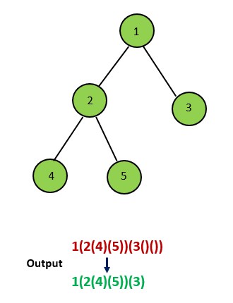
{:align="center"}

- 如果当前节点只有左孩子，那我们在递归时，只需要在左孩子的结果外加上一层括号，而不需要给右孩子加上任何括号；

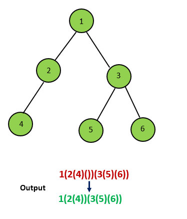
{:align="center"}

- 如果当前节点只有右孩子，那我们在递归时，需要先加上一层空的括号 `()` 表示左孩子为空，再对右孩子进行递归，并在结果外加上一层括号。

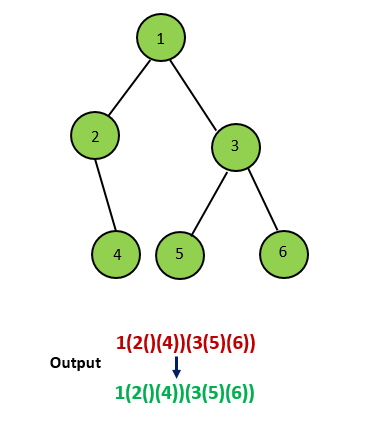
{:align="center"}

考虑完上面的 `4` 种情况，我们就可以得到最终的字符串。

```Java [sol1]
/**
 * Definition for a binary tree node.
 * public class TreeNode {
 *     int val;
 *     TreeNode left;
 *     TreeNode right;
 *     TreeNode(int x) { val = x; }
 * }
 */
public class Solution {
    public String tree2str(TreeNode t) {
        if(t==null)
            return "";
        if(t.left==null && t.right==null)
            return t.val+"";
        if(t.right==null)
            return t.val+"("+tree2str(t.left)+")";
        return t.val+"("+tree2str(t.left)+")("+tree2str(t.right)+")";   
    }
}
```

**复杂度分析**

* 时间复杂度：$O(N)$，其中 $N$ 是二叉树中的节点数目。

* 空间复杂度：$O(N)$，在最坏情况下，会递归 $N$ 层，需要 $O(N)$ 的栈空间。

#### 方法二：迭代

我们也可以用迭代的方法解决这个问题。

我们用一个栈来存储树中的一些节点，其中栈顶的元素为当前遍历到的节点，从栈底到栈顶的元素在树上即为从根到当前节点的唯一路径。和迭代得到前序遍历的方法略有不同，由于这里需要输出额外的括号，因此我们还需要用一个集合存储所有遍历过的节点，具体的原因在接下来会说明。

首先我们把根节点入栈。对于当前栈顶的元素，如果它没有遍历过，那么就把它加入到集合中，并开始对以它为根的子树进行前序遍历。我们先在答案末尾添加一个 `(`，表示一个节点的开始，然后判断该节点的子节点个数。和方法一相同，这里会出现四种情况：如果它没有子节点，我们什么都不做；如果它有两个子节点，那么我们先将右孩子入栈，再将左孩子入栈，这样就保证了前序遍历的顺序；如果它只有左孩子，那么我们将左孩子入栈；如果它只有右孩子，那么我们在答案末尾添加一个 `()` 表示空的左孩子，再将右孩子入栈。注意这四种情况中，我们都不会将当前节点出栈，原因是我们一开始添加了 `(` 表示节点的开始，在以当前节点为根的子树中所有节点遍历完成之后，我们才会在答案末尾添加 `)` 表示节点的结束。因此我们需要用上面提到的集合来存储遍历过的节点，如果当前栈顶的元素遍历过，那么我们就知道需要在答案末尾添加 `)`，并将这个节点出栈。

在迭代完成之后，我们得到的答案字符串的前后会有一对括号，我们把它去除后就可以得到最终的答案。

<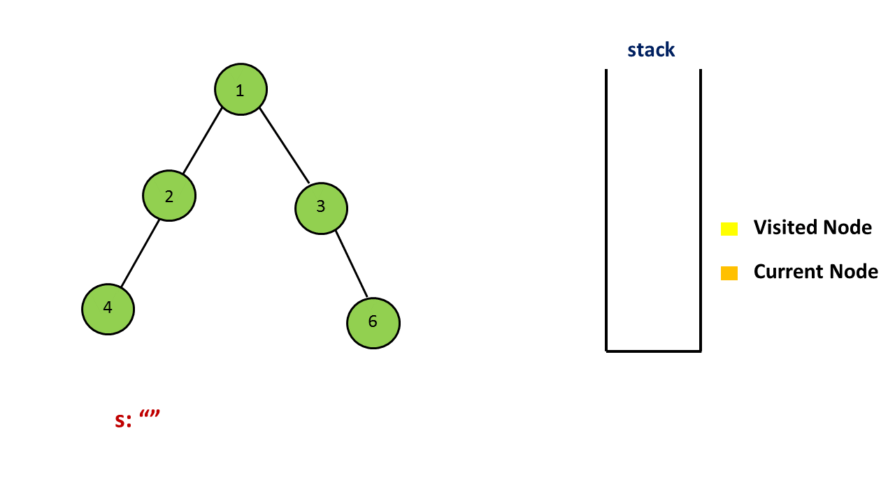,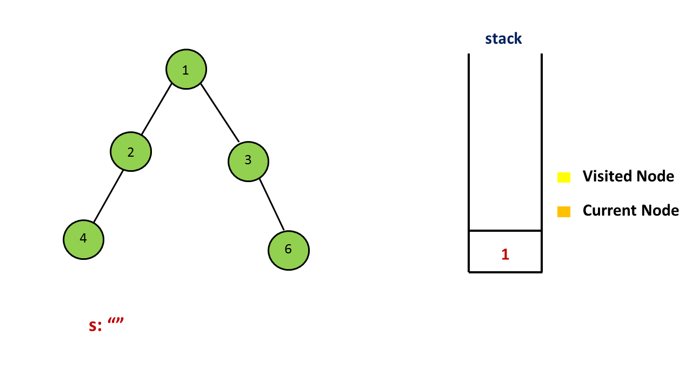,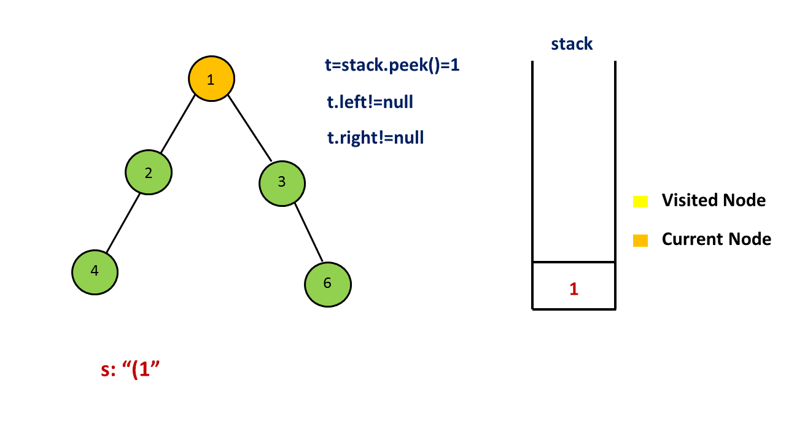,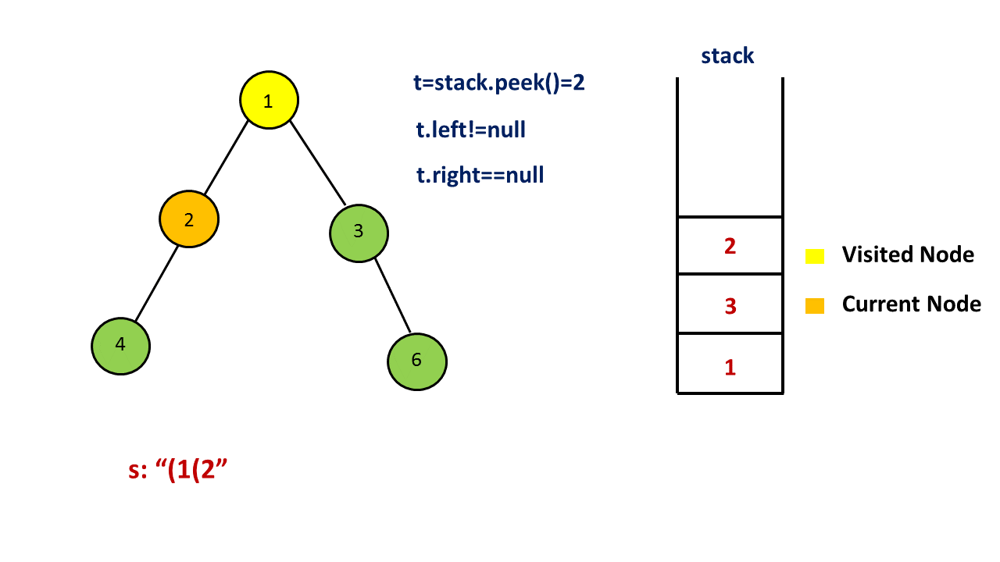,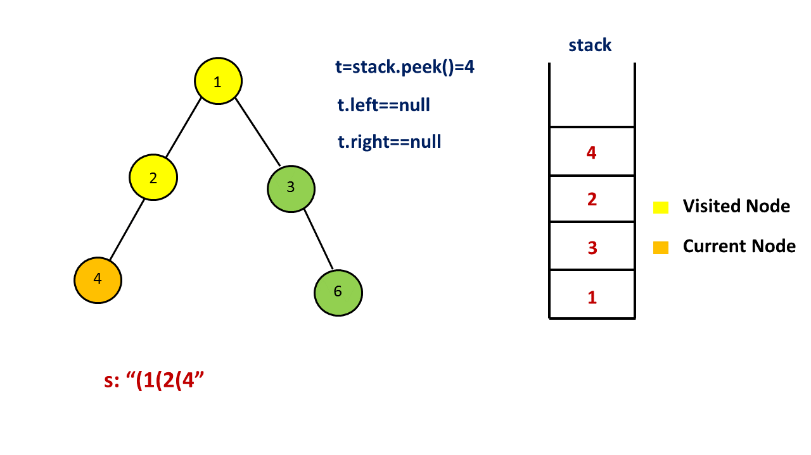,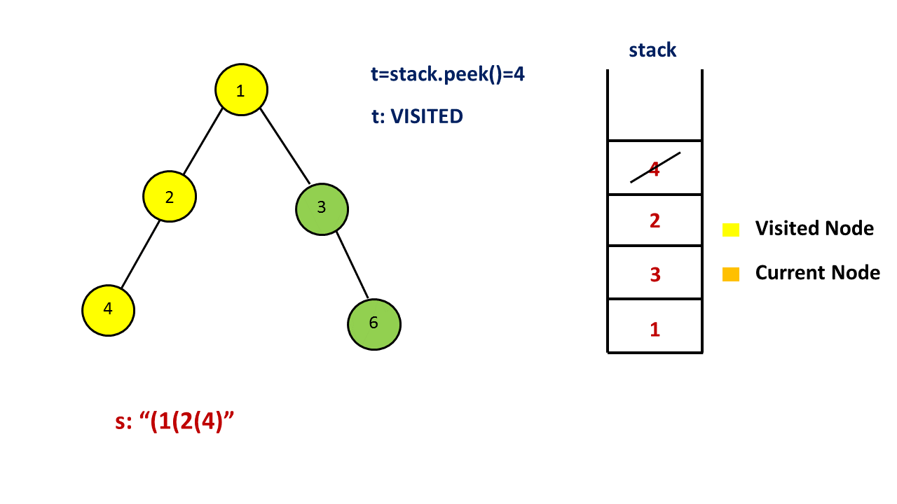,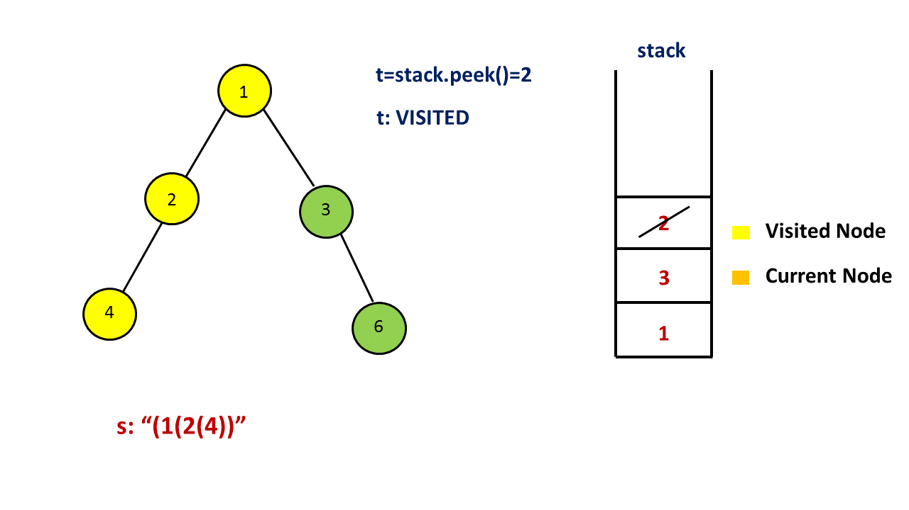,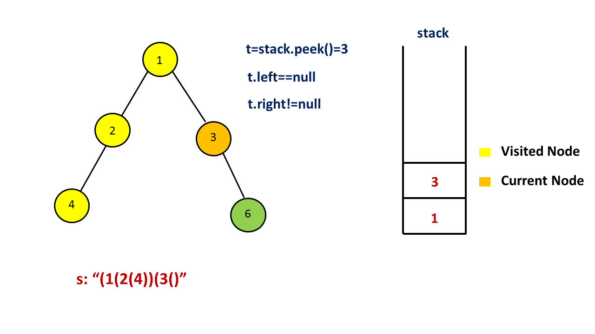,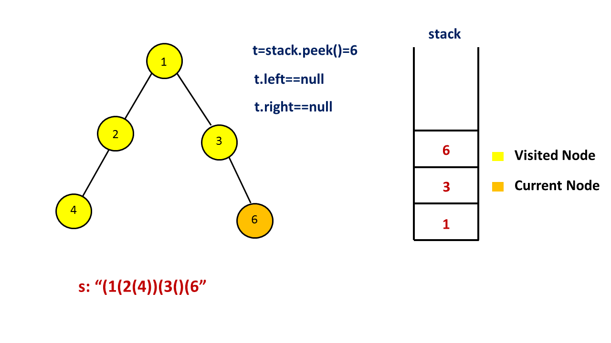,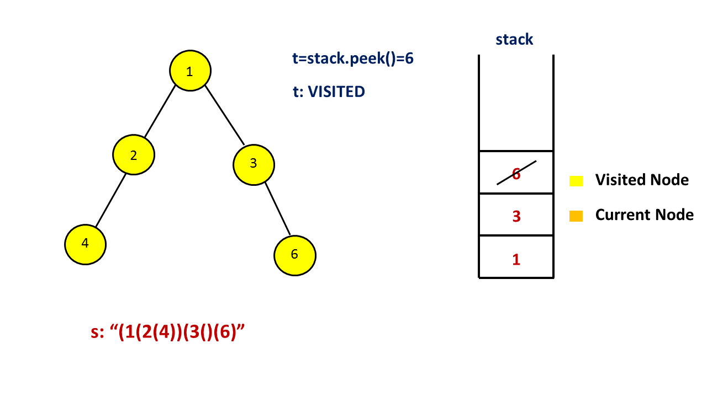,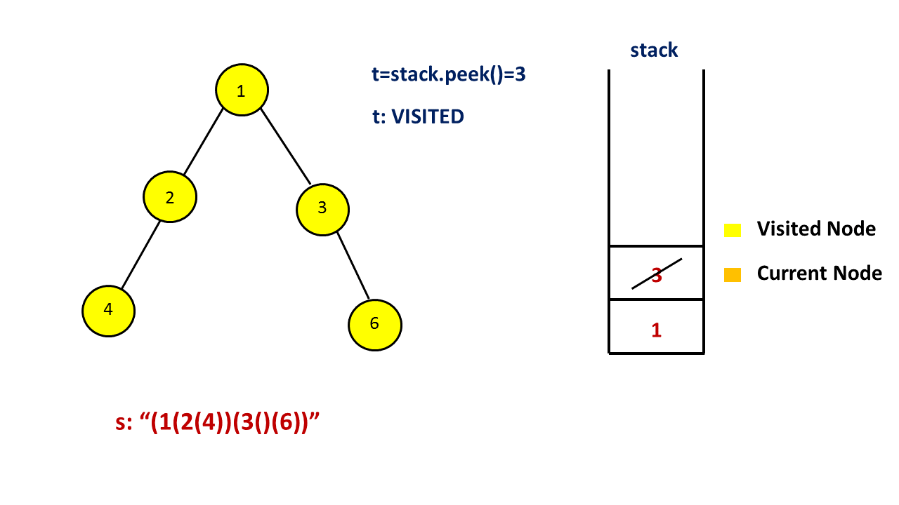,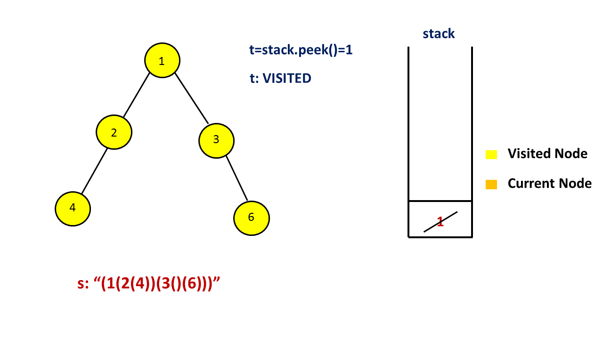,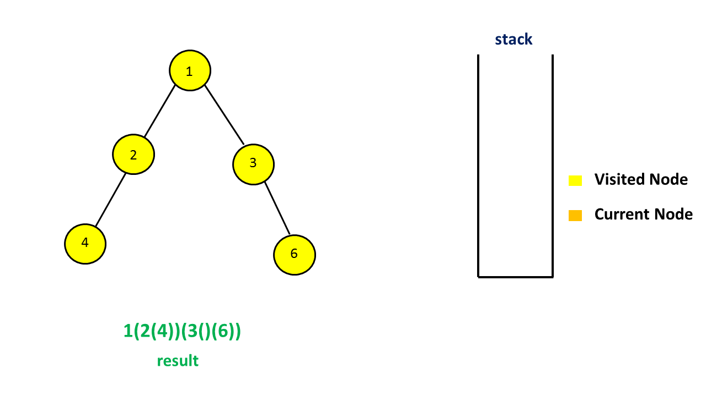>

```Java [sol2]
public class Solution {
    public String tree2str(TreeNode t) {
        if (t == null)
            return "";
        Stack < TreeNode > stack = new Stack < > ();
        stack.push(t);
        Set < TreeNode > visited = new HashSet < > ();
        StringBuilder s = new StringBuilder();
        while (!stack.isEmpty()) {
            t = stack.peek();
            if (visited.contains(t)) {
                stack.pop();
                s.append(")");
            } else {
                visited.add(t);
                s.append("(" + t.val);
                if (t.left == null && t.right != null)
                    s.append("()");
                if (t.right != null)
                    stack.push(t.right);
                if (t.left != null)
                    stack.push(t.left);
            }
        }
        return s.substring(1, s.length() - 1);
    }
}
```

**复杂度分析**

* 时间复杂度：$O(N)$，其中 $N$ 是二叉树中的节点数目。

* 空间复杂度：$O(N)$，在最坏情况下，栈中会存放 $N$ 个节点。

## 统计信息
| 通过次数 | 提交次数 | AC比率 |
| :------: | :------: | :------: |
|    30117    |    52978    |   56.8%   |

## 提交历史
| 提交时间 | 提交结果 | 执行时间 |  内存消耗  | 语言 |
| :------: | :------: | :------: | :--------: | :--------: |


## 相似题目
|                             题目                             | 难度 |
| :----------------------------------------------------------: | :---------: |
| [从字符串生成二叉树](https://leetcode-cn.com/problems/construct-binary-tree-from-string/) | 中等|
| [寻找重复的子树](https://leetcode-cn.com/problems/find-duplicate-subtrees/) | 中等|
