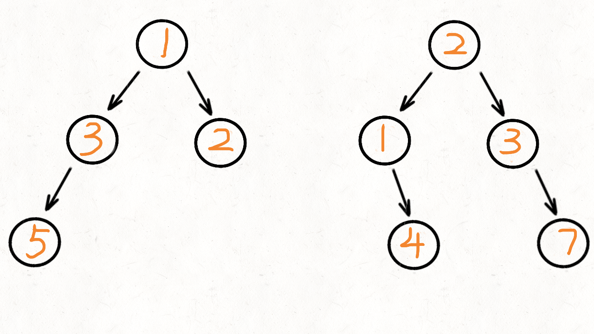

> 原文链接: https://leetcode-cn.com/problems/merge-two-binary-trees


## 英文原文
<div><p>You are given two binary trees <code>root1</code> and <code>root2</code>.</p>

<p>Imagine that when you put one of them to cover the other, some nodes of the two trees are overlapped while the others are not. You need to merge the two trees into a new binary tree. The merge rule is that if two nodes overlap, then sum node values up as the new value of the merged node. Otherwise, the NOT null node will be used as the node of the new tree.</p>

<p>Return <em>the merged tree</em>.</p>

<p><strong>Note:</strong> The merging process must start from the root nodes of both trees.</p>

<p>&nbsp;</p>
<p><strong>Example 1:</strong></p>

<pre>
<strong>Input:</strong> root1 = [1,3,2,5], root2 = [2,1,3,null,4,null,7]
<strong>Output:</strong> [3,4,5,5,4,null,7]
</pre>

<p><strong>Example 2:</strong></p>

<pre>
<strong>Input:</strong> root1 = [1], root2 = [1,2]
<strong>Output:</strong> [2,2]
</pre>

<p>&nbsp;</p>
<p><strong>Constraints:</strong></p>

<ul>
	<li>The number of nodes in both trees is in the range <code>[0, 2000]</code>.</li>
	<li><code>-10<sup>4</sup> &lt;= Node.val &lt;= 10<sup>4</sup></code></li>
</ul>
</div>

## 中文题目
<div><p>给定两个二叉树，想象当你将它们中的一个覆盖到另一个上时，两个二叉树的一些节点便会重叠。</p>

<p>你需要将他们合并为一个新的二叉树。合并的规则是如果两个节点重叠，那么将他们的值相加作为节点合并后的新值，否则<strong>不为&nbsp;</strong>NULL 的节点将直接作为新二叉树的节点。</p>

<p><strong>示例&nbsp;1:</strong></p>

<pre>
<strong>输入:</strong> 
	Tree 1                     Tree 2                  
          1                         2                             
         / \                       / \                            
        3   2                     1   3                        
       /                           \   \                      
      5                             4   7                  
<strong>输出:</strong> 
合并后的树:
	     3
	    / \
	   4   5
	  / \   \ 
	 5   4   7
</pre>

<p><strong>注意:</strong>&nbsp;合并必须从两个树的根节点开始。</p>
</div>

## 通过代码
<RecoDemo>
</RecoDemo>


## 高赞题解
### 解题思路：

递归实现
如果没有头绪的话，可以将这两颗树想象成是两个数组：   
```
1 3 2 5
2 1 3 4 7
```
合并两个数组很直观，将数组 2 的值合并到数组 1 中，再返回数组 1 就可以了。   
对于二叉树来说，如果我们像遍历数组那样，挨个遍历两颗二叉树中的每个节点，再把他们相加，那问题就比较容易解决了。  
   
遍历二叉树很简单，用 **前序** 遍历就可以了，再依次把访问到的节点值相加，因为题目没有说不能改变树的值和结构，我们不用再创建新的节点了，直接将树2合并到树1上再返回就可以了。   
需要注意：这两颗树并不是长得完全一样，有的树可能有左节点，但有的树没有。 
对于这种情况，我们统一的都把他们挂到树 1 上面就可以了，对于上面例子中的两颗树，合并起来的结果如下：
```
	     3
	    / \
	   4   5
	  / \   \ 
	 5   4   7
```
相当于树1少了一条腿，而树 2 有这条腿，那就把树 2 的拷贝过来。   
总结下递归的条件：
1. 终止条件：树 1 的节点为 `null`，或者树 2 的节点为 `null`   
2. 递归函数内：将两个树的节点相加后，再赋给树 1 的节点。再递归的执行两个树的左节点，递归执行两个树的右节点   
    
动画演示如下：   



时间复杂度：$O(N)$
空间复杂度：$O(h)$，$h$ 是树的高度      
代码实现：     
```Java []
class Solution {
	public TreeNode mergeTrees(TreeNode t1, TreeNode t2) {
		if(t1==null || t2==null) {
			return t1==null? t2 : t1;
		}
		return dfs(t1,t2);
	}
	
	TreeNode dfs(TreeNode r1, TreeNode r2) {
		// 如果 r1和r2中，只要有一个是null，函数就直接返回
		if(r1==null || r2==null) {
			return r1==null? r2 : r1;
		}
		//让r1的值 等于  r1和r2的值累加，再递归的计算两颗树的左节点、右节点
		r1.val += r2.val;
		r1.left = dfs(r1.left,r2.left);
		r1.right = dfs(r1.right,r2.right);
		return r1;
	}
}
```
```Python []
class Solution(object):
	def mergeTrees(self, t1, t2):
		"""
		:type t1: TreeNode
		:type t2: TreeNode
		:rtype: TreeNode
		"""		
		def dfs(r1,r2):
			# 如果 r1和r2中，只要有一个是null，函数就直接返回
			if not (r1 and r2):
				return r1 if r1 else r2
			# 让r1的值 等于  r1和r2的值累加
			# 再递归的计算两颗树的左节点、右节点
			r1.val += r2.val
			r1.left = dfs(r1.left,r2.left)
			r1.right = dfs(r1.right,r2.right)
			return r1
		return dfs(t1,t2)
```
   
   
   
#### 迭代实现
迭代实现用的是广度优先算法，广度优先就需要额外的数据结构来辅助了，我们可以借助栈或者队列来完成。   
只要两颗树的左节点都不为 `null`，就把将他们放入队列中；同理只要两棵树的右节点都不为 `null` 了，也将他们放入队列中。     
然后我们不断的从队列中取出节点，把他们相加。   
如果出现  树 1 的 left 节点为 `null`，树 2 的 `left` 不为 `null`，直接将树 2 的 `left` 赋给树 1 就可以了；同理如果树 1 的 `right` 节点为 `null`，树 2 的不为 `null`，将树 2 的 `right` 节点赋给树 1。   
动画图如下：     


时间复杂度：$O(N)$  
空间复杂度：$O(N)$，对于满二叉树时，要保存所有的叶子节点，即  `N/2` 个节点。
   

   
      
代码实现：   
```Java []
class Solution {
	public TreeNode mergeTrees(TreeNode t1, TreeNode t2) {
	//如果 t1和t2中，只要有一个是null，函数就直接返回
		if(t1==null || t2==null) {
			return t1==null? t2 : t1;
		}
		java.util.LinkedList<TreeNode> queue = new java.util.LinkedList<TreeNode>();
		queue.add(t1);
		queue.add(t2);
		while(queue.size()>0) {
			TreeNode r1 = queue.remove();
			TreeNode r2 = queue.remove();
			r1.val += r2.val;
			//如果r1和r2的左子树都不为空，就放到队列中
			//如果r1的左子树为空，就把r2的左子树挂到r1的左子树上
			if(r1.left!=null && r2.left!=null){
				queue.add(r1.left);
				queue.add(r2.left);
			}
			else if(r1.left==null) {
				r1.left = r2.left;
			}
			//对于右子树也是一样的
			if(r1.right!=null && r2.right!=null) {
				queue.add(r1.right);
				queue.add(r2.right);
			}
			else if(r1.right==null) {
				r1.right = r2.right;
			}
		}
		return t1;
	}
}
```
```Python []
class Solution(object):
	def mergeTrees(self, t1, t2):
		"""
		:type t1: TreeNode
		:type t2: TreeNode
		:rtype: TreeNode
		"""	
	# 如果 t1和t2中，只要有一个是null，函数就直接返回
		if not (t1 and t2):
			return t2 if not t1 else t1
		queue = [(t1,t2)]
		while queue:
			r1,r2 = queue.pop(0)
			r1.val += r2.val
			# 如果r1和r2的左子树都不为空，就放到队列中
			# 如果r1的左子树为空，就把r2的左子树挂到r1的左子树上
			if r1.left and r2.left:
				queue.append((r1.left,r2.left))
			elif not r1.left:
				r1.left = r2.left
			# 对于右子树也是一样的
			if r1.right and r2.right:
				queue.append((r1.right,r2.right))
			elif not r1.right:
				r1.right = r2.right
		return t1
```


## 统计信息
| 通过次数 | 提交次数 | AC比率 |
| :------: | :------: | :------: |
|    205929    |    261555    |   78.7%   |

## 提交历史
| 提交时间 | 提交结果 | 执行时间 |  内存消耗  | 语言 |
| :------: | :------: | :------: | :--------: | :--------: |
