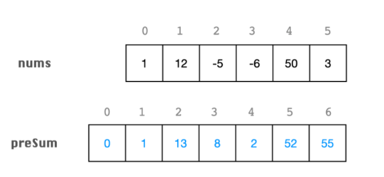

> 原文链接: https://leetcode-cn.com/problems/maximum-average-subarray-i


## 英文原文
<div><p>You are given an integer array <code>nums</code> consisting of <code>n</code> elements, and an integer <code>k</code>.</p>

<p>Find a contiguous subarray whose <strong>length is equal to</strong> <code>k</code> that has the maximum average value and return <em>this value</em>. Any answer with a calculation error less than <code>10<sup>-5</sup></code> will be accepted.</p>

<p>&nbsp;</p>
<p><strong>Example 1:</strong></p>

<pre>
<strong>Input:</strong> nums = [1,12,-5,-6,50,3], k = 4
<strong>Output:</strong> 12.75000
<strong>Explanation:</strong> Maximum average is (12 - 5 - 6 + 50) / 4 = 51 / 4 = 12.75
</pre>

<p><strong>Example 2:</strong></p>

<pre>
<strong>Input:</strong> nums = [5], k = 1
<strong>Output:</strong> 5.00000
</pre>

<p>&nbsp;</p>
<p><strong>Constraints:</strong></p>

<ul>
	<li><code>n == nums.length</code></li>
	<li><code>1 &lt;= k &lt;= n &lt;= 10<sup>5</sup></code></li>
	<li><code>-10<sup>4</sup> &lt;= nums[i] &lt;= 10<sup>4</sup></code></li>
</ul>
</div>

## 中文题目
<div><p>给你一个由 <code>n</code> 个元素组成的整数数组 <code>nums</code> 和一个整数 <code>k</code> 。</p>

<p>请你找出平均数最大且 <strong>长度为 <code>k</code></strong> 的连续子数组，并输出该最大平均数。</p>

<p>任何误差小于 <code>10<sup>-5</sup></code> 的答案都将被视为正确答案。</p>

<p>&nbsp;</p>

<p><strong>示例 1：</strong></p>

<pre>
<strong>输入：</strong>nums = [1,12,-5,-6,50,3], k = 4
<strong>输出：</strong>12.75
<strong>解释：</strong>最大平均数 (12-5-6+50)/4 = 51/4 = 12.75
</pre>

<p><strong>示例 2：</strong></p>

<pre>
<strong>输入：</strong>nums = [5], k = 1
<strong>输出：</strong>5.00000
</pre>

<p>&nbsp;</p>

<p><strong>提示：</strong></p>

<ul>
	<li><code>n == nums.length</code></li>
	<li><code>1 &lt;= k &lt;= n &lt;= 10<sup>5</sup></code></li>
	<li><code>-10<sup>4</sup> &lt;= nums[i] &lt;= 10<sup>4</sup></code></li>
</ul>
</div>

## 通过代码
<RecoDemo>
</RecoDemo>


## 高赞题解
各位题友大家好，今天是「每日算法题」公众号坚持日更的第 **11** 天。今天力扣上的每日一题是第 643 题「[子数组最大平均数 I](https://leetcode-cn.com/problems/maximum-average-subarray-i/)」。

### 解题思路


首先需要区分两个概念：**子串（子数组）** 和 **子序列。** 这两个名词经常在题目中出现，非常有必要加以区分。**子串sub-string（子数组 sub-array）是连续的，而子序列 subsequence 可以不连续。**

### 方法一：preSum


今天题目让求最大平均数，由于 `k` 是不变的，因此可以先求区间的最大和，然后再除以 `k`。


上周我在题解中已经说过，求区间的和可以用 **preSum**。preSum 方法还能快速计算指定区间段 `i ~ j` 的元素之和。它的计算方法是从左向右遍历数组，当遍历到数组的 `i` 位置时，preSum 表示 `i` 位置左边的元素之和。

假设数组长度为 `N`，我们定义一个长度为 `N+1` 的 preSum 数组，**preSum[i] 表示该元素左边所有元素之和（不包含当前元素）**。然后遍历一次数组，累加区间 `[0, i)` 范围内的元素，可以得到 preSum 数组。代码如下：

```Python []
N = len(nums)
preSum = range(N + 1)
for i in range(N):
    preSum[i + 1] = preSum[i] + nums[i]
print(preSum)
```


利用 preSum 数组，可以在 `O(1)` 的时间内快速求出 `nums`  任意区间 `[i, j]` (两端都包含) 的各元素之和。

`sum(i, j) = preSum[j + 1] - preSum[i]`


对于本题，可以先遍历一次，求数组每个位置的 preSum，然后再遍历一次，求长度为 k 的每个区间的最大和。最终除以 k 得到最大平均数。





使用 Python2 写的代码如下。

```Python []
class Solution(object):
    def findMaxAverage(self, nums, k):
        """
        :type nums: List[int]
        :type k: int
        :rtype: float
        """
        N = len(nums)
        preSum = range(N + 1)
        for i in range(N):
            preSum[i + 1] = preSum[i] + nums[i]
        largest = float("-inf")
        for i in range(k - 1, N):
            largest = max(preSum[i + 1] - preSum[i + 1 - k], largest)
        return largest / float(k)
```


### 方法二：滑动窗口


题目也可以抽象成长度固定为 k 的滑动窗口。当每次窗口右移的时候，需要把右边的新位置 **加到** 窗口中的 **和** 中，把左边被移除的位置从窗口的 **和** 中 **减掉**。这样窗口里面所有元素的 **和** 是准确的，我们求出最大的和，最终除以 `k` 得到最大平均数。


这个方法只用遍历一次数组。


需要注意的是，需要根据 `i` 的位置，计算滑动窗口是否开始、是否要移除最左边元素：

- 当 `i >= k` 时，为了固定窗口的元素是 `k` 个，每次移动时需要将 `i - k` 位置的元素移除。
- 当 `i >= k - 1` 时，最左边第一个滑动窗口内的元素刚好 `k` 个，开始计算滑动窗口的最大和。


使用 Python2 写的代码如下。

```Python []
class Solution(object):
    def findMaxAverage(self, nums, k):
        """
        :type nums: List[int]
        :type k: int
        :rtype: float
        """
        sums = 0
        largest = float('-inf')
        for i, num in enumerate(nums):
            sums += num
            if i >= k:
                sums -= nums[i - k]
            if i >= k - 1:
                largest = max(sums, largest)
        return largest / float(k)
```


### 刷题心得


今天的题目非常好，虽然是个 Easy 题目，但是让我们练习了 **preSum** 和 **滑动窗口** 两种方法的最基本用法。


- preSum 方法要注意定义的 preSum 是否包含当前元素；
- 滑动窗口 方法要注意窗口的大小要固定为 `k`。


OK，这就是今天题解的全部内容了，如果你觉得有帮助的话，**求赞、求关注、求收藏**。我们明天再见！

## 统计信息
| 通过次数 | 提交次数 | AC比率 |
| :------: | :------: | :------: |
|    66898    |    149157    |   44.9%   |

## 提交历史
| 提交时间 | 提交结果 | 执行时间 |  内存消耗  | 语言 |
| :------: | :------: | :------: | :--------: | :--------: |


## 相似题目
|                             题目                             | 难度 |
| :----------------------------------------------------------: | :---------: |
| [子数组最大平均数 II](https://leetcode-cn.com/problems/maximum-average-subarray-ii/) | 困难|
