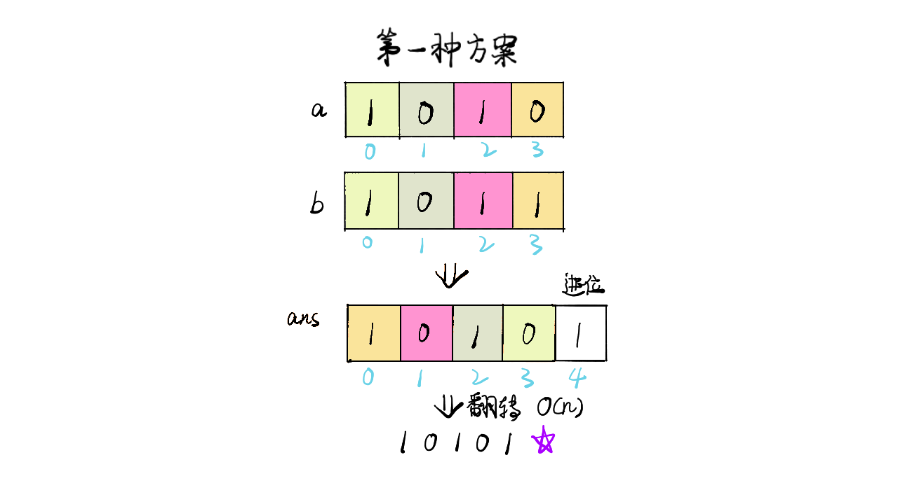
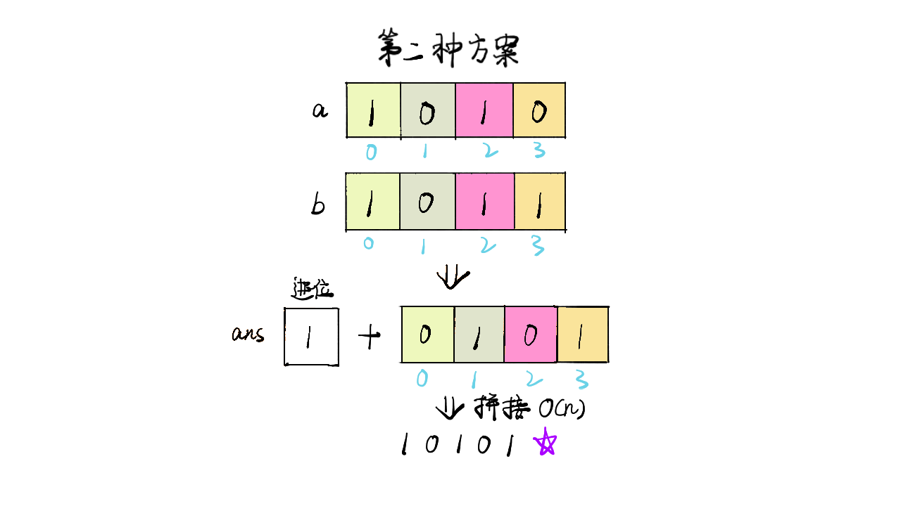

> 原文链接: https://leetcode-cn.com/problems/add-binary


## 英文原文
<div><p>Given two binary strings <code>a</code> and <code>b</code>, return <em>their sum as a binary string</em>.</p>

<p>&nbsp;</p>
<p><strong>Example 1:</strong></p>
<pre><strong>Input:</strong> a = "11", b = "1"
<strong>Output:</strong> "100"
</pre><p><strong>Example 2:</strong></p>
<pre><strong>Input:</strong> a = "1010", b = "1011"
<strong>Output:</strong> "10101"
</pre>
<p>&nbsp;</p>
<p><strong>Constraints:</strong></p>

<ul>
	<li><code>1 &lt;= a.length, b.length &lt;= 10<sup>4</sup></code></li>
	<li><code>a</code> and <code>b</code> consist&nbsp;only of <code>&#39;0&#39;</code> or <code>&#39;1&#39;</code> characters.</li>
	<li>Each string does not contain leading zeros except for the zero itself.</li>
</ul>
</div>

## 中文题目
<div><p>给你两个二进制字符串，返回它们的和（用二进制表示）。</p>

<p>输入为 <strong>非空 </strong>字符串且只包含数字&nbsp;<code>1</code>&nbsp;和&nbsp;<code>0</code>。</p>

<p>&nbsp;</p>

<p><strong>示例&nbsp;1:</strong></p>

<pre><strong>输入:</strong> a = &quot;11&quot;, b = &quot;1&quot;
<strong>输出:</strong> &quot;100&quot;</pre>

<p><strong>示例&nbsp;2:</strong></p>

<pre><strong>输入:</strong> a = &quot;1010&quot;, b = &quot;1011&quot;
<strong>输出:</strong> &quot;10101&quot;</pre>

<p>&nbsp;</p>

<p><strong>提示：</strong></p>

<ul>
	<li>每个字符串仅由字符 <code>&#39;0&#39;</code> 或 <code>&#39;1&#39;</code> 组成。</li>
	<li><code>1 &lt;= a.length, b.length &lt;= 10^4</code></li>
	<li>字符串如果不是 <code>&quot;0&quot;</code> ，就都不含前导零。</li>
</ul>
</div>

## 通过代码
<RecoDemo>
</RecoDemo>


## 高赞题解
### 解题方案

#### 思路

整体思路是将两个字符串较短的用 $0$ 补齐，使得两个字符串长度一致，然后从末尾进行遍历计算，得到最终结果。

本题解中大致思路与上述一致，但由于字符串操作原因，不确定最后的结果是否会多出一位进位，所以会有 2 种处理方式：
  - 第一种，在进行计算时直接拼接字符串，会得到一个反向字符，需要最后再进行翻转
  - 第二种，按照位置给结果字符赋值，最后如果有进位，则在前方进行字符串拼接添加进位

时间复杂度：$O(n)$

#### 代码

```Java []
class Solution {
    public String addBinary(String a, String b) {
        StringBuilder ans = new StringBuilder();
        int ca = 0;
        for(int i = a.length() - 1, j = b.length() - 1;i >= 0 || j >= 0; i--, j--) {
            int sum = ca;
            sum += i >= 0 ? a.charAt(i) - '0' : 0;
            sum += j >= 0 ? b.charAt(j) - '0' : 0;
            ans.append(sum % 2);
            ca = sum / 2;
        }
        ans.append(ca == 1 ? ca : "");
        return ans.reverse().toString();
    }
}
```
```JavaScript []
/**
 * @param {string} a
 * @param {string} b
 * @return {string}
 */
var addBinary = function(a, b) {
    let ans = "";
    let ca = 0;
    for(let i = a.length - 1, j = b.length - 1;i >= 0 || j >= 0; i--, j--) {
        let sum = ca;
        sum += i >= 0 ? parseInt(a[i]) : 0;
        sum += j >= 0 ? parseInt(b[j]) : 0;
        ans += sum % 2;
        ca = Math.floor(sum / 2);
    }
    ans += ca == 1 ? ca : "";
    return ans.split('').reverse().join('');
};
```

#### 画解

<,,>

想看大鹏画解更多高频面试题，欢迎阅读大鹏的 LeetBook：[《画解剑指 Offer 》](https://leetcode-cn.com/leetbook/detail/illustrate-lcof/)，O(∩_∩)O

## 统计信息
| 通过次数 | 提交次数 | AC比率 |
| :------: | :------: | :------: |
|    207943    |    384093    |   54.1%   |

## 提交历史
| 提交时间 | 提交结果 | 执行时间 |  内存消耗  | 语言 |
| :------: | :------: | :------: | :--------: | :--------: |


## 相似题目
|                             题目                             | 难度 |
| :----------------------------------------------------------: | :---------: |
| [两数相加](https://leetcode-cn.com/problems/add-two-numbers/) | 中等|
| [字符串相乘](https://leetcode-cn.com/problems/multiply-strings/) | 中等|
| [加一](https://leetcode-cn.com/problems/plus-one/) | 简单|
| [数组形式的整数加法](https://leetcode-cn.com/problems/add-to-array-form-of-integer/) | 简单|
