> 原文链接: https://leetcode-cn.com/problems/longest-continuous-increasing-subsequence


## 英文原文
<div><p>Given an unsorted array of integers <code>nums</code>, return <em>the length of the longest <strong>continuous increasing subsequence</strong> (i.e. subarray)</em>. The subsequence must be <strong>strictly</strong> increasing.</p>

<p>A <strong>continuous increasing subsequence</strong> is defined by two indices <code>l</code> and <code>r</code> (<code>l &lt; r</code>) such that it is <code>[nums[l], nums[l + 1], ..., nums[r - 1], nums[r]]</code> and for each <code>l &lt;= i &lt; r</code>, <code>nums[i] &lt; nums[i + 1]</code>.</p>

<p>&nbsp;</p>
<p><strong>Example 1:</strong></p>

<pre>
<strong>Input:</strong> nums = [1,3,5,4,7]
<strong>Output:</strong> 3
<strong>Explanation:</strong> The longest continuous increasing subsequence is [1,3,5] with length 3.
Even though [1,3,5,7] is an increasing subsequence, it is not continuous as elements 5 and 7 are separated by element
4.
</pre>

<p><strong>Example 2:</strong></p>

<pre>
<strong>Input:</strong> nums = [2,2,2,2,2]
<strong>Output:</strong> 1
<strong>Explanation:</strong> The longest continuous increasing subsequence is [2] with length 1. Note that it must be strictly
increasing.
</pre>

<p>&nbsp;</p>
<p><strong>Constraints:</strong></p>

<ul>
	<li><code>1 &lt;= nums.length &lt;= 10<sup>4</sup></code></li>
	<li><code>-10<sup>9</sup> &lt;= nums[i] &lt;= 10<sup>9</sup></code></li>
</ul>
</div>

## 中文题目
<div><p>给定一个未经排序的整数数组，找到最长且<strong> 连续递增的子序列</strong>，并返回该序列的长度。</p>

<p><strong>连续递增的子序列</strong> 可以由两个下标 <code>l</code> 和 <code>r</code>（<code>l < r</code>）确定，如果对于每个 <code>l <= i < r</code>，都有 <code>nums[i] < nums[i + 1]</code> ，那么子序列 <code>[nums[l], nums[l + 1], ..., nums[r - 1], nums[r]]</code> 就是连续递增子序列。</p>

<p> </p>

<p><strong>示例 1：</strong></p>

<pre>
<strong>输入：</strong>nums = [1,3,5,4,7]
<strong>输出：</strong>3
<strong>解释：</strong>最长连续递增序列是 [1,3,5], 长度为3。
尽管 [1,3,5,7] 也是升序的子序列, 但它不是连续的，因为 5 和 7 在原数组里被 4 隔开。 
</pre>

<p><strong>示例 2：</strong></p>

<pre>
<strong>输入：</strong>nums = [2,2,2,2,2]
<strong>输出：</strong>1
<strong>解释：</strong>最长连续递增序列是 [2], 长度为1。
</pre>

<p> </p>

<p><strong>提示：</strong></p>

<ul>
	<li><code>1 <= nums.length <= 10<sup>4</sup></code></li>
	<li><code>-10<sup>9</sup> <= nums[i] <= 10<sup>9</sup></code></li>
</ul>
</div>

## 通过代码
<RecoDemo>
</RecoDemo>


## 高赞题解
### 解题思路

- 标签：遍历
- 过程：
  - count 为当前元素峰值，ans为最大峰值
  - 初始化 count = 1
  - 从 0 位置开始遍历，遍历时根据前后元素状态判断是否递增，递增则 count++，递减则 count=1
  - 如果 count>ans，则更新 ans
  - 直到循环结束
- 时间复杂度：$O(N)$

### 代码

```Java []
class Solution {
    public int findLengthOfLCIS(int[] nums) {
        if(nums.length <= 1)
            return nums.length;
        int ans = 1;
        int count = 1;
        for(int i=0;i<nums.length-1;i++) {
            if(nums[i+1] > nums[i]) {
                count++;
            } else {  
                count = 1;
            }
            ans = count > ans ? count : ans;
        }
        return ans;
    }
}
```

### 画解


<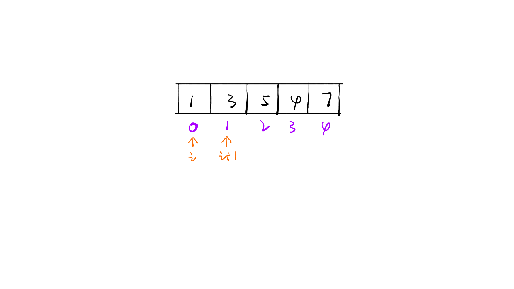,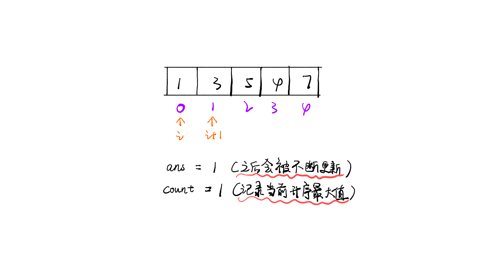,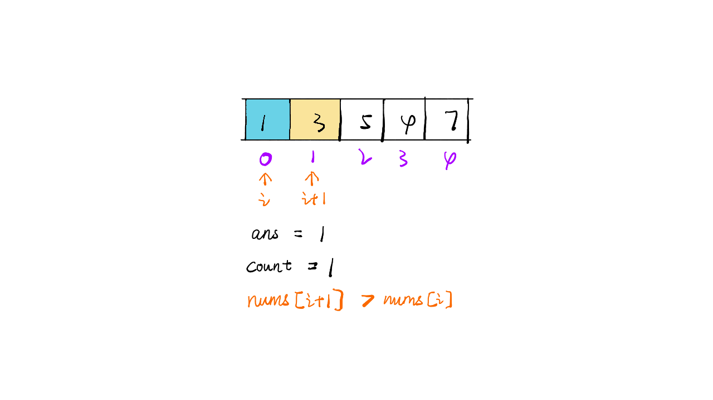,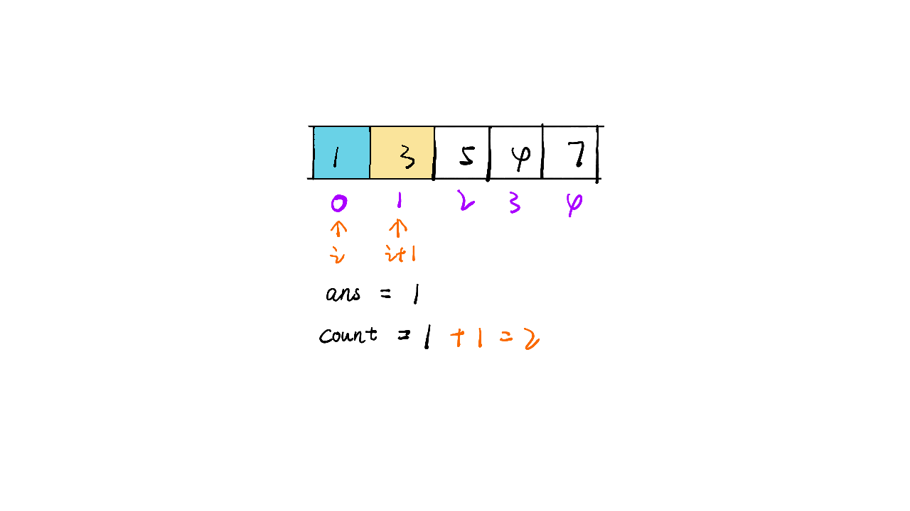,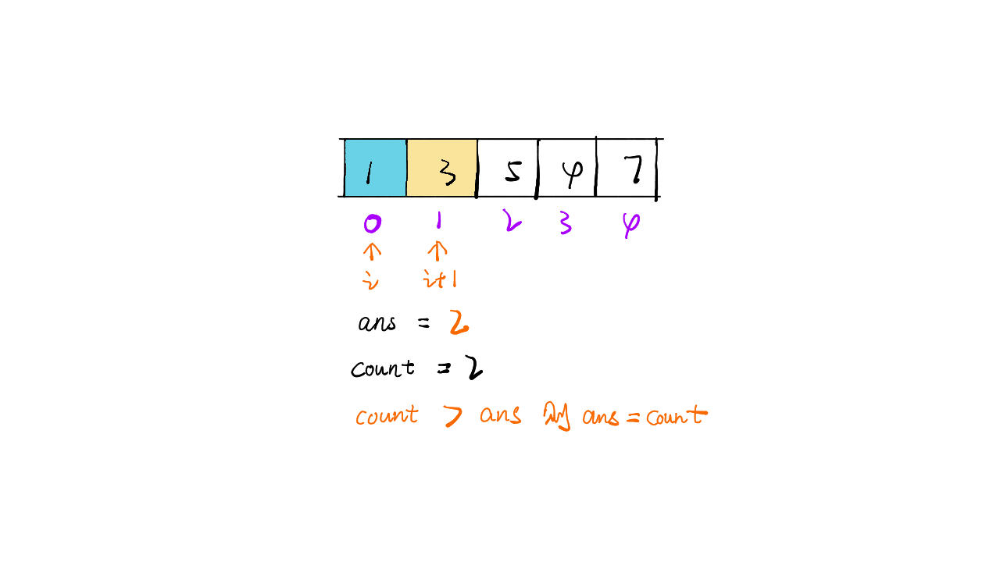,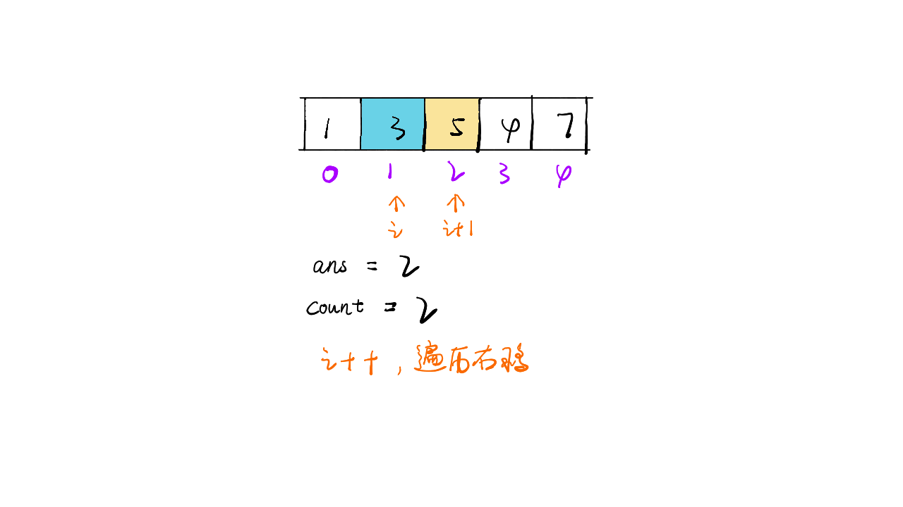,,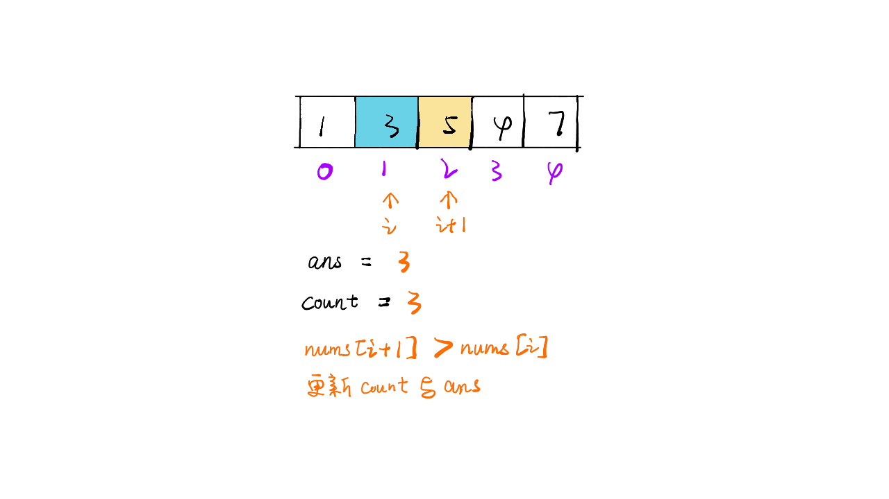,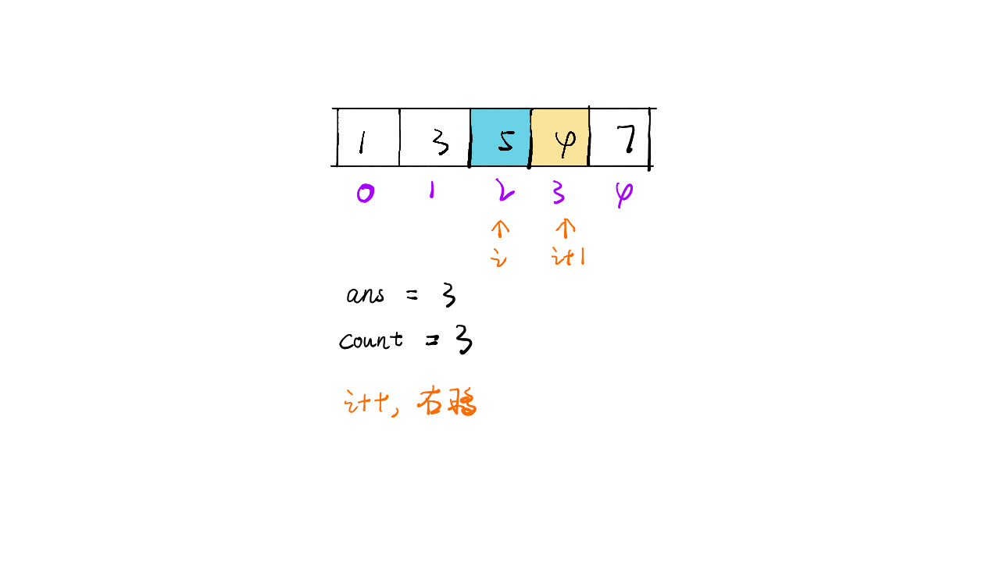,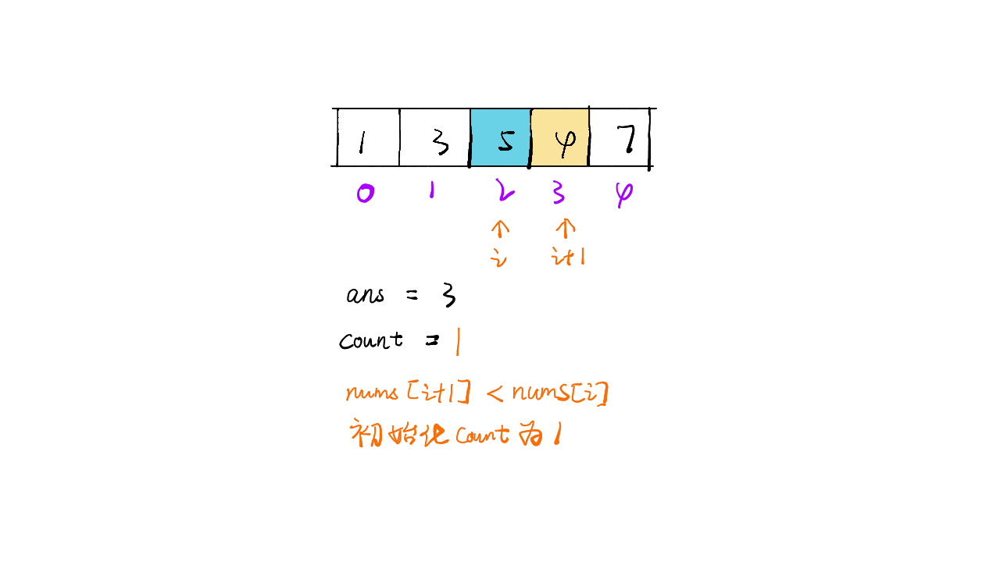,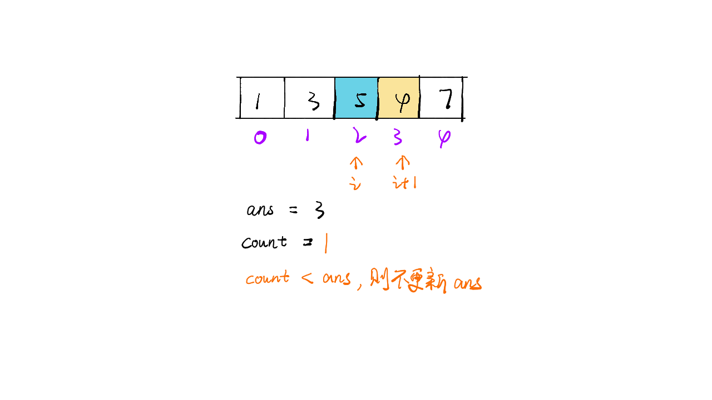,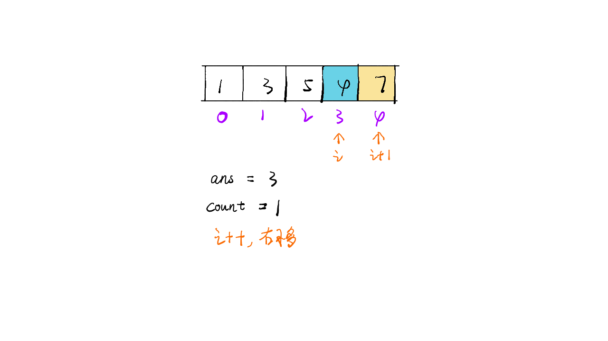,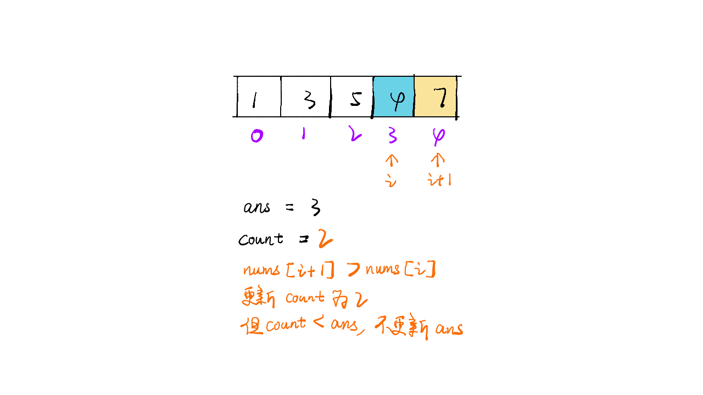,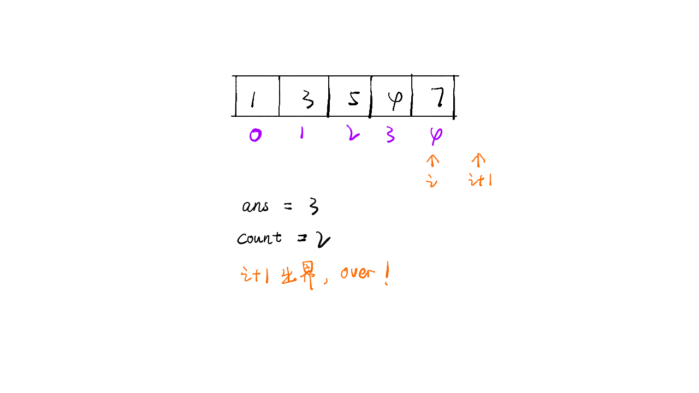,>

想看大鹏画解更多高频面试题，欢迎阅读大鹏的 LeetBook：[《画解剑指 Offer 》](https://leetcode-cn.com/leetbook/detail/illustrate-lcof/)，O(∩_∩)O

## 统计信息
| 通过次数 | 提交次数 | AC比率 |
| :------: | :------: | :------: |
|    97897    |    195265    |   50.1%   |

## 提交历史
| 提交时间 | 提交结果 | 执行时间 |  内存消耗  | 语言 |
| :------: | :------: | :------: | :--------: | :--------: |


## 相似题目
|                             题目                             | 难度 |
| :----------------------------------------------------------: | :---------: |
| [最长递增子序列的个数](https://leetcode-cn.com/problems/number-of-longest-increasing-subsequence/) | 中等|
| [最小窗口子序列](https://leetcode-cn.com/problems/minimum-window-subsequence/) | 困难|
