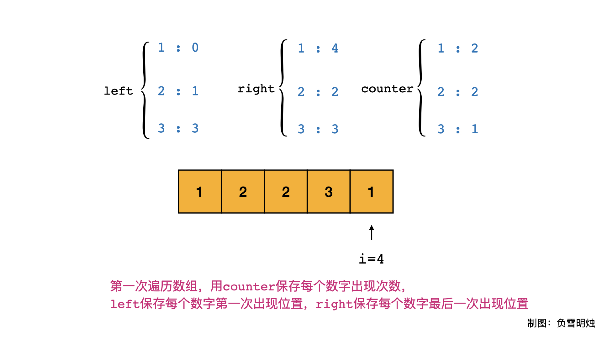
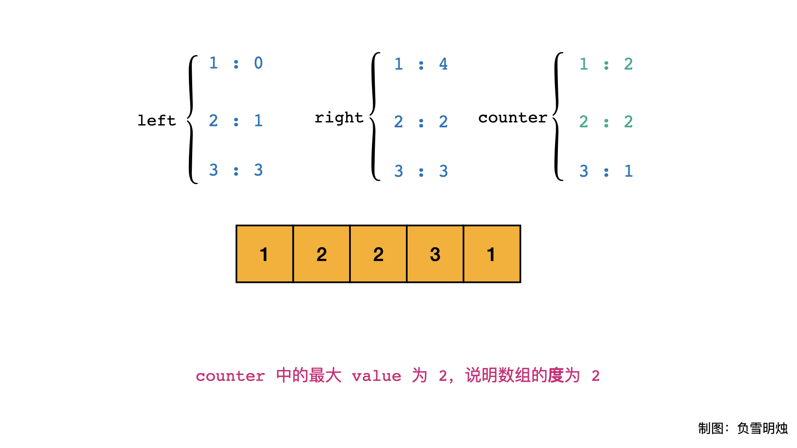
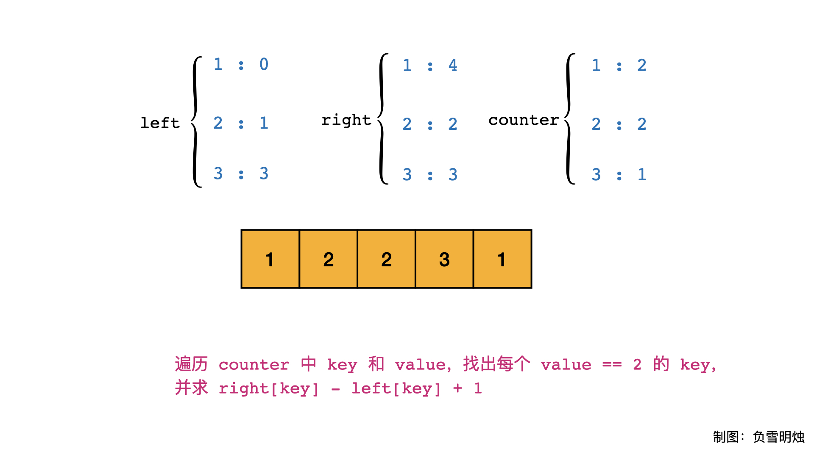
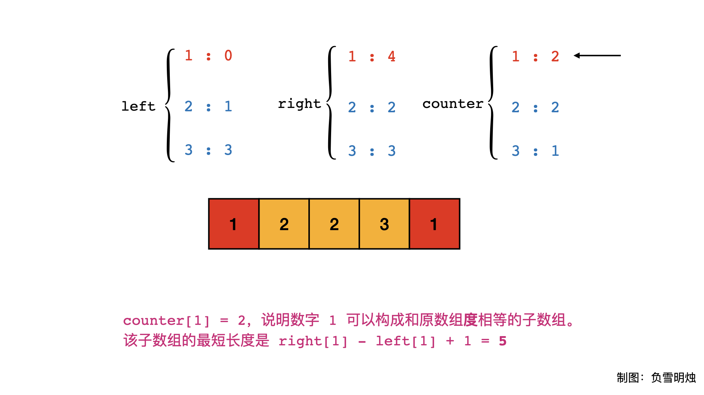
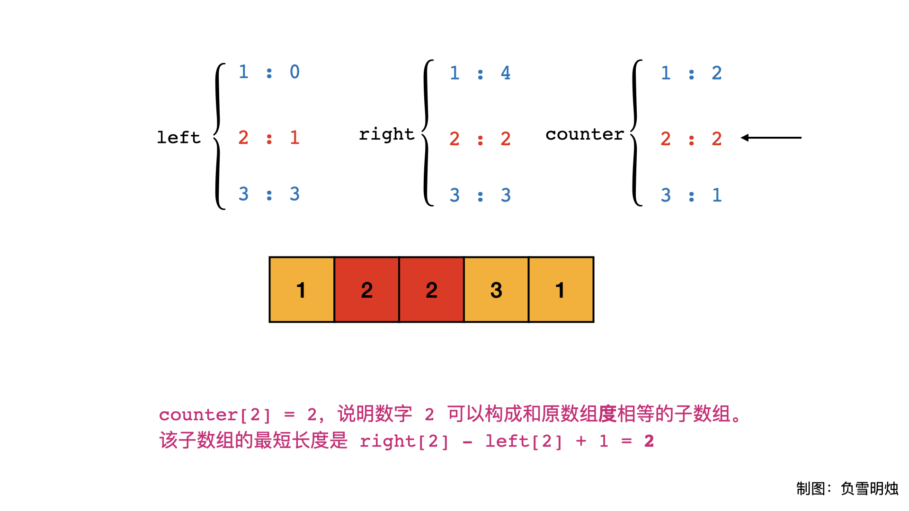
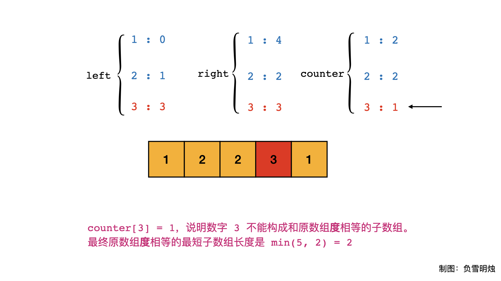

> 原文链接: https://leetcode-cn.com/problems/degree-of-an-array


## 英文原文
<div><p>Given a non-empty array of non-negative integers <code>nums</code>, the <b>degree</b> of this array is defined as the maximum frequency of any one of its elements.</p>

<p>Your task is to find the smallest possible length of a (contiguous) subarray of <code>nums</code>, that has the same degree as <code>nums</code>.</p>

<p>&nbsp;</p>
<p><strong>Example 1:</strong></p>

<pre>
<strong>Input:</strong> nums = [1,2,2,3,1]
<strong>Output:</strong> 2
<strong>Explanation:</strong> 
The input array has a degree of 2 because both elements 1 and 2 appear twice.
Of the subarrays that have the same degree:
[1, 2, 2, 3, 1], [1, 2, 2, 3], [2, 2, 3, 1], [1, 2, 2], [2, 2, 3], [2, 2]
The shortest length is 2. So return 2.
</pre>

<p><strong>Example 2:</strong></p>

<pre>
<strong>Input:</strong> nums = [1,2,2,3,1,4,2]
<strong>Output:</strong> 6
<strong>Explanation:</strong> 
The degree is 3 because the element 2 is repeated 3 times.
So [2,2,3,1,4,2] is the shortest subarray, therefore returning 6.
</pre>

<p>&nbsp;</p>
<p><strong>Constraints:</strong></p>

<ul>
	<li><code>nums.length</code> will be between 1 and 50,000.</li>
	<li><code>nums[i]</code> will be an integer between 0 and 49,999.</li>
</ul>
</div>

## 中文题目
<div><p>给定一个非空且只包含非负数的整数数组 <code>nums</code>，数组的度的定义是指数组里任一元素出现频数的最大值。</p>

<p>你的任务是在 <code>nums</code> 中找到与 <code>nums</code> 拥有相同大小的度的最短连续子数组，返回其长度。</p>

<p> </p>

<p><strong>示例 1：</strong></p>

<pre>
<strong>输入：</strong>[1, 2, 2, 3, 1]
<strong>输出：</strong>2
<strong>解释：</strong>
输入数组的度是2，因为元素1和2的出现频数最大，均为2.
连续子数组里面拥有相同度的有如下所示:
[1, 2, 2, 3, 1], [1, 2, 2, 3], [2, 2, 3, 1], [1, 2, 2], [2, 2, 3], [2, 2]
最短连续子数组[2, 2]的长度为2，所以返回2.
</pre>

<p><strong>示例 2：</strong></p>

<pre>
<strong>输入：</strong>[1,2,2,3,1,4,2]
<strong>输出：</strong>6
</pre>

<p> </p>

<p><strong>提示：</strong></p>

<ul>
	<li><code>nums.length</code> 在1到 50,000 区间范围内。</li>
	<li><code>nums[i]</code> 是一个在 0 到 49,999 范围内的整数。</li>
</ul>
</div>

## 通过代码
<RecoDemo>
</RecoDemo>


## 高赞题解
各位题友大家好！ 今天是 **[@负雪明烛](/u/fuxuemingzhu/)** 坚持日更的第 **27** 天。今天力扣上的每日一题是「[697. 数组的度](https://leetcode-cn.com/problems/degree-of-an-array/)」。

### 理解题意

今天题目比较晦涩，需要我来解释一下题目。


- **数组的度：数组中各元素出现次数的最大值**。对于示例二 `[1,2,2,3,1,4,2]` ：数组中各元素出现的次数为： `1` 出现 2 次， `2` 出现 3 次， `3` 出现 1 次， `4` 出现 1 次，所以数组的**度**为 3（就是元素 `2` 出现的次数）。
- 题目要求的是与 `nums` 拥有相同大小的**度**的**最短连续子数组**的长度。比如对于示例二 `[1,2,2,3,1,4,2]`，数组的度为 3，它的**度为 3 的**最短连续子数组是 `[2,2,3,1,4,2]` ，返回该子数组长度 6。

### 解题思路


本题可以按照两部分求解：

- 先求原数组的度；
- 再求与原数组相同**度**的最短子数组。


### 求原数组的度


求数组的度，本质还是求各个元素的出现次数，我们可以用 **字典（哈希表）**计数，字典的 key 是元素，value 是该元素出现的次数。因此，字典中所有 value 的最大值就是数组的**度 $degree$**。


### 求与原数组相同度的最短子数组


要求的子数组的**度**与原数组相同**度**的相同，那么该子数组中也得有 $degree$ 个重复的元素。比如对于示例二`[1,2,2,3,1,4,2]`，出现次数最多的元素是 2，它的出现次数为 3， 所以数组的度为 3；我们要求的子数组得有 3 个 2 ，所以最短的子数组是 [`2,2,3,1,4,2]`。注意到了吗？我们要求的最短子数组的起始和终止位置，由**出现次数最多的元素 第一次和最后一次出现的位置** 确定。


另外，需要注意的是出现次数最多的元素可能不止一个，比如示例一`[1, 2, 2, 3, 1]`，数字 `1` 和数字 `2` 都出现了 2 次。此时，我们必须分别对每个出现次数为 `2` 的元素（即数字 `1` 和数字 `2` ）都求一次包含`2`个它的最短子数组的长度（分别为5和2），最终对所有最短子数组长度取 $min$，得到结果为 2。

示例一的运行情况如下面动图所示：


上面的动图对应的 PPT 在下面，可以点击观看。

<,,,,,,,>


# 代码


- 使用 `left` 和 `right` 分别保存了每个元素在数组中第一次出现的位置和最后一次出现的位置；使用 `counter` 保存每个元素出现的次数。
- 数组的度 $degree$ 等于 `counter.values()` 的最大值；

- 对`counter`再次遍历：
  - 如果元素 `k` 出现的次数等于 $degree$，则找出元素 `k` 最后一次出现的位置 和 第一次出现的位置，计算两者之差+1，即为子数组长度。 
  - 对所有出现次数等于 $degree$ 的子数组的最短长度，取 $min$。


```Python []
class Solution:
    def findShortestSubArray(self, nums: List[int]) -> int:
        left, right = dict(), dict()
        counter = collections.Counter()
        for i, num in enumerate(nums):
            if num not in left:
                left[num] = i
            right[num] = i
            counter[num] += 1
        degree = max(counter.values())
        res = len(nums)
        for k, v in counter.items():
            if v == degree:
                res = min(res, right[k] - left[k] + 1)
        return res
```
```C++ []
class Solution {
public:
    int findShortestSubArray(vector<int>& nums) {
        unordered_map<int, int> left, right, counter;
        int degree = 0;
        for (int i = 0; i < nums.size(); ++i) {
            if (!left.count(nums[i]))
                left[nums[i]] = i;
            right[nums[i]] = i;
            counter[nums[i]] ++;
            degree = max(degree, counter[nums[i]]);
        }
        int res = nums.size();
        for (auto& kv : counter) {
            if (kv.second == degree) {
                res = min(res, right[kv.first] - left[kv.first] + 1);
            }
        }
        return res;
    }
};
```

- 时间复杂度：$O(N)$，因为对数组遍历了一遍，对`counter` 遍历了两遍。
- 空间复杂度：$O(N)$，因为 `counter` 在最坏情况下会跟 `nums` 的元素个数相等。

### 刷题心得


今天这个题目本身不难，写了这么长的题解是因为想法是很抽象的，找到最简洁易懂的表达方式是很难的。大家看题解主要是学习作者的思路，最重要的还是要形成自己的理解啊！

-----


OK，以上就是 [@负雪明烛](https://leetcode-cn.com/u/fuxuemingzhu/) 写的今天题解的全部内容了，如果你觉得有帮助的话，**求赞、求关注、求收藏**。如果有疑问的话，请在下面评论，我会及时解答。


**关注我**，你将不会错过我的精彩动画题解、面试题分享、组队刷题活动，进入主页 [@负雪明烛](https://leetcode-cn.com/u/fuxuemingzhu/) 右侧有刷题组织，从此刷题不再孤单。


祝大家牛年大吉！AC 多多，Offer 多多！我们明天再见！

## 统计信息
| 通过次数 | 提交次数 | AC比率 |
| :------: | :------: | :------: |
|    68733    |    113752    |   60.4%   |

## 提交历史
| 提交时间 | 提交结果 | 执行时间 |  内存消耗  | 语言 |
| :------: | :------: | :------: | :--------: | :--------: |


## 相似题目
|                             题目                             | 难度 |
| :----------------------------------------------------------: | :---------: |
| [最大子数组和](https://leetcode-cn.com/problems/maximum-subarray/) | 简单|
