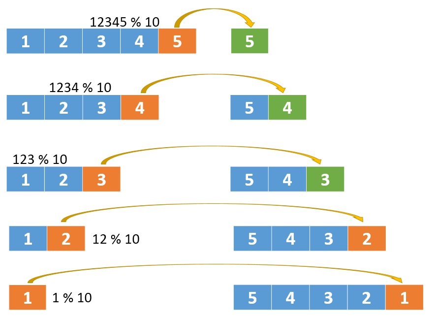
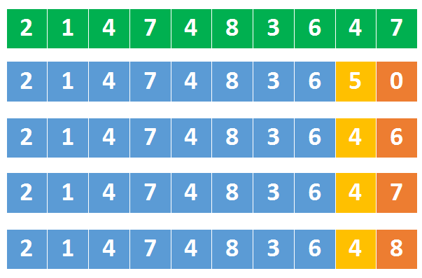
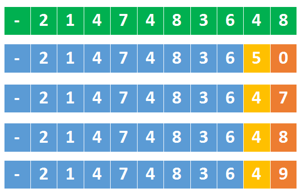

> 原文链接: https://leetcode-cn.com/problems/reverse-integer


## 英文原文
<div><p>Given a signed 32-bit integer <code>x</code>, return <code>x</code><em> with its digits reversed</em>. If reversing <code>x</code> causes the value to go outside the signed 32-bit integer range <code>[-2<sup>31</sup>, 2<sup>31</sup> - 1]</code>, then return <code>0</code>.</p>

<p><strong>Assume the environment does not allow you to store 64-bit integers (signed or unsigned).</strong></p>

<p>&nbsp;</p>
<p><strong>Example 1:</strong></p>
<pre><strong>Input:</strong> x = 123
<strong>Output:</strong> 321
</pre><p><strong>Example 2:</strong></p>
<pre><strong>Input:</strong> x = -123
<strong>Output:</strong> -321
</pre><p><strong>Example 3:</strong></p>
<pre><strong>Input:</strong> x = 120
<strong>Output:</strong> 21
</pre><p><strong>Example 4:</strong></p>
<pre><strong>Input:</strong> x = 0
<strong>Output:</strong> 0
</pre>
<p>&nbsp;</p>
<p><strong>Constraints:</strong></p>

<ul>
	<li><code>-2<sup>31</sup> &lt;= x &lt;= 2<sup>31</sup> - 1</code></li>
</ul>
</div>

## 中文题目
<div><p>给你一个 32 位的有符号整数 <code>x</code> ，返回将 <code>x</code> 中的数字部分反转后的结果。</p>

<p>如果反转后整数超过 32 位的有符号整数的范围 <code>[−2<sup>31</sup>,  2<sup>31 </sup>− 1]</code> ，就返回 0。</p>
<strong>假设环境不允许存储 64 位整数（有符号或无符号）。</strong>

<p> </p>

<p><strong>示例 1：</strong></p>

<pre>
<strong>输入：</strong>x = 123
<strong>输出：</strong>321
</pre>

<p><strong>示例 2：</strong></p>

<pre>
<strong>输入：</strong>x = -123
<strong>输出：</strong>-321
</pre>

<p><strong>示例 3：</strong></p>

<pre>
<strong>输入：</strong>x = 120
<strong>输出：</strong>21
</pre>

<p><strong>示例 4：</strong></p>

<pre>
<strong>输入：</strong>x = 0
<strong>输出：</strong>0
</pre>

<p> </p>

<p><strong>提示：</strong></p>

<ul>
	<li><code>-2<sup>31</sup> <= x <= 2<sup>31</sup> - 1</code></li>
</ul>
</div>

## 通过代码
<RecoDemo>
</RecoDemo>


## 高赞题解
#### 解题思路：   

首先我们想一下，怎么去反转```一个整数```？   

用栈？   

或者把整数变成字符串，再去反转这个字符串？   

这两种方式是可以，但并不好。实际上我们只要能拿到这个整数的 **末尾数字** 就可以了。   

以```12345```为例，先拿到```5```，再拿到```4```，之后是```3```，```2```，```1```，我们按这样的顺序就可以反向拼接处一个数字了，也就能达到 **反转** 的效果。   

怎么拿末尾数字呢？好办，用取模运算就可以了   


{:width=500}

{:align=center}


1、将```12345 % 10 ``` 得到```5```，之后将```12345 / 10```      

2、将```1234 % 10 ``` 得到```4```，再将```1234 / 10 ```   

3、将```123 % 10 ``` 得到```3```，再将```123 / 10 ```   

4、将```12 % 10 ``` 得到```2```，再将```12 / 10```   

5、将```1 % 10 ``` 得到```1```，再将```1 / 10```   

   

这么看起来，一个循环就搞定了，循环的判断条件是```x>0```   

但这样不对，因为忽略了 **负数**   

循环的判断条件应该是```while(x!=0)```，无论正数还是负数，按照上面不断的```/10```这样的操作，最后都会变成```0```，所以判断终止条件就是```!=0```   

有了取模和除法操作，对于像```12300```这样的数字，也可以完美的解决掉了。   

   

看起来这道题就这么解决了，但请注意，题目上还有这么一句   

> 假设我们的环境只能存储得下 32 位的有符号整数，则其数值范围为 ```[−2^31,  2^31 − 1]```。  


也就是说我们不能用```long```存储最终结果，而且有些数字可能是合法范围内的数字，但是**反转**过来就超过范围了。  

假设有```1147483649```这个数字，它是小于最大的32位整数```2147483647```的，但是将这个数字反转过来后就变成了```9463847411```，这就比最大的32位整数还要大了，这样的数字是没法存到```int```里面的，所以肯定要返回```0```(溢出了)。 

甚至，我们还需要提前判断   


{:width=500}

{:align=center}


上图中，绿色的是最大32位整数   

第二排数字中，橘子的是```5```，它是大于上面同位置的```4```，这就意味着```5```后跟任何数字，都会比最大32为整数都大。   

所以，我们到【最大数的1/10】时，就要开始判断了   

如果某个数字**大于** ```214748364```那后面就不用再判断了，肯定溢出了。   

如果某个数字**等于** ```214748364```呢，这对应到上图中第三、第四、第五排的数字，需要要跟最大数的**末尾数字**比较，如果这个数字比```7```还大，说明溢出了。 


对于负数也是一样的    


{:width=500}

{:align=center}


上图中绿色部分是最小的32位整数，同样是在【最小数的 1/10】时开始判断   

如果某个数字**小于** ```-214748364```说明溢出了   

如果某个数字**等于** ```-214748364```，还需要跟最小数的末尾比较，即看它是否小于```8```   

   

第八题 **字符串转换整数 (atoi)** 也有这样的问题，你可以点击 [这里](https://leetcode-cn.com/problems/string-to-integer-atoi/solution/tu-jie-8-zi-fu-chuan-zhuan-huan-zheng-shu-atoi-by-/) 查看。


代码实现

```Java []

class Solution {

    public int reverse(int x) {

        int res = 0;

        while(x!=0) {

            //每次取末尾数字

            int tmp = x%10;

            //判断是否 大于 最大32位整数

            if (res>214748364 || (res==214748364 && tmp>7)) {

                return 0;

            }

            //判断是否 小于 最小32位整数

            if (res<-214748364 || (res==-214748364 && tmp<-8)) {

                return 0;

            }

            res = res*10 + tmp;

            x /= 10;

        }

        return res;

    }

}			

```

   

我总结了几道类似的题目，方便你查看

| 题目 | 题解 | 难度等级 

|---| --- | --- |

|[整数反转](https://leetcode-cn.com/problems/reverse-integer/) | [链接](https://leetcode-cn.com/problems/reverse-integer/solution/tu-jie-7-zheng-shu-fan-zhuan-by-wang_ni_ma/) | 简单 |

|[回文数](https://leetcode-cn.com/problems/palindrome-number/)| [链接](https://leetcode-cn.com/problems/palindrome-number/solution/chao-xiang-xi-tu-jie-san-chong-jie-fa-9-hui-wen-sh/)| 简单 |

|[字符串转换整数 (atoi)](https://leetcode-cn.com/problems/string-to-integer-atoi/)|[链接](https://leetcode-cn.com/problems/string-to-integer-atoi/solution/tu-jie-8-zi-fu-chuan-zhuan-huan-zheng-shu-atoi-by-/)| 中等 |


## 统计信息
| 通过次数 | 提交次数 | AC比率 |
| :------: | :------: | :------: |
|    899507    |    2563154    |   35.1%   |

## 提交历史
| 提交时间 | 提交结果 | 执行时间 |  内存消耗  | 语言 |
| :------: | :------: | :------: | :--------: | :--------: |


## 相似题目
|                             题目                             | 难度 |
| :----------------------------------------------------------: | :---------: |
| [字符串转换整数 (atoi)](https://leetcode-cn.com/problems/string-to-integer-atoi/) | 中等|
| [颠倒二进制位](https://leetcode-cn.com/problems/reverse-bits/) | 简单|
