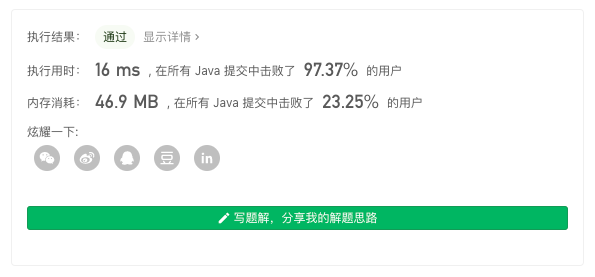
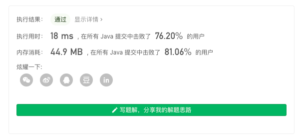
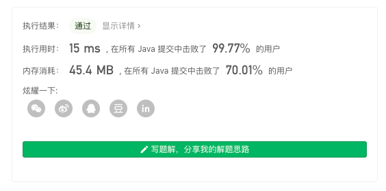

> 原文链接: https://leetcode-cn.com/problems/design-hashset


## 英文原文
<div><p>Design a HashSet without using any built-in hash table libraries.</p>

<p>Implement <code>MyHashSet</code> class:</p>

<ul>
	<li><code>void add(key)</code> Inserts the value <code>key</code> into the HashSet.</li>
	<li><code>bool contains(key)</code> Returns whether the value <code>key</code> exists in the HashSet or not.</li>
	<li><code>void remove(key)</code> Removes the value <code>key</code> in the HashSet. If <code>key</code> does not exist in the HashSet, do nothing.</li>
</ul>

<p>&nbsp;</p>
<p><strong>Example 1:</strong></p>

<pre>
<strong>Input</strong>
[&quot;MyHashSet&quot;, &quot;add&quot;, &quot;add&quot;, &quot;contains&quot;, &quot;contains&quot;, &quot;add&quot;, &quot;contains&quot;, &quot;remove&quot;, &quot;contains&quot;]
[[], [1], [2], [1], [3], [2], [2], [2], [2]]
<strong>Output</strong>
[null, null, null, true, false, null, true, null, false]

<strong>Explanation</strong>
MyHashSet myHashSet = new MyHashSet();
myHashSet.add(1);      // set = [1]
myHashSet.add(2);      // set = [1, 2]
myHashSet.contains(1); // return True
myHashSet.contains(3); // return False, (not found)
myHashSet.add(2);      // set = [1, 2]
myHashSet.contains(2); // return True
myHashSet.remove(2);   // set = [1]
myHashSet.contains(2); // return False, (already removed)</pre>

<p>&nbsp;</p>
<p><strong>Constraints:</strong></p>

<ul>
	<li><code>0 &lt;= key &lt;= 10<sup>6</sup></code></li>
	<li>At most <code>10<sup>4</sup></code> calls will be made to <code>add</code>, <code>remove</code>, and <code>contains</code>.</li>
</ul>
</div>

## 中文题目
<div><p>不使用任何内建的哈希表库设计一个哈希集合（HashSet）。</p>

<p>实现 <code>MyHashSet</code> 类：</p>

<ul>
	<li><code>void add(key)</code> 向哈希集合中插入值 <code>key</code> 。</li>
	<li><code>bool contains(key)</code> 返回哈希集合中是否存在这个值 <code>key</code> 。</li>
	<li><code>void remove(key)</code> 将给定值 <code>key</code> 从哈希集合中删除。如果哈希集合中没有这个值，什么也不做。</li>
</ul>
 

<p><strong>示例：</strong></p>

<pre>
<strong>输入：</strong>
["MyHashSet", "add", "add", "contains", "contains", "add", "contains", "remove", "contains"]
[[], [1], [2], [1], [3], [2], [2], [2], [2]]
<strong>输出：</strong>
[null, null, null, true, false, null, true, null, false]

<strong>解释：</strong>
MyHashSet myHashSet = new MyHashSet();
myHashSet.add(1);      // set = [1]
myHashSet.add(2);      // set = [1, 2]
myHashSet.contains(1); // 返回 True
myHashSet.contains(3); // 返回 False ，（未找到）
myHashSet.add(2);      // set = [1, 2]
myHashSet.contains(2); // 返回 True
myHashSet.remove(2);   // set = [1]
myHashSet.contains(2); // 返回 False ，（已移除）</pre>

<p> </p>

<p><strong>提示：</strong></p>

<ul>
	<li><code>0 <= key <= 10<sup>6</sup></code></li>
	<li>最多调用 <code>10<sup>4</sup></code> 次 <code>add</code>、<code>remove</code> 和 <code>contains</code> 。</li>
</ul>

<p> </p>

<p><strong>进阶：</strong>你可以不使用内建的哈希集合库解决此问题吗？</p>
</div>

## 通过代码
<RecoDemo>
</RecoDemo>


## 高赞题解
## 简单数组



由于题目给出了 `0 <= key <= 10^6` 数据范围，同时限定了 key 只能是 int。

我们可以直接使用一个 boolean 数组记录某个 key 是否存在，key 直接对应 boolean 的下标。

代码：
```Java []
class MyHashSet {
    boolean[] nodes = new boolean[1000009];
    
    public void add(int key) {
        nodes[key] = true;
    }
    
    public void remove(int key) {
        nodes[key] = false;
    }
    
    public boolean contains(int key) {
        return nodes[key];
    }
}
```
* 时间复杂度：$O(1)$
* 空间复杂度：$O(1)$

***

## 链表



我们利用「链表」来构建 Set，这也是工程上最简单的一种实现方式。

代码：
```Java []
class MyHashSet {
    // 由于使用的是「链表」，这个值可以取得很小
    Node[] nodes = new Node[10009];

    public void add(int key) {
        // 根据 key 获取哈希桶的位置
        int idx = getIndex(key);
        // 判断链表中是否已经存在
        Node loc = nodes[idx], tmp = loc;
        if (loc != null) {
            Node prev = null;
            while (tmp != null) {
                if (tmp.key == key) { 
                    return;
                }
                prev = tmp;
                tmp = tmp.next;
            }
            tmp = prev;
        }
        Node node = new Node(key);

        // 头插法
        // node.next = loc;
        // nodes[idx] = node;

        // 尾插法 
        if (tmp != null) {
            tmp.next = node;
        } else {
            nodes[idx] = node;
        }
    }

    public void remove(int key) {
        int idx = getIndex(key);
        Node loc = nodes[idx];
        if (loc != null) {
            Node prev = null;
            while (loc != null) {
                if (loc.key == key) {
                    if (prev != null) {
                        prev.next = loc.next;
                    } else {
                        nodes[idx] = loc.next;
                    }
                    return;
                }
                prev = loc;
                loc = loc.next;
            }
        }
    }

    public boolean contains(int key) {
        int idx = getIndex(key);
        Node loc = nodes[idx];
        if (loc != null) {
            while (loc != null) {
                if (loc.key == key) {
                    return true;
                }
                loc = loc.next;
            }
        }
        return false;
    }

    static class Node {
        private int key;
        private Node next;
        private Node(int key) {
            this.key = key;
        }
    }
    
    int getIndex(int key) {
        // 因为 nodes 的长度只有 10009，对应的十进制的 10011100011001（总长度为 32 位，其余高位都是 0）
        // 为了让 key 对应的 hash 高位也参与运算，这里对 hashCode 进行右移异或
        // 使得 hashCode 的高位随机性和低位随机性都能体现在低 16 位中
        int hash = Integer.hashCode(key);
        hash ^= (hash >>> 16);
        return hash % nodes.length;
    }
}
```
* 时间复杂度：由于没有扩容的逻辑，最坏情况下复杂度为 $O(n)$，一般情况下复杂度为 $O(1)$
* 空间复杂度：$O(1)$


***

## 分桶数组



事实上我们还可以实现一个类似「bitmap」数据结构。

使用 int 中的每一位代表一个位置。

由于数据范围为 `0 <= key <= 10^6`，我们最多需要的 int 数量不会超过 40000。

因此我们可以建立一个 buckets 数组，数组装载的 int 类型数值。

* 先对 key 进行 `key / 32`，确定当前 key 所在桶的位置（大概位置）
* 再对 key 进行 `key % 32`，确定当前 key 所在桶中的哪一位（精确位置）

根据位运算对「精确位置」进行修改。

代码：
```Java []
class MyHashSet {
    int[] bs = new int[40000];
    public void add(int key) {
        int bucketIdx = key / 32;
        int bitIdx = key % 32;
        setVal(bucketIdx, bitIdx, true);
    }
    
    public void remove(int key) {
        int bucketIdx = key / 32;
        int bitIdx = key % 32;
        setVal(bucketIdx, bitIdx, false);
    }
    
    public boolean contains(int key) {
        int bucketIdx = key / 32;
        int bitIdx = key % 32;
        return getVal(bucketIdx, bitIdx);
    }

    void setVal(int bucket, int loc, boolean val) {
        if (val) {
            int u = bs[bucket] | (1 << loc);
            bs[bucket] = u;
        } else {
            int u = bs[bucket] & ~(1 << loc);
            bs[bucket] = u;
        }
    }

    boolean getVal(int bucket, int loc) {
        int u = (bs[bucket] >> loc) & 1;
        return u == 1;
    }
}
```
* 时间复杂度：$O(1)$
* 空间复杂度：$O(1)$

***

## 最后

**如果有帮助到你，请给题解点个赞和收藏，让更多的人看到 ~ ("▔□▔)/**

**如有不理解的地方，欢迎你在评论区给我留言，我都会逐一回复 ~**

也欢迎你 [关注我](https://oscimg.oschina.net/oscnet/up-19688dc1af05cf8bdea43b2a863038ab9e5.png) 和 加入我们的[「组队打卡」](https://leetcode-cn.com/u/ac_oier/)小群 ，提供写「证明」&「思路」的高质量题解 

## 统计信息
| 通过次数 | 提交次数 | AC比率 |
| :------: | :------: | :------: |
|    71015    |    110375    |   64.3%   |

## 提交历史
| 提交时间 | 提交结果 | 执行时间 |  内存消耗  | 语言 |
| :------: | :------: | :------: | :--------: | :--------: |


## 相似题目
|                             题目                             | 难度 |
| :----------------------------------------------------------: | :---------: |
| [设计哈希映射](https://leetcode-cn.com/problems/design-hashmap/) | 简单|
