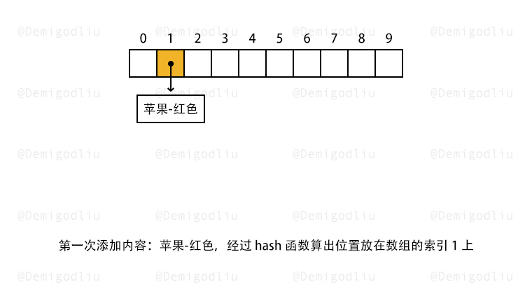
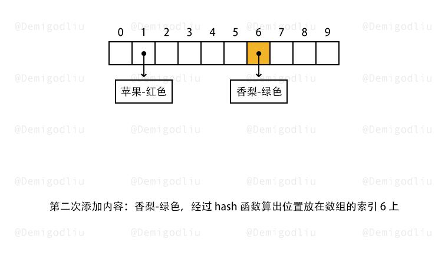
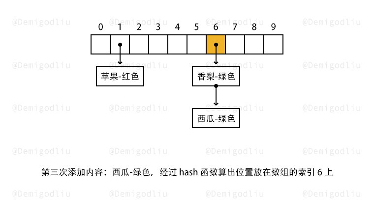

> 原文链接: https://leetcode-cn.com/problems/design-hashmap


## 英文原文
<div><p>Design a HashMap without using any built-in hash table libraries.</p>

<p>Implement the <code>MyHashMap</code> class:</p>

<ul>
	<li><code>MyHashMap()</code> initializes the object with an empty map.</li>
	<li><code>void put(int key, int value)</code> inserts a <code>(key, value)</code> pair into the HashMap. If the <code>key</code> already exists in the map, update the corresponding <code>value</code>.</li>
	<li><code>int get(int key)</code> returns the <code>value</code> to which the specified <code>key</code> is mapped, or <code>-1</code> if this map contains no mapping for the <code>key</code>.</li>
	<li><code>void remove(key)</code> removes the <code>key</code> and its corresponding <code>value</code> if the map contains the mapping for the <code>key</code>.</li>
</ul>

<p>&nbsp;</p>
<p><strong>Example 1:</strong></p>

<pre>
<strong>Input</strong>
[&quot;MyHashMap&quot;, &quot;put&quot;, &quot;put&quot;, &quot;get&quot;, &quot;get&quot;, &quot;put&quot;, &quot;get&quot;, &quot;remove&quot;, &quot;get&quot;]
[[], [1, 1], [2, 2], [1], [3], [2, 1], [2], [2], [2]]
<strong>Output</strong>
[null, null, null, 1, -1, null, 1, null, -1]

<strong>Explanation</strong>
MyHashMap myHashMap = new MyHashMap();
myHashMap.put(1, 1); // The map is now [[1,1]]
myHashMap.put(2, 2); // The map is now [[1,1], [2,2]]
myHashMap.get(1);    // return 1, The map is now [[1,1], [2,2]]
myHashMap.get(3);    // return -1 (i.e., not found), The map is now [[1,1], [2,2]]
myHashMap.put(2, 1); // The map is now [[1,1], [2,1]] (i.e., update the existing value)
myHashMap.get(2);    // return 1, The map is now [[1,1], [2,1]]
myHashMap.remove(2); // remove the mapping for 2, The map is now [[1,1]]
myHashMap.get(2);    // return -1 (i.e., not found), The map is now [[1,1]]
</pre>

<p>&nbsp;</p>
<p><strong>Constraints:</strong></p>

<ul>
	<li><code>0 &lt;= key, value &lt;= 10<sup>6</sup></code></li>
	<li>At most <code>10<sup>4</sup></code> calls will be made to <code>put</code>, <code>get</code>, and <code>remove</code>.</li>
</ul>
</div>

## 中文题目
<div><p>不使用任何内建的哈希表库设计一个哈希映射（HashMap）。</p>

<p>实现 <code>MyHashMap</code> 类：</p>

<ul>
	<li><code>MyHashMap()</code> 用空映射初始化对象</li>
	<li><code>void put(int key, int value)</code> 向 HashMap 插入一个键值对 <code>(key, value)</code> 。如果 <code>key</code> 已经存在于映射中，则更新其对应的值 <code>value</code> 。</li>
	<li><code>int get(int key)</code> 返回特定的 <code>key</code> 所映射的 <code>value</code> ；如果映射中不包含 <code>key</code> 的映射，返回 <code>-1</code> 。</li>
	<li><code>void remove(key)</code> 如果映射中存在 <code>key</code> 的映射，则移除 <code>key</code> 和它所对应的 <code>value</code> 。</li>
</ul>

<p> </p>

<p><strong>示例：</strong></p>

<pre>
<strong>输入</strong>：
["MyHashMap", "put", "put", "get", "get", "put", "get", "remove", "get"]
[[], [1, 1], [2, 2], [1], [3], [2, 1], [2], [2], [2]]
<strong>输出</strong>：
[null, null, null, 1, -1, null, 1, null, -1]

<strong>解释</strong>：
MyHashMap myHashMap = new MyHashMap();
myHashMap.put(1, 1); // myHashMap 现在为 [[1,1]]
myHashMap.put(2, 2); // myHashMap 现在为 [[1,1], [2,2]]
myHashMap.get(1);    // 返回 1 ，myHashMap 现在为 [[1,1], [2,2]]
myHashMap.get(3);    // 返回 -1（未找到），myHashMap 现在为 [[1,1], [2,2]]
myHashMap.put(2, 1); // myHashMap 现在为 [[1,1], [2,1]]（更新已有的值）
myHashMap.get(2);    // 返回 1 ，myHashMap 现在为 [[1,1], [2,1]]
myHashMap.remove(2); // 删除键为 2 的数据，myHashMap 现在为 [[1,1]]
myHashMap.get(2);    // 返回 -1（未找到），myHashMap 现在为 [[1,1]]
</pre>

<p> </p>

<p><strong>提示：</strong></p>

<ul>
	<li><code>0 <= key, value <= 10<sup>6</sup></code></li>
	<li>最多调用 <code>10<sup>4</sup></code> 次 <code>put</code>、<code>get</code> 和 <code>remove</code> 方法</li>
</ul>

<p> </p>

<p><strong>进阶：</strong>你能否不使用内置的 HashMap 库解决此问题？</p>
</div>

## 通过代码
<RecoDemo>
</RecoDemo>


## 高赞题解


---

### 🧠 解题思路

本题考查我们对于实现哈希表，有哪些方法，分别有什么利弊？

实现哈希表的原理，其实我们会遇到一个抉择，那就是时间和空间的取舍。

实现方式有两种：

1. 超大数组：不考虑空间复杂度，创建超大数组，每个数都能单独存入，且不会位置冲突。
2. 链地址法：空间/时间的最佳实践，基于数组实现，并且通过一个 $hash$ 函数生成一个对应的索引，当多个数索引一致的时候，再处理冲突问题，一般我们使用链地址法解决冲突。

---

### 🎨 图解演示

<,,>

---

### 🍭 示例代码

```Javascript []
var MyHashMap = function() {
    this.base = 1000;
    this.data = new Array(this.base).fill(0).map(i => new Array());
};

MyHashMap.prototype.put = function(key, value) {
    let hash = key % this.base;
    for(let i of this.data[hash]){
        if(i[0] === key) return i[1] = value;
    }
    this.data[hash].push([key, value]);
};

MyHashMap.prototype.get = function(key) {
    let hash = key % this.base;
    for(let i of this.data[hash]){
        if(i[0] === key) return i[1];
    }
    return -1;
};

MyHashMap.prototype.remove = function(key) {
    let hash = key % this.base;
    for(let i of this.data[hash]){
        if(i[0] === key) {
            let index = this.data[hash].indexOf(i);
            this.data[hash].splice(index, 1);
        }
    }
};
```
```C++ []
class MyHashMap {
private:
    vector<list<pair<int, int>>> data;
    static const int base = 769;
    static int hash(int key) {
        return key % base;
    }
public:
    MyHashMap(): data(base) {}
    
    void put(int key, int value) {
        int h = hash(key);
        for (auto it = data[h].begin(); it != data[h].end(); it++) {
            if ((*it).first == key) {
                (*it).second = value;
                return;
            }
        }
        data[h].push_back(make_pair(key, value));
    }
    
    int get(int key) {
        int h = hash(key);
        for (auto it = data[h].begin(); it != data[h].end(); it++) {
            if ((*it).first == key) {
                return (*it).second;
            }
        }
        return -1;
    }
    
    void remove(int key) {
        int h = hash(key);
        for (auto it = data[h].begin(); it != data[h].end(); it++) {
            if ((*it).first == key) {
                data[h].erase(it);
                return;
            }
        }
    }
};
```
```Java []
class MyHashMap {
    private class Pair {
        private int key;
        private int value;

        public Pair(int key, int value) {
            this.key = key;
            this.value = value;
        }

        public int getKey() {
            return key;
        }

        public int getValue() {
            return value;
        }

        public void setValue(int value) {
            this.value = value;
        }
    }

    private static final int BASE = 769;
    private LinkedList[] data;

    public MyHashMap() {
        data = new LinkedList[BASE];
        for (int i = 0; i < BASE; ++i) {
            data[i] = new LinkedList<Pair>();
        }
    }
    
    public void put(int key, int value) {
        int h = hash(key);
        Iterator<Pair> iterator = data[h].iterator();
        while (iterator.hasNext()) {
            Pair pair = iterator.next();
            if (pair.getKey() == key) {
                pair.setValue(value);
                return;
            }
        }
        data[h].offerLast(new Pair(key, value));
    }
    
    public int get(int key) {
        int h = hash(key);
        Iterator<Pair> iterator = data[h].iterator();
        while (iterator.hasNext()) {
            Pair pair = iterator.next();
            if (pair.getKey() == key) {
                return pair.value;
            }
        }
        return -1;
    }
    
    public void remove(int key) {
        int h = hash(key);
        Iterator<Pair> iterator = data[h].iterator();
        while (iterator.hasNext()) {
            Pair pair = iterator.next();
            if (pair.key == key) {
                data[h].remove(pair);
                return;
            }
        }
    }

    private static int hash(int key) {
        return key % BASE;
    }
}
```
```Golang []
const base = 769

type entry struct {
    key, value int
}

type MyHashMap struct {
    data []list.List
}

func Constructor() MyHashMap {
    return MyHashMap{make([]list.List, base)}
}

func (m *MyHashMap) hash(key int) int {
    return key % base
}

func (m *MyHashMap) Put(key, value int) {
    h := m.hash(key)
    for e := m.data[h].Front(); e != nil; e = e.Next() {
        if et := e.Value.(entry); et.key == key {
            e.Value = entry{key, value}
            return
        }
    }
    m.data[h].PushBack(entry{key, value})
}

func (m *MyHashMap) Get(key int) int {
    h := m.hash(key)
    for e := m.data[h].Front(); e != nil; e = e.Next() {
        if et := e.Value.(entry); et.key == key {
            return et.value
        }
    }
    return -1
}

func (m *MyHashMap) Remove(key int) {
    h := m.hash(key)
    for e := m.data[h].Front(); e != nil; e = e.Next() {
        if e.Value.(entry).key == key {
            m.data[h].Remove(e)
        }
    }
}
```
```C []
struct List {
    int key;
    int val;
    struct List* next;
};

void listPush(struct List* head, int key, int val) {
    struct List* tmp = malloc(sizeof(struct List));
    tmp->key = key;
    tmp->val = val;
    tmp->next = head->next;
    head->next = tmp;
}

void listDelete(struct List* head, int key) {
    for (struct List* it = head; it->next; it = it->next) {
        if (it->next->key == key) {
            struct List* tmp = it->next;
            it->next = tmp->next;
            free(tmp);
            break;
        }
    }
}

struct List* listFind(struct List* head, int key) {
    for (struct List* it = head; it->next; it = it->next) {
        if (it->next->key == key) {
            return it->next;
        }
    }
    return NULL;
}

void listFree(struct List* head) {
    while (head->next) {
        struct List* tmp = head->next;
        head->next = tmp->next;
        free(tmp);
    }
}

const int base = 769;

int hash(int key) {
    return key % base;
}

typedef struct {
    struct List* data;
} MyHashMap;

MyHashMap* myHashMapCreate() {
    MyHashMap* ret = malloc(sizeof(MyHashMap));
    ret->data = malloc(sizeof(struct List) * base);
    for (int i = 0; i < base; i++) {
        ret->data[i].key = 0;
        ret->data[i].val = 0;
        ret->data[i].next = NULL;
    }
    return ret;
}

void myHashMapPut(MyHashMap* obj, int key, int value) {
    int h = hash(key);
    struct List* rec = listFind(&(obj->data[h]), key);
    if (rec == NULL) {
        listPush(&(obj->data[h]), key, value);
    } else {
        rec->val = value;
    }
}

int myHashMapGet(MyHashMap* obj, int key) {
    int h = hash(key);
    struct List* rec = listFind(&(obj->data[h]), key);
    if (rec == NULL) {
        return -1;
    } else {
        return rec->val;
    }
}

void myHashMapRemove(MyHashMap* obj, int key) {
    int h = hash(key);
    listDelete(&(obj->data[h]), key);
}

void myHashMapFree(MyHashMap* obj) {
    for (int i = 0; i < base; i++) {
        listFree(&(obj->data[i]));
    }
    free(obj->data);
}
```

---

### 转身挥手

嘿，少年，做图不易，留下个赞或评论再走吧！谢啦~ 💐

差点忘了，祝你牛年大吉 🐮 ，AC 和 Offer 📑 多多益善~

⛲⛲⛲ 期待下次再见~ 

## 统计信息
| 通过次数 | 提交次数 | AC比率 |
| :------: | :------: | :------: |
|    62371    |    97002    |   64.3%   |

## 提交历史
| 提交时间 | 提交结果 | 执行时间 |  内存消耗  | 语言 |
| :------: | :------: | :------: | :--------: | :--------: |


## 相似题目
|                             题目                             | 难度 |
| :----------------------------------------------------------: | :---------: |
| [设计哈希集合](https://leetcode-cn.com/problems/design-hashset/) | 简单|
