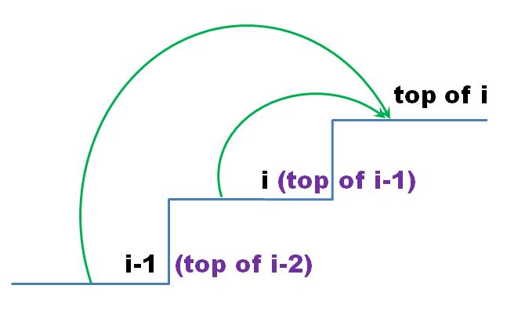
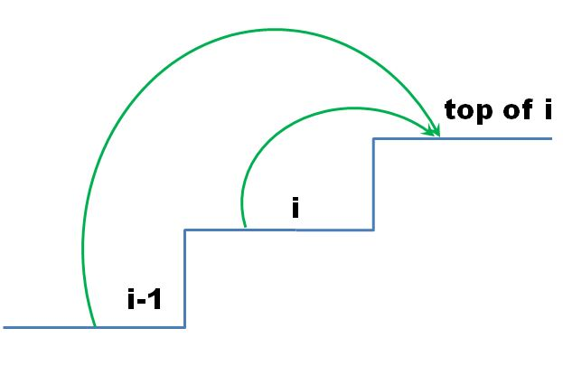
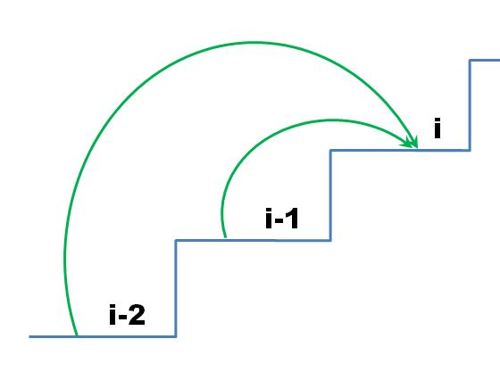

> 原文链接: https://leetcode-cn.com/problems/min-cost-climbing-stairs


## 英文原文
<div><p>You are given an integer array <code>cost</code> where <code>cost[i]</code> is the cost of <code>i<sup>th</sup></code> step on a staircase. Once you pay the cost, you can either climb one or two steps.</p>

<p>You can either start from the step with index <code>0</code>, or the step with index <code>1</code>.</p>

<p>Return <em>the minimum cost to reach the top of the floor</em>.</p>

<p>&nbsp;</p>
<p><strong>Example 1:</strong></p>

<pre>
<strong>Input:</strong> cost = [10,<u>15</u>,20]
<strong>Output:</strong> 15
<strong>Explanation:</strong> You will start at index 1.
- Pay 15 and climb two steps to reach the top.
The total cost is 15.
</pre>

<p><strong>Example 2:</strong></p>

<pre>
<strong>Input:</strong> cost = [<u>1</u>,100,<u>1</u>,1,<u>1</u>,100,<u>1</u>,<u>1</u>,100,<u>1</u>]
<strong>Output:</strong> 6
<strong>Explanation:</strong> You will start at index 0.
- Pay 1 and climb two steps to reach index 2.
- Pay 1 and climb two steps to reach index 4.
- Pay 1 and climb two steps to reach index 6.
- Pay 1 and climb one step to reach index 7.
- Pay 1 and climb two steps to reach index 9.
- Pay 1 and climb one step to reach the top.
The total cost is 6.
</pre>

<p>&nbsp;</p>
<p><strong>Constraints:</strong></p>

<ul>
	<li><code>2 &lt;= cost.length &lt;= 1000</code></li>
	<li><code>0 &lt;= cost[i] &lt;= 999</code></li>
</ul>
</div>

## 中文题目
<div><p>数组的每个下标作为一个阶梯，第 <code>i</code> 个阶梯对应着一个非负数的体力花费值 <code>cost[i]</code>（下标从 <code>0</code> 开始）。</p>

<p>每当你爬上一个阶梯你都要花费对应的体力值，一旦支付了相应的体力值，你就可以选择向上爬一个阶梯或者爬两个阶梯。</p>

<p>请你找出达到楼层顶部的最低花费。在开始时，你可以选择从下标为 0 或 1 的元素作为初始阶梯。</p>

<p> </p>

<p><strong>示例 1：</strong></p>

<pre>
<strong>输入：</strong>cost = [10, 15, 20]
<strong>输出：</strong>15
<strong>解释：</strong>最低花费是从 cost[1] 开始，然后走两步即可到阶梯顶，一共花费 15 。
</pre>

<p><strong> 示例 2：</strong></p>

<pre>
<strong>输入：</strong>cost = [1, 100, 1, 1, 1, 100, 1, 1, 100, 1]
<strong>输出：</strong>6
<strong>解释：</strong>最低花费方式是从 cost[0] 开始，逐个经过那些 1 ，跳过 cost[3] ，一共花费 6 。
</pre>

<p> </p>

<p><strong>提示：</strong></p>

<ul>
	<li><code>cost</code> 的长度范围是 <code>[2, 1000]</code>。</li>
	<li><code>cost[i]</code> 将会是一个整型数据，范围为 <code>[0, 999]</code> 。</li>
</ul>
</div>

## 通过代码
<RecoDemo>
</RecoDemo>


## 高赞题解
题目要求的是**到达**第`n`级台阶楼层**顶部**的最小花费，可以用动态规划来解，下面一步一步来讲怎样确定状态空间、怎样给出状态转移方程。


理解题意需要注意两点：


- 第`i`级台阶是第`i-1`级台阶的阶梯**顶部**。


- **踏上**第`i`级台阶花费`cost[i]`，直接迈一大步**跨过**而不踏上去则不用花费。


**解法一**：





**到达**第`i`级台阶的阶梯**顶部**的最小花费，有两个选择：


- 先付出最小总花费`minCost[i-1]`**到达**第`i`级台阶（即第`i-1`级台阶的阶梯**顶部**），踏上第`i`级台阶需要再花费`cost[i]`，再迈一步**到达**第`i`级台阶的阶梯**顶部**，最小总花费为`minCost[i-1] + cost[i])`；


- 先付出最小总花费`minCost[i-2]`**到达**第`i-1`级台阶（即第`i-2`级台阶的阶梯**顶部**），踏上第`i-1`级台阶需要再花费`cost[i-1]`，再迈两步**跨过**第`i`级台阶直接**到达**第`i`级台阶的阶梯**顶部**，最小总花费为`minCost[i-2] + cost[i-1])`；


则`minCost[i]`是上面这两个最小总花费中的最小值。


`minCost[i] = min(minCost[i-1] + cost[i], minCost[i-2] + cost[i-1])`。


台阶的数组从`0`开始计数。可以用`-1`代表地面，并设`cost[-1] = 0`。


最小总花费的初始值为：


第`0`级台阶： `minCost[0] =  min(cost[-1], cost[0]) = min(0, cost[0]) = 0`，


第`1`级台阶： `minCost[1] = min(cost[0], cost[1])`。


动态递归代码如下：


```python []

class Solution:

    def minCostClimbingStairs(self, cost: List[int]) -> int:

        n = len(cost)

        minCost = [0] * n

        minCost[1] = min(cost[0], cost[1])

        for i in range(2, n):

            minCost[i] = min(minCost[i - 1] + cost[i], minCost[i - 2] + cost[i - 1])

        return minCost[-1]

```

```c++ []

class Solution {

public:

    int minCostClimbingStairs(vector<int>& cost) {

        int size = cost.size();

        vector<int> minCost(size);

        minCost[0] = 0;

        minCost[1] = min(cost[0], cost[1]);

        for (int i = 2; i < size; i++) {

            minCost[i] = min(minCost[i - 1] + cost[i], minCost[i - 2] + cost[i - 1]);

        }

        return minCost[size - 1];

    }

};

```

```java []

class Solution {

    public int minCostClimbingStairs(int[] cost) {

        int size = cost.length;

        int[] minCost = new int[size];

        minCost[0] = 0;

        minCost[1] = Math.min(cost[0], cost[1]);

        for (int i = 2; i < size; i++) {

            minCost[i] = Math.min(minCost[i - 1] + cost[i], minCost[i - 2] + cost[i - 1]);

        }

        return minCost[size - 1];

    }

}

```


上面的代码在空间利用上可以再优化一下。只用两个变量保存状态转移方程中前面的两个记录，并不断更新，就可以递推下去，这样空间复杂度就由O(N)变为O(1)了。


代码如下：


```python []

class Solution:

    def minCostClimbingStairs(self, cost: List[int]) -> int:

        minCost0, minCost1 = 0, min(cost[0], cost[1])

        for i in range(2, len(cost)):

            minCost = min(minCost1 + cost[i], minCost0 + cost[i - 1])

            minCost0, minCost1 = minCost1, minCost;

        return minCost

```

```c++ []

class Solution {

public:

    int minCostClimbingStairs(vector<int>& cost) {

        int minCost0 = 0;

        int minCost1 = min(cost[0], cost[1]);

        int minCost;

        for (int i = 2; i < cost.size(); i++) {

            minCost = min(minCost1 + cost[i], minCost0 + cost[i - 1]);

            minCost0 = minCost1;

            minCost1 = minCost;

        }

        return minCost;

    }

};

```

```java []

class Solution {

    public int minCostClimbingStairs(int[] cost) {

        int minCost0 = 0;

        int minCost1 = Math.min(cost[0], cost[1]);

        int minCost = 0;

        for (int i = 2; i < cost.length; i++) {

            minCost = Math.min(minCost1 + cost[i], minCost0 + cost[i - 1]);

            minCost0 = minCost1;

            minCost1 = minCost;

        }

        return minCost;

    }

};

```

**解法二**：





**到达**第`i`级台阶的阶梯**顶部**的最小花费，有两个选择：


- 最后**踏上**了第`i`级台阶，最小花费`dp[i]`，再迈一步到达第`i`级台阶楼层顶部；

- 最后**踏上**了第`i-1`级台阶，最小花费`dp[i-1]`，再迈两步**跨过**第`i`级台阶直接到达第`i`级台阶的阶梯顶部。


所以**到达**第`i`级台阶的阶梯**顶部**的最小花费为`minCost[i] =  min(dp[i], dp[i-1])`。


即为了求出**到达**第`i`级台阶的阶梯**顶部**的最小花费，我们先算出**踏上**第`i`级台阶的最小花费，用`dp[i]`表示，再通过`min(dp[i], dp[i-1])`来求出**到达**第`i`级台阶的阶梯**顶部**的最小花费。





**踏上**第`i`级台阶有两种方法：


- 先踏上第`i-2`级台阶（最小总花费`dp[i-2]`），再直接迈两步踏上第`i`级台阶（花费`cost[i]`），最小总花费`dp[i-2] + cost[i]`；


- 先踏上第`i-1`级台阶（最小总花费`dp[i-1]`），再迈一步踏上第`i`级台阶（花费`cost[i]`），最小总花费`dp[i-1] + cost[i]`；


则`dp[i]`是上面这两个最小总花费中的最小值。


因此状态转移方程是：


`dp[i] = min(dp[i-2], dp[i-1]) + cost[i]`。


初始条件：


最后一步**踏上**第`0`级台阶，最小花费`dp[0] = cost[0]`。


最后一步**踏上**第`1`级台阶有两个选择：


- 可以分别踏上第`0`级与第`1`级台阶，花费`cost[0] + cost[1]`；

- 也可以从地面开始迈两步直接踏上第`1`级台阶，花费`cost[1]`。


最小值`dp[1] = min(cost[0] + cost[1], cost[1]) = cost[1]`。


以下是代码：


```python []

class Solution:

    def minCostClimbingStairs(self, cost: List[int]) -> int:

        n = len(cost)

        dp = [0] * n

        dp[0], dp[1] = cost[0], cost[1]

        for i in range(2, n):

            dp[i] = min(dp[i - 2], dp[i - 1]) + cost[i]

        return min(dp[-2], dp[-1])

```

```c++ []

class Solution {

public:

    int minCostClimbingStairs(vector<int>& cost) {

        vector<int> dp(cost.size());

        dp[0] = cost[0];

        dp[1] = cost[1];

        for (int i = 2; i < cost.size(); i++) {

            dp[i] = min(dp[i - 2], dp[i - 1]) + cost[i];

        }

        return min(dp[cost.size() - 2], dp[cost.size() - 1]);

    }

};

```

```java []

class Solution {

    public int minCostClimbingStairs(int[] cost) {

        int[] dp = new int[cost.length];

        dp[0] = cost[0];

        dp[1] = cost[1];

        for (int i = 2; i < cost.length; i++) {

            dp[i] = Math.min(dp[i - 2], dp[i - 1]) + cost[i];

        }

        return Math.min(dp[cost.length - 2], dp[cost.length - 1]);

    }

}

```


上面的代码在空间利用上可以再优化一下。


注意到状态转移方程中只用到了前面的两个记录，可以不用一维数组，只用两个变量保存前面的两个记录，并不断更新，就可以递推下去，这样空间复杂度就是O(1)了。


更进一步，注意到初始值`dp[0] = cost[0]`，`dp[1] = cost[1]`，可以直接复用`cost`数组来代表`dp`数组。


代码如下：


```python []

class Solution:

    def minCostClimbingStairs(self, cost: List[int]) -> int:

        for i in range(2, len(cost)):

            cost[i] = min(cost[i - 2], cost[i - 1]) + cost[i]

        return min(cost[-2], cost[-1])

```

```c++ []

class Solution {

public:

    int minCostClimbingStairs(vector<int>& cost) {

        for (int i = 2; i < cost.size(); i++) {

            cost[i] = min(cost[i - 2], cost[i - 1]) + cost[i];

        }

        return min(cost[cost.size() - 2], cost[cost.size() - 1]);

    }

};

```

```java []

class Solution {

    public int minCostClimbingStairs(int[] cost) {

        for (int i = 2; i < cost.length; i++) {

            cost[i] = Math.min(cost[i - 2], cost[i - 1]) + cost[i];

        }

        return Math.min(cost[cost.length - 2], cost[cost.length - 1]);

    }

}

```


**这两种解法的关系**：


**到达**第`i`级台阶的阶梯**顶部**的最小花费等于**踏上**第`i`级台阶的最小花费与**踏上**第`i-1`级台阶的最小花费的最小值：


`minCost[i] = min(dp[i], dp[i-1])`


将`dp[i]`的状态转移方程`dp[i] = min(dp[i-1], dp[i-2]) + cost[i]`代入：


```

minCost[i] = min(dp[i-1], dp[i])

           = min(min(dp[i-1], dp[i-2]) + cost[i], min(dp[i-2], dp[i-3]) + cost[i-1])

           = min(minCost[i-1] + cost[i], minCost[i-2] + cost[i-1])

```


这样我们就得到了`minCost[i]`的状态转移方程。


`minCost[i]`与`dp[i]`的关系，还满足`minCost[i] = dp[i+1] - cost[i+1]`。 


## 统计信息
| 通过次数 | 提交次数 | AC比率 |
| :------: | :------: | :------: |
|    150879    |    253355    |   59.6%   |

## 提交历史
| 提交时间 | 提交结果 | 执行时间 |  内存消耗  | 语言 |
| :------: | :------: | :------: | :--------: | :--------: |


## 相似题目
|                             题目                             | 难度 |
| :----------------------------------------------------------: | :---------: |
| [爬楼梯](https://leetcode-cn.com/problems/climbing-stairs/) | 简单|
