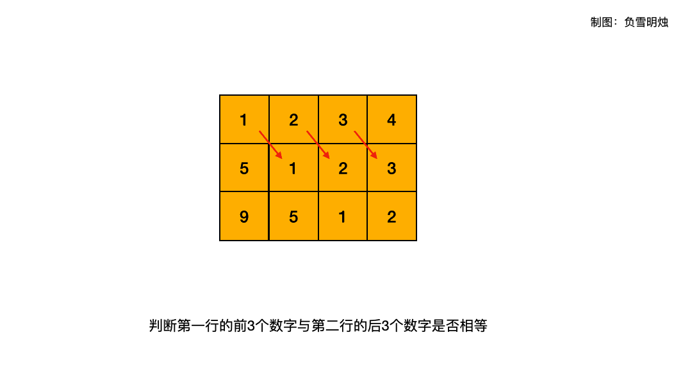

> 原文链接: https://leetcode-cn.com/problems/toeplitz-matrix


## 英文原文
<div><p>Given an <code>m x n</code> <code>matrix</code>, return&nbsp;<em><code>true</code>&nbsp;if the matrix is Toeplitz. Otherwise, return <code>false</code>.</em></p>

<p>A matrix is <strong>Toeplitz</strong> if every diagonal from top-left to bottom-right has the same elements.</p>

<p>&nbsp;</p>
<p><strong>Example 1:</strong></p>

<pre>
<strong>Input:</strong> matrix = [[1,2,3,4],[5,1,2,3],[9,5,1,2]]
<strong>Output:</strong> true
<strong>Explanation:</strong>
In the above grid, the&nbsp;diagonals are:
&quot;[9]&quot;, &quot;[5, 5]&quot;, &quot;[1, 1, 1]&quot;, &quot;[2, 2, 2]&quot;, &quot;[3, 3]&quot;, &quot;[4]&quot;.
In each diagonal all elements are the same, so the answer is True.
</pre>

<p><strong>Example 2:</strong></p>

<pre>
<strong>Input:</strong> matrix = [[1,2],[2,2]]
<strong>Output:</strong> false
<strong>Explanation:</strong>
The diagonal &quot;[1, 2]&quot; has different elements.
</pre>

<p>&nbsp;</p>
<p><strong>Constraints:</strong></p>

<ul>
	<li><code>m == matrix.length</code></li>
	<li><code>n == matrix[i].length</code></li>
	<li><code>1 &lt;= m, n &lt;= 20</code></li>
	<li><code>0 &lt;= matrix[i][j] &lt;= 99</code></li>
</ul>

<p>&nbsp;</p>
<p><strong>Follow up:</strong></p>

<ul>
	<li>What if the <code>matrix</code> is stored on disk, and the memory is limited such that you can only load at most one row of the matrix into the memory at once?</li>
	<li>What if the <code>matrix</code> is so large that you can only load up a partial row into the memory at once?</li>
</ul>
</div>

## 中文题目
<div><p>给你一个 <code>m x n</code> 的矩阵 <code>matrix</code> 。如果这个矩阵是托普利茨矩阵，返回 <code>true</code> ；否则，返回<em> </em><code>false</code><em> 。</em></p>

<p>如果矩阵上每一条由左上到右下的对角线上的元素都相同，那么这个矩阵是<em> </em><strong>托普利茨矩阵</strong> 。</p>

<p> </p>

<p><strong>示例 1：</strong></p>

<pre>
<strong>输入：</strong>matrix = [[1,2,3,4],[5,1,2,3],[9,5,1,2]]
<strong>输出：</strong>true
<strong>解释：</strong>
在上述矩阵中, 其对角线为: 
"[9]", "[5, 5]", "[1, 1, 1]", "[2, 2, 2]", "[3, 3]", "[4]"。 
各条对角线上的所有元素均相同, 因此答案是 True 。
</pre>

<p><strong>示例 2：</strong></p>

<pre>
<strong>输入：</strong>matrix = [[1,2],[2,2]]
<strong>输出：</strong>false
<strong>解释：</strong>
对角线 "[1, 2]" 上的元素不同。</pre>

<p> </p>

<p><strong>提示：</strong></p>

<ul>
	<li><code>m == matrix.length</code></li>
	<li><code>n == matrix[i].length</code></li>
	<li><code>1 <= m, n <= 20</code></li>
	<li><code>0 <= matrix[i][j] <= 99</code></li>
</ul>

<p> </p>

<p><strong>进阶：</strong></p>

<ul>
	<li>如果矩阵存储在磁盘上，并且内存有限，以至于一次最多只能将矩阵的一行加载到内存中，该怎么办？</li>
	<li>如果矩阵太大，以至于一次只能将不完整的一行加载到内存中，该怎么办？</li>
</ul>
</div>

## 通过代码
<RecoDemo>
</RecoDemo>


## 高赞题解

各位题友大家好！ 今天是 **[@负雪明烛](/u/fuxuemingzhu/)** 坚持日更的第 **29** 天。今天力扣上的每日一题是「[766. 托普利茨矩阵](https://leetcode-cn.com/problems/toeplitz-matrix/)」。

### 解题思路

- **解题思路：每一个位置都要跟其右下角的元素相等**。


我以前做这个题的时候选择了一个笨方法：遍历每条对角线，判断每条对角线上元素是否都相等。很显然，这个做法是直接按照托普利茨矩阵定义写的，但是由于对角线比较多，导致代码比较复杂。


现在，我是这么做的：只要每个元素都跟其右下角元素相等就行了。只要这样遍历结束之后，就能保证所有对角线上的元素就都是相等的。

以题目示例一为例的动图如下：




### 代码


在 Python 代码中我用了**切片**操作，第 $i$ 行的 $[0, N - 2]$的切片等于第 $i + 1$ 行的 $[1, N - 1]$，这样能节省代码长度。


Python, C++, Java 代码如下：


```Python []
class Solution:
    def isToeplitzMatrix(self, matrix: List[List[int]]) -> bool:
        for i in range(len(matrix) - 1):
            if matrix[i][:-1] != matrix[i + 1][1:]:
                return False
        return True
```

```C++ []
class Solution {
public:
    bool isToeplitzMatrix(vector<vector<int>>& matrix) {
        for (int i = 0; i < matrix.size() - 1; ++i) {
            for (int j = 0; j < matrix[0].size() - 1; ++j) {
                if (matrix[i][j] != matrix[i + 1][j + 1])
                    return false;
            }
        }
        return true;
    }
};
```

```Java []
class Solution {
    public boolean isToeplitzMatrix(int[][] matrix) {
        for (int i = 0; i < matrix.length - 1; ++i) {
            for (int j = 0; j < matrix[0].length - 1; ++j) {
                if (matrix[i][j] != matrix[i + 1][j + 1])
                    return false;
            }
        }
        return true;
    }
}
```


### 刷题心得


- 每次做题都会有新体会，坚持刷题，就一定会有收获。
- 多看看别人的优秀题解，能学到很多东西。


-----


OK，以上就是 [@负雪明烛](https://leetcode-cn.com/u/fuxuemingzhu/) 写的今天题解的全部内容了，如果你觉得有帮助的话，**求赞、求关注、求收藏**。如果有疑问的话，请在下面评论，我会及时解答。


**关注我**，你将不会错过我的精彩动画题解、面试题分享、组队刷题活动，进入主页 [@负雪明烛](https://leetcode-cn.com/u/fuxuemingzhu/) 右侧有刷题组织，从此刷题不再孤单。

祝大家牛年大吉！AC 多多，Offer 多多！我们明天再见！

## 统计信息
| 通过次数 | 提交次数 | AC比率 |
| :------: | :------: | :------: |
|    56266    |    79492    |   70.8%   |

## 提交历史
| 提交时间 | 提交结果 | 执行时间 |  内存消耗  | 语言 |
| :------: | :------: | :------: | :--------: | :--------: |


## 相似题目
|                             题目                             | 难度 |
| :----------------------------------------------------------: | :---------: |
| [有效的单词方块](https://leetcode-cn.com/problems/valid-word-square/) | 简单|
