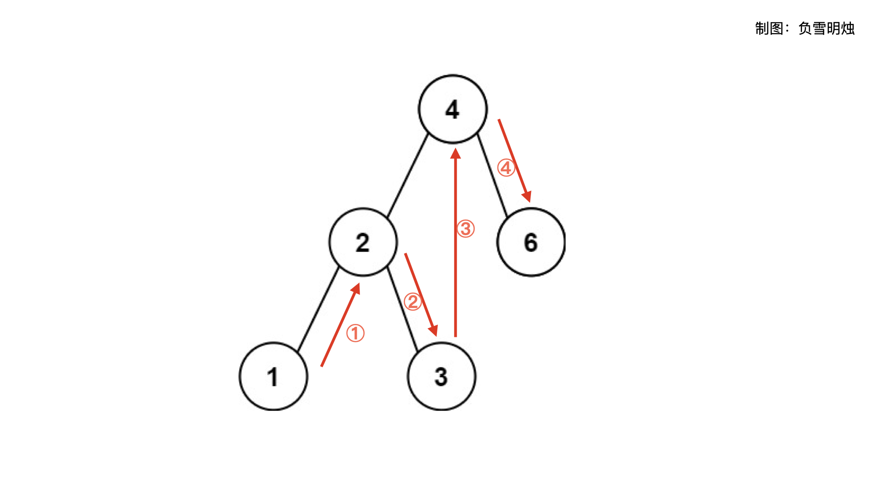

> 原文链接: https://leetcode-cn.com/problems/minimum-distance-between-bst-nodes


## 英文原文
<div><p>Given the <code>root</code> of a Binary Search Tree (BST), return <em>the minimum difference between the values of any two different nodes in the tree</em>.</p>

<p>&nbsp;</p>
<p><strong>Example 1:</strong></p>

<pre>
<strong>Input:</strong> root = [4,2,6,1,3]
<strong>Output:</strong> 1
</pre>

<p><strong>Example 2:</strong></p>

<pre>
<strong>Input:</strong> root = [1,0,48,null,null,12,49]
<strong>Output:</strong> 1
</pre>

<p>&nbsp;</p>
<p><strong>Constraints:</strong></p>

<ul>
	<li>The number of nodes in the tree is in the range <code>[2, 100]</code>.</li>
	<li><code>0 &lt;= Node.val &lt;= 10<sup>5</sup></code></li>
</ul>

<p>&nbsp;</p>
<p><strong>Note:</strong> This question is the same as 530: <a href="https://leetcode.com/problems/minimum-absolute-difference-in-bst/" target="_blank">https://leetcode.com/problems/minimum-absolute-difference-in-bst/</a></p>
</div>

## 中文题目
<div><p>给你一个二叉搜索树的根节点 <code>root</code> ，返回 <strong>树中任意两不同节点值之间的最小差值</strong> 。</p>

<p>差值是一个正数，其数值等于两值之差的绝对值。</p>

<p>&nbsp;</p>

<div class="original__bRMd">
<div>
<p><strong>示例 1：</strong></p>

<pre>
<strong>输入：</strong>root = [4,2,6,1,3]
<strong>输出：</strong>1
</pre>

<p><strong>示例 2：</strong></p>

<pre>
<strong>输入：</strong>root = [1,0,48,null,null,12,49]
<strong>输出：</strong>1
</pre>

<p>&nbsp;</p>

<p><strong>提示：</strong></p>

<ul>
	<li>树中节点的数目范围是 <code>[2, 100]</code></li>
	<li><code>0 &lt;= Node.val &lt;= 10<sup>5</sup></code></li>
</ul>

<p>&nbsp;</p>

<p><strong>注意：</strong>本题与 530：<a href="https://leetcode-cn.com/problems/minimum-absolute-difference-in-bst/">https://leetcode-cn.com/problems/minimum-absolute-difference-in-bst/</a> 相同</p>
</div>
</div>
</div>

## 通过代码
<RecoDemo>
</RecoDemo>


## 高赞题解
各位题友大家好！ 今天是 **[@负雪明烛](/u/fuxuemingzhu/)** 坚持日更的第 **79** 天。今天力扣上的每日一题是「[783. 二叉搜索树节点最小距离](https://leetcode-cn.com/problems/minimum-distance-between-bst-nodes/)」。

# 解题思路


今天题目重点：
**1. 二叉搜索树（BST）**
**2. 任意两个不同节点**

遇到二叉搜索树，立刻想到这句话：「**二叉搜索树（BST）的中序遍历是有序的**」。这是解决所有二叉搜索树问题的关键。

要求 BST 的任意两个不同节点之间的最小差值，也就是相当于求 BST **中序遍历**得到的**有序序列**中所有**相邻节点**之间的最小差值。

分享二叉树遍历的经验：先序、中序、后序遍历方式的区别在于把「执行操作」放在两个递归函数的位置。伪代码在下面。


1. 先序遍历：

```python
def dfs(root):
    if not root:
        return
    执行操作
    dfs(root.left)
    dfs(root.right)
```

2. 中序遍历：

```python
def dfs(root):
    if not root:
        return
    dfs(root.left)
    执行操作
    dfs(root.right)
```


3. 后序遍历：

```python
def dfs(root):
    if not root:
        return
    dfs(root.left)
    dfs(root.right)
	执行操作
```


本题是使用了中序遍历，所以把「执行操作」这一步改成自己想要的代码。用本题作为示例。


于是有了下面两种写法。


## 方法一：数组保存中序遍历结果


这个方法是最直观的，也不容易出错的。


1. 先中序遍历，把结果放在数组中；
2. 然后对数组中的相邻元素求差，得到所有差值的最小值。

对应的代码如下，二叉树的各种遍历方式是基本功，务必要掌握。

```python []
# Definition for a binary tree node.
# class TreeNode(object):
#     def __init__(self, x):
#         self.val = x
#         self.left = None
#         self.right = None

class Solution(object):
    def minDiffInBST(self, root):
        self.vals = []
        self.inOrder(root)
        return min([self.vals[i + 1] - self.vals[i] for i in xrange(len(self.vals) - 1)])

    def inOrder(self, root):
        if not root:
            return 
        self.inOrder(root.left)
        self.vals.append(root.val)
        self.inOrder(root.right)
```


- 时间复杂度：$O(N)$，因为每个节点只访问了一次；
- 空间复杂度：$O(N)$，因为需要数组保存二叉树的每个节点值。


## 方法二：只保存上个节点


在方法一中，我们保存了整个中序遍历数组，比较浪费空间。


其实我们只需要知道，在中序遍历的时候的两个被**依次访问**的节点。注意，这里说的不是 BST 的相邻节点，因为在中序遍历时，在访问根节点前，上一个被访问的节点是其左子树的最右下角的节点。如下图所示，访问 节点4 之前，访问的是节点3。





所以，我们只需要一个变量 prev 保存在中序遍历时，上一次被访问的节点。因为在中序遍历的过程中，节点的值是依次递增的，因此求差值的方式应该是 `root.val - prev.val` ，对该值取最小，就是 BST 任意两个节点的最小差值。


这里需要注意一个细节：中序遍历时的第一个节点，并没有 prev 节点。此时应该怎么办？其实就是不求 第一个节点 和 上个节点的差值就行。可以把 prev 初始化为 None，遍历时对 prev 进行一个判断，如果 prev 为 None，说明当前遍历的是中序遍历的第一个节点，跳过求差值；此后的遍历中，在每次求完 diff 之后，把 prev 设置为当前遍历的节点。


代码如下：

```python []
# Definition for a binary tree node.
# class TreeNode(object):
#     def __init__(self, x):
#         self.val = x
#         self.left = None
#         self.right = None

class Solution(object):
    def minDiffInBST(self, root):
        self.prev = None
        self.minDiff = 10e6
        self.inOrder(root)
        return self.minDiff

    def inOrder(self, root):
        if not root:
            return 
        self.inOrder(root.left)
        if self.prev:
            self.minDiff = min(root.val - self.prev.val, self.minDiff)
        self.prev = root
        self.inOrder(root.right)
```


- 时间复杂度：$O(N)$，因为每个节点只访问了一次；
- 空间复杂度：$O(N)$，因为递归用了系统栈。

# 刷题心得


二叉树的多种遍历方式必须要掌握呀。另外建议刚开始刷题的朋友，不妨从二叉树上手。

参考资料：无。


-----


OK，以上就是 [@负雪明烛](https://leetcode-cn.com/u/fuxuemingzhu/) 写的今天题解的全部内容了，如果你觉得有帮助的话，**求赞、求关注、求收藏**。如果有疑问的话，请在下面评论，我会及时解答。


**关注我**，你将不会错过我的精彩动画题解、面试题分享、组队刷题活动，进入主页 [@负雪明烛](https://leetcode-cn.com/u/fuxuemingzhu/) 右侧有刷题组织，从此刷题不再孤单。


祝大家 AC 多多，Offer 多多！我们明天再见！

## 统计信息
| 通过次数 | 提交次数 | AC比率 |
| :------: | :------: | :------: |
|    71310    |    119518    |   59.7%   |

## 提交历史
| 提交时间 | 提交结果 | 执行时间 |  内存消耗  | 语言 |
| :------: | :------: | :------: | :--------: | :--------: |


## 相似题目
|                             题目                             | 难度 |
| :----------------------------------------------------------: | :---------: |
| [二叉树的中序遍历](https://leetcode-cn.com/problems/binary-tree-inorder-traversal/) | 简单|
