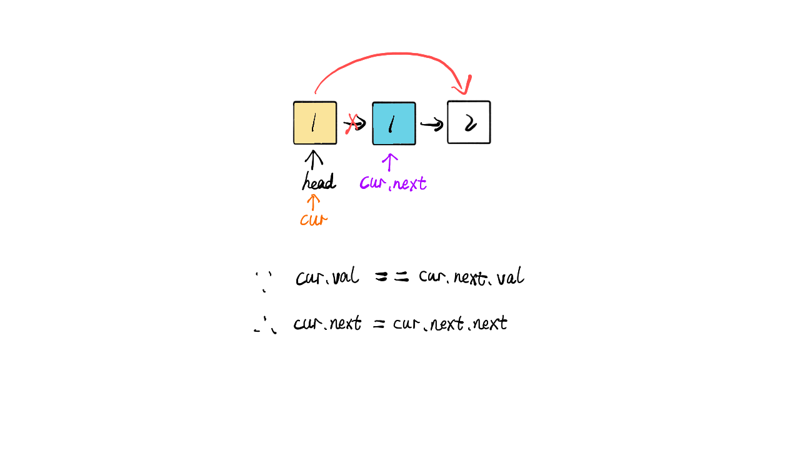
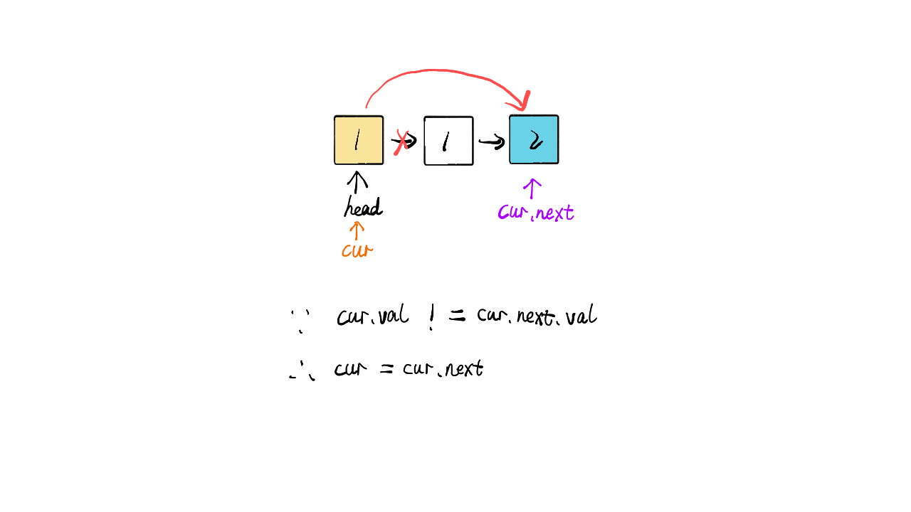
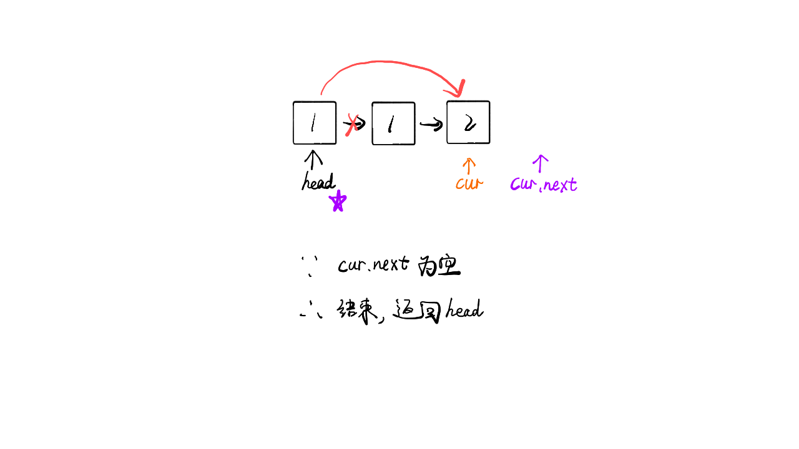

> 原文链接: https://leetcode-cn.com/problems/remove-duplicates-from-sorted-list


## 英文原文
<div><p>Given the <code>head</code> of a sorted linked list, <em>delete all duplicates such that each element appears only once</em>. Return <em>the linked list <strong>sorted</strong> as well</em>.</p>

<p>&nbsp;</p>
<p><strong>Example 1:</strong></p>

<pre>
<strong>Input:</strong> head = [1,1,2]
<strong>Output:</strong> [1,2]
</pre>

<p><strong>Example 2:</strong></p>

<pre>
<strong>Input:</strong> head = [1,1,2,3,3]
<strong>Output:</strong> [1,2,3]
</pre>

<p>&nbsp;</p>
<p><strong>Constraints:</strong></p>

<ul>
	<li>The number of nodes in the list is in the range <code>[0, 300]</code>.</li>
	<li><code>-100 &lt;= Node.val &lt;= 100</code></li>
	<li>The list is guaranteed to be <strong>sorted</strong> in ascending order.</li>
</ul>
</div>

## 中文题目
<div><p>存在一个按升序排列的链表，给你这个链表的头节点 <code>head</code> ，请你删除所有重复的元素，使每个元素 <strong>只出现一次</strong> 。</p>

<p>返回同样按升序排列的结果链表。</p>

<p> </p>

<p><strong>示例 1：</strong></p>

<pre>
<strong>输入：</strong>head = [1,1,2]
<strong>输出：</strong>[1,2]
</pre>

<p><strong>示例 2：</strong></p>

<pre>
<strong>输入：</strong>head = [1,1,2,3,3]
<strong>输出：</strong>[1,2,3]
</pre>

<p> </p>

<p><strong>提示：</strong></p>

<ul>
	<li>链表中节点数目在范围 <code>[0, 300]</code> 内</li>
	<li><code>-100 <= Node.val <= 100</code></li>
	<li>题目数据保证链表已经按升序排列</li>
</ul>
</div>

## 通过代码
<RecoDemo>
</RecoDemo>


## 高赞题解
### 思路

- 标签：链表
- 指定 cur 指针指向头部 head
- 当 cur 和 cur.next 的存在为循环结束条件，当二者有一个不存在时说明链表没有去重复的必要了
- 当 cur.val 和 cur.next.val 相等时说明需要去重，则将 cur 的下一个指针指向下一个的下一个，这样就能达到去重复的效果
- 如果不相等则 cur 移动到下一个位置继续循环
- 时间复杂度：$O(n)$


### 代码

```Java []
/**
 * Definition for singly-linked list.
 * public class ListNode {
 *     int val;
 *     ListNode next;
 *     ListNode(int x) { val = x; }
 * }
 */
class Solution {
    public ListNode deleteDuplicates(ListNode head) {
        ListNode cur = head;
        while(cur != null && cur.next != null) {
            if(cur.val == cur.next.val) {
                cur.next = cur.next.next;
            } else {
                cur = cur.next;
            }
        }
        return head;
    }
}
```
```JavaScript []
/**
 * Definition for singly-linked list.
 * function ListNode(val) {
 *     this.val = val;
 *     this.next = null;
 * }
 */
/**
 * @param {ListNode} head
 * @return {ListNode}
 */
var deleteDuplicates = function(head) {
    var cur = head;
    while(cur && cur.next) {
        if(cur.val == cur.next.val) {
            cur.next = cur.next.next;
        } else {
            cur = cur.next;
        }
    }
    return head;
};
```

### 画解

<,,,>

想看大鹏画解更多高频面试题，欢迎阅读大鹏的 LeetBook：[《画解剑指 Offer 》](https://leetcode-cn.com/leetbook/detail/illustrate-lcof/)，O(∩_∩)O

## 统计信息
| 通过次数 | 提交次数 | AC比率 |
| :------: | :------: | :------: |
|    342875    |    637494    |   53.8%   |

## 提交历史
| 提交时间 | 提交结果 | 执行时间 |  内存消耗  | 语言 |
| :------: | :------: | :------: | :--------: | :--------: |


## 相似题目
|                             题目                             | 难度 |
| :----------------------------------------------------------: | :---------: |
| [删除排序链表中的重复元素 II](https://leetcode-cn.com/problems/remove-duplicates-from-sorted-list-ii/) | 中等|
