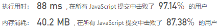
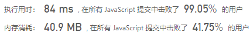
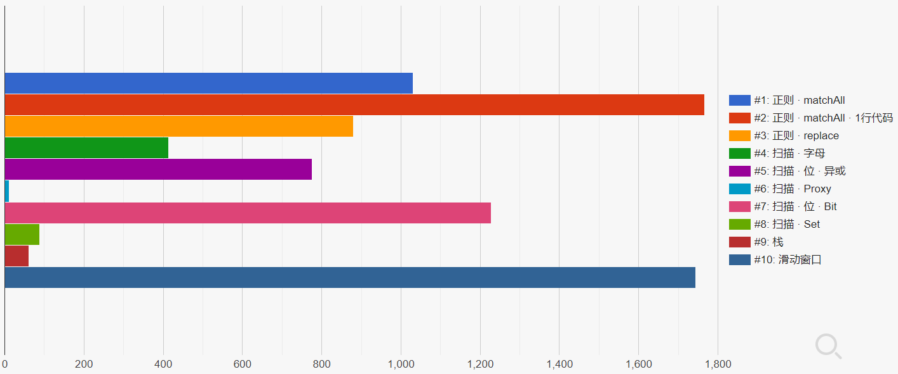

> 原文链接: https://leetcode-cn.com/problems/positions-of-large-groups


## 英文原文
<div><p>In a string <code><font face="monospace">s</font></code>&nbsp;of lowercase letters, these letters form consecutive groups of the same character.</p>

<p>For example, a string like <code>s = &quot;abbxxxxzyy&quot;</code> has the groups <code>&quot;a&quot;</code>, <code>&quot;bb&quot;</code>, <code>&quot;xxxx&quot;</code>, <code>&quot;z&quot;</code>, and&nbsp;<code>&quot;yy&quot;</code>.</p>

<p>A group is identified by an interval&nbsp;<code>[start, end]</code>, where&nbsp;<code>start</code>&nbsp;and&nbsp;<code>end</code>&nbsp;denote the start and end&nbsp;indices (inclusive) of the group. In the above example,&nbsp;<code>&quot;xxxx&quot;</code>&nbsp;has the interval&nbsp;<code>[3,6]</code>.</p>

<p>A group is considered&nbsp;<strong>large</strong>&nbsp;if it has 3 or more characters.</p>

<p>Return&nbsp;<em>the intervals of every <strong>large</strong> group sorted in&nbsp;<strong>increasing order by start index</strong></em>.</p>

<p>&nbsp;</p>
<p><strong>Example 1:</strong></p>

<pre>
<strong>Input:</strong> s = &quot;abbxxxxzzy&quot;
<strong>Output:</strong> [[3,6]]
<strong>Explanation</strong>: <code>&quot;xxxx&quot; is the only </code>large group with start index 3 and end index 6.
</pre>

<p><strong>Example 2:</strong></p>

<pre>
<strong>Input:</strong> s = &quot;abc&quot;
<strong>Output:</strong> []
<strong>Explanation</strong>: We have groups &quot;a&quot;, &quot;b&quot;, and &quot;c&quot;, none of which are large groups.
</pre>

<p><strong>Example 3:</strong></p>

<pre>
<strong>Input:</strong> s = &quot;abcdddeeeeaabbbcd&quot;
<strong>Output:</strong> [[3,5],[6,9],[12,14]]
<strong>Explanation</strong>: The large groups are &quot;ddd&quot;, &quot;eeee&quot;, and &quot;bbb&quot;.
</pre>

<p><strong>Example 4:</strong></p>

<pre>
<strong>Input:</strong> s = &quot;aba&quot;
<strong>Output:</strong> []
</pre>

<p>&nbsp;</p>
<p><strong>Constraints:</strong></p>

<ul>
	<li><code>1 &lt;= s.length &lt;= 1000</code></li>
	<li><code>s</code> contains lower-case English letters only.</li>
</ul>
</div>

## 中文题目
<div><p>在一个由小写字母构成的字符串 <code>s</code> 中，包含由一些连续的相同字符所构成的分组。</p>

<p>例如，在字符串 <code>s = "abbxxxxzyy"</code> 中，就含有 <code>"a"</code>, <code>"bb"</code>, <code>"xxxx"</code>, <code>"z"</code> 和 <code>"yy"</code> 这样的一些分组。</p>

<p>分组可以用区间 <code>[start, end]</code> 表示，其中 <code>start</code> 和 <code>end</code> 分别表示该分组的起始和终止位置的下标。上例中的 <code>"xxxx"</code> 分组用区间表示为 <code>[3,6]</code> 。</p>

<p>我们称所有包含大于或等于三个连续字符的分组为 <strong>较大分组</strong> 。</p>

<p>找到每一个 <strong>较大分组</strong> 的区间，<strong>按起始位置下标递增顺序排序后</strong>，返回结果。</p>

<p> </p>

<p><strong>示例 1：</strong></p>

<pre>
<strong>输入：</strong>s = "abbxxxxzzy"
<strong>输出：</strong>[[3,6]]
<strong>解释</strong><strong>：</strong><code>"xxxx" 是一个起始于 3 且终止于 6 的较大分组</code>。
</pre>

<p><strong>示例 2：</strong></p>

<pre>
<strong>输入：</strong>s = "abc"
<strong>输出：</strong>[]
<strong>解释：</strong>"a","b" 和 "c" 均不是符合要求的较大分组。
</pre>

<p><strong>示例 3：</strong></p>

<pre>
<strong>输入：</strong>s = "abcdddeeeeaabbbcd"
<strong>输出：</strong>[[3,5],[6,9],[12,14]]
<strong>解释：</strong>较大分组为 "ddd", "eeee" 和 "bbb"</pre>

<p><strong>示例 4：</strong></p>

<pre>
<strong>输入：</strong>s = "aba"
<strong>输出：</strong>[]
</pre>
 

<p><strong>提示：</strong></p>

<ul>
	<li><code>1 <= s.length <= 1000</code></li>
	<li><code>s</code> 仅含小写英文字母</li>
</ul>
</div>

## 通过代码
<RecoDemo>
</RecoDemo>


## 高赞题解
## 一 正则
`([a-z])`捕获小写字母，`\1`反向引用刚才捕获的字母，`{2,}`该字母又出现`>=`2次
matchAll
```javascript
var largeGroupPositions = function(s) {
    let g = s.matchAll(/([a-z])\1{2,}/g), r = [], t
    while (t = g.next().value) r.push([t.index, t.index + t[0].length - 1])
    return r
};
```


matchAll · 1行代码
```javascript
var largeGroupPositions = function(s) {
    return Array.from(s.matchAll(/(.)\1\1+/g), v => [v.index, v.index + v[0].length - 1])
};
```


replace：`.`匹配除换行符以外的任意字符
```javascript
var largeGroupPositions = function(s) {
    const r = []
    s.replace(/(.)\1{2,}/g, (a, _, i)=> r.push([i, i + a.length - 1]))
    return r
};
```


## 二 扫描
`start`不同字母首次出现索引，初始`0`。遍历遇下个不同字母，更新`start`
字母
```javascript
var largeGroupPositions = function(s) {
    let i = 0, start = 0, r = []
    while (++i <= s.length) // = 时，JS数组越界不报错，处理类似 aaa 情况
        if (s[start] !== s[i]) {
            if (i - start > 2) r.push([start, i - 1])
            start = i
        }
    return r
};
```


位运算 · 异或：字母转`Unicode编码`，相同`^`为`0`
```javascript
var largeGroupPositions = function(s) {
    let i = 0, start = 0, r = []
    while (++i <= s.length) 
        if (s.charCodeAt(start) ^ s.charCodeAt(i)) {
            if (i - start > 2) r.push([start, i - 1])
            start = i
        }
    return r
};
```


Proxy：`拦截`数组`push`方法，不满足连续出现次数`>=3`不真正`push`
```javascript
var largeGroupPositions = function(s) {
    let i = 0, start = 0, r = [], p = proxy(r)
    while (++i <= s.length) 
        if (s[start] !== s[i]) {
            p.push([start, i - 1])
            start = i
        }
    return r
};
const proxy = r => new Proxy(r, {
    set (t, p, v) {         
        if (typeof v === 'object' && v[1] - v[0] > 1) t[p] = v
        return true
    }
})
```


## 三 位
小写字母转`Unicode编码`-`97`，范围`[0, 25]`。二进制的`32位`从左到右`[1, 26]`位可表示`[a, z]`
```javascript
class Bit { // 构造Bit类，模仿Set，当Set用
    constructor () {
        this.clear()
    }
    add (v) { // 遇 a 转97，再-97 = 0，1左移0位 = 1。或 运算，占第1位
        this.bit |= 1 << v
        return this
    }
    has (v) { // 再遇 a，同上，1左移0位 = 1。且 运算，第1位已被占，找到连续 a
        return this.bit & 1 << v
    }
    clear () {
        this.bit = 0
        return this
    }
}
```
构造Bit类，遇不同字母(`has`返回0)，清空`Bit`并放入。相当于用`!Bit.has`代替上解法的`!==`
```javascript
var largeGroupPositions = function(s) {
    let i = 0, start = 0, b = new Bit, r = [], t
    b.add(s.charCodeAt(0) - 97)
    while (++i < s.length) {
        if (!b.has(t = s.charCodeAt(i) - 97)) {
            if (i - start > 2) r.push([start, i - 1])
            start = i
            b.clear().add(t)
        }
    }
    if (i - start > 2) r.push([start, i - 1])
    return r
};
```

### 提示
`Bit`作用与`Set`一致，即判断字母是否重复出现。只是`!Set.has`字母不如直接`!==`快
```javascript
var largeGroupPositions = function(s) {
    let i = 0, start = 0, b = new Set(s[0]), r = [], t
    while (++i <= s.length) 
        if (!b.has(s[i])) {
            if (i - start > 2) r.push([start, i - 1])
            start = i
            b.clear()
            b.add(s[i])
        }
    return r
};
```


## 四 栈
构造特殊栈：`push`时，遇`不同元素`，清空栈 并 返回清空前的长度，该长度即`相同元素个数`
```javascript
class Stack {
    constructor () {
        this.q = []
    } 
    length () {
        return this.q.length
    }
    top () {
        return this.q[this.length() - 1]
    }
    clear () {
        this.q.length = 0
    }
    push (v) {
        let len = 0
        if (v !== this.top()) {
            len = this.length()
            this.clear()
        }
        this.q.push(v)
        return len
    }
}
```
遍历将元素放入栈，找 相同元素个数`>=`3 即可
```javascript
var largeGroupPositions = function(s) {
    let i = -1, q = new Stack, r = []
    while (++i <= s.length) {
        const n = q.push(s[i])
        if (n > 2) r.push([i - n, i - 1])
    }
    return r
};
```


## 五 滑动窗口
来自[@Xu-Quan Lyu](https://leetcode-cn.com/u/aincrad-lyu/)
```javascript
var largeGroupPositions = function(s) {
    let l = r = 0, n = s.length, res = []
    while (l < n) {
        while (r + 1 < n && s[r] === s[r + 1]) r++
        if (r - l > 1) res.push([l, r])
        l = ++r
    }
    return res
};
```


## 排行
长度1000随机小写字母，每种解法求解100次，每秒操作数



## 统计信息
| 通过次数 | 提交次数 | AC比率 |
| :------: | :------: | :------: |
|    52638    |    96947    |   54.3%   |

## 提交历史
| 提交时间 | 提交结果 | 执行时间 |  内存消耗  | 语言 |
| :------: | :------: | :------: | :--------: | :--------: |
