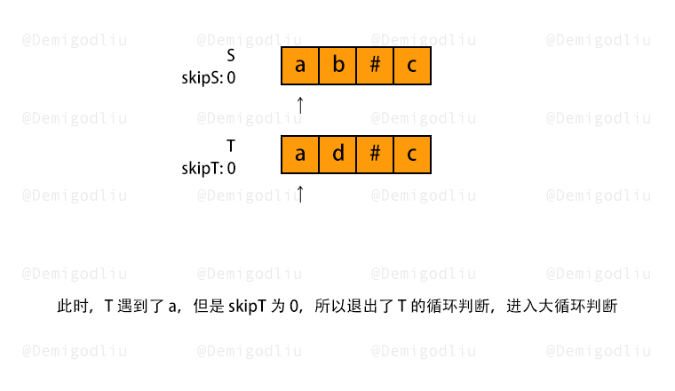

> 原文链接: https://leetcode-cn.com/problems/backspace-string-compare


## 英文原文
<div><p>Given two strings <code>s</code> and <code>t</code>, return <code>true</code> <em>if they are equal when both are typed into empty text editors</em>. <code>&#39;#&#39;</code> means a backspace character.</p>

<p>Note that after backspacing an empty text, the text will continue empty.</p>

<p>&nbsp;</p>
<p><strong>Example 1:</strong></p>

<pre>
<strong>Input:</strong> s = &quot;ab#c&quot;, t = &quot;ad#c&quot;
<strong>Output:</strong> true
<strong>Explanation:</strong> Both s and t become &quot;ac&quot;.
</pre>

<p><strong>Example 2:</strong></p>

<pre>
<strong>Input:</strong> s = &quot;ab##&quot;, t = &quot;c#d#&quot;
<strong>Output:</strong> true
<strong>Explanation:</strong> Both s and t become &quot;&quot;.
</pre>

<p><strong>Example 3:</strong></p>

<pre>
<strong>Input:</strong> s = &quot;a##c&quot;, t = &quot;#a#c&quot;
<strong>Output:</strong> true
<strong>Explanation:</strong> Both s and t become &quot;c&quot;.
</pre>

<p><strong>Example 4:</strong></p>

<pre>
<strong>Input:</strong> s = &quot;a#c&quot;, t = &quot;b&quot;
<strong>Output:</strong> false
<strong>Explanation:</strong> s becomes &quot;c&quot; while t becomes &quot;b&quot;.
</pre>

<p>&nbsp;</p>
<p><strong>Constraints:</strong></p>

<ul>
	<li><code><span>1 &lt;= s.length, t.length &lt;= 200</span></code></li>
	<li><span><code>s</code>&nbsp;and <code>t</code> only contain&nbsp;lowercase letters and <code>&#39;#&#39;</code> characters.</span></li>
</ul>

<p>&nbsp;</p>
<p><strong>Follow up:</strong> Can you solve it in <code>O(n)</code> time and <code>O(1)</code> space?</p>
</div>

## 中文题目
<div><p>给定 <code>s</code> 和 <code>t</code> 两个字符串，当它们分别被输入到空白的文本编辑器后，请你判断二者是否相等。<code>#</code> 代表退格字符。</p>

<p>如果相等，返回 <code>true</code> ；否则，返回 <code>false</code> 。</p>

<p><strong>注意：</strong>如果对空文本输入退格字符，文本继续为空。</p>

<p>&nbsp;</p>

<p><strong>示例 1：</strong></p>

<pre>
<strong>输入：</strong>s = "ab#c", t = "ad#c"
<strong>输出：</strong>true
<strong>解释：</strong>S 和 T 都会变成 “ac”。
</pre>

<p><strong>示例 2：</strong></p>

<pre>
<strong>输入：</strong>s = "ab##", t = "c#d#"
<strong>输出：</strong>true
<strong>解释：</strong>s 和 t 都会变成 “”。
</pre>

<p><strong>示例 3：</strong></p>

<pre>
<strong>输入：</strong>s = "a##c", t = "#a#c"
<strong>输出：</strong>true
<strong>解释：</strong>s 和 t 都会变成 “c”。
</pre>

<p><strong>示例 4：</strong></p>

<pre>
<strong>输入：</strong>s = "a#c", t = "b"
<strong>输出：</strong>false
<strong>解释：</strong>s 会变成 “c”，但 t 仍然是 “b”。</pre>

<p>&nbsp;</p>

<p><strong>提示：</strong></p>

<ul>
	<li><code><span>1 &lt;= s.length, t.length &lt;= 200</span></code></li>
	<li><code>s</code> 和 <code>t</code> 只含有小写字母以及字符 <code>'#'</code></li>
</ul>

<p>&nbsp;</p>

<p><strong>进阶：</strong></p>

<ul>
	<li>你可以用 <code>O(N)</code> 的时间复杂度和 <code>O(1)</code> 的空间复杂度解决该问题吗？</li>
</ul>

<p>&nbsp;</p>
</div>

## 通过代码
<RecoDemo>
</RecoDemo>


## 高赞题解


---

### 🧠 解题思路

相信大家看到该题的第一反应应该是使用栈，或者直接删除字符串来解决，但是这样做的话，空间复杂度为： $n+m$。

这无疑不是更优解，下面，我将介绍一种常量级空间复杂度的解法：双指针，并且比官方解思路更简单清晰！

由于 $#$ 号只会消除左边的一个字符，所以对右边的字符无影响，所以我们选择从后往前遍历 $S$，$T$ 字符串。

思路解析：

1. 准备两个指针 $i$, $j$ 分别指向 $S$，$T$ 的末位字符，再准备两个变量 $skipS$，$skipT$ 来分别存放 $S$，$T$ 字符串中的 $#$ 数量。
2. 从后往前遍历 $S$，所遇情况有三，如下所示：
 2.1 若当前字符是 $#$，则 $skipS$ 自增 $1$；
 2.2 若当前字符不是 $#$，且 $skipS$ 不为 $0$，则 $skipS$ 自减 $1$；
 2.3 若当前字符不是 $#$，且 $skipS$ 为 $0$，则代表当前字符不会被消除，我们可以用来和 $T$ 中的当前字符作比较。

若对比过程出现 $S$, $T$ 当前字符不匹配，则遍历结束，返回 $false$，若 $S$，$T$ 都遍历结束，且都能一一匹配，则返回 $true$。

文字描述一般在不懂逻辑的时候都比较不容易理解，所以请结合图解来加快理解。

---

### 🎨 图解演示

<,,,,,,,,>

---

### 🍭 示例代码

```Javascript []
var backspaceCompare = function(S, T) {
    let i = S.length - 1,
        j = T.length - 1,
        skipS = 0,
        skipT = 0;
    // 大循环
    while(i >= 0 || j >= 0){
        // S 循环
        while(i >= 0){
            if(S[i] === '#'){
                skipS++;
                i--;
            }else if(skipS > 0){
                skipS--;
                i--;
            }else break;
        }
        // T 循环
        while(j >= 0){
            if(T[j] === '#'){
                skipT++;
                j--;
            }else if(skipT > 0){
                skipT--;
                j--;
            }else break;
        }
        if(S[i] !== T[j]) return false;
        i--;
        j--;
    }
    return true;
};
```
```C++ []
class Solution {
public:
    bool backspaceCompare(string S, string T) {
        int i = S.length() - 1, j = T.length() - 1;
        int skipS = 0, skipT = 0;

        while (i >= 0 || j >= 0) {
            while (i >= 0) {
                if (S[i] == '#') {
                    skipS++, i--;
                } else if (skipS > 0) {
                    skipS--, i--;
                } else {
                    break;
                }
            }
            while (j >= 0) {
                if (T[j] == '#') {
                    skipT++, j--;
                } else if (skipT > 0) {
                    skipT--, j--;
                } else {
                    break;
                }
            }
            if (i >= 0 && j >= 0) {
                if (S[i] != T[j]) {
                    return false;
                }
            } else {
                if (i >= 0 || j >= 0) {
                    return false;
                }
            }
            i--, j--;
        }
        return true;
    }
};
```
```Java []
class Solution {
    public boolean backspaceCompare(String S, String T) {
        int i = S.length() - 1, j = T.length() - 1;
        int skipS = 0, skipT = 0;

        while (i >= 0 || j >= 0) {
            while (i >= 0) {
                if (S.charAt(i) == '#') {
                    skipS++;
                    i--;
                } else if (skipS > 0) {
                    skipS--;
                    i--;
                } else {
                    break;
                }
            }
            while (j >= 0) {
                if (T.charAt(j) == '#') {
                    skipT++;
                    j--;
                } else if (skipT > 0) {
                    skipT--;
                    j--;
                } else {
                    break;
                }
            }
            if (i >= 0 && j >= 0) {
                if (S.charAt(i) != T.charAt(j)) {
                    return false;
                }
            } else {
                if (i >= 0 || j >= 0) {
                    return false;
                }
            }
            i--;
            j--;
        }
        return true;
    }
}
```
```Golang []
func backspaceCompare(s, t string) bool {
    skipS, skipT := 0, 0
    i, j := len(s)-1, len(t)-1
    for i >= 0 || j >= 0 {
        for i >= 0 {
            if s[i] == '#' {
                skipS++
                i--
            } else if skipS > 0 {
                skipS--
                i--
            } else {
                break
            }
        }
        for j >= 0 {
            if t[j] == '#' {
                skipT++
                j--
            } else if skipT > 0 {
                skipT--
                j--
            } else {
                break
            }
        }
        if i >= 0 && j >= 0 {
            if s[i] != t[j] {
                return false
            }
        } else if i >= 0 || j >= 0 {
            return false
        }
        i--
        j--
    }
    return true
}
```
```Python3 []
class Solution:
    def backspaceCompare(self, S: str, T: str) -> bool:
        i, j = len(S) - 1, len(T) - 1
        skipS = skipT = 0

        while i >= 0 or j >= 0:
            while i >= 0:
                if S[i] == "#":
                    skipS += 1
                    i -= 1
                elif skipS > 0:
                    skipS -= 1
                    i -= 1
                else:
                    break
            while j >= 0:
                if T[j] == "#":
                    skipT += 1
                    j -= 1
                elif skipT > 0:
                    skipT -= 1
                    j -= 1
                else:
                    break
            if i >= 0 and j >= 0:
                if S[i] != T[j]:
                    return False
            elif i >= 0 or j >= 0:
                return False
            i -= 1
            j -= 1
        
        return True
```
```C []
bool backspaceCompare(char* S, char* T) {
    int i = strlen(S) - 1, j = strlen(T) - 1;
    int skipS = 0, skipT = 0;

    while (i >= 0 || j >= 0) {
        while (i >= 0) {
            if (S[i] == '#') {
                skipS++, i--;
            } else if (skipS > 0) {
                skipS--, i--;
            } else {
                break;
            }
        }
        while (j >= 0) {
            if (T[j] == '#') {
                skipT++, j--;
            } else if (skipT > 0) {
                skipT--, j--;
            } else {
                break;
            }
        }
        if (i >= 0 && j >= 0) {
            if (S[i] != T[j]) {
                return false;
            }
        } else {
            if (i >= 0 || j >= 0) {
                return false;
            }
        }
        i--, j--;
    }
    return true;
}
```

---

### 转身挥手

嘿，少年，做图不易，留下个赞或评论再走吧！谢啦~ 💐

差点忘了，祝你牛年大吉 🐮 ，AC 和 Offer 📑 多多益善~

⛲⛲⛲ 期待下次再见~ 

## 统计信息
| 通过次数 | 提交次数 | AC比率 |
| :------: | :------: | :------: |
|    98052    |    192829    |   50.8%   |

## 提交历史
| 提交时间 | 提交结果 | 执行时间 |  内存消耗  | 语言 |
| :------: | :------: | :------: | :--------: | :--------: |
