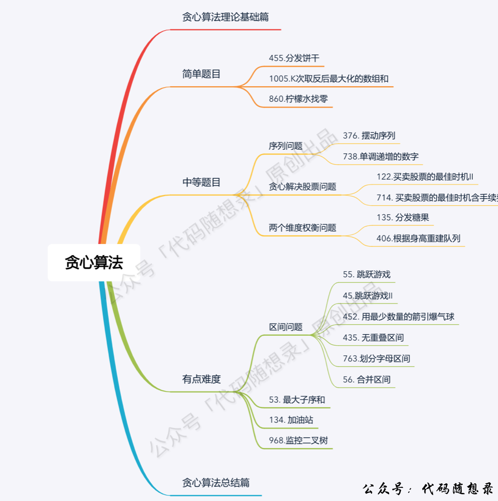

> 原文链接: https://leetcode-cn.com/problems/lemonade-change


## 英文原文
<div><p>At a lemonade stand, each lemonade costs <code>$5</code>. Customers are standing in a queue to buy from you, and order one at a time (in the order specified by bills). Each customer will only buy one lemonade and pay with either a <code>$5</code>, <code>$10</code>, or <code>$20</code> bill. You must provide the correct change to each customer so that the net transaction is that the customer pays <code>$5</code>.</p>

<p>Note that you don&#39;t have any change in hand at first.</p>

<p>Given an integer array <code>bills</code> where <code>bills[i]</code> is the bill the <code>i<sup>th</sup></code> customer pays, return <code>true</code> <em>if you can provide every customer with correct change, or</em> <code>false</code> <em>otherwise</em>.</p>

<p>&nbsp;</p>
<p><strong>Example 1:</strong></p>

<pre>
<strong>Input:</strong> bills = [5,5,5,10,20]
<strong>Output:</strong> true
<strong>Explanation:</strong> 
From the first 3 customers, we collect three $5 bills in order.
From the fourth customer, we collect a $10 bill and give back a $5.
From the fifth customer, we give a $10 bill and a $5 bill.
Since all customers got correct change, we output true.
</pre>

<p><strong>Example 2:</strong></p>

<pre>
<strong>Input:</strong> bills = [5,5,10,10,20]
<strong>Output:</strong> false
<strong>Explanation:</strong> 
From the first two customers in order, we collect two $5 bills.
For the next two customers in order, we collect a $10 bill and give back a $5 bill.
For the last customer, we can not give change of $15 back because we only have two $10 bills.
Since not every customer received correct change, the answer is false.
</pre>

<p><strong>Example 3:</strong></p>

<pre>
<strong>Input:</strong> bills = [5,5,10]
<strong>Output:</strong> true
</pre>

<p><strong>Example 4:</strong></p>

<pre>
<strong>Input:</strong> bills = [10,10]
<strong>Output:</strong> false
</pre>

<p>&nbsp;</p>
<p><strong>Constraints:</strong></p>

<ul>
	<li><code>1 &lt;= bills.length &lt;= 10<sup>5</sup></code></li>
	<li><code>bills[i]</code> is either <code>5</code>, <code>10</code>, or <code>20</code>.</li>
</ul>
</div>

## 中文题目
<div><p>在柠檬水摊上，每一杯柠檬水的售价为&nbsp;<code>5</code>&nbsp;美元。顾客排队购买你的产品，（按账单 <code>bills</code> 支付的顺序）一次购买一杯。</p>

<p>每位顾客只买一杯柠檬水，然后向你付 <code>5</code> 美元、<code>10</code> 美元或 <code>20</code> 美元。你必须给每个顾客正确找零，也就是说净交易是每位顾客向你支付 <code>5</code> 美元。</p>

<p>注意，一开始你手头没有任何零钱。</p>

<p>给你一个整数数组 <code>bills</code> ，其中 <code>bills[i]</code> 是第 <code>i</code> 位顾客付的账。如果你能给每位顾客正确找零，返回&nbsp;<code>true</code>&nbsp;，否则返回 <code>false</code>&nbsp;。</p>

<p>&nbsp;</p>

<p><strong>示例 1：</strong></p>

<pre>
<strong>输入：</strong>bills = [5,5,5,10,20]
<strong>输出：</strong>true
<strong>解释：
</strong>前 3 位顾客那里，我们按顺序收取 3 张 5 美元的钞票。
第 4 位顾客那里，我们收取一张 10 美元的钞票，并返还 5 美元。
第 5 位顾客那里，我们找还一张 10 美元的钞票和一张 5 美元的钞票。
由于所有客户都得到了正确的找零，所以我们输出 true。
</pre>

<p><strong>示例 2：</strong></p>

<pre>
<strong>输入：</strong>bills = [5,5,10,10,20]
<strong>输出：</strong>false
<strong>解释：</strong>
前 2 位顾客那里，我们按顺序收取 2 张 5 美元的钞票。
对于接下来的 2 位顾客，我们收取一张 10 美元的钞票，然后返还 5 美元。
对于最后一位顾客，我们无法退回 15 美元，因为我们现在只有两张 10 美元的钞票。
由于不是每位顾客都得到了正确的找零，所以答案是 false。
</pre>

<p><strong>示例 3：</strong></p>

<pre>
<strong>输入：</strong>bills = [5,5,10]
<strong>输出：</strong>true
</pre>

<p><strong>示例 4：</strong></p>

<pre>
<strong>输入：</strong>bills = [10,10]
<strong>输出：</strong>false</pre>

<p>&nbsp;</p>

<p><strong>提示：</strong></p>

<ul>
	<li><code>1 &lt;= bills.length &lt;= 10<sup>5</sup></code></li>
	<li><code>bills[i]</code>&nbsp;不是&nbsp;<code>5</code>&nbsp;就是&nbsp;<code>10</code>&nbsp;或是&nbsp;<code>20</code>&nbsp;</li>
</ul>
</div>

## 通过代码
<RecoDemo>
</RecoDemo>


## 高赞题解
> **点击上方关注「代码随想录」，学习算法不迷路！**


## 思路  

**不少同学对贪心算法还处于朦胧状态，我特意录了一期视频，讲一讲[贪心算法理论基础](https://www.bilibili.com/video/BV1WK4y1R71x)**，这里详细介绍了我们做贪心算法的时候常遇到的问题，相信结合本篇题解，会对你学习贪心有所帮助。


这是前几天的leetcode每日一题，感觉不错，给大家讲一下。

这道题目刚一看，可能会有点懵，这要怎么找零才能保证完整全部账单的找零呢？

**但仔细一琢磨就会发现，可供我们做判断的空间非常少！**

只需要维护三种金额的数量，5，10和20。

有如下三种情况：

* 情况一：账单是5，直接收下。
* 情况二：账单是10，消耗一个5，增加一个10
* 情况三：账单是20，优先消耗一个10和一个5，如果不够，再消耗三个5

此时大家就发现 情况一，情况二，都是固定策略，都不用我们来做分析了，而唯一不确定的其实在情况三。

而情况三逻辑也不复杂甚至感觉纯模拟就可以了，其实情况三这里是有贪心的。

账单是20的情况，为什么要优先消耗一个10和一个5呢？

**因为美元10只能给账单20找零，而美元5可以给账单10和账单20找零，美元5更万能！**

所以局部最优：遇到账单20，优先消耗美元10，完成本次找零。全局最优：完成全部账单的找零。

局部最优可以推出全局最优，并找不出反例，那么就试试贪心算法！

C++代码如下：

```C++
class Solution {
public:
    bool lemonadeChange(vector<int>& bills) {
        int five = 0, ten = 0, twenty = 0;
        for (int bill : bills) {
            // 情况一
            if (bill == 5) five++;
            // 情况二
            if (bill == 10) {
                if (five <= 0) return false;
                ten++;
                five--;
            }
            // 情况三
            if (bill == 20) {
                // 优先消耗10美元，因为5美元的找零用处更大，能多留着就多留着
                if (five > 0 && ten > 0) {
                    five--;
                    ten--;
                    twenty++; // 其实这行代码可以删了，因为记录20已经没有意义了，不会用20来找零
                } else if (five >= 3) {
                    five -= 3;
                    twenty++; // 同理，这行代码也可以删了
                } else return false;
            }
        }
        return true;
    }
};
```

## 总结

咋眼一看好像很复杂，分析清楚之后，会发现逻辑其实非常固定。

这道题目可以告诉大家，遇到感觉没有思路的题目，可以静下心来把能遇到的情况分析一下，只要分析到具体情况了，一下子就豁然开朗了。

如果一直陷入想从整体上寻找找零方案，就会把自己陷进去，各种情况一交叉，只会越想越复杂了。


## 其他语言版本


Java：
```java
class Solution {
    public boolean lemonadeChange(int[] bills) {
        int cash_5 = 0;
        int cash_10 = 0;

        for (int i = 0; i < bills.length; i++) {
            if (bills[i] == 5) {
                cash_5++;
            } else if (bills[i] == 10) {
                cash_5--;
                cash_10++;
            } else if (bills[i] == 20) {
                if (cash_10 > 0) {
                    cash_10--;
                    cash_5--;
                } else {
                    cash_5 -= 3;
                }
            }
            if (cash_5 < 0 || cash_10 < 0) return false;
        }
        
        return true;
    }
}
```

Python：
```python
class Solution:
    def lemonadeChange(self, bills: List[int]) -> bool:
        five, ten, twenty = 0, 0, 0
        for bill in bills:
            if bill == 5:
                five += 1
            elif bill == 10:
                if five < 1: return False
                five -= 1
                ten += 1
            else:
                if ten > 0 and five > 0:
                    ten -= 1
                    five -= 1
                    twenty += 1
                elif five > 2:
                    five -= 3
                    twenty += 1
                else:
                    return False
        return True

```

Go： 

```golang
func lemonadeChange(bills []int) bool {
    //left表示还剩多少 下表0位5元的个数 ，下表1为10元的个数
    left:=[2]int{0,0}
    //第一个元素不为5，直接退出
    if bills[0]!=5{
        return false
    }
    for i:=0;i<len(bills);i++{
        //先统计5元和10元的个数
        if bills[i]==5{
            left[0]+=1
        }
        if bills[i]==10{
            left[1]+=1
        }
        //接着处理找零的
        tmp:=bills[i]-5
        if tmp==5{
            if left[0]>0{
                left[0]-=1
            }else {
                return false
            }
        }
        if tmp==15{
            if left[1]>0&&left[0]>0{
                left[0]-=1
                left[1]-=1
            }else if left[1]==0&&left[0]>2{
                left[0]-=3
            }else{
                return false
            }
        }
    }
    return true
}
```


Javascript:
```Javascript
var lemonadeChange = function(bills) {
    let fiveCount = 0
    let tenCount = 0

    for(let i = 0; i < bills.length; i++) {
        let bill = bills[i]
        if(bill === 5) {
            fiveCount += 1
        } else if (bill === 10) {
            if(fiveCount > 0) {
                fiveCount -=1
                tenCount += 1
            } else {
                return false
            }
        } else {
            if(tenCount > 0 && fiveCount > 0) {
                tenCount -= 1
                fiveCount -= 1 
            } else if(fiveCount >= 3) {
                fiveCount -= 3
            } else {
                return false
            }
        } 
    }
    return true
};

```

# 贪心算法力扣题目总结

按照如下顺序刷力扣上的题目，相信会帮你在学习贪心算法的路上少走很多弯路。以下每道题目在力扣题解区都有「代码随想录」的题解。

{:width="450px"}{:align="center"}


------------

**大家好，我是程序员Carl，点击[我的头像](https://programmercarl.com)**，查看力扣详细刷题攻略，你会发现相见恨晚！

**如果感觉题解对你有帮助，不要吝啬给一个👍吧！**


## 统计信息
| 通过次数 | 提交次数 | AC比率 |
| :------: | :------: | :------: |
|    95202    |    162252    |   58.7%   |

## 提交历史
| 提交时间 | 提交结果 | 执行时间 |  内存消耗  | 语言 |
| :------: | :------: | :------: | :--------: | :--------: |
