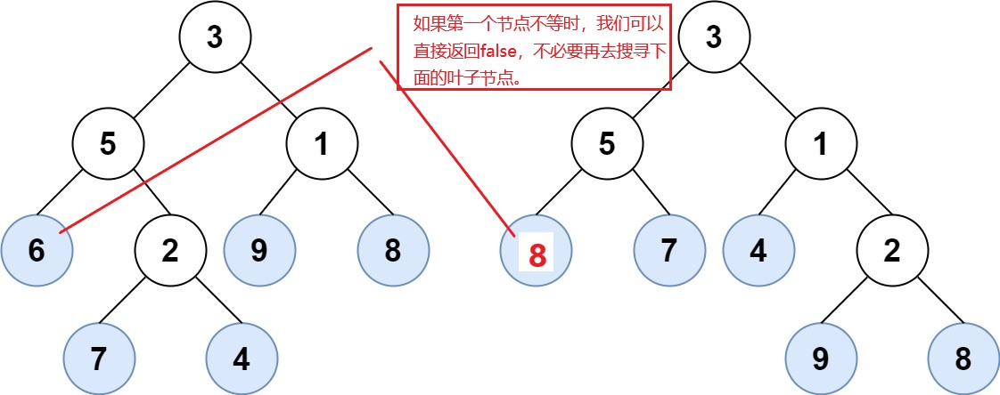
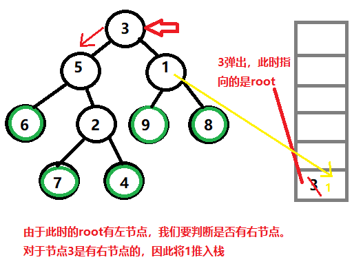
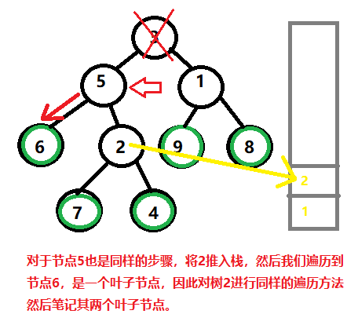
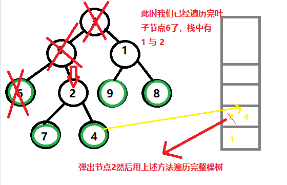

> 原文链接: https://leetcode-cn.com/problems/leaf-similar-trees


## 英文原文
<div><p>Consider all the leaves of a binary tree, from&nbsp;left to right order, the values of those&nbsp;leaves form a <strong>leaf value sequence</strong><em>.</em></p>

<p></p>

<p>For example, in the given tree above, the leaf value sequence is <code>(6, 7, 4, 9, 8)</code>.</p>

<p>Two binary trees are considered <em>leaf-similar</em>&nbsp;if their leaf value sequence is the same.</p>

<p>Return <code>true</code> if and only if the two given trees with head nodes <code>root1</code> and <code>root2</code> are leaf-similar.</p>

<p>&nbsp;</p>
<p><strong>Example 1:</strong></p>

<pre>
<strong>Input:</strong> root1 = [3,5,1,6,2,9,8,null,null,7,4], root2 = [3,5,1,6,7,4,2,null,null,null,null,null,null,9,8]
<strong>Output:</strong> true
</pre>

<p><strong>Example 2:</strong></p>

<pre>
<strong>Input:</strong> root1 = [1], root2 = [1]
<strong>Output:</strong> true
</pre>

<p><strong>Example 3:</strong></p>

<pre>
<strong>Input:</strong> root1 = [1], root2 = [2]
<strong>Output:</strong> false
</pre>

<p><strong>Example 4:</strong></p>

<pre>
<strong>Input:</strong> root1 = [1,2], root2 = [2,2]
<strong>Output:</strong> true
</pre>

<p><strong>Example 5:</strong></p>

<pre>
<strong>Input:</strong> root1 = [1,2,3], root2 = [1,3,2]
<strong>Output:</strong> false
</pre>

<p>&nbsp;</p>
<p><strong>Constraints:</strong></p>

<ul>
	<li>The number of nodes in each tree will be in the range <code>[1, 200]</code>.</li>
	<li>Both of the given trees will have values in the range <code>[0, 200]</code>.</li>
</ul>
</div>

## 中文题目
<div><p>请考虑一棵二叉树上所有的叶子，这些叶子的值按从左到右的顺序排列形成一个 <strong>叶值序列 </strong>。</p>

<p></p>

<p>举个例子，如上图所示，给定一棵叶值序列为 <code>(6, 7, 4, 9, 8)</code> 的树。</p>

<p>如果有两棵二叉树的叶值序列是相同，那么我们就认为它们是 <em>叶相似 </em>的。</p>

<p>如果给定的两个根结点分别为 <code>root1</code> 和 <code>root2</code> 的树是叶相似的，则返回 <code>true</code>；否则返回 <code>false</code> 。</p>

<p> </p>

<p><strong>示例 1：</strong></p>

<p></p>

<pre>
<strong>输入：</strong>root1 = [3,5,1,6,2,9,8,null,null,7,4], root2 = [3,5,1,6,7,4,2,null,null,null,null,null,null,9,8]
<strong>输出：</strong>true
</pre>

<p><strong>示例 2：</strong></p>

<pre>
<strong>输入：</strong>root1 = [1], root2 = [1]
<strong>输出：</strong>true
</pre>

<p><strong>示例 3：</strong></p>

<pre>
<strong>输入：</strong>root1 = [1], root2 = [2]
<strong>输出：</strong>false
</pre>

<p><strong>示例 4：</strong></p>

<pre>
<strong>输入：</strong>root1 = [1,2], root2 = [2,2]
<strong>输出：</strong>true
</pre>

<p><strong>示例 5：</strong></p>

<p></p>

<pre>
<strong>输入：</strong>root1 = [1,2,3], root2 = [1,3,2]
<strong>输出：</strong>false
</pre>

<p> </p>

<p><strong>提示：</strong></p>

<ul>
	<li>给定的两棵树可能会有 <code>1</code> 到 <code>200</code> 个结点。</li>
	<li>给定的两棵树上的值介于 <code>0</code> 到 <code>200</code> 之间。</li>
</ul>
</div>

## 通过代码
<RecoDemo>
</RecoDemo>


## 高赞题解
### 小明的第一感
**深搜(法一)**：
小明的妈妈昨天很开心，于是又给了他一个新的问题，“找不同”。对于两颗🌳，小明需要找到其对于的叶子节点的不同，如果两颗🌳的叶子节点的值是相同的，那么告诉妈妈它们一样$(返回true)$, 反之则告诉妈妈它们不一样$(返回false)$。
对于早已经会深搜的小明感觉智商受到了侮辱。于是他脑子里啪啪就想出了深搜的法子。他先拿了第一张纸(vector)对树进行了完全的遍历并储存了下 "树一" 的所有叶子节点的值，然后又拿了一张纸(vector)对树进行完全的遍历储存下了 "树二" 的所有叶子节点的值。然后进行了比对，并将结果告诉了妈妈。
*********************
```cpp
class Solution {
public:
    bool leafSimilar(TreeNode* root1, TreeNode* root2) {
        vector<int> v1, v2;
        dfs(root1, v1);
        dfs(root2, v2);
        return v1 == v2;
    }
    void dfs(TreeNode* root, vector<int>& vec)
    {
        if(!root->left && !root->right)
        {
            vec.push_back(root->val);
            return;
        }

        if(root->left) dfs(root->left, vec);
        if(root->right) dfs(root->right, vec);
    }
};
```
********************
时间复杂度: $O(N1+N2)$，其中 $N1$ 与 $N2$为树的节点数量。
空间复杂度：储存叶子节点需要的空间为 $O(L1+L2)$，其中 $L1$ 与 $L2$为叶子的节点数量，递归的空间取决于树的高度 $O(h)$。
*********************
### 小明发现问题
**同步遍历法(法二)**：
小明开心告诉妈妈答案后准备去找小红玩耍，然而他发现小红早已经等待了他半天。于是晚上回家后小明想有没有办法能提高今天对🌳找不同的速度！他发现了一个问题：***尽管对于两棵树的第一个叶子节点不相同，他还是遍历了其所有的叶子节点***。问题出在哪？因为他先遍历一棵树，在遍历了第一棵🌳后他并不知道第二个🌳叶子节点的值，因此他还要继续重复遍历的操作。于是他想同时逐个比较两棵树的叶子节点，一但发现不同，立刻返回$false$。
这样子会有一个问题，同时观察两颗树他在观察一棵树回到另一颗树继续观察下一个叶子节点时不知从何开始。因此他还是需要辅助记录的小纸(stack)。然而这一次他记录的是下一个搜索的起始位置。
**************
### 小明的同步遍历算法
1. 使用两个栈分别记录两棵树其下一次出发搜寻叶子节点的起始点.
2. 只要有任意一个栈为空，说明其树以经遍历完毕。这里有两种情况:
    - 两个栈都空了，并且叶子节点都相等，因此返回true
    - 只有一颗树空了，证明另一棵树一定还有别的叶子节点, 因此返回false
3. 分别取出两个栈中两颗树出发搜寻叶子节点的起始点，并出发找到其对于的叶子节点。
    - 左孩子不为空时，如果右孩子也不为空，则将其推入栈作为下次的起始点。然后继续往左搜寻叶子节点。
    - 左孩子为空时，那么右孩子一定不为空，则出发往右孩子寻找第一个叶子节点。
4. 当两棵树分别都找到叶子节点后，比较它们的值是否相等，如果不相等则返回$false$, 相等则继续找下一个叶子节点。
*****************
### 小明的作图笔记
发现问题的地方：

****************





*********************
```cpp
class Solution {
public:
    bool leafSimilar(TreeNode* root1, TreeNode* root2) {
        stack<TreeNode*> s1, s2;
        s1.push(root1), s2.push(root2);
        while(!s1.empty() && !s2.empty())
        {
            TreeNode* node1 = s1.top(); s1.pop();
            TreeNode* node2 = s2.top(); s2.pop();
            while(node1->left || node1->right)
            {
                if(node1->left)
                {
                    if(node1->right) s1.push(node1->right);
                    node1 = node1->left;
                }
                else
                    node1 = node1->right;
            }
            //同样的操作对树2进行一遍
            while(node2->left || node2->right)
            {
                if(node2->left)
                {
                    if(node2->right) s2.push(node2->right);
                    node2 = node2->left;
                }
                else
                    node2 = node2->right;
            }
            //此时node1与node2分别指向树1与树2的叶子节点
            if(node1->val != node2->val) return false;
        }
        //到此两种情况：
        //1. 两个栈都空了，并且叶子节点都相等，因此返回true
        //2. 只有一颗树空了，证明另一棵树一定还有别的叶子节点, 返回false;
        return s1.empty() && s2.empty();
    }
};
```
************
时间复杂度：最坏情况也需要遍历所有节点，因此为 $O(N1+N2)$，其中 $N1$ 与 $N2$为树的节点数量
空间复杂度: 栈的空间取决于树的深度，因此为 $O(h)$。
*************
虽然小明很厉害，但是我偷他的笔记也很累的，所以各位给个👍吧！

## 统计信息
| 通过次数 | 提交次数 | AC比率 |
| :------: | :------: | :------: |
|    61768    |    94744    |   65.2%   |

## 提交历史
| 提交时间 | 提交结果 | 执行时间 |  内存消耗  | 语言 |
| :------: | :------: | :------: | :--------: | :--------: |
