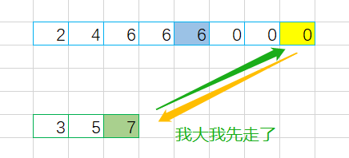
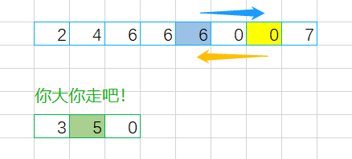
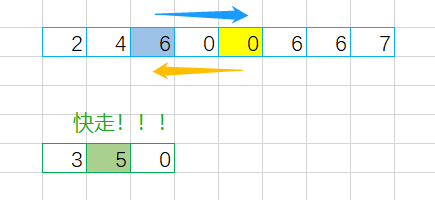
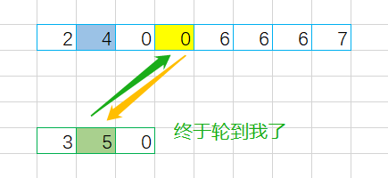
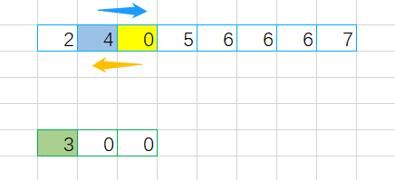
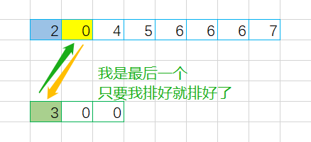
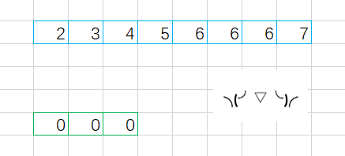

> 原文链接: https://leetcode-cn.com/problems/merge-sorted-array


## 英文原文
<div><p>You are given two integer arrays <code>nums1</code> and <code>nums2</code>, sorted in <strong>non-decreasing order</strong>, and two integers <code>m</code> and <code>n</code>, representing the number of elements in <code>nums1</code> and <code>nums2</code> respectively.</p>

<p><strong>Merge</strong> <code>nums1</code> and <code>nums2</code> into a single array sorted in <strong>non-decreasing order</strong>.</p>

<p>The final sorted array should not be returned by the function, but instead be <em>stored inside the array </em><code>nums1</code>. To accommodate this, <code>nums1</code> has a length of <code>m + n</code>, where the first <code>m</code> elements denote the elements that should be merged, and the last <code>n</code> elements are set to <code>0</code> and should be ignored. <code>nums2</code> has a length of <code>n</code>.</p>

<p>&nbsp;</p>
<p><strong>Example 1:</strong></p>

<pre>
<strong>Input:</strong> nums1 = [1,2,3,0,0,0], m = 3, nums2 = [2,5,6], n = 3
<strong>Output:</strong> [1,2,2,3,5,6]
<strong>Explanation:</strong> The arrays we are merging are [1,2,3] and [2,5,6].
The result of the merge is [<u>1</u>,<u>2</u>,2,<u>3</u>,5,6] with the underlined elements coming from nums1.
</pre>

<p><strong>Example 2:</strong></p>

<pre>
<strong>Input:</strong> nums1 = [1], m = 1, nums2 = [], n = 0
<strong>Output:</strong> [1]
<strong>Explanation:</strong> The arrays we are merging are [1] and [].
The result of the merge is [1].
</pre>

<p><strong>Example 3:</strong></p>

<pre>
<strong>Input:</strong> nums1 = [0], m = 0, nums2 = [1], n = 1
<strong>Output:</strong> [1]
<strong>Explanation:</strong> The arrays we are merging are [] and [1].
The result of the merge is [1].
Note that because m = 0, there are no elements in nums1. The 0 is only there to ensure the merge result can fit in nums1.
</pre>

<p>&nbsp;</p>
<p><strong>Constraints:</strong></p>

<ul>
	<li><code>nums1.length == m + n</code></li>
	<li><code>nums2.length == n</code></li>
	<li><code>0 &lt;= m, n &lt;= 200</code></li>
	<li><code>1 &lt;= m + n &lt;= 200</code></li>
	<li><code>-10<sup>9</sup> &lt;= nums1[i], nums2[j] &lt;= 10<sup>9</sup></code></li>
</ul>

<p>&nbsp;</p>
<p><strong>Follow up: </strong>Can you come up with an algorithm that runs in <code>O(m + n)</code> time?</p>
</div>

## 中文题目
<div><p>给你两个按 <strong>非递减顺序</strong> 排列的整数数组&nbsp;<code>nums1</code><em> </em>和 <code>nums2</code>，另有两个整数 <code>m</code> 和 <code>n</code> ，分别表示 <code>nums1</code> 和 <code>nums2</code> 中的元素数目。</p>

<p>请你 <strong>合并</strong> <code>nums2</code><em> </em>到 <code>nums1</code> 中，使合并后的数组同样按 <strong>非递减顺序</strong> 排列。</p>

<p><strong>注意：</strong>最终，合并后数组不应由函数返回，而是存储在数组 <code>nums1</code> 中。为了应对这种情况，<code>nums1</code> 的初始长度为 <code>m + n</code>，其中前 <code>m</code> 个元素表示应合并的元素，后 <code>n</code> 个元素为 <code>0</code> ，应忽略。<code>nums2</code> 的长度为 <code>n</code> 。</p>

<p>&nbsp;</p>

<p><strong>示例 1：</strong></p>

<pre>
<strong>输入：</strong>nums1 = [1,2,3,0,0,0], m = 3, nums2 = [2,5,6], n = 3
<strong>输出：</strong>[1,2,2,3,5,6]
<strong>解释：</strong>需要合并 [1,2,3] 和 [2,5,6] 。
合并结果是 [<em><strong>1</strong></em>,<em><strong>2</strong></em>,2,<em><strong>3</strong></em>,5,6] ，其中斜体加粗标注的为 nums1 中的元素。
</pre>

<p><strong>示例 2：</strong></p>

<pre>
<strong>输入：</strong>nums1 = [1], m = 1, nums2 = [], n = 0
<strong>输出：</strong>[1]
<strong>解释：</strong>需要合并 [1] 和 [] 。
合并结果是 [1] 。
</pre>

<p><strong>示例 3：</strong></p>

<pre>
<strong>输入：</strong>nums1 = [0], m = 0, nums2 = [1], n = 1
<strong>输出：</strong>[1]
<strong>解释：</strong>需要合并的数组是 [] 和 [1] 。
合并结果是 [1] 。
注意，因为 m = 0 ，所以 nums1 中没有元素。nums1 中仅存的 0 仅仅是为了确保合并结果可以顺利存放到 nums1 中。
</pre>

<p>&nbsp;</p>

<p><strong>提示：</strong></p>

<ul>
	<li><code>nums1.length == m + n</code></li>
	<li><code>nums2.length == n</code></li>
	<li><code>0 &lt;= m, n &lt;= 200</code></li>
	<li><code>1 &lt;= m + n &lt;= 200</code></li>
	<li><code>-10<sup>9</sup> &lt;= nums1[i], nums2[j] &lt;= 10<sup>9</sup></code></li>
</ul>

<p>&nbsp;</p>

<p><strong>进阶：</strong>你可以设计实现一个时间复杂度为 <code>O(m + n)</code> 的算法解决此问题吗？</p>
</div>

## 通过代码
<RecoDemo>
</RecoDemo>


## 高赞题解
#### 解题思路：
1. 几个月后重刷此题，感觉还是有点进步的
2. 思路的重点一个是从后往前确定两组中该用哪个数字
3. 另一个是结束条件以第二个数组全都插入进去为止

#### 画图理解：
<,,,,,,,>


#### 代码：

```C++ []
void merge(vector<int>& nums1, int m, vector<int>& nums2, int n) {
    int i = nums1.size() - 1;
    m--;
    n--;
    while (n >= 0) {
        while (m >= 0 && nums1[m] > nums2[n]) {
            swap(nums1[i--], nums1[m--]);
        }
        swap(nums1[i--], nums2[n--]);
    }
}
```


#### 致谢：

感谢您的观看，希望对您有帮助，欢迎热烈的交流！  

如果感觉还不错就点个赞吧~


## 统计信息
| 通过次数 | 提交次数 | AC比率 |
| :------: | :------: | :------: |
|    511030    |    984939    |   51.9%   |

## 提交历史
| 提交时间 | 提交结果 | 执行时间 |  内存消耗  | 语言 |
| :------: | :------: | :------: | :--------: | :--------: |


## 相似题目
|                             题目                             | 难度 |
| :----------------------------------------------------------: | :---------: |
| [合并两个有序链表](https://leetcode-cn.com/problems/merge-two-sorted-lists/) | 简单|
| [有序数组的平方](https://leetcode-cn.com/problems/squares-of-a-sorted-array/) | 简单|
| [区间列表的交集](https://leetcode-cn.com/problems/interval-list-intersections/) | 中等|
