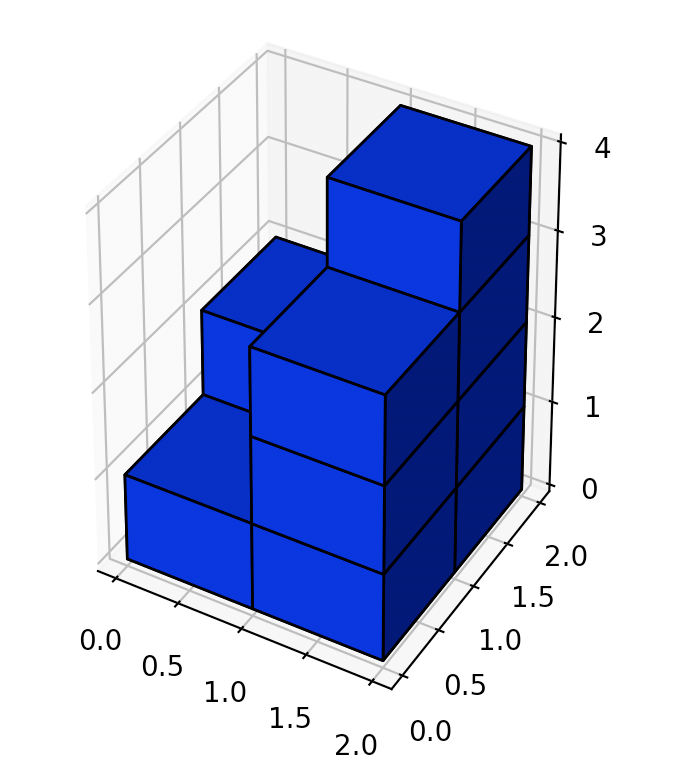
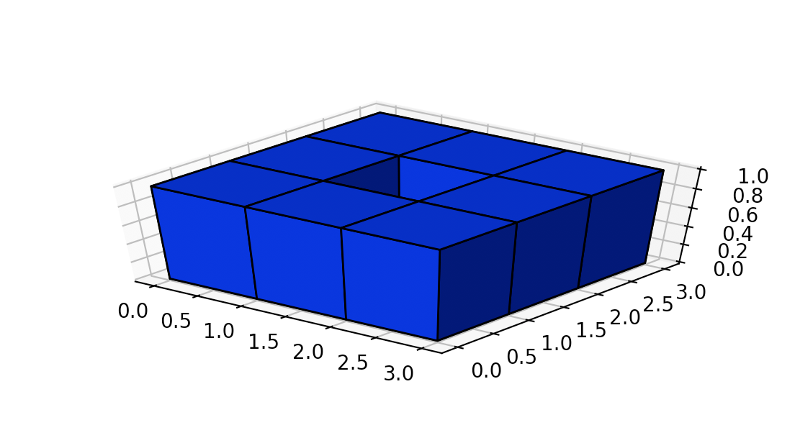

> 原文链接: https://leetcode-cn.com/problems/surface-area-of-3d-shapes


## 英文原文
<div><p>You are given an <code>n x n</code> <code>grid</code> where you have placed some <code>1 x 1 x 1</code> cubes. Each value <code>v = grid[i][j]</code> represents a tower of <code>v</code> cubes placed on top of cell <code>(i, j)</code>.</p>

<p>After placing these cubes, you have decided to glue any directly adjacent cubes to each other, forming several irregular 3D shapes.</p>

<p>Return <em>the total surface area of the resulting shapes</em>.</p>

<p><strong>Note:</strong> The bottom face of each shape counts toward its surface area.</p>

<p>&nbsp;</p>
<p><strong>Example 1:</strong></p>

<pre>
<strong>Input:</strong> grid = [[2]]
<strong>Output:</strong> 10
</pre>

<p><strong>Example 2:</strong></p>

<pre>
<strong>Input:</strong> grid = [[1,2],[3,4]]
<strong>Output:</strong> 34
</pre>

<p><strong>Example 3:</strong></p>

<pre>
<strong>Input:</strong> grid = [[1,0],[0,2]]
<strong>Output:</strong> 16
</pre>

<p><strong>Example 4:</strong></p>

<pre>
<strong>Input:</strong> grid = [[1,1,1],[1,0,1],[1,1,1]]
<strong>Output:</strong> 32
</pre>

<p><strong>Example 5:</strong></p>

<pre>
<strong>Input:</strong> grid = [[2,2,2],[2,1,2],[2,2,2]]
<strong>Output:</strong> 46
</pre>

<p>&nbsp;</p>
<p><strong>Constraints:</strong></p>

<ul>
	<li><code>n == grid.length</code></li>
	<li><code>n == grid[i].length</code></li>
	<li><code>1 &lt;= n &lt;= 50</code></li>
	<li><code>0 &lt;= grid[i][j] &lt;= 50</code></li>
</ul>
</div>

## 中文题目
<div><p>给你一个 <code>n * n</code> 的网格 <code>grid</code> ，上面放置着一些 <code>1 x 1 x 1</code> 的正方体。</p>

<p>每个值 <code>v = grid[i][j]</code> 表示 <code>v</code> 个正方体叠放在对应单元格 <code>(i, j)</code> 上。</p>

<p>放置好正方体后，任何直接相邻的正方体都会互相粘在一起，形成一些不规则的三维形体。</p>

<p>请你返回最终这些形体的总表面积。</p>

<p><strong>注意：</strong>每个形体的底面也需要计入表面积中。</p>

<p> </p>

<ul>
</ul>

<p><strong>示例 1：</strong></p>

<pre>
<strong>输入：</strong>grid = [[2]]
<strong>输出：</strong>10
</pre>

<p><strong>示例 2：</strong></p>

<pre>
<strong>输入：</strong>grid = [[1,2],[3,4]]
<strong>输出：</strong>34
</pre>

<p><strong>示例 3：</strong></p>

<pre>
<strong>输入：</strong>grid = [[1,0],[0,2]]
<strong>输出：</strong>16
</pre>

<p><strong>示例 4：</strong></p>

<pre>
<strong>输入：</strong>grid = [[1,1,1],[1,0,1],[1,1,1]]
<strong>输出：</strong>32
</pre>

<p><strong>示例 5：</strong></p>

<pre>
<strong>输入：</strong>grid = [[2,2,2],[2,1,2],[2,2,2]]
<strong>输出：</strong>46
</pre>

<p> </p>

<p><strong>提示：</strong></p>

<ul>
	<li><code>n == grid.length</code></li>
	<li><code>n == grid[i].length</code></li>
	<li><code>1 <= n <= 50</code></li>
	<li><code>0 <= grid[i][j] <= 50</code></li>
</ul>
</div>

## 通过代码
<RecoDemo>
</RecoDemo>


## 高赞题解
#### 解题思路：

题目需要求的是表面积，很多同学说看不懂题意，我这里画了几个示例图。
（c 几个破图画了半天！ 宝宝们快给我**点赞**昂！！）

##### 示例图
示例 1：
```
输入：[[2]]
输出：10
```
这个图长这样

{:width=300}
{:align=center}


2 个立方体分别贡献了 5 个单位的表面积。后面示例的表面积你们可以自己数一数辣~

示例 2:
```
输入：[[1,2],[3,4]]
输出：34
```
这个示例你从右侧看就是长这个亚子：

{:width=300}
{:align=center}


示例 3:
```
输入：[[1,0],[0,2]]
输出：16
```
这个示例长这个亚子：

{:width=300}
{:align=center}

示例 4:
```
输入：[[1,1,1],[1,0,1],[1,1,1]]
输出：32
```
这个示例长这个亚子：

{:width=300}
{:align=center}

中间是空心的！但是空心处那几个表面积也是要算的！

示例 5:
```
输入：[[2,2,2],[2,1,2],[2,2,2]]
输出：46
```
这个示例长这个亚子：

{:width=300}
{:align=center}

中间看得像空心，但是中间那是有一个立方体哒！
俯视看是这个亚子：

{:width=300}
{:align=center}


#### 做法：
首先，一个柱体一个柱体的看，每个柱体是由：**2 个底面（上表面/下表面）+ 所有的正方体都贡献了 4 个侧表面积**。
然后，把柱体贴合在一起之后，我们需要把贴合的表面积给减掉，**两个柱体贴合的表面积就是 两个柱体高的最小值*2**。

```Java []
class Solution {
    public int surfaceArea(int[][] grid) {
        int n = grid.length, area = 0;
        for (int i = 0; i < n; i++) {
            for (int j = 0; j < n; j++) {
                // 先把grid[i][j]赋值给level，省掉了bound check，可以略微略微略微优化一下耗时。。。
                int level = grid[i][j];
                if (level > 0) {
                    // 一个柱体中：2个底面 + 所有的正方体都贡献了4个侧表面积 
                    area += (level << 2) + 2;
                    // 减掉 i 与 i-1 相贴的两份表面积
                    area -= i > 0? Math.min(level, grid[i - 1][j]) << 1: 0; 
                    // 减掉 j 与 j-1 相贴的两份表面积
                    area -= j > 0? Math.min(level, grid[i][j - 1]) << 1: 0;
                }  
            }
        }
        return area;
    }
}
```


## 统计信息
| 通过次数 | 提交次数 | AC比率 |
| :------: | :------: | :------: |
|    33713    |    52822    |   63.8%   |

## 提交历史
| 提交时间 | 提交结果 | 执行时间 |  内存消耗  | 语言 |
| :------: | :------: | :------: | :--------: | :--------: |
