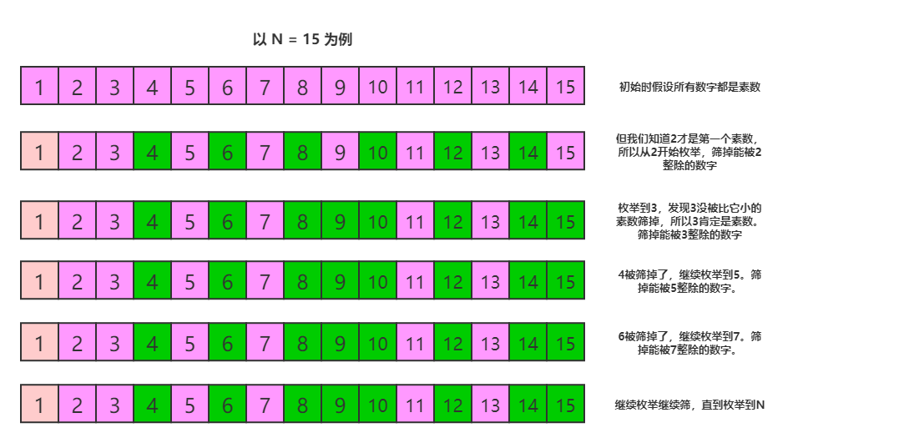

> 原文链接: https://leetcode-cn.com/problems/x-of-a-kind-in-a-deck-of-cards


## 英文原文
<div><p>In a deck of cards, each card has an integer written on it.</p>

<p>Return <code>true</code> if and only if you can choose <code>X &gt;= 2</code> such that it is possible to split the entire deck into 1 or more groups of cards, where:</p>

<ul>
	<li>Each group has exactly <code>X</code> cards.</li>
	<li>All the cards in each group have the same integer.</li>
</ul>

<p>&nbsp;</p>
<p><strong>Example 1:</strong></p>

<pre>
<strong>Input:</strong> deck = [1,2,3,4,4,3,2,1]
<strong>Output:</strong> true
<strong>Explanation</strong>: Possible partition [1,1],[2,2],[3,3],[4,4].
</pre>

<p><strong>Example 2:</strong></p>

<pre>
<strong>Input:</strong> deck = [1,1,1,2,2,2,3,3]
<strong>Output:</strong> false
<strong>Explanation</strong>: No possible partition.
</pre>

<p><strong>Example 3:</strong></p>

<pre>
<strong>Input:</strong> deck = [1]
<strong>Output:</strong> false
<strong>Explanation</strong>: No possible partition.
</pre>

<p><strong>Example 4:</strong></p>

<pre>
<strong>Input:</strong> deck = [1,1]
<strong>Output:</strong> true
<strong>Explanation</strong>: Possible partition [1,1].
</pre>

<p><strong>Example 5:</strong></p>

<pre>
<strong>Input:</strong> deck = [1,1,2,2,2,2]
<strong>Output:</strong> true
<strong>Explanation</strong>: Possible partition [1,1],[2,2],[2,2].
</pre>

<p>&nbsp;</p>
<p><strong>Constraints:</strong></p>

<ul>
	<li><code>1 &lt;= deck.length &lt;= 10<sup>4</sup></code></li>
	<li><code>0 &lt;= deck[i] &lt; 10<sup>4</sup></code></li>
</ul>
</div>

## 中文题目
<div><p>给定一副牌，每张牌上都写着一个整数。</p>

<p>此时，你需要选定一个数字 <code>X</code>，使我们可以将整副牌按下述规则分成 1 组或更多组：</p>

<ul>
	<li>每组都有&nbsp;<code>X</code>&nbsp;张牌。</li>
	<li>组内所有的牌上都写着相同的整数。</li>
</ul>

<p>仅当你可选的 <code>X &gt;= 2</code> 时返回&nbsp;<code>true</code>。</p>

<p>&nbsp;</p>

<p><strong>示例 1：</strong></p>

<pre><strong>输入：</strong>[1,2,3,4,4,3,2,1]
<strong>输出：</strong>true
<strong>解释：</strong>可行的分组是 [1,1]，[2,2]，[3,3]，[4,4]
</pre>

<p><strong>示例 2：</strong></p>

<pre><strong>输入：</strong>[1,1,1,2,2,2,3,3]
<strong>输出：</strong>false
<strong>解释：</strong>没有满足要求的分组。
</pre>

<p><strong>示例 3：</strong></p>

<pre><strong>输入：</strong>[1]
<strong>输出：</strong>false
<strong>解释：</strong>没有满足要求的分组。
</pre>

<p><strong>示例 4：</strong></p>

<pre><strong>输入：</strong>[1,1]
<strong>输出：</strong>true
<strong>解释：</strong>可行的分组是 [1,1]
</pre>

<p><strong>示例 5：</strong></p>

<pre><strong>输入：</strong>[1,1,2,2,2,2]
<strong>输出：</strong>true
<strong>解释：</strong>可行的分组是 [1,1]，[2,2]，[2,2]
</pre>

<p><br>
<strong>提示：</strong></p>

<ol>
	<li><code>1 &lt;= deck.length &lt;= 10000</code></li>
	<li><code>0 &lt;= deck[i] &lt;&nbsp;10000</code></li>
</ol>

<p>&nbsp;</p>
</div>

## 通过代码
<RecoDemo>
</RecoDemo>


## 高赞题解
**面试官：** 题意就是这样，来说说你的想法。
**前额叶：** 先统计每个数出现的次数，记为数组 arr，记其中最小的值为 min，然后从 2 到 min 枚举，看能否有数字可以将 arr 中的所有元素整除。

**面试官：** 不错，有可以**优化**的地方吗？
**前额叶：** 有两个剪枝。第一个，如果 min 是 1 的话， 直接返回false。第二个，枚举过程中，在判断能否整除arr所有元素之前，先判断能否整除 decks.size()。

**面试官：** 不错，还有吗？
**前额叶：** 还可以优化枚举过程，现在的枚举 [2, min] 中的所有数字，其实可以只枚举里面的素数。我先证明一下，设 x 是一个素数， y = a*x，a 为大于1的整数。如果 x 不能整除 z，那么对于任意的 y 都不能整除 z。我们可以先用素数筛算法处理出需要的素数，然后再进行枚举。虽然素数筛有一定的时耗，但是当有多组输入时，可以均摊这个时耗。

**下面来介绍下素数筛：**
对于一个大于2的整数 x，如果x不是素数，那么必然存在一个素数 p 满足，p < x 且 x%p == 0。反过来讲，如果一个整数 x，存在一个素数 p 满足 x%p == 0，那么 x 必然不是素数。

基于这个前提，我们可以设计出一个筛选素数的算法，假设我们要筛选不超过 N 的素数，那么有如下操作：

```
//标记数组，如果mark[i] == false 且 i>=2，则认为 i 是素数。初始时假设都是素数
bool mark[N+1] = {0}; 
vector<int> prime; //用来存储素数的容器
for(int i = 2; i <= N; i++) {
    if(mark[i]) { //i 已经被标记为不是素数了，continue
        continue;
    }
    primes.push_back(i); //i是一个素数，放进容器。
    for(int j = i + i; j <= N; j += i) {//筛掉所有能被i整除的数字。
        mark[j] = true;
    }
}
```

代码不好理解，可以看图~



```
bool initFlag = false;
vector<int> primes;
class Solution {
public:
    bool hasGroupsSizeX(vector<int>& deck) {
        if(initFlag == false) {
            initFlag = true;
            bool mark[10000] = {0};
            for(int i = 2; i < 10000; i++) {
                if(mark[i]) {
                    continue;
                }
                primes.push_back(i);
                for(int j = i + i; j < 10000; j += i) {
                    mark[j] = true;
                }
            }
        }

        unordered_map<int, int> cnt;
        for(auto v : deck) {
            cnt[v]++;
        }
        auto minIter = cnt.begin();
        for(auto it = cnt.begin(); it != cnt.end(); it++) {
            if(it->second < minIter->second) {
                minIter = it;
            }
        }
        if(minIter->second <= 1) {
            return false;
        }
        for(auto v : primes) {
            if(deck.size() % v) {
                continue;
            }
            if(v > minIter->second) {
                break;
            }
            bool flag = true;
            for(auto it = cnt.cbegin(); flag && it != cnt.cend(); ++it) {
                if(it->second % v) {
                    flag = false;
                }
            }
            if(flag) {
                return true;
            }
        }
        return false;
    }
};
```

昨晚与 [@Smile](/u/fwsmile/) 小姐姐把酒夜话，聊起了一些面试的小技巧。现在总结一下，分享给大家，希望有帮助~
在参加面试的时候，如果碰见了不太擅长的题目，**不要纠缠太久以免浪费时间**。因为很多大厂对面试官都会有题数的要求，并且会要求面试官必须考察求职者的**多个方面**(比如算法，数据库，网络，操作系统等等)。而且大多数面试不会超过**四十分钟**，所以时间很宝贵，要尽可能的引导面试官发现自己的优点。比如你面试的是数据库相关的职位，却卡在了一道算法题上，你应该尽快和面试官交换思路，然后可以告诉面试官自己更擅长数据库，引导面试官发现自己的长处，拿到更高的得分。


### 如果感觉这篇题解对你有帮助，可以关注下我的公众号哟 👏[HelloNebula](../images/x-of-a-kind-in-a-deck-of-cards-1.jpg)👏

## 统计信息
| 通过次数 | 提交次数 | AC比率 |
| :------: | :------: | :------: |
|    49946    |    128410    |   38.9%   |

## 提交历史
| 提交时间 | 提交结果 | 执行时间 |  内存消耗  | 语言 |
| :------: | :------: | :------: | :--------: | :--------: |
