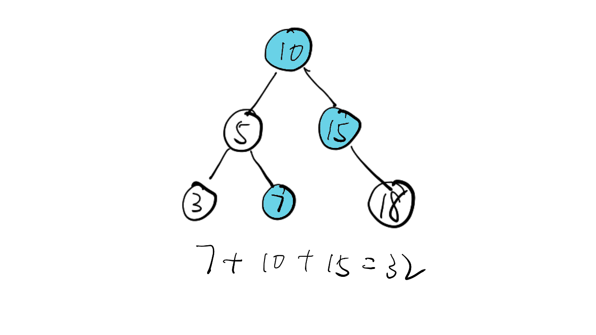
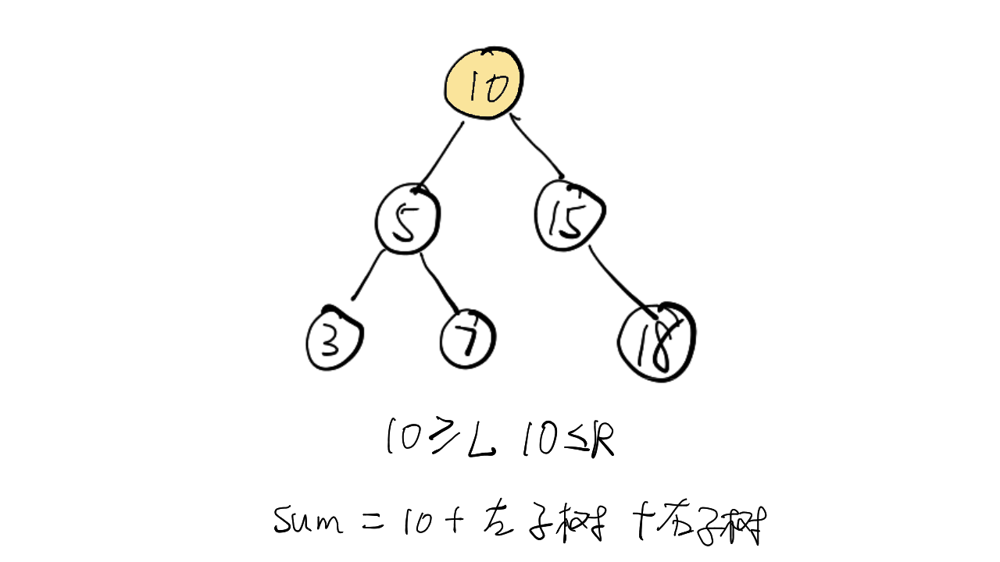
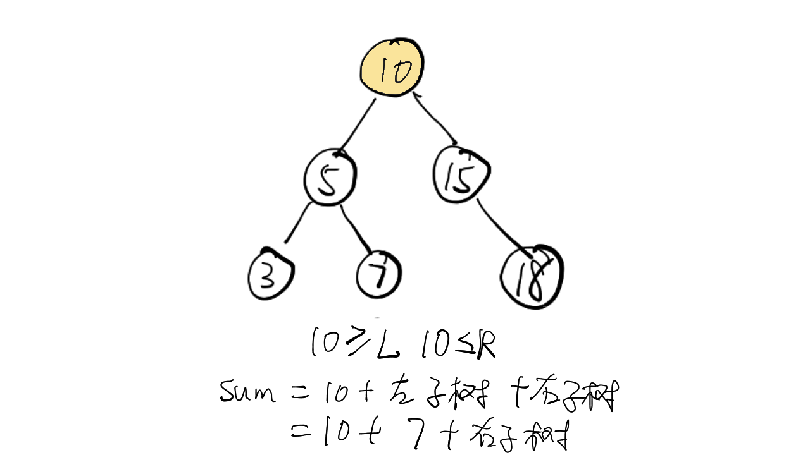
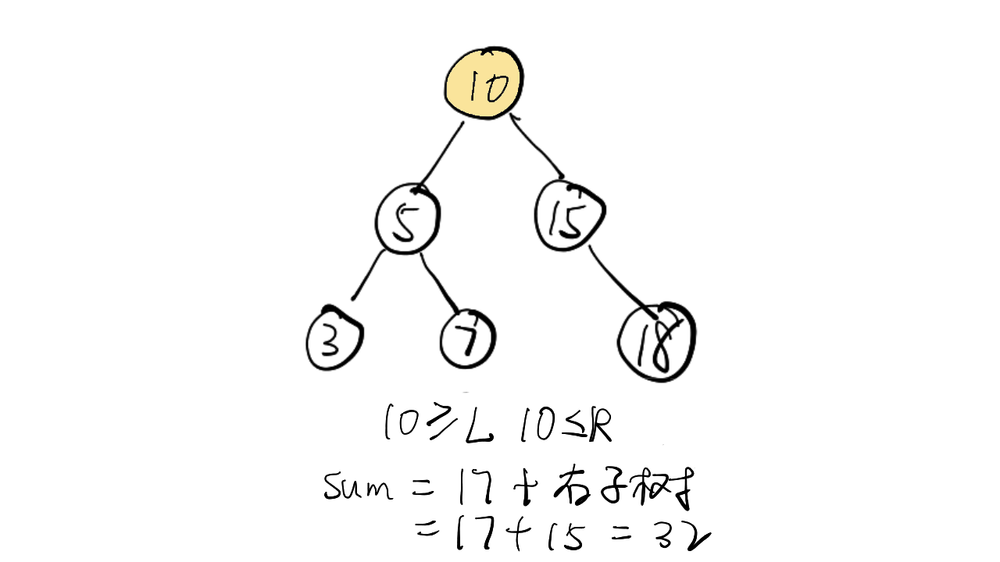

> 原文链接: https://leetcode-cn.com/problems/range-sum-of-bst


## 英文原文
<div><p>Given the <code>root</code> node of a binary search tree and two integers <code>low</code> and <code>high</code>, return <em>the sum of values of all nodes with a value in the <strong>inclusive</strong> range </em><code>[low, high]</code>.</p>

<p>&nbsp;</p>
<p><strong>Example 1:</strong></p>

<pre>
<strong>Input:</strong> root = [10,5,15,3,7,null,18], low = 7, high = 15
<strong>Output:</strong> 32
<strong>Explanation:</strong> Nodes 7, 10, and 15 are in the range [7, 15]. 7 + 10 + 15 = 32.
</pre>

<p><strong>Example 2:</strong></p>

<pre>
<strong>Input:</strong> root = [10,5,15,3,7,13,18,1,null,6], low = 6, high = 10
<strong>Output:</strong> 23
<strong>Explanation:</strong> Nodes 6, 7, and 10 are in the range [6, 10]. 6 + 7 + 10 = 23.
</pre>

<p>&nbsp;</p>
<p><strong>Constraints:</strong></p>

<ul>
	<li>The number of nodes in the tree is in the range <code>[1, 2 * 10<sup>4</sup>]</code>.</li>
	<li><code>1 &lt;= Node.val &lt;= 10<sup>5</sup></code></li>
	<li><code>1 &lt;= low &lt;= high &lt;= 10<sup>5</sup></code></li>
	<li>All <code>Node.val</code> are <strong>unique</strong>.</li>
</ul>
</div>

## 中文题目
<div><p>给定二叉搜索树的根结点 <code>root</code>，返回值位于范围 <em><code>[low, high]</code></em> 之间的所有结点的值的和。</p>

<p> </p>

<p><strong>示例 1：</strong></p>

<pre>
<strong>输入：</strong>root = [10,5,15,3,7,null,18], low = 7, high = 15
<strong>输出：</strong>32
</pre>

<p><strong>示例 2：</strong></p>

<pre>
<strong>输入：</strong>root = [10,5,15,3,7,13,18,1,null,6], low = 6, high = 10
<strong>输出：</strong>23
</pre>

<p> </p>

<p><strong>提示：</strong></p>

<ul>
	<li>树中节点数目在范围 <code>[1, 2 * 10<sup>4</sup>]</code> 内</li>
	<li><code>1 <= Node.val <= 10<sup>5</sup></code></li>
	<li><code>1 <= low <= high <= 10<sup>5</sup></code></li>
	<li>所有 <code>Node.val</code> <strong>互不相同</strong></li>
</ul>
</div>

## 通过代码
<RecoDemo>
</RecoDemo>


## 高赞题解
### 解题思路

- 标签：深度优先遍历
- 题意：这个题字面含义很难理解，本意就是求出所有 `X >= L` 且 `X <= R` 的值的和
- 递归终止条件：
  - 当前节点为 null 时返回 0
  - 当前节点 `X < L` 时则返回右子树之和
  - 当前节点 `X > R` 时则返回左子树之和
  - 当前节点 `X >= L` 且 `X <= R` 时则返回：当前节点值 + 左子树之和 + 右子树之和
- 注意点：通过判断X的大小能够避免遍历全部树的节点，比如下方的动图中，3 这个值就没有必要遍历

### 代码

```Java []
/**
 * Definition for a binary tree node.
 * public class TreeNode {
 *     int val;
 *     TreeNode left;
 *     TreeNode right;
 *     TreeNode(int x) { val = x; }
 * }
 */
class Solution {
    public int rangeSumBST(TreeNode root, int L, int R) {
        if (root == null) {
            return 0;
        }
        if (root.val < L) {
            return rangeSumBST(root.right, L, R);
        }
        if (root.val > R) {
            return rangeSumBST(root.left, L, R);
        }
        return root.val + rangeSumBST(root.left, L, R) + rangeSumBST(root.right, L, R);
    }
}
```

### 画解

<,,,,,,,,,,>


想看大鹏画解更多高频面试题，欢迎阅读大鹏的 LeetBook：[《画解剑指 Offer 》](https://leetcode-cn.com/leetbook/detail/illustrate-lcof/)，O(∩_∩)O

## 统计信息
| 通过次数 | 提交次数 | AC比率 |
| :------: | :------: | :------: |
|    99767    |    121749    |   81.9%   |

## 提交历史
| 提交时间 | 提交结果 | 执行时间 |  内存消耗  | 语言 |
| :------: | :------: | :------: | :--------: | :--------: |
