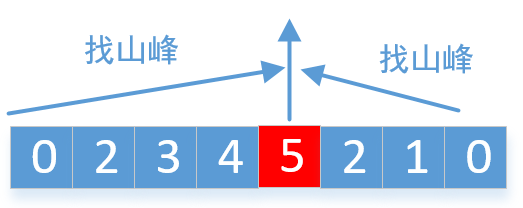

> 原文链接: https://leetcode-cn.com/problems/valid-mountain-array


## 英文原文
<div><p>Given an array of integers <code>arr</code>, return <em><code>true</code> if and only if it is a valid mountain array</em>.</p>

<p>Recall that arr is a mountain array if and only if:</p>

<ul>
	<li><code>arr.length &gt;= 3</code></li>
	<li>There exists some <code>i</code> with <code>0 &lt; i &lt; arr.length - 1</code> such that:
	<ul>
		<li><code>arr[0] &lt; arr[1] &lt; ... &lt; arr[i - 1] &lt; arr[i] </code></li>
		<li><code>arr[i] &gt; arr[i + 1] &gt; ... &gt; arr[arr.length - 1]</code></li>
	</ul>
	</li>
</ul>

<p>&nbsp;</p>
<p><strong>Example 1:</strong></p>
<pre><strong>Input:</strong> arr = [2,1]
<strong>Output:</strong> false
</pre><p><strong>Example 2:</strong></p>
<pre><strong>Input:</strong> arr = [3,5,5]
<strong>Output:</strong> false
</pre><p><strong>Example 3:</strong></p>
<pre><strong>Input:</strong> arr = [0,3,2,1]
<strong>Output:</strong> true
</pre>
<p>&nbsp;</p>
<p><strong>Constraints:</strong></p>

<ul>
	<li><code>1 &lt;= arr.length &lt;= 10<sup>4</sup></code></li>
	<li><code>0 &lt;= arr[i] &lt;= 10<sup>4</sup></code></li>
</ul>
</div>

## 中文题目
<div><p>给定一个整数数组 <code>arr</code>，如果它是有效的山脉数组就返回 <code>true</code>，否则返回 <code>false</code>。</p>

<p>让我们回顾一下，如果 A 满足下述条件，那么它是一个山脉数组：</p>

<ul>
	<li><code>arr.length >= 3</code></li>
	<li>在 <code>0 < i < arr.length - 1</code> 条件下，存在 <code>i</code> 使得：
	<ul>
		<li><code>arr[0] < arr[1] < ... arr[i-1] < arr[i] </code></li>
		<li><code>arr[i] > arr[i+1] > ... > arr[arr.length - 1]</code></li>
	</ul>
	</li>
</ul>

<p> </p>

<p></p>

<p> </p>

<p><strong>示例 1：</strong></p>

<pre>
<strong>输入：</strong>arr = [2,1]
<strong>输出：</strong>false
</pre>

<p><strong>示例 2：</strong></p>

<pre>
<strong>输入：</strong>arr = [3,5,5]
<strong>输出：</strong>false
</pre>

<p><strong>示例 3：</strong></p>

<pre>
<strong>输入：</strong>arr = [0,3,2,1]
<strong>输出：</strong>true</pre>

<p> </p>

<p><strong>提示：</strong></p>

<ul>
	<li><code>1 <= arr.length <= 10<sup>4</sup></code></li>
	<li><code>0 <= arr[i] <= 10<sup>4</sup></code></li>
</ul>
</div>

## 通过代码
<RecoDemo>
</RecoDemo>


## 高赞题解

可以使用两种指针，一个从左边找最高山峰，一个从右边找最高山峰，最后判断找到的是不是同一个山峰



```
    public boolean validMountainArray(int[] A) {
        int len = A.length;
        int left = 0;
        int right = len - 1;
        //从左边往右边找，一直找到山峰为止
        while (left + 1 < len && A[left] < A[left + 1])
            left++;
        //从右边往左边找，一直找到山峰为止
        while (right > 0 && A[right - 1] > A[right])
            right--;
        //判断从左边和从右边找的山峰是不是同一个
        return left > 0 && right < len - 1 && left == right;
    }
```
看下运行结果


<br>

我把部分**算法题**整理成了**PDF**文档，截止目前总共有**1000多页**，大家可以下载阅读
**链接**：https://pan.baidu.com/s/1hjwK0ZeRxYGB8lIkbKuQgQ 
**提取码**：6666 

#### 如果觉得有用就给个赞吧，还可以关注我的[LeetCode主页](https://leetcode-cn.com/u/sdwwld/)查看更多的详细题解


## 统计信息
| 通过次数 | 提交次数 | AC比率 |
| :------: | :------: | :------: |
|    63283    |    161070    |   39.3%   |

## 提交历史
| 提交时间 | 提交结果 | 执行时间 |  内存消耗  | 语言 |
| :------: | :------: | :------: | :--------: | :--------: |
