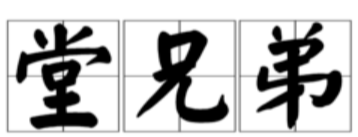
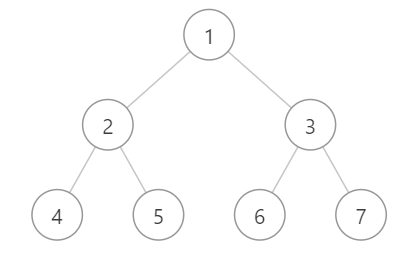

> 原文链接: https://leetcode-cn.com/problems/cousins-in-binary-tree


## 英文原文
<div><p>Given the <code>root</code> of a binary tree with unique values and the values of two different nodes of the tree <code>x</code> and <code>y</code>, return <code>true</code> <em>if the nodes corresponding to the values </em><code>x</code><em> and </em><code>y</code><em> in the tree are <strong>cousins</strong>, or </em><code>false</code><em> otherwise.</em></p>

<p>Two nodes of a binary tree are <strong>cousins</strong> if they have the same depth with different parents.</p>

<p>Note that in a binary tree, the root node is at the depth <code>0</code>, and children of each depth <code>k</code> node are at the depth <code>k + 1</code>.</p>

<p>&nbsp;</p>
<p><strong>Example 1:</strong></p>

<pre>
<strong>Input:</strong> root = [1,2,3,4], x = 4, y = 3
<strong>Output:</strong> false
</pre>

<p><strong>Example 2:</strong></p>

<pre>
<strong>Input:</strong> root = [1,2,3,null,4,null,5], x = 5, y = 4
<strong>Output:</strong> true
</pre>

<p><strong>Example 3:</strong></p>

<pre>
<strong>Input:</strong> root = [1,2,3,null,4], x = 2, y = 3
<strong>Output:</strong> false
</pre>

<p>&nbsp;</p>
<p><strong>Constraints:</strong></p>

<ul>
	<li>The number of nodes in the tree is in the range <code>[2, 100]</code>.</li>
	<li><code>1 &lt;= Node.val &lt;= 100</code></li>
	<li>Each node has a <strong>unique</strong> value.</li>
	<li><code>x != y</code></li>
	<li><code>x</code> and <code>y</code> are exist in the tree.</li>
</ul>
</div>

## 中文题目
<div><p>在二叉树中，根节点位于深度 <code>0</code> 处，每个深度为 <code>k</code> 的节点的子节点位于深度 <code>k+1</code> 处。</p>

<p>如果二叉树的两个节点深度相同，但<strong> 父节点不同</strong> ，则它们是一对<em>堂兄弟节点</em>。</p>

<p>我们给出了具有唯一值的二叉树的根节点 <code>root</code> ，以及树中两个不同节点的值 <code>x</code> 和 <code>y</code> 。</p>

<p>只有与值 <code>x</code> 和 <code>y</code> 对应的节点是堂兄弟节点时，才返回 <code>true</code> 。否则，返回 <code>false</code>。</p>

<p> </p>

<p><strong>示例 1：<br />
</strong></p>

<pre>
<strong>输入：</strong>root = [1,2,3,4], x = 4, y = 3
<strong>输出：</strong>false
</pre>

<p><strong>示例 2：<br />
</strong></p>

<pre>
<strong>输入：</strong>root = [1,2,3,null,4,null,5], x = 5, y = 4
<strong>输出：</strong>true
</pre>

<p><strong>示例 3：</strong></p>

<p><strong></strong></p>

<pre>
<strong>输入：</strong>root = [1,2,3,null,4], x = 2, y = 3
<strong>输出：</strong>false</pre>

<p> </p>

<p><strong>提示：</strong></p>

<ul>
	<li>二叉树的节点数介于 <code>2</code> 到 <code>100</code> 之间。</li>
	<li>每个节点的值都是唯一的、范围为 <code>1</code> 到 <code>100</code> 的整数。</li>
</ul>

<p> </p>
</div>

## 通过代码
<RecoDemo>
</RecoDemo>


## 高赞题解



### 解题思路
这道题目当然用BFS或者DFS都可以做，但是用DFS是不如BFS优雅的。
细节是魔鬼，本题有两个关键点：
1. **深度相同**
2. **父节点不同**

**在确定深度上面，BFS一直很可以的。**
具体思路如下：
因为在BFS中，我们使用的是层序遍历，如果每次遍历一层，那么这一层的元素的深度是相同的。
例子：（第i层深度为i）
{:width=200}
第一层: [1]
第二层：[2,3]
第三层：[4,5,6,7]

因此我们在每一层，看看是否有出现 `x` 和 `y`，其中分为以下三种情况：
1. `x` 和 `y` 都没出现 → 那只能往下一层继续找了
2. `x` 和 `y` 只出现一个 → 两个元素的深度不同，不可能为兄弟，返回`false`
3. **`x` 和 `y` 都出现了，好耶，但是还不够好**
    - `x` 和 `y` 父节点相同 → 不是堂兄弟，是亲兄弟，不行，返回`false`
    - `x` 和 `y` 父节点不同 → 满足题目条件了，好耶，返回`true`


众所周知，BFS需要用到队列，那么我们应该如何设计队列的数据类型？
在这里，我采用了 `pair<TreeNode*, TreeNode*>`（其实`pair<TreeNode*, int>`也可以），其中pair中，第一个元素记录指向**当前结点**的指针，第二个元素记录指向**当前结点的父结点**的指针，这样就可以完美应对上面所说的三种情况了。
### 代码


```cpp
class Solution {
public:
    using PTT = pair<TreeNode*, TreeNode*>;
    bool isCousins(TreeNode* root, int x, int y) {
        // 使用队列q来进行bfs
        // 其中pair中，p.first 记录当前结点的指针，p.second 记录当前结点的父结点的指针
        queue<PTT> q;
        q.push({root, nullptr});
        while(!q.empty()) {
            int n = q.size();
            vector<TreeNode*> rec_parent;
            for(int i = 0; i < n; i++) {
                auto [cur, parent] = q.front(); q.pop();
                if(cur->val == x || cur->val == y)
                    rec_parent.push_back(parent);
                if(cur->left) q.push({cur->left, cur});
                if(cur->right) q.push({cur->right, cur});
            }
            // `x` 和 `y` 都没出现
            if(rec_parent.size() == 0)
                continue;
            // `x` 和 `y` 只出现一个
            else if(rec_parent.size() == 1)
                return false;
            // `x` 和 `y` 都出现了
            else if(rec_parent.size() == 2)
                // `x` 和 `y` 父节点 相同/不相同 ？
                return rec_parent[0] != rec_parent[1];
        }
        return false;
    }
};
```

## 统计信息
| 通过次数 | 提交次数 | AC比率 |
| :------: | :------: | :------: |
|    52534    |    94288    |   55.7%   |

## 提交历史
| 提交时间 | 提交结果 | 执行时间 |  内存消耗  | 语言 |
| :------: | :------: | :------: | :--------: | :--------: |


## 相似题目
|                             题目                             | 难度 |
| :----------------------------------------------------------: | :---------: |
| [二叉树的层序遍历](https://leetcode-cn.com/problems/binary-tree-level-order-traversal/) | 中等|
