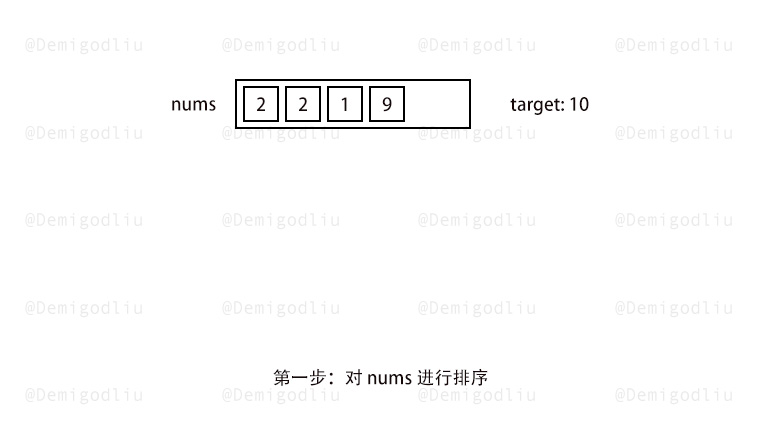
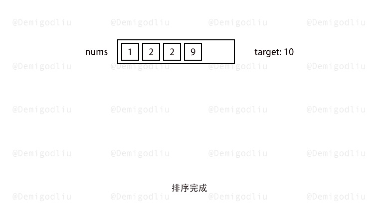
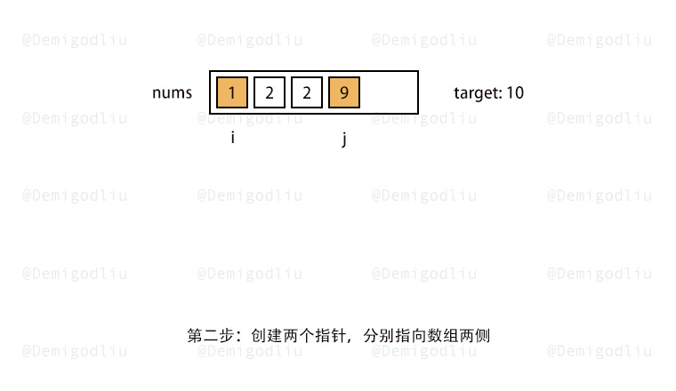
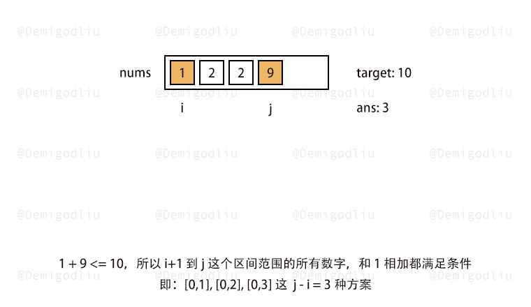
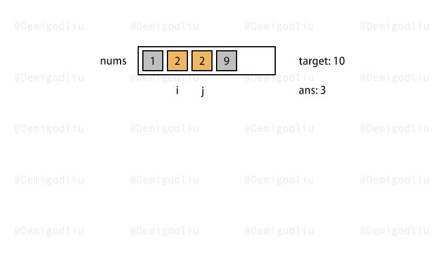
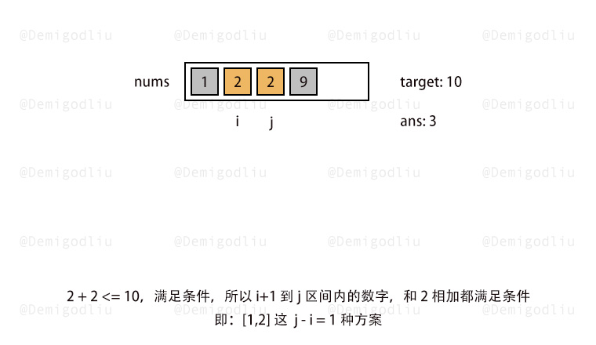
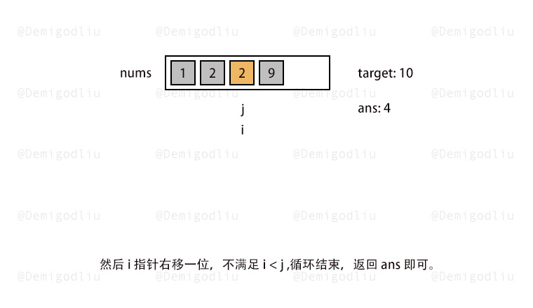

> 原文链接: https://leetcode-cn.com/problems/4xy4Wx


## 英文原文
<div></div>

## 中文题目
<div>小力将 N 个零件的报价存于数组 `nums`。小力预算为 `target`，假定小力仅购买两个零件，要求购买零件的花费不超过预算，请问他有多少种采购方案。

注意：答案需要以 `1e9 + 7 (1000000007)` 为底取模，如：计算初始结果为：`1000000008`，请返回 `1`


**示例 1：**
>输入：`nums = [2,5,3,5], target = 6`
>
>输出：`1`
>
>解释：预算内仅能购买 nums[0] 与 nums[2]。

**示例 2：**
>输入：`nums = [2,2,1,9], target = 10`
>
>输出：`4`
>
>解释：符合预算的采购方案如下：
>nums[0] + nums[1] = 4
>nums[0] + nums[2] = 3
>nums[1] + nums[2] = 3
>nums[2] + nums[3] = 10

**提示：**
- `2 <= nums.length <= 10^5`
- `1 <= nums[i], target <= 10^5`
</div>

## 通过代码
<RecoDemo>
</RecoDemo>


## 高赞题解


---

### 🧠 解题思路

通过分析题意，我们得知其需求很简单，就是在 $nums$ 中找到两个数 $a$ 和 $b$，并且让其满足 $a + b <= target$ 即可！

首先，如果通过双 $for$ 暴破，很显然，会超时的......，别问我怎么知道的哈！！

咳，咳咳...，言归正传，先整个例子便于讲解：

```js
nums：[2，2，1，9]     target: 10
```

首先，获取两个数，求和之后再和某个数做比较，这个题其实和 [剑指 Offer 57. 和为s的两个数字](https://leetcode-cn.com/problems/he-wei-sde-liang-ge-shu-zi-lcof/solution/shuang-zhi-zhen-he-wei-sde-liang-ge-shu-wy7r4/) 极为相似，不知道的小伙伴可以先行看看这道题熟悉一下思路。

首先，为了便于计算，我们先对 $nums$ 做升序排序。

```js
nums：[1，2，2，9]     target: 10
```

然后，创建一个指针 $i$ 指针指向 $nums$ 首位，再创建一个指针 $j$ 指向 $nums$ 末位，然后通过遍历，找到符合 $nums[i] + nums[j] <= target$ 条件的 $i$，$j$ 区间范围。

既然该范围的边界值之和都满足了条件，那么代表该区间内的所有数字和 $nums[i]$ 相加都满足条件，所以，我们可以通过 $j - i$ 来获取到当前有多少个数，可以和 $nums[i]$ 相加后满足条件！

```js
i：0    j：3    nums[0] + nums[3] = 10，满足条件 <= 10

所以，当 i = 0 时，存在 j - i = 3 种方案，即：[0,1],[0,2],[0,3]

------------------------------------------------------------

然后 i 指针右移一位，如下所示：

i：1    j：3    nums[1] + nums[3] = 11，不满足条件 <= 10

------------------------------------------------------------

所以 j 指针左移一位，如下所示：

i：1    j：2    nums[1] + nums[2] = 4，满足条件 <= 10

------------------------------------------------------------

所以，当 i = 1 时，存在 j - i = 1 种方案，即：[1,2]

最后，满足条件的方案总共就是 [0,1],[0,2],[0,3],[1,2] 这 4 种方案！
```

最后，就可以愉快的开整了！！

---

### 🎨 图解演示

<,,,,,,,,>

---

### 🍭 示例代码

```Javascript []
var purchasePlans = function(nums, target) {
    let i = 0, j = nums.length - 1, ans = 0;
    nums.sort((a, b) => a - b);
    while(i < j){
        if(nums[i] + nums[j] > target) j--;
        else {
            ans += j - i;
            i++;
        }
    }
    return ans % 1000000007;
};
```
```Java []
class Solution {
    public int purchasePlans(int[] nums, int target) {
        int mod = 1_000_000_007;
        int ans = 0;
        Arrays.sort(nums);
        int left = 0, right = nums.length - 1;
        while (left < right) {
            if (nums[left] + nums[right] > target) right--;
            else {
                ans += right - left;
                left++;
            }
            ans %= mod;
        }
        return ans % mod;
    }
}
```
```C++ []
class Solution {
public:
    int purchasePlans(vector<int>& nums, int target) {
        long long res = 0;
        long long mod = 1000000007;
        sort(nums.begin(),nums.end());
        int i=0,j = nums.size()-1;
        for(i=0;i<j;i++)
        {
            while(j>i&&nums[i]+nums[j]>target)
            {
                j--;
            }
            res += j-i;
        }
        return res%mod;
    }
};
```
```C []
int comp(const void* a,const void* b){
    return *(int*)a - *(int*)b;
}
int purchasePlans(int* nums, int numsSize, int target){
    long long sum = 0;
    qsort(nums,numsSize,sizeof(int),comp);
    unsigned left = 0,right = numsSize - 1;
    while(left < right){
        if((nums[left] + nums[right]) > target){
            right--;
        }
        else{
            sum += right - left;
            left++;
        }
    }
    return sum%(1000000007);
}
```
```Golang []
func purchasePlans(nums []int, target int) int {
	sort.Ints(nums)
	j := len(nums) - 1
	ans := 0
	for i := 0; i < len(nums); i++ {
		for ; j > i; j-- {
			if nums[i]+nums[j] <= target {
				break
			}
		}
		if j > i {
			ans = ans + (j - i)
		}
	}
	return ans % 1000000007
}
```
```Python3 []
class Solution:
    def purchasePlans(self, nums: List[int], target: int) -> int:
        nums.sort()
        ans = 0
        i = 0
        j = len(nums)-1
        while i < j:
            if nums[i] + nums[j] > target:
                j -= 1
            else:
                ans += (j-i)
                i += 1
        if ans<=1000000007:
            return ans
        else:
            return ans%1000000007
```

---

### 转身挥手

嘿，少年，做图不易，留下个赞或评论再走吧！谢啦~ 💐

差点忘了，祝你牛年大吉 🐮 ，AC 和 Offer 📑 多多益善~

⛲⛲⛲ 期待下次再见~ 

## 统计信息
| 通过次数 | 提交次数 | AC比率 |
| :------: | :------: | :------: |
|    11226    |    39181    |   28.7%   |

## 提交历史
| 提交时间 | 提交结果 | 执行时间 |  内存消耗  | 语言 |
| :------: | :------: | :------: | :--------: | :--------: |
