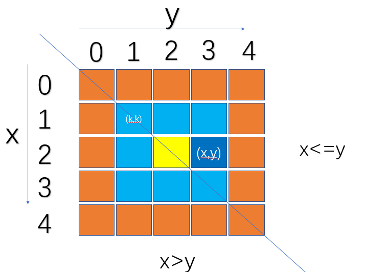

> 原文链接: https://leetcode-cn.com/problems/SNJvJP


## 英文原文
<div></div>

## 中文题目
<div>某乐团的演出场地可视作 `num * num` 的二维矩阵 `grid`（左上角坐标为 `[0,0]`)，每个位置站有一位成员。乐团共有 `9` 种乐器，乐器编号为 `1~9`，每位成员持有 `1` 个乐器。

为保证声乐混合效果，成员站位规则为：自 `grid` 左上角开始顺时针螺旋形向内循环以 `1，2，...，9` 循环重复排列。例如当 num = `5` 时，站位如图所示


请返回位于场地坐标 [`Xpos`,`Ypos`] 的成员所持乐器编号。

**示例 1：**
>输入：`num = 3, Xpos = 0, Ypos = 2`
>
>输出：`3`
>
>解释：


**示例 2：**
>输入：`num = 4, Xpos = 1, Ypos = 2`
>
>输出：`5`
>
>解释：


**提示：**
- `1 <= num <= 10^9`
- `0 <= Xpos, Ypos < num`</div>

## 通过代码
<RecoDemo>
</RecoDemo>


## 高赞题解
**思路：**
1.获取所求点在第几层（此处根据所求点的位置，层数k可能会多算一层）
2.前第`0，1...k`层的数量和 与 所求点相对第k层左上角元素(第k层的入口元素)的**相对路径**做`+`或`-`运算，求得所求点的**绝对路径**（从起始点到所求点经过的长度）


**记：**`k(0,1,2...⌈n/2⌉ `(往上取整))
`C(k)`=第`k`层的方块数目,如图`C(0)=16,C(1)=8,C(2)=1`;
`T(k)`=第`k`层以外（不包括第`k`层）的方块 数目，如图`T(0)=0,T(1)=C(0)=16,T(2)=C(0)+C(1)=16+8=24,T(3)=16+8+1=25;`
但是具体怎么计算呢 可以用补集的思想
`T(k)=n*n-(n-2k)*(n-2k)=4*k*(n-k)`


但是怎么求`(i,j)`点所在层 已经遍历过的数目呢 。(即下图深蓝色的路径长度)
**1.求所在的层数`k`**
`k=min(x,n-1-x,y,n-1-y)`(后续由于要分类讨论，k的求取可以直接通过其中某两个值求最小值即可); 即看该点距离哪个边界更近，所求的最小值就是第几层，如图 `k=min(2,2,3,1)`,即处于第一层。那么我们也就知道了该层以外的橙色数目`T(k)=T(1)=16`。
**2.求所求点`(x,y)`相对该层左上角点的相对路径长度**

**2.1 对于`x<=y`，我们可以知道`dl=(x-k)+(y-k)+1`**
故 绝对路径长度为 `T(k)+dl`


**2.2 但是对于`x>y`呢**
如果我们采用相同的方法，就会导致对称的两个`(i,j)`与`(j,i)`相对路径相同。故才用另外一种方法
在计算层数`k`的时候 多计算一层，再从下一层的入口处回`退dl`个路径
此时绝对路径长度为 `T(k+1)-dl` ,注意`dl`计算时，仍用其真正所处的层数`k'-1=(k+1)-1=k`来计算。即：`dl=(x-(k'-1))+(y-(k'-1))-1`
    
(至于为何此处可直接`-dl`，可以看下图，下一层的入口点与上一层的入口点是右下和左上关系，按照螺旋顺序到`(i,j)`点的路径长度是相同的。)


最后， 就是把相应的路径长度`len`转化为`1-9`的数字即可，`index=(len-1)%9+1`。

*当然此题也可拓展到`m*n`型的矩阵，最后一圈应该是一条线。`n*n`可以看作是`m*n`的特例，对于`n`为奇数的情况，一条线压缩成了一个点。*
（注：本题思路来自网络文章，非原创，聊作整理，供大家交流学习）

```c++ []
class Solution {
public:
    int orchestraLayout(int num, int xPos, int yPos) {
        long long x=xPos,y=yPos,n=num;
        if  (x <= y) {
            long long  k= min(x, n-1-y);
            return  (4*k*(n-k)+1+(x+y-k*2)-1)%9+1;
        }
        long long  kp =min(y, n-1-x)+1 ; 
        return   (4*kp*(n-kp)+1-(x+y-(kp-1)*2)-1)%9+1;
    }
};
```
```python3 []
class Solution(object):
    def orchestraLayout(self, n, x, y):
        if  x <= y :
            k= min(x, n-1-y)
            return  (4*k*(n-k)+1+(x+y-k*2)-1)%9+1
        kp =min(y, n-1-x)+1 
        return  (4*kp*(n-kp)+1-(x+y-(kp-1)*2)-1)%9+1
```


## 统计信息
| 通过次数 | 提交次数 | AC比率 |
| :------: | :------: | :------: |
|    5488    |    28744    |   19.1%   |

## 提交历史
| 提交时间 | 提交结果 | 执行时间 |  内存消耗  | 语言 |
| :------: | :------: | :------: | :--------: | :--------: |
