> 原文链接: https://leetcode-cn.com/problems/shu-zu-zhong-zhong-fu-de-shu-zi-lcof


## 中文题目
<div><p>找出数组中重复的数字。</p>

<p><br>
在一个长度为 n 的数组 nums 里的所有数字都在 0～n-1 的范围内。数组中某些数字是重复的，但不知道有几个数字重复了，也不知道每个数字重复了几次。请找出数组中任意一个重复的数字。</p>

<p><strong>示例 1：</strong></p>

<pre><strong>输入：</strong>
[2, 3, 1, 0, 2, 5, 3]
<strong>输出：</strong>2 或 3 
</pre>

<p>&nbsp;</p>

<p><strong>限制：</strong></p>

<p><code>2 &lt;= n &lt;= 100000</code></p>
</div>

## 通过代码
<RecoDemo>
</RecoDemo>


## 高赞题解
#### 方法一：哈希表 / Set

利用数据结构特点，容易想到使用哈希表（Set）记录数组的各个数字，当查找到重复数字则直接返回。

##### 算法流程：

1. 初始化： 新建 HashSet ，记为 $dic$ ；
2. 遍历数组 $nums$ 中的每个数字 $num$ ：
   1. 当 $num$ 在 $dic$ 中，说明重复，直接返回 $num$ ；
   2. 将 $num$ 添加至 $dic$ 中；
3. 返回 $-1$ 。本题中一定有重复数字，因此这里返回多少都可以。

##### 复杂度分析：

- **时间复杂度 $O(N)$ ：** 遍历数组使用 $O(N)$ ，HashSet 添加与查找元素皆为 $O(1)$ 。
- **空间复杂度 $O(N)$ ：** HashSet 占用 $O(N)$ 大小的额外空间。

<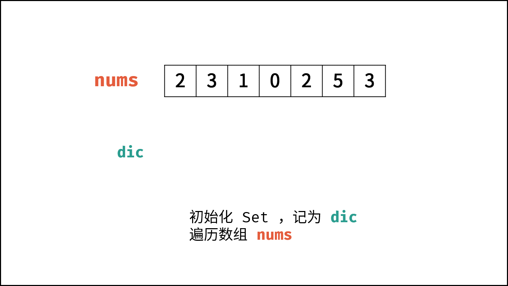,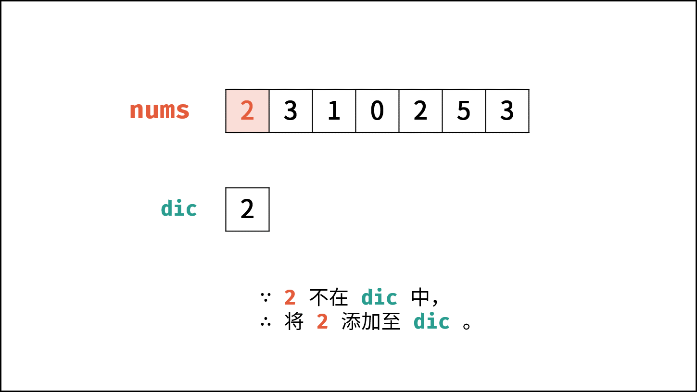,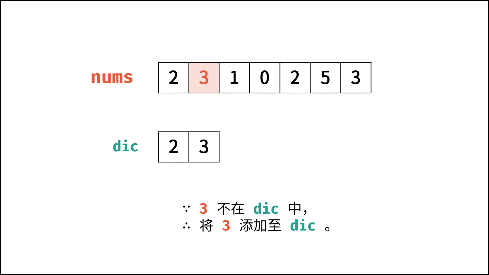,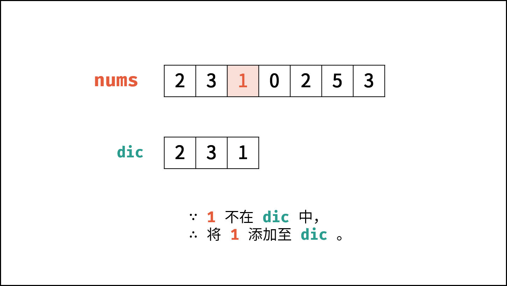,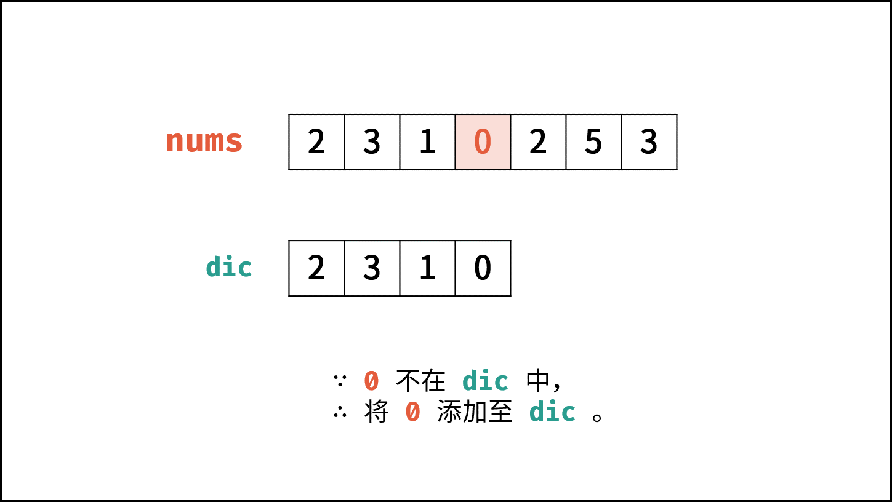,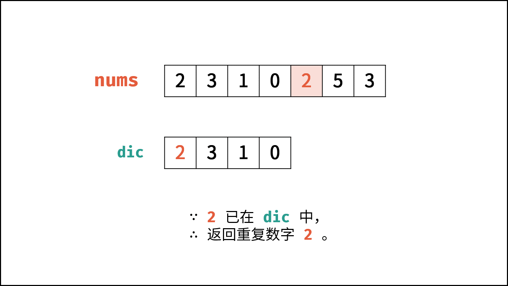>

##### 代码：

```Python []
class Solution:
    def findRepeatNumber(self, nums: [int]) -> int:
        dic = set()
        for num in nums:
            if num in dic: return num
            dic.add(num)
        return -1
```

```Java []
class Solution {
    public int findRepeatNumber(int[] nums) {
        Set<Integer> dic = new HashSet<>();
        for(int num : nums) {
            if(dic.contains(num)) return num;
            dic.add(num);
        }
        return -1;
    }
}
```

```C++ []
class Solution {
public:
    int findRepeatNumber(vector<int>& nums) {
        unordered_map<int, bool> map;
        for(int num : nums) {
            if(map[num]) return num;
            map[num] = true;
        }
        return -1;
    }
};
```

#### 方法二：原地交换

题目说明尚未被充分使用，即 `在一个长度为 n 的数组 nums 里的所有数字都在 0 ~ n-1 的范围内` 。 此说明含义：数组元素的 **索引** 和 **值** 是 **一对多** 的关系。
因此，可遍历数组并通过交换操作，使元素的 **索引** 与 **值** 一一对应（即 $nums[i] = i$ ）。因而，就能通过索引映射对应的值，起到与字典等价的作用。

{:width=500}

遍历中，第一次遇到数字 $x$ 时，将其交换至索引 $x$ 处；而当第二次遇到数字 $x$ 时，一定有 $nums[x] = x$ ，此时即可得到一组重复数字。

##### 算法流程：

1. 遍历数组 $nums$ ，设索引初始值为 $i = 0$ :
   1. **若 $nums[i] = i$ ：** 说明此数字已在对应索引位置，无需交换，因此跳过；
   2. **若 $nums[nums[i]] = nums[i]$ ：** 代表索引 $nums[i]$ 处和索引 $i$ 处的元素值都为 $nums[i]$ ，即找到一组重复值，返回此值 $nums[i]$ ；
   3. **否则：** 交换索引为 $i$ 和 $nums[i]$ 的元素值，将此数字交换至对应索引位置。

2. 若遍历完毕尚未返回，则返回 $-1$ 。

##### 复杂度分析：

- **时间复杂度 $O(N)$ ：** 遍历数组使用 $O(N)$ ，每轮遍历的判断和交换操作使用 $O(1)$ 。
- **空间复杂度 $O(1)$ ：** 使用常数复杂度的额外空间。

<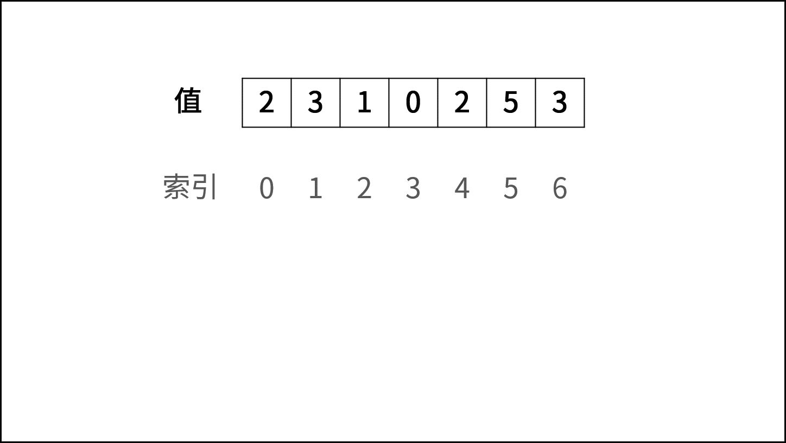,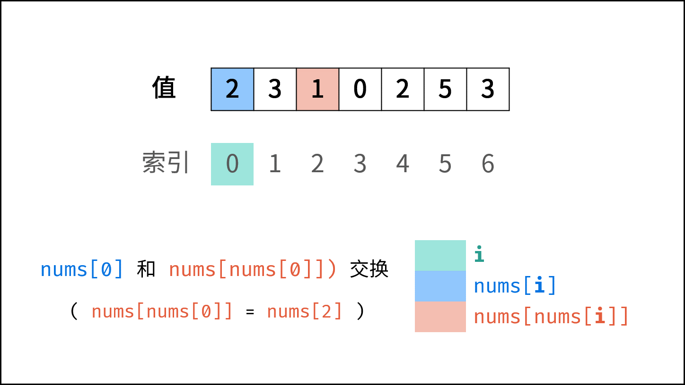,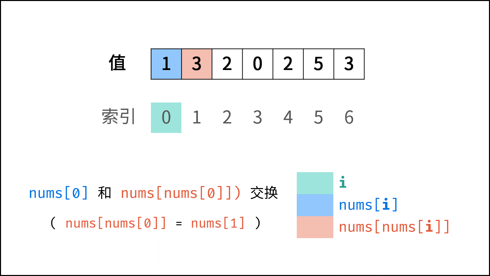,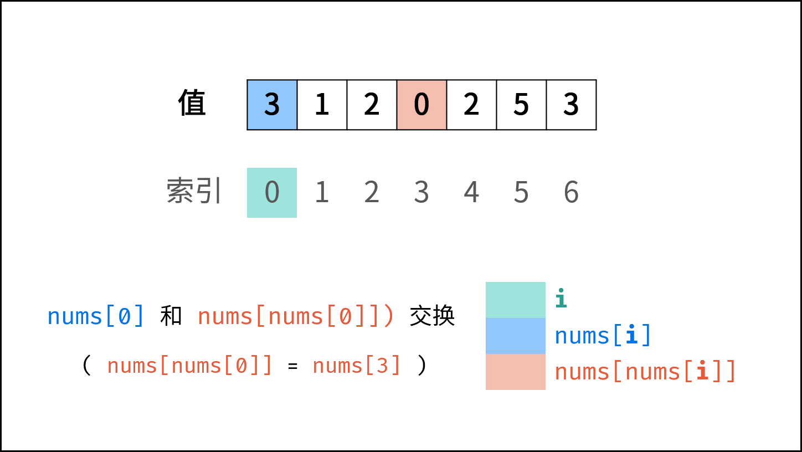,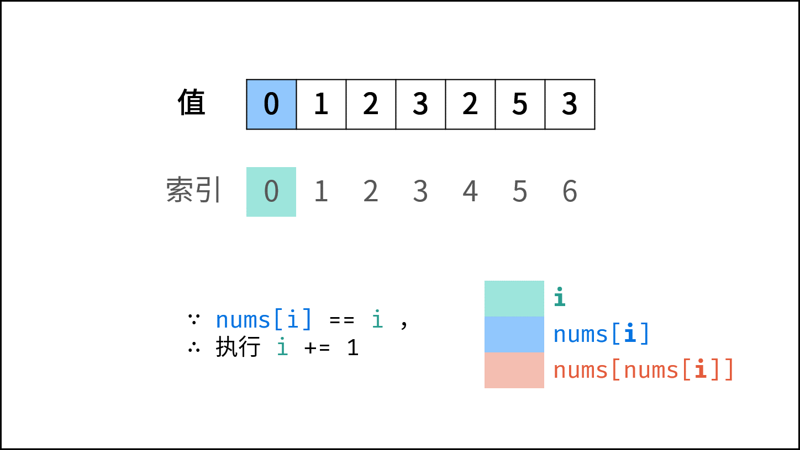,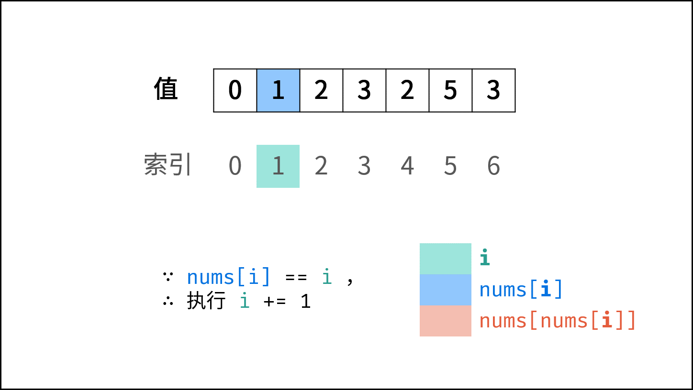,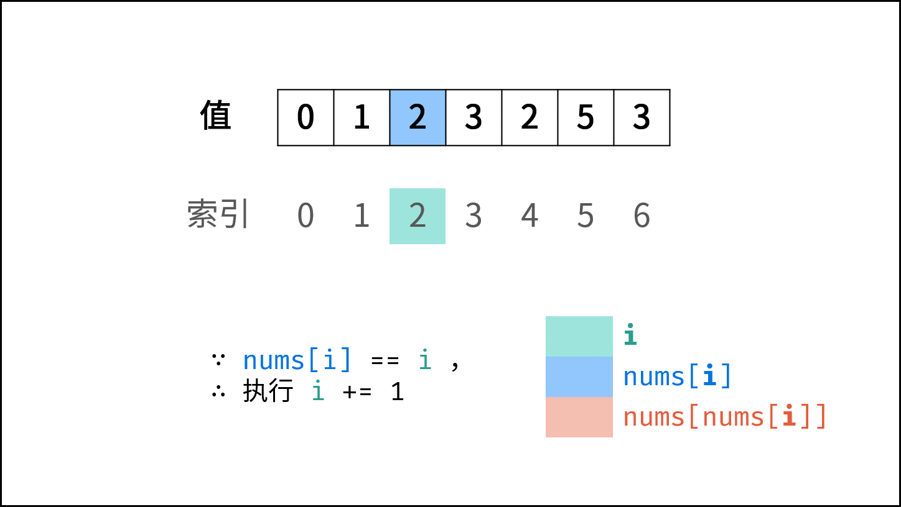,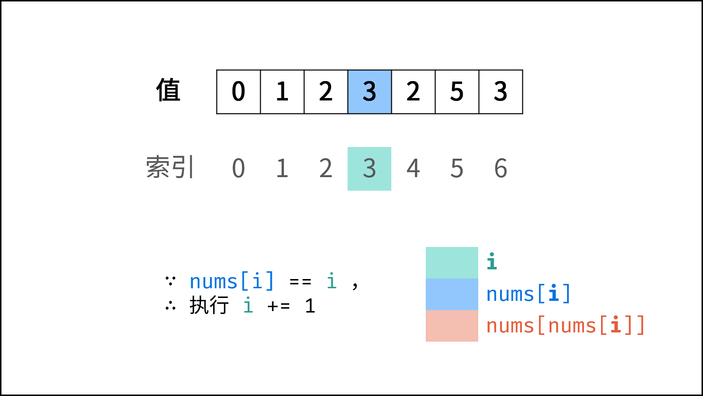,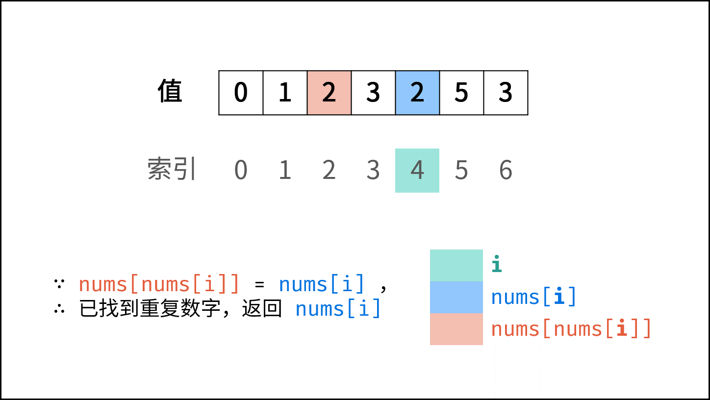>

##### 代码：

Python 中， $a, b = c, d$ 操作的原理是先暂存元组 $(c, d)$ ，然后 “按左右顺序” 赋值给 a 和 b 。
因此，若写为 $nums[i], nums[nums[i]] = nums[nums[i]], nums[i]$ ，则 $nums[i]$ 会先被赋值，之后 $nums[nums[i]]$ 指向的元素则会出错。

```Python []
class Solution:
    def findRepeatNumber(self, nums: [int]) -> int:
        i = 0
        while i < len(nums):
            if nums[i] == i:
                i += 1
                continue
            if nums[nums[i]] == nums[i]: return nums[i]
            nums[nums[i]], nums[i] = nums[i], nums[nums[i]]
        return -1
```

```Java []
class Solution {
    public int findRepeatNumber(int[] nums) {
        int i = 0;
        while(i < nums.length) {
            if(nums[i] == i) {
                i++;
                continue;
            }
            if(nums[nums[i]] == nums[i]) return nums[i];
            int tmp = nums[i];
            nums[i] = nums[tmp];
            nums[tmp] = tmp;
        }
        return -1;
    }
}
```

```C++ []
class Solution {
public:
    int findRepeatNumber(vector<int>& nums) {
        int i = 0;
        while(i < nums.size()) {
            if(nums[i] == i) {
                i++;
                continue;
            }
            if(nums[nums[i]] == nums[i])
                return nums[i];
            swap(nums[i],nums[nums[i]]);
        }
        return -1;
    }
};
```

## 统计信息
| 通过次数 | 提交次数 | AC比率 |
| :------: | :------: | :------: |
|    431674    |    636364    |   67.8%   |

## 提交历史
| 提交时间 | 提交结果 | 执行时间 |  内存消耗  | 语言 |
| :------: | :------: | :------: | :--------: | :--------: |
