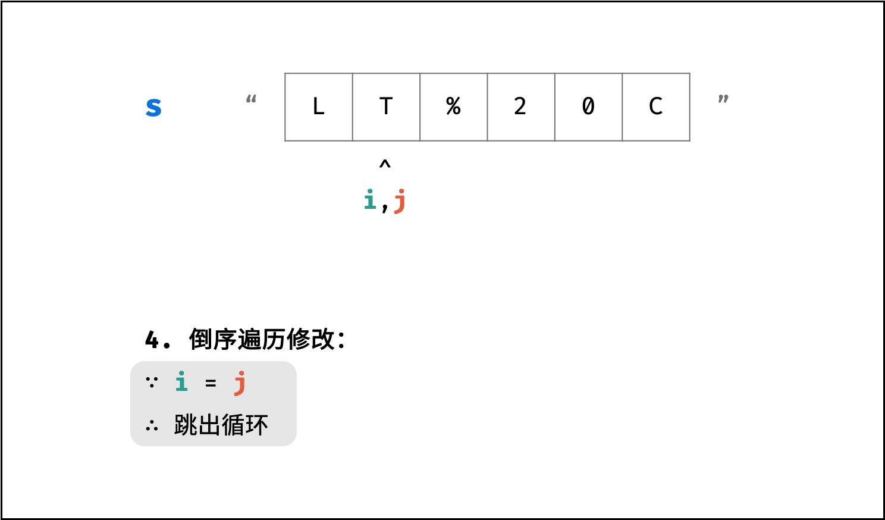

> 原文链接: https://leetcode-cn.com/problems/ti-huan-kong-ge-lcof


## 中文题目
<div><p>请实现一个函数，把字符串 <code>s</code> 中的每个空格替换成&quot;%20&quot;。</p>

<p>&nbsp;</p>

<p><strong>示例 1：</strong></p>

<pre><strong>输入：</strong>s = &quot;We are happy.&quot;
<strong>输出：</strong>&quot;We%20are%20happy.&quot;</pre>

<p>&nbsp;</p>

<p><strong>限制：</strong></p>

<p><code>0 &lt;= s 的长度 &lt;= 10000</code></p>
</div>

## 通过代码
<RecoDemo>
</RecoDemo>


## 高赞题解
#### 方法一：遍历添加

在 Python 和 Java 等语言中，字符串都被设计成「不可变」的类型，即无法直接修改字符串的某一位字符，需要新建一个字符串实现。

##### 算法流程：

1. 初始化一个 list (Python) / StringBuilder (Java) ，记为 `res` ；
2. 遍历列表 `s` 中的每个字符 `c` ：
    - 当 `c` 为空格时：向 `res` 后添加字符串 "%20" ；
    - 当 `c` 不为空格时：向 `res` 后添加字符 `c` ；
3. 将列表 `res` 转化为字符串并返回。

##### 复杂度分析：

- **时间复杂度 $O(N)$ ：** 遍历使用 $O(N)$ ，每轮添加（修改）字符操作使用 $O(1)$ ；
- **空间复杂度 $O(N)$ ：** Python 新建的 list 和 Java 新建的 StringBuilder 都使用了线性大小的额外空间。

<,,,,>

#### 代码：

```Python []
class Solution:
    def replaceSpace(self, s: str) -> str:
        res = []
        for c in s:
            if c == ' ': res.append("%20")
            else: res.append(c)
        return "".join(res)
```

```Java []
class Solution {
    public String replaceSpace(String s) {
        StringBuilder res = new StringBuilder();
        for(Character c : s.toCharArray())
        {
            if(c == ' ') res.append("%20");
            else res.append(c);
        }
        return res.toString();
    }
}
```

#### 方法二：原地修改

在 C++ 语言中， string 被设计成「可变」的类型（[参考资料](https://stackoverflow.com/questions/28442719/are-c-strings-mutable-unlike-java-strings)），因此可以在不新建字符串的情况下实现原地修改。

由于需要将空格替换为 "%20" ，字符串的总字符数增加，因此需要扩展原字符串 s 的长度，计算公式为：`新字符串长度 = 原字符串长度 + 2 * 空格个数` ，示例如下图所示。

{:width=450}

##### 算法流程：

1. 初始化：空格数量 `count` ，字符串 `s` 的长度 `len` ；
2. 统计空格数量：遍历 `s` ，遇空格则 `count++` ；
3. 修改 `s` 长度：添加完 "%20" 后的字符串长度应为 `len + 2 * count` ；
4. 倒序遍历修改：`i` 指向原字符串尾部元素， `j` 指向新字符串尾部元素；当 `i = j` 时跳出（代表左方已没有空格，无需继续遍历）；
    - 当 `s[i]` 不为空格时：执行 `s[j] = s[i]` ；
    - 当 `s[i]` 为空格时：将字符串闭区间 `[j-2, j]` 的元素修改为 "%20" ；由于修改了 3 个元素，因此需要 `j -= 2` ；
5. 返回值：已修改的字符串 `s` ；

<,,,,,,,,>

##### 复杂度分析：

- **时间复杂度 $O(N)$ ：** 遍历统计、遍历修改皆使用 $O(N)$ 时间。
- **空间复杂度 $O(1)$ ：** 由于是原地扩展 `s` 长度，因此使用 $O(1)$ 额外空间。

```C++ []
class Solution {
public:
    string replaceSpace(string s) {
        int count = 0, len = s.size();
        // 统计空格数量
        for (char c : s) {
            if (c == ' ') count++;
        }
        // 修改 s 长度
        s.resize(len + 2 * count);
        // 倒序遍历修改
        for(int i = len - 1, j = s.size() - 1; i < j; i--, j--) {
            if (s[i] != ' ')
                s[j] = s[i];
            else {
                s[j - 2] = '%';
                s[j - 1] = '2';
                s[j] = '0';
                j -= 2;
            }
        }
        return s;
    }
};
```

## 统计信息
| 通过次数 | 提交次数 | AC比率 |
| :------: | :------: | :------: |
|    318051    |    418428    |   76.0%   |

## 提交历史
| 提交时间 | 提交结果 | 执行时间 |  内存消耗  | 语言 |
| :------: | :------: | :------: | :--------: | :--------: |
