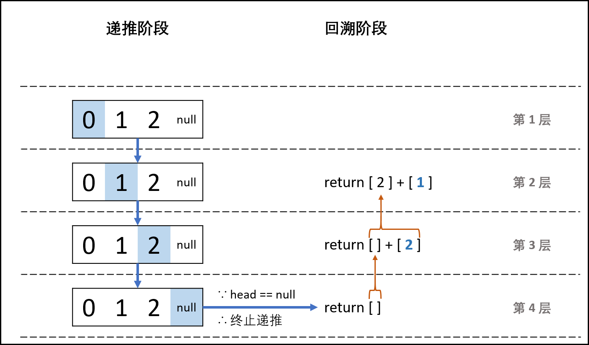
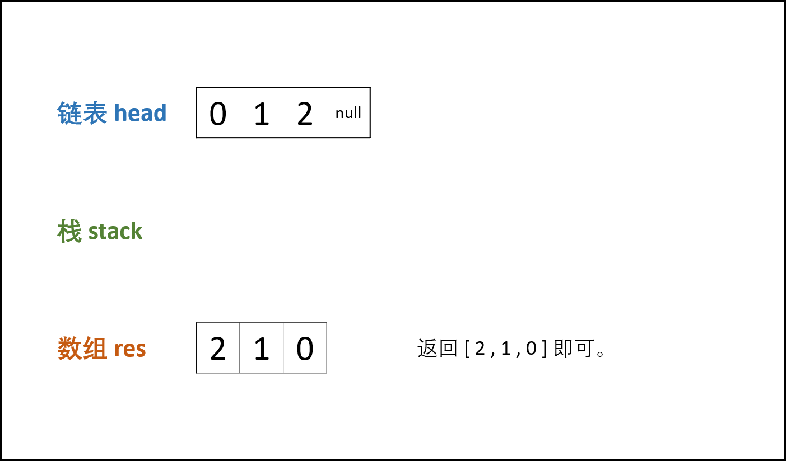

> 原文链接: https://leetcode-cn.com/problems/cong-wei-dao-tou-da-yin-lian-biao-lcof


## 中文题目
<div><p>输入一个链表的头节点，从尾到头反过来返回每个节点的值（用数组返回）。</p>

<p>&nbsp;</p>

<p><strong>示例 1：</strong></p>

<pre><strong>输入：</strong>head = [1,3,2]
<strong>输出：</strong>[2,3,1]</pre>

<p>&nbsp;</p>

<p><strong>限制：</strong></p>

<p><code>0 &lt;= 链表长度 &lt;= 10000</code></p>
</div>

## 通过代码
<RecoDemo>
</RecoDemo>


## 高赞题解
### 方法一：递归法

#### 解题思路：

> **利用递归：** 先走至链表末端，回溯时依次将节点值加入列表 ，这样就可以实现链表值的倒序输出。

- **Python 算法流程：**
  1. **递推阶段：** 每次传入 `head.next` ，以 `head == None`（即走过链表尾部节点）为递归终止条件，此时返回空列表 `[]` 。
  2. **回溯阶段：** 利用 Python 语言特性，递归回溯时每次返回 `当前 list + 当前节点值 [head.val] `，即可实现节点的倒序输出。

- **Java 算法流程：**
  1. **递推阶段：** 每次传入 `head.next` ，以 `head == null`（即走过链表尾部节点）为递归终止条件，此时直接返回。
  2. **回溯阶段：** 层层回溯时，将当前节点值加入列表，即`tmp.add(head.val)`。
  3. 最终，将列表 `tmp` 转化为数组 `res` ，并返回即可。

#### 复杂度分析：
- **时间复杂度 $O(N)$：** 遍历链表，递归 $N$ 次。
- **空间复杂度 $O(N)$：** 系统递归需要使用 $O(N)$ 的栈空间。

> 图解以 Python 代码为例， Java 原理一致，只是把利用返回值改为 `add()` 操作。

<,,,,,,,,,>

#### 代码：

```python []
class Solution:
    def reversePrint(self, head: ListNode) -> List[int]:
        return self.reversePrint(head.next) + [head.val] if head else []
```

```java []
class Solution {
    ArrayList<Integer> tmp = new ArrayList<Integer>();
    public int[] reversePrint(ListNode head) {
        recur(head);
        int[] res = new int[tmp.size()];
        for(int i = 0; i < res.length; i++)
            res[i] = tmp.get(i);
        return res;
    }
    void recur(ListNode head) {
        if(head == null) return;
        recur(head.next);
        tmp.add(head.val);
    }
}
```

### 方法二：辅助栈法

#### 解题思路：

> **链表特点：** 只能从前至后访问每个节点。 
> **题目要求：** 倒序输出节点值。
> 这种 **先入后出** 的需求可以借助 **栈** 来实现。

- **算法流程：**
  1. **入栈：** 遍历链表，将各节点值 `push` 入栈。（Python​ 使用 `append()` 方法，​Java​借助 `LinkedList` 的`addLast()`方法）。
  2. **出栈：** 将各节点值 `pop` 出栈，存储于数组并返回。（Python​ 直接返回 `stack` 的倒序列表，Java ​新建一个数组，通过 `popLast()` 方法将各元素存入数组，实现倒序输出）。

#### 复杂度分析：

- **时间复杂度 $O(N)$：** 入栈和出栈共使用 $O(N)$ 时间。
- **空间复杂度 $O(N)$：** 辅助栈 `stack` 和数组 `res` 共使用 $O(N)$ 的额外空间。
 
> 图解以 Java 代码为例，Python 无需将 `stack` 转移至 `res`，而是直接返回倒序数组。

<,,,,,,,>

#### 代码：

```python []
class Solution:
    def reversePrint(self, head: ListNode) -> List[int]:
        stack = []
        while head:
            stack.append(head.val)
            head = head.next
        return stack[::-1]
```

```java []
class Solution {
    public int[] reversePrint(ListNode head) {
        LinkedList<Integer> stack = new LinkedList<Integer>();
        while(head != null) {
            stack.addLast(head.val);
            head = head.next;
        }
        int[] res = new int[stack.size()];
        for(int i = 0; i < res.length; i++)
            res[i] = stack.removeLast();
    return res;
    }
}
```

## 统计信息
| 通过次数 | 提交次数 | AC比率 |
| :------: | :------: | :------: |
|    332746    |    443676    |   75.0%   |

## 提交历史
| 提交时间 | 提交结果 | 执行时间 |  内存消耗  | 语言 |
| :------: | :------: | :------: | :--------: | :--------: |
