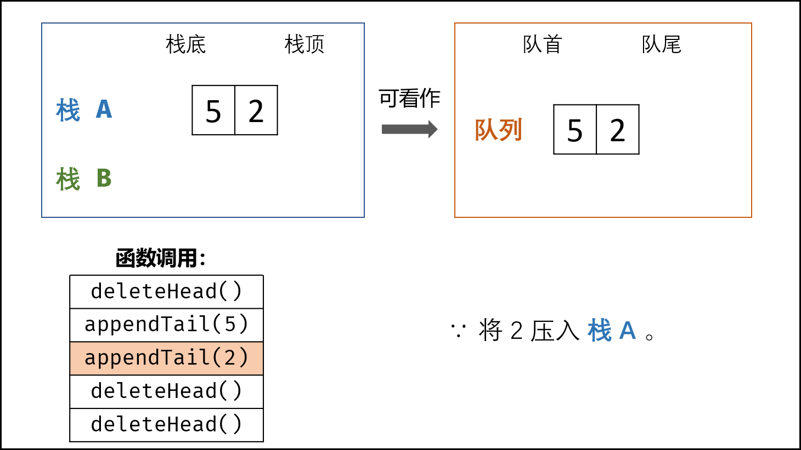

> 原文链接: https://leetcode-cn.com/problems/yong-liang-ge-zhan-shi-xian-dui-lie-lcof


## 中文题目
<div><p>用两个栈实现一个队列。队列的声明如下，请实现它的两个函数 <code>appendTail</code> 和 <code>deleteHead</code> ，分别完成在队列尾部插入整数和在队列头部删除整数的功能。(若队列中没有元素，<code>deleteHead</code>&nbsp;操作返回 -1 )</p>

<p>&nbsp;</p>

<p><strong>示例 1：</strong></p>

<pre><strong>输入：</strong>
[&quot;CQueue&quot;,&quot;appendTail&quot;,&quot;deleteHead&quot;,&quot;deleteHead&quot;]
[[],[3],[],[]]
<strong>输出：</strong>[null,null,3,-1]
</pre>

<p><strong>示例 2：</strong></p>

<pre><strong>输入：</strong>
[&quot;CQueue&quot;,&quot;deleteHead&quot;,&quot;appendTail&quot;,&quot;appendTail&quot;,&quot;deleteHead&quot;,&quot;deleteHead&quot;]
[[],[],[5],[2],[],[]]
<strong>输出：</strong>[null,-1,null,null,5,2]
</pre>

<p><strong>提示：</strong></p>

<ul>
	<li><code>1 &lt;= values &lt;= 10000</code></li>
	<li><code>最多会对&nbsp;appendTail、deleteHead 进行&nbsp;10000&nbsp;次调用</code></li>
</ul>
</div>

## 通过代码
<RecoDemo>
</RecoDemo>


## 高赞题解
#### 解题思路：

- **栈无法实现队列功能：** 栈底元素（对应队首元素）无法直接删除，需要将上方所有元素出栈。
- **双栈可实现列表倒序：** 设有含三个元素的栈 $A = [1,2,3]$ 和空栈 $B = []$。若循环执行 $A$ 元素出栈并添加入栈 $B$ ，直到栈 $A$ 为空，则 $A = []$ , $B = [3,2,1]$ ，即 **栈 $B$ 元素实现栈 $A$ 元素倒序** 。
- **利用栈 $B$ 删除队首元素：** 倒序后，$B$ 执行出栈则相当于删除了 $A$ 的栈底元素，即对应队首元素。

{:width=500}

##### 函数设计：

> 题目只要求实现 **加入队尾**`appendTail()` 和 **删除队首**`deleteHead()` 两个函数的正常工作，因此我们可以设计栈 `A` 用于加入队尾操作，栈 `B` 用于将元素倒序，从而实现删除队首元素。

- **加入队尾 `appendTail()`函数：** 将数字 `val` 加入栈 `A` 即可。
- **删除队首`deleteHead()`函数：** 有以下三种情况。
    1. **当栈 `B` 不为空：** `B`中仍有已完成倒序的元素，因此直接返回 `B` 的栈顶元素。
    2. **否则，当 `A` 为空：** 即两个栈都为空，无元素，因此返回 $-1$ 。
    3. **否则：** 将栈 `A` 元素全部转移至栈 `B` 中，实现元素倒序，并返回栈 `B` 的栈顶元素。

<,,,,,,,>

##### 复杂度分析：

> 由于问题特殊，以下分析仅满足添加 $N$ 个元素并删除 $N$ 个元素，即栈初始和结束状态下都为空的情况。

- **时间复杂度：** `appendTail()`函数为 $O(1)$ ；`deleteHead()` 函数在 $N$ 次队首元素删除操作中总共需完成 $N$ 个元素的倒序。
- **空间复杂度 $O(N)$ ：** 最差情况下，栈 `A` 和 `B` 共保存 $N$ 个元素。

#### 代码：

```python []
class CQueue:
    def __init__(self):
        self.A, self.B = [], []

    def appendTail(self, value: int) -> None:
        self.A.append(value)

    def deleteHead(self) -> int:
        if self.B: return self.B.pop()
        if not self.A: return -1
        while self.A:
            self.B.append(self.A.pop())
        return self.B.pop()
```

```java []
class CQueue {
    LinkedList<Integer> A, B;
    public CQueue() {
        A = new LinkedList<Integer>();
        B = new LinkedList<Integer>();
    }
    public void appendTail(int value) {
        A.addLast(value);
    }
    public int deleteHead() {
        if(!B.isEmpty()) return B.removeLast();
        if(A.isEmpty()) return -1;
        while(!A.isEmpty())
            B.addLast(A.removeLast());
        return B.removeLast();
    }
}
```

## 统计信息
| 通过次数 | 提交次数 | AC比率 |
| :------: | :------: | :------: |
|    294890    |    413200    |   71.4%   |

## 提交历史
| 提交时间 | 提交结果 | 执行时间 |  内存消耗  | 语言 |
| :------: | :------: | :------: | :--------: | :--------: |
