> 原文链接: https://leetcode-cn.com/problems/qing-wa-tiao-tai-jie-wen-ti-lcof


## 中文题目
<div><p>一只青蛙一次可以跳上1级台阶，也可以跳上2级台阶。求该青蛙跳上一个 <code>n</code>&nbsp;级的台阶总共有多少种跳法。</p>

<p>答案需要取模 1e9+7（1000000007），如计算初始结果为：1000000008，请返回 1。</p>

<p><strong>示例 1：</strong></p>

<pre><strong>输入：</strong>n = 2
<strong>输出：</strong>2
</pre>

<p><strong>示例 2：</strong></p>

<pre><strong>输入：</strong>n = 7
<strong>输出：</strong>21
</pre>

<p><strong>示例 3：</strong></p>

<pre><strong>输入：</strong>n = 0
<strong>输出：</strong>1</pre>

<p><strong>提示：</strong></p>

<ul>
	<li><code>0 &lt;= n &lt;= 100</code></li>
</ul>

<p>注意：本题与主站 70 题相同：<a href="https://leetcode-cn.com/problems/climbing-stairs/">https://leetcode-cn.com/problems/climbing-stairs/</a></p>

<p>&nbsp;</p>
</div>

## 通过代码
<RecoDemo>
</RecoDemo>


## 高赞题解
#### 解题思路：

> 此类求 *多少种可能性* 的题目一般都有 **递推性质** ，即 $f(n)$ 和 $f(n-1)$…$f(1)$ 之间是有联系的。

- 设跳上 $n$ 级台阶有 $f(n)$ 种跳法。在所有跳法中，青蛙的最后一步只有两种情况： **跳上 $1$ 级或 $2$ 级台阶**。
  1. **当为 $1$ 级台阶：** 剩 $n-1$ 个台阶，此情况共有 $f(n-1)$ 种跳法；
  2. **当为 $2$ 级台阶：** 剩 $n-2$ 个台阶，此情况共有 $f(n-2)$ 种跳法。
- $f(n)$ 为以上两种情况之和，即 $f(n)=f(n-1)+f(n-2)$ ，以上递推性质为斐波那契数列。本题可转化为 **求斐波那契数列第 $n$ 项的值** ，与 [面试题10- I. 斐波那契数列](https://leetcode-cn.com/problems/fei-bo-na-qi-shu-lie-lcof/solution/mian-shi-ti-10-i-fei-bo-na-qi-shu-lie-dong-tai-gui/) 等价，唯一的不同在于起始数字不同。
  - 青蛙跳台阶问题： $f(0)=1$ ,  $f(1)=1$ , $f(2)=2$ ；
  - 斐波那契数列问题： $f(0)=0$ , $f(1)=1$ , $f(2)=1$ 。

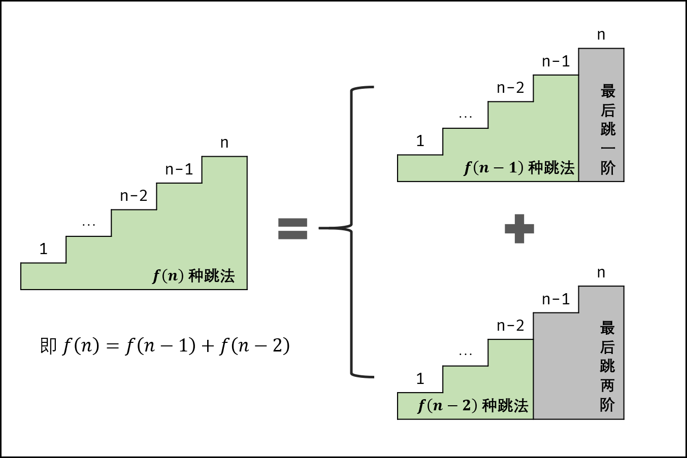{:width=500}{:align=center}

> 斐波那契数列的定义是 $f(n + 1) = f(n) + f(n - 1)$ ，生成第 $n$ 项的做法有以下几种：
> 1. **递归法：**
>    - **原理：** 把 $f(n)$ 问题的计算拆分成 $f(n-1)$ 和 $f(n-2)$ 两个子问题的计算，并递归，以 $f(0)$ 和 $f(1)$ 为终止条件。
>    - **缺点：** 大量重复的递归计算，例如 $f(n)$ 和 $f(n - 1)$ 两者向下递归都需要计算 $f(n - 2)$ 的值。
> 2. **记忆化递归法：**
>    - **原理：** 在递归法的基础上，新建一个长度为 $n$ 的数组，用于在递归时存储 $f(0)$ 至 $f(n)$ 的数字值，重复遇到某数字时则直接从数组取用，避免了重复的递归计算。
>    - **缺点：** 记忆化存储的数组需要使用 $O(N)$ 的额外空间。
> 3. **动态规划：**
>    - **原理：** 以斐波那契数列性质 $f(n + 1) = f(n) + f(n - 1)$ 为转移方程。
>    - 从计算效率、空间复杂度上看，动态规划是本题的最佳解法。

**动态规划解析：**

- **状态定义：** 设 $dp$ 为一维数组，其中 $dp[i]$ 的值代表 `斐波那契数列第 $i$ 个数字` 。
- **转移方程：** $dp[i + 1] = dp[i] + dp[i - 1]$ ，即对应数列定义 $f(n + 1) = f(n) + f(n - 1)$ ；
- **初始状态：** $dp[0] = 1$, $dp[1] = 1$ ，即初始化前两个数字；
- **返回值：** $dp[n]$ ，即斐波那契数列的第 $n$ 个数字。

**空间复杂度优化：**

> 若新建长度为 $n$ 的 $dp$ 列表，则空间复杂度为 $O(N)$ 。
- 由于 $dp$ 列表第 $i$ 项只与第 $i-1$ 和第 $i-2$ 项有关，因此只需要初始化三个整形变量 `sum`, `a`, `b` ，利用辅助变量 $sum$ 使 $a, b$ 两数字交替前进即可 *（具体实现见代码）* 。
- 因为节省了 $dp$ 列表空间，因此空间复杂度降至 $O(1)$ 。

**循环求余法：**

> **大数越界：** 随着 $n$ 增大, $f(n)$ 会超过 `Int32` 甚至 `Int64` 的取值范围，导致最终的返回值错误。 
- **求余运算规则：** 设正整数 $x, y, p$ ，求余符号为 $\odot$ ，则有 $(x + y) \odot p = (x \odot p + y \odot p) \odot p$ 。
- **解析：** 根据以上规则，可推出 $f(n) \odot p = [f(n-1) \odot p + f(n-2) \odot p] \odot p$ ，从而可以在循环过程中每次计算 $sum = a + b \odot 1000000007$ ，此操作与最终返回前取余等价。

> 图解基于 Java 代码绘制，Python 由于语言特性可以省去 $sum$ 辅助变量和大数越界处理。

<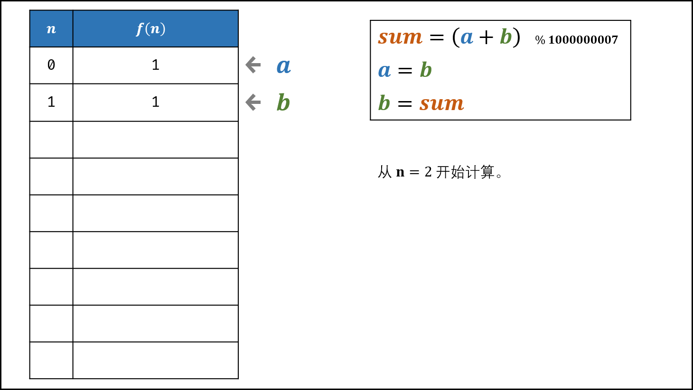,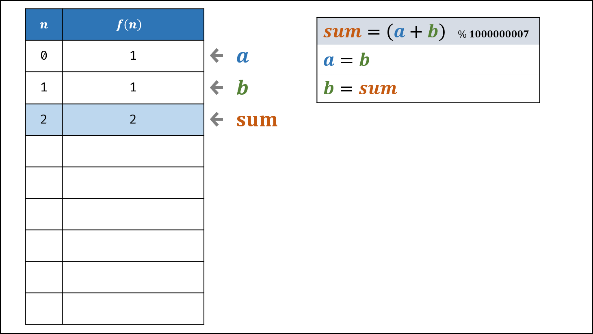,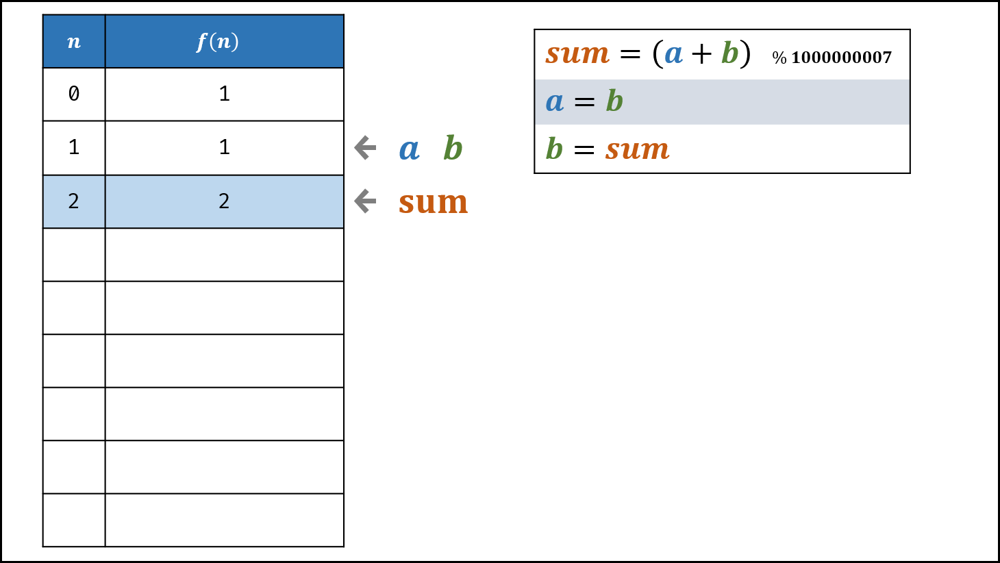,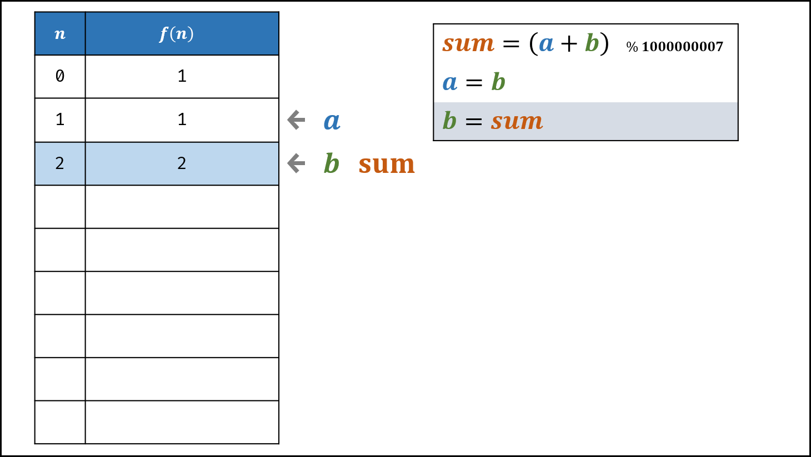,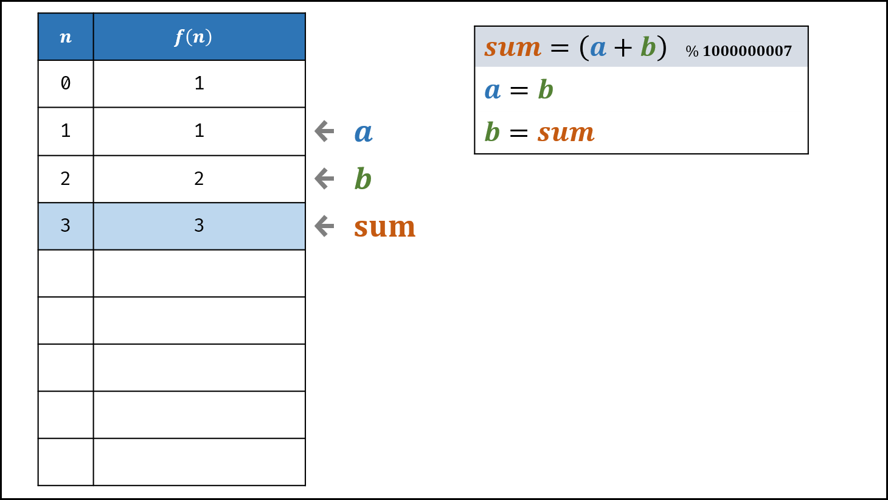,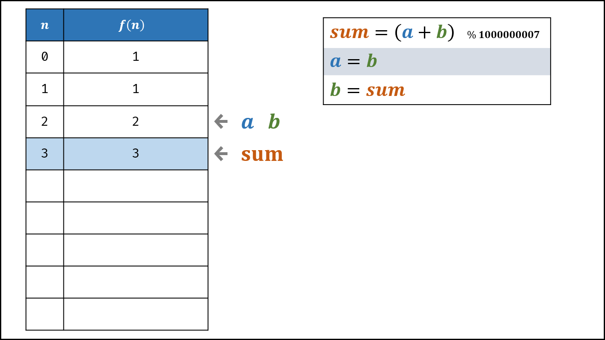,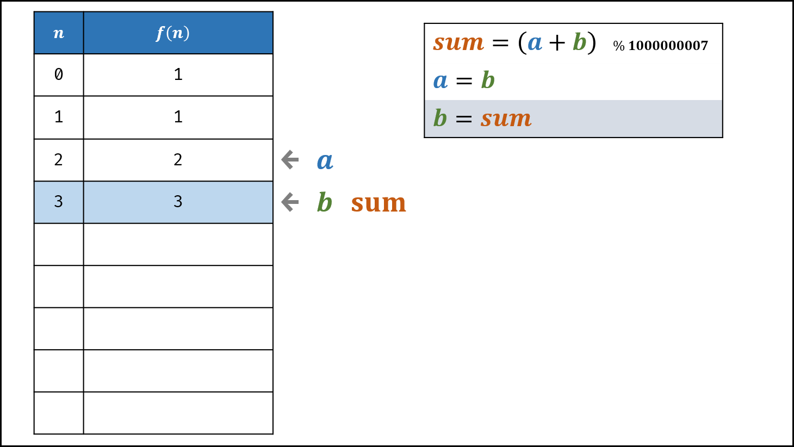,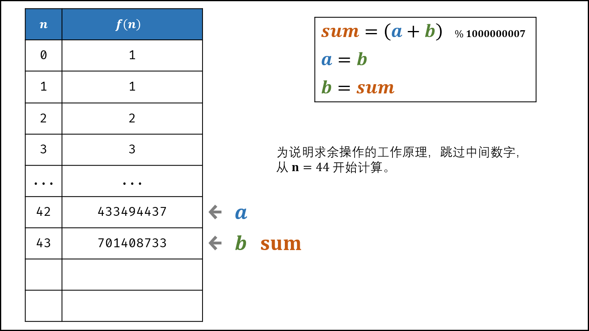,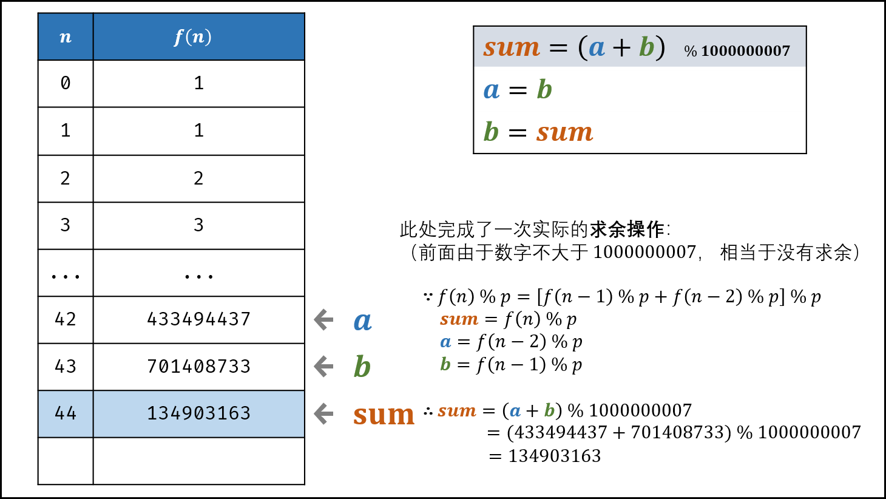,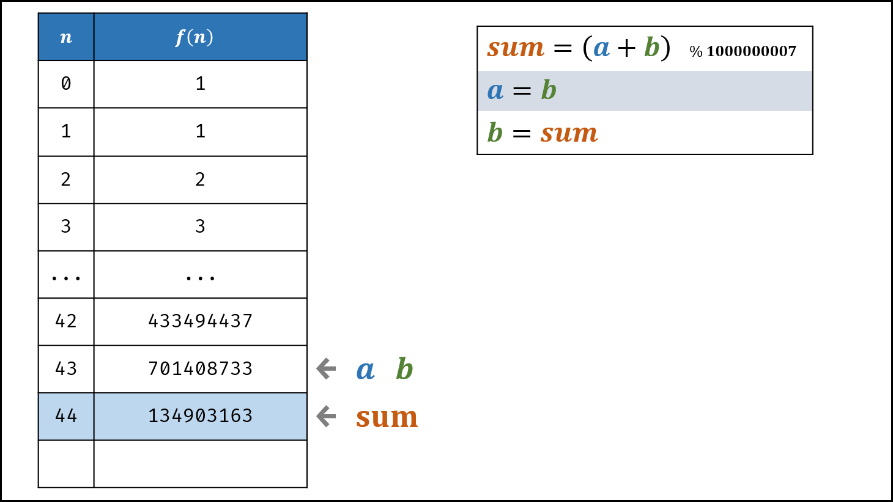,,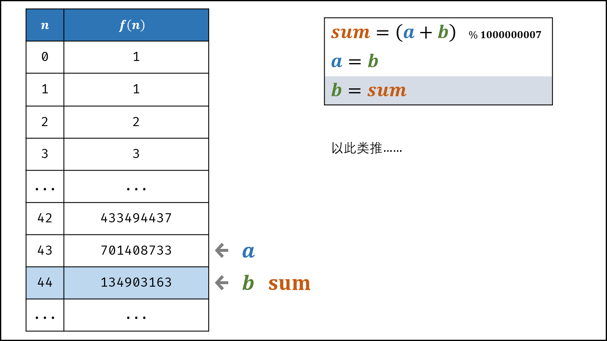>

**复杂度分析：**

- **时间复杂度 $O(N)$ ：** 计算 $f(n)$ 需循环 $n$ 次，每轮循环内计算操作使用 $O(1)$ 。
- **空间复杂度 $O(1)$ ：** 几个标志变量使用常数大小的额外空间。

#### 代码：

> 由于 Python 中整形数字的大小限制 *取决计算机的内存* （可理解为无限大），因此可不考虑大数越界问题。

```python []
class Solution:
    def numWays(self, n: int) -> int:
        a, b = 1, 1
        for _ in range(n):
            a, b = b, a + b
        return a % 1000000007
```

```java []
class Solution {
    public int numWays(int n) {
        int a = 1, b = 1, sum;
        for(int i = 0; i < n; i++){
            sum = (a + b) % 1000000007;
            a = b;
            b = sum;
        }
        return a;
    }
}
```

## 统计信息
| 通过次数 | 提交次数 | AC比率 |
| :------: | :------: | :------: |
|    212166    |    475971    |   44.6%   |

## 提交历史
| 提交时间 | 提交结果 | 执行时间 |  内存消耗  | 语言 |
| :------: | :------: | :------: | :--------: | :--------: |
