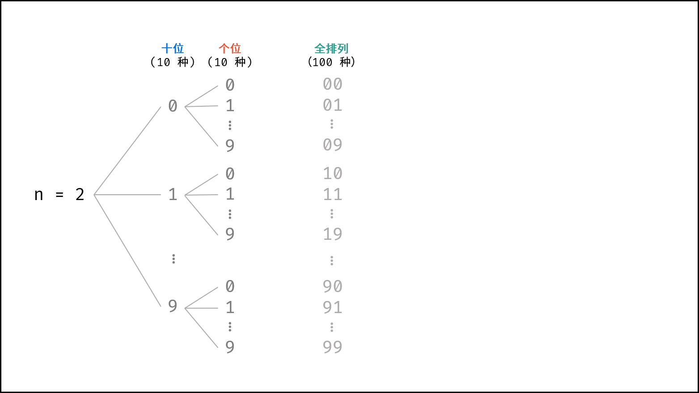
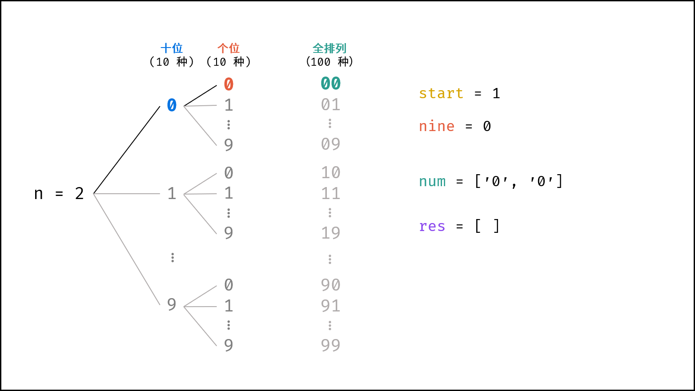
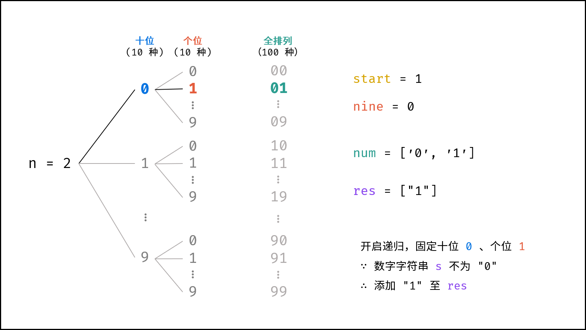
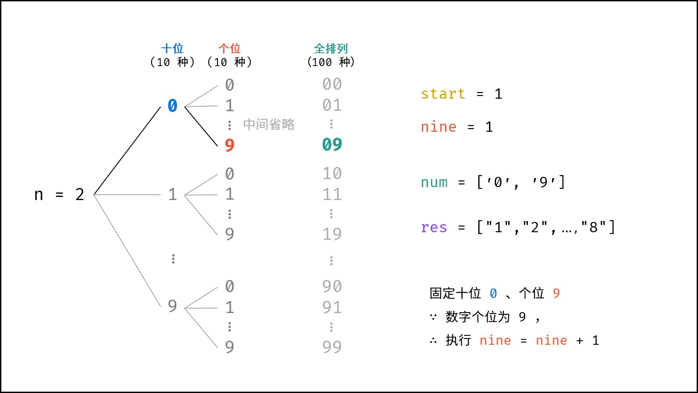
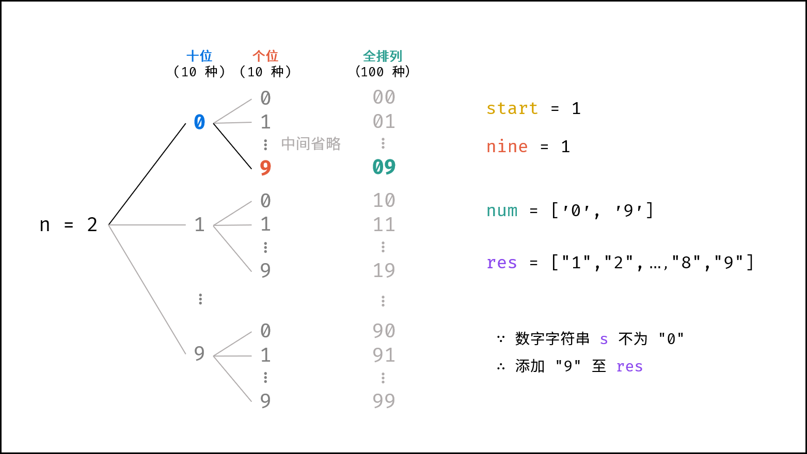
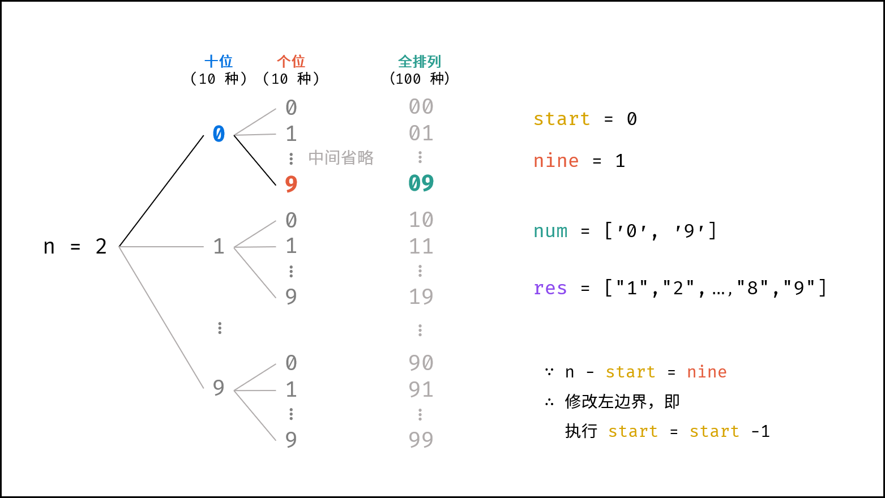
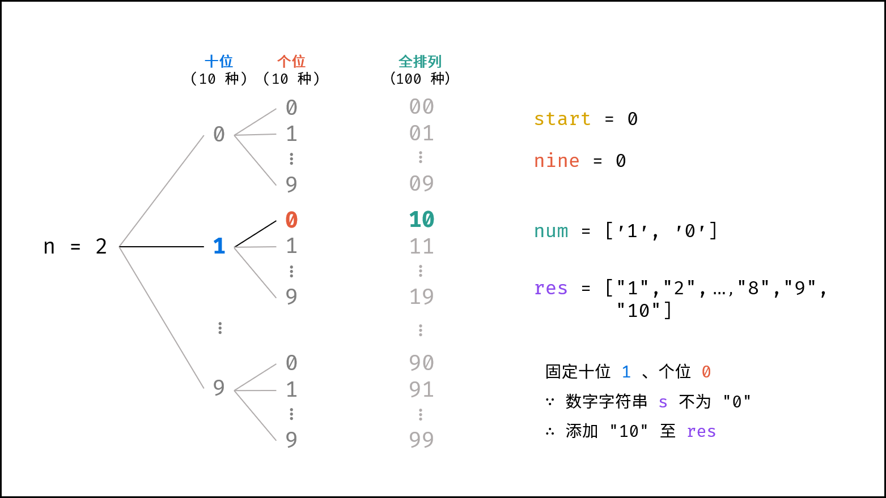
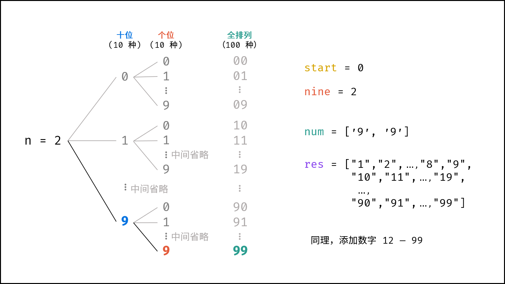
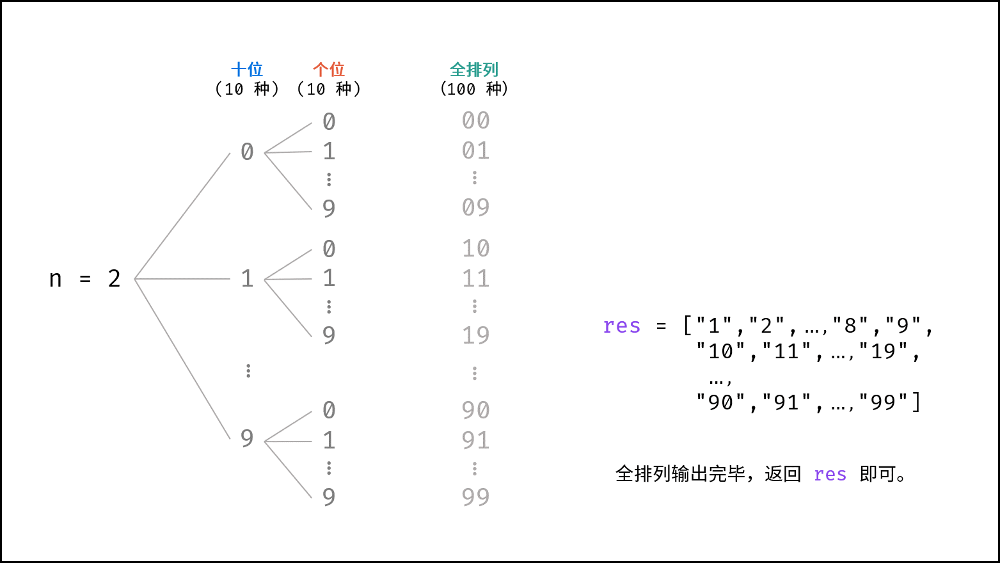

> 原文链接: https://leetcode-cn.com/problems/da-yin-cong-1dao-zui-da-de-nwei-shu-lcof


## 中文题目
<div><p>输入数字 <code>n</code>，按顺序打印出从 1 到最大的 n 位十进制数。比如输入 3，则打印出 1、2、3 一直到最大的 3 位数 999。</p>

<p><strong>示例 1:</strong></p>

<pre><strong>输入:</strong> n = 1
<strong>输出:</strong> [1,2,3,4,5,6,7,8,9]
</pre>

<p>&nbsp;</p>

<p>说明：</p>

<ul>
	<li>用返回一个整数列表来代替打印</li>
	<li>n 为正整数</li>
</ul>
</div>

## 通过代码
<RecoDemo>
</RecoDemo>


## 高赞题解
#### 解题思路：

题目要求打印 “从 $1$ 至最大的 $n$ 位数的列表” ，因此需考虑以下两个问题：

1. **最大的 $n$ 位数（记为 $end$ ）和位数 $n$ 的关系：** 例如最大的 $1$ 位数是 $9$ ，最大的 $2$ 位数是 $99$ ，最大的 $3$ 位数是 $999$ 。则可推出公式：

$$
end = 10^n - 1
$$

2. **大数越界问题：** 当 $n$ 较大时，$end$ 会超出 $int32$ 整型的取值范围，超出取值范围的数字无法正常存储。但由于本题要求返回 int 类型数组，相当于默认所有数字都在 int32 整型取值范围内，因此不考虑大数越界问题。

因此，只需定义区间 $[1, 10^n - 1]$ 和步长 $1$ ，通过 $for$ 循环生成结果列表 $res$ 并返回即可。

##### 复杂度分析：

- **时间复杂度 $O(10^n)$ ：** 生成长度为 $10^n$ 的列表需使用 $O(10^n)$ 时间。
- **空间复杂度 $O(1)$ ：** 建立列表需使用 $O(1)$ 大小的额外空间（ 列表作为返回结果，不计入额外空间 ）。

##### 代码：

```Python []
class Solution:
    def printNumbers(self, n: int) -> List[int]:
        res = []
        for i in range(1, 10 ** n):
            res.append(i)
        return res
```

```Java []
class Solution {
    public int[] printNumbers(int n) {
        int end = (int)Math.pow(10, n) - 1;
        int[] res = new int[end];
        for(int i = 0; i < end; i++)
            res[i] = i + 1;
        return res;
    }
}
```

利用 Python 的语言特性，可以简化代码：先使用 `range()` 方法生成可迭代对象，再使用 `list()` 方法转化为列表并返回即可。

```Python
class Solution:
    def printNumbers(self, n: int) -> List[int]:
        return list(range(1, 10 ** n))
```

#### 大数打印解法：

实际上，本题的主要考点是大数越界情况下的打印。需要解决以下三个问题：

##### 1. 表示大数的变量类型：

- 无论是 short / int / long ... 任意变量类型，数字的取值范围都是有限的。因此，大数的表示应用字符串 String 类型。

##### 2. 生成数字的字符串集：

- 使用 int 类型时，每轮可通过 $+1$ 生成下个数字，而此方法无法应用至 String 类型。并且， String 类型的数字的进位操作效率较低，例如 `"9999"` 至 `"10000"` 需要从个位到千位循环判断，进位 4 次。

- 观察可知，生成的列表实际上是 $n$ 位 $0$ - $9$ 的 **全排列** ，因此可避开进位操作，通过递归生成数字的 String 列表。

##### 3. 递归生成全排列：

- 基于分治算法的思想，先固定高位，向低位递归，当个位已被固定时，添加数字的字符串。例如当 $n = 2$ 时（数字范围 $1 - 99$ ），固定十位为 $0$ - $9$ ，按顺序依次开启递归，固定个位 $0$ - $9$ ，终止递归并添加数字字符串。

{:width=500}

根据以上方法，可初步编写全排列代码：

```Python []
class Solution:
    def printNumbers(self, n: int) -> [int]:
        def dfs(x):
            if x == n: # 终止条件：已固定完所有位
                res.append(''.join(num)) # 拼接 num 并添加至 res 尾部
                return
            for i in range(10): # 遍历 0 - 9
                num[x] = str(i) # 固定第 x 位为 i
                dfs(x + 1) # 开启固定第 x + 1 位
        
        num = ['0'] * n # 起始数字定义为 n 个 0 组成的字符列表
        res = [] # 数字字符串列表
        dfs(0) # 开启全排列递归
        return ','.join(res)  # 拼接所有数字字符串，使用逗号隔开，并返回
```

```Java []
class Solution {
    StringBuilder res;
    int count = 0, n;
    char[] num, loop = {'0', '1', '2', '3', '4', '5', '6', '7', '8', '9'};
    public String printNumbers(int n) {
        this.n = n;
        res = new StringBuilder(); // 数字字符串集
        num = new char[n]; // 定义长度为 n 的字符列表
        dfs(0); // 开启全排列递归
        res.deleteCharAt(res.length() - 1); // 删除最后多余的逗号
        return res.toString(); // 转化为字符串并返回
    }
    void dfs(int x) {
        if(x == n) { // 终止条件：已固定完所有位
            res.append(String.valueOf(num) + ","); // 拼接 num 并添加至 res 尾部，使用逗号隔开
            return;
        }
        for(char i : loop) { // 遍历 ‘0‘ - ’9‘
            num[x] = i; // 固定第 x 位为 i
            dfs(x + 1); // 开启固定第 x + 1 位
        }
    }
}
```

在此方法下，各数字字符串被逗号隔开，共同组成长字符串。返回的数字集字符串如下所示：

```yaml
输入：n = 1
输出："0,1,2,3,4,5,6,7,8,9"

输入：n = 2
输出："00,01,02,...,10,11,12,...,97,98,99"

输入：n = 3
输出："000,001,002,...,100,101,102,...,997,998,999"
```

观察可知，当前的生成方法仍有以下问题：

1. 诸如 $00, 01, 02, \cdots$ 应显示为 $0, 1, 2, \cdots$ ，即应 **删除高位多余的 $0$** ;
2. 此方法从 $0$ 开始生成，而题目要求 **列表从 $1$ 开始** ；

以上两个问题的解决方法如下：

##### 1. 删除高位多余的 $0$ ：

- **字符串左边界定义：** 声明变量 $start$ 规定字符串的左边界，以保证添加的数字字符串 `num[start:]` 中无高位多余的 $0$ 。例如当 $n = 2$ 时， $1 - 9$ 时 $start = 1$ ， $10 - 99$ 时 $start = 0$ 。

- **左边界 $start$ 变化规律：** 观察可知，当输出数字的所有位都是 $9$ 时，则下个数字需要向更高位进 $1$ ，此时左边界 $start$ 需要减 $1$ （即高位多余的 $0$ 减少一个）。例如当 $n = 3$ （数字范围 $1 - 999$ ）时，左边界 $start$ 需要减 $1$ 的情况有： "009" 进位至 "010" ， "099" 进位至 "100" 。设数字各位中 $9$ 的数量为 $nine$ ，所有位都为 $9$ 的判断条件可用以下公式表示：

$$
n - start = nine
$$

- **统计 $nine$ 的方法：** 固定第 $x$ 位时，当 $i = 9$ 则执行 $nine = nine + 1$ ，并在回溯前恢复 $nine = nine - 1$ 。

##### 2. 列表从 $1$ 开始：

- 在以上方法的基础上，添加数字字符串前判断其是否为 `"0"` ，若为 `"0"` 则直接跳过。

<,,,,,,,,,>

##### 复杂度分析：

- **时间复杂度 $O(10^n)$ ：** 递归的生成的排列的数量为 $10^n$ 。
- **空间复杂度 $O(10^n)$ ：** 结果列表 $res$ 的长度为 $10^n - 1$ ，各数字字符串的长度区间为 $1, 2, ..., n$ ，因此占用 $O(10^n)$ 大小的额外空间。

##### 代码：

为 **正确表示大数** ，以下代码的返回值为数字字符串集拼接而成的长字符串。

```Python []
class Solution:
    def printNumbers(self, n: int) -> [int]:
        def dfs(x):
            if x == n:
                s = ''.join(num[self.start:])
                if s != '0': res.append(s)
                if n - self.start == self.nine: self.start -= 1
                return
            for i in range(10):
                if i == 9: self.nine += 1
                num[x] = str(i)
                dfs(x + 1)
            self.nine -= 1
        
        num, res = ['0'] * n, []
        self.nine = 0
        self.start = n - 1
        dfs(0)
        return ','.join(res)
```

```Java []
class Solution {
    StringBuilder res;
    int nine = 0, count = 0, start, n;
    char[] num, loop = {'0', '1', '2', '3', '4', '5', '6', '7', '8', '9'};
    public String printNumbers(int n) {
        this.n = n;
        res = new StringBuilder();
        num = new char[n];
        start = n - 1;
        dfs(0);
        res.deleteCharAt(res.length() - 1);
        return res.toString();
    }
    void dfs(int x) {
        if(x == n) {
            String s = String.valueOf(num).substring(start);
            if(!s.equals("0")) res.append(s + ",");
            if(n - start == nine) start--;
            return;
        }
        for(char i : loop) {
            if(i == '9') nine++;
            num[x] = i;
            dfs(x + 1);
        }
        nine--;
    }
}
```

本题要求输出 int 类型数组。为 **运行通过** ，可在添加数字字符串 $s$ 前，将其转化为 int 类型。代码如下所示：

```Python []
class Solution:
    def printNumbers(self, n: int) -> [int]:
        def dfs(x):
            if x == n:
                s = ''.join(num[self.start:])
                if s != '0': res.append(int(s))
                if n - self.start == self.nine: self.start -= 1
                return
            for i in range(10):
                if i == 9: self.nine += 1
                num[x] = str(i)
                dfs(x + 1)
            self.nine -= 1
        
        num, res = ['0'] * n, []
        self.nine = 0
        self.start = n - 1
        dfs(0)
        return res
```

```Java []
class Solution {
    int[] res;
    int nine = 0, count = 0, start, n;
    char[] num, loop = {'0', '1', '2', '3', '4', '5', '6', '7', '8', '9'};
    public int[] printNumbers(int n) {
        this.n = n;
        res = new int[(int)Math.pow(10, n) - 1];
        num = new char[n];
        start = n - 1;
        dfs(0);
        return res;
    }
    void dfs(int x) {
        if(x == n) {
            String s = String.valueOf(num).substring(start);
            if(!s.equals("0")) res[count++] = Integer.parseInt(s);
            if(n - start == nine) start--;
            return;
        }
        for(char i : loop) {
            if(i == '9') nine++;
            num[x] = i;
            dfs(x + 1);
        }
        nine--;
    }
}
```

## 统计信息
| 通过次数 | 提交次数 | AC比率 |
| :------: | :------: | :------: |
|    158596    |    203987    |   77.7%   |

## 提交历史
| 提交时间 | 提交结果 | 执行时间 |  内存消耗  | 语言 |
| :------: | :------: | :------: | :--------: | :--------: |
