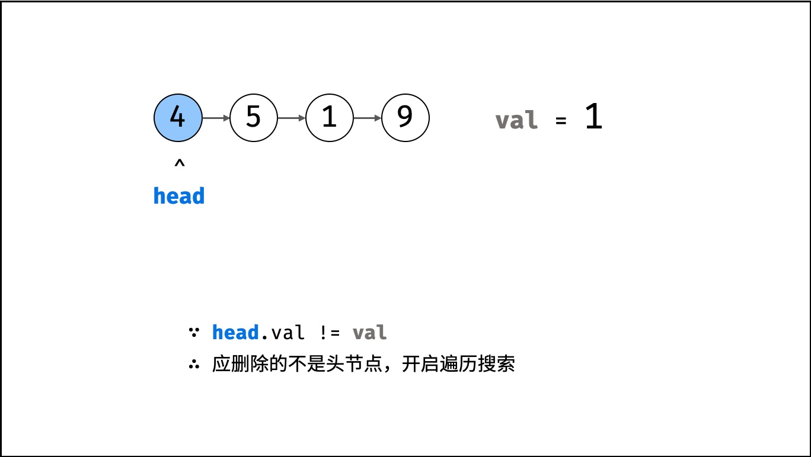
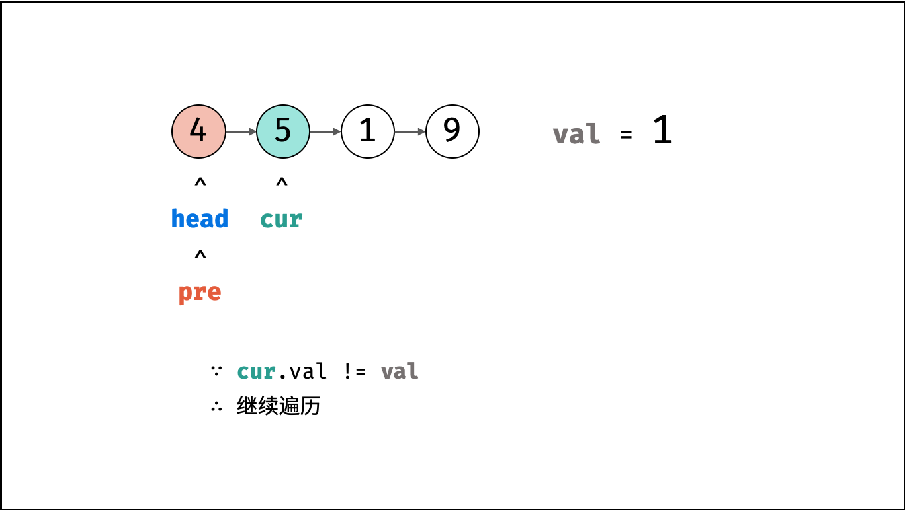
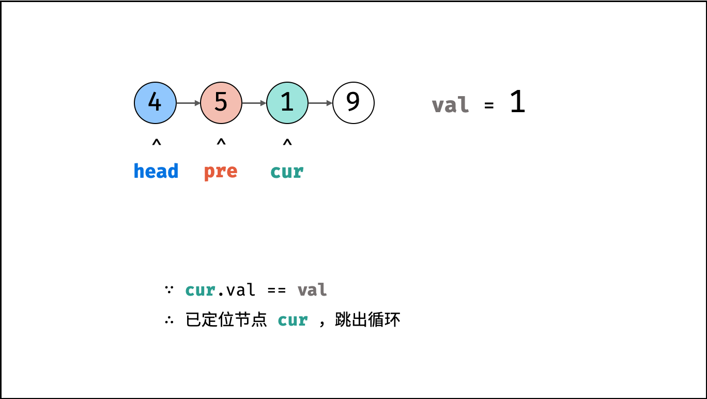
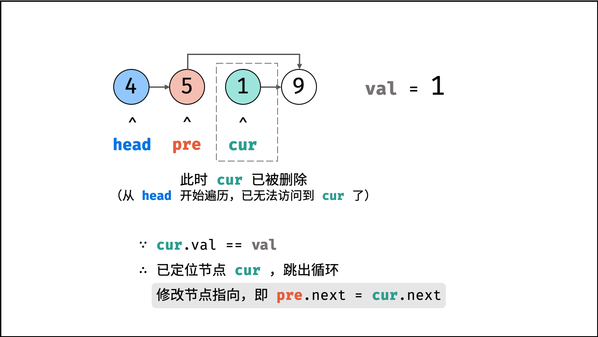
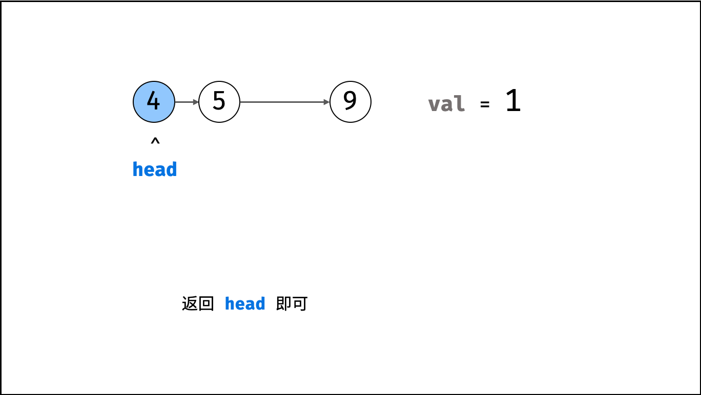

> 原文链接: https://leetcode-cn.com/problems/shan-chu-lian-biao-de-jie-dian-lcof


## 中文题目
<div><p>给定单向链表的头指针和一个要删除的节点的值，定义一个函数删除该节点。</p>

<p>返回删除后的链表的头节点。</p>

<p><strong>注意：</strong>此题对比原题有改动</p>

<p><strong>示例 1:</strong></p>

<pre><strong>输入:</strong> head = [4,5,1,9], val = 5
<strong>输出:</strong> [4,1,9]
<strong>解释: </strong>给定你链表中值为&nbsp;5&nbsp;的第二个节点，那么在调用了你的函数之后，该链表应变为 4 -&gt; 1 -&gt; 9.
</pre>

<p><strong>示例 2:</strong></p>

<pre><strong>输入:</strong> head = [4,5,1,9], val = 1
<strong>输出:</strong> [4,5,9]
<strong>解释: </strong>给定你链表中值为&nbsp;1&nbsp;的第三个节点，那么在调用了你的函数之后，该链表应变为 4 -&gt; 5 -&gt; 9.
</pre>

<p>&nbsp;</p>

<p><strong>说明：</strong></p>

<ul>
	<li>题目保证链表中节点的值互不相同</li>
	<li>若使用 C 或 C++ 语言，你不需要 <code>free</code> 或 <code>delete</code> 被删除的节点</li>
</ul>
</div>

## 通过代码
<RecoDemo>
</RecoDemo>


## 高赞题解
#### 解题思路：

本题删除值为 `val` 的节点分需为两步：定位节点、修改引用。

1. **定位节点：** 遍历链表，直到 `head.val == val` 时跳出，即可定位目标节点。
2. **修改引用：** 设节点 `cur` 的前驱节点为 `pre` ，后继节点为 `cur.next` ；则执行 `pre.next = cur.next` ，即可实现删除 `cur` 节点。

{:width=450}

##### 算法流程：

1. **特例处理：** 当应删除头节点 `head` 时，直接返回 `head.next` 即可。
2. **初始化：** `pre = head` , `cur = head.next` 。
3. **定位节点：** 当 `cur` 为空 **或** `cur` 节点值等于 `val` 时跳出。
   1. 保存当前节点索引，即 `pre = cur` 。
   2. 遍历下一节点，即 `cur = cur.next` 。
4. **删除节点：** 若 `cur` 指向某节点，则执行 `pre.next = cur.next` ；若 `cur` 指向 $null$ ，代表链表中不包含值为 `val` 的节点。
5. **返回值：** 返回链表头部节点 `head` 即可。

<,,,,>

##### 复杂度分析：

- **时间复杂度 $O(N)$ ：** $N$ 为链表长度，删除操作平均需循环 $N/2$ 次，最差 $N$ 次。
- **空间复杂度 $O(1)$ ：** `cur`, `pre` 占用常数大小额外空间。

#### 代码：

```Python []
class Solution:
    def deleteNode(self, head: ListNode, val: int) -> ListNode:
        if head.val == val: return head.next
        pre, cur = head, head.next
        while cur and cur.val != val:
            pre, cur = cur, cur.next
        if cur: pre.next = cur.next
        return head
```

```Java []
class Solution {
    public ListNode deleteNode(ListNode head, int val) {
        if(head.val == val) return head.next;
        ListNode pre = head, cur = head.next;
        while(cur != null && cur.val != val) {
            pre = cur;
            cur = cur.next;
        }
        if(cur != null) pre.next = cur.next;
        return head;
    }
}
```

```C++ []
class Solution {
public:
    ListNode* deleteNode(ListNode* head, int val) {
        if(head->val == val) return head->next;
        ListNode *pre = head, *cur = head->next;
        while(cur != nullptr && cur->val != val) {
            pre = cur;
            cur = cur->next;
        }
        if(cur != nullptr) pre->next = cur->next;
        return head;
    }
};
```

## 统计信息
| 通过次数 | 提交次数 | AC比率 |
| :------: | :------: | :------: |
|    203337    |    340541    |   59.7%   |

## 提交历史
| 提交时间 | 提交结果 | 执行时间 |  内存消耗  | 语言 |
| :------: | :------: | :------: | :--------: | :--------: |
