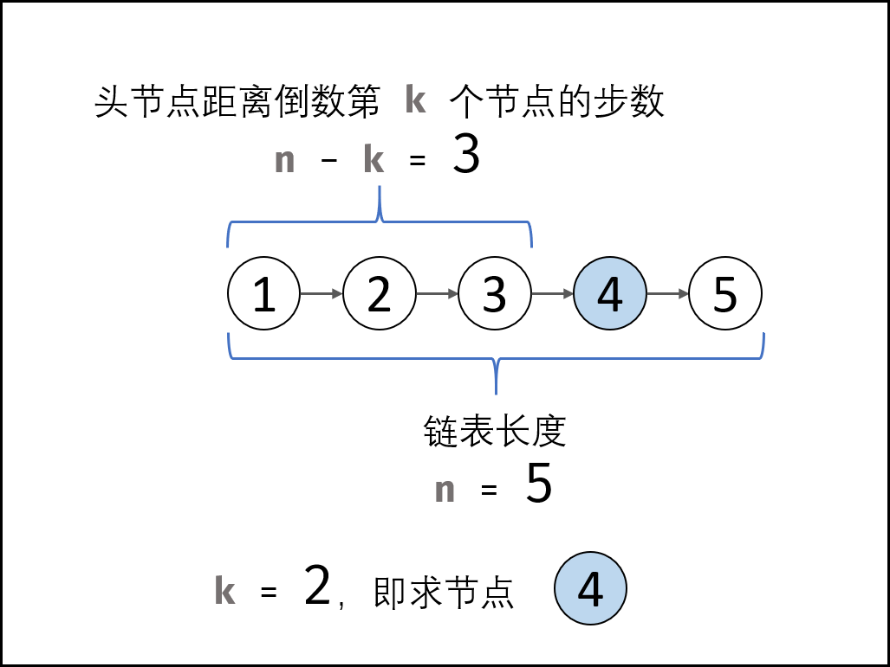
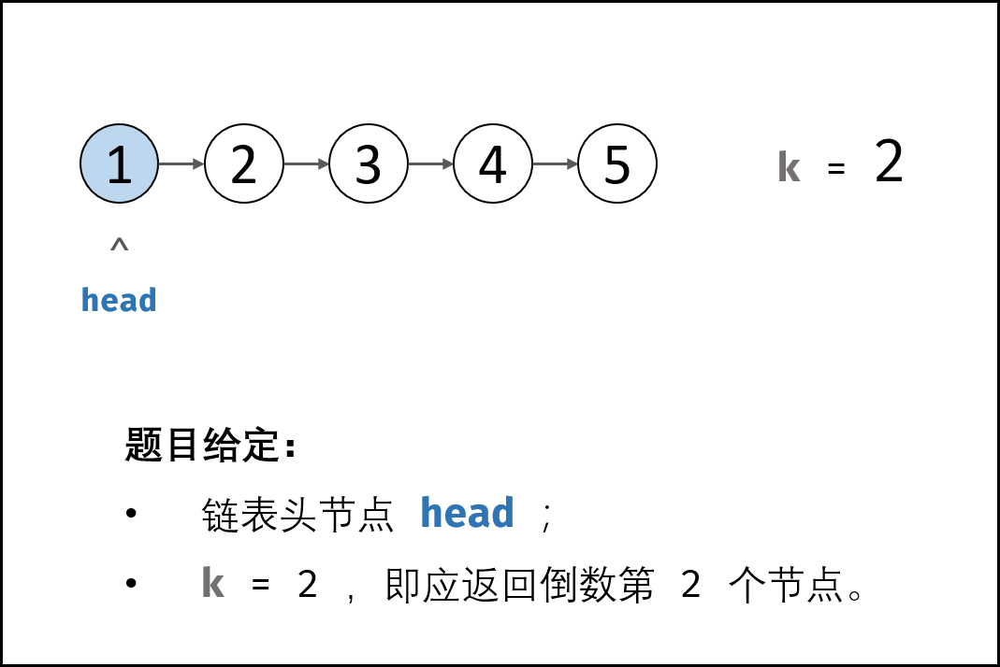
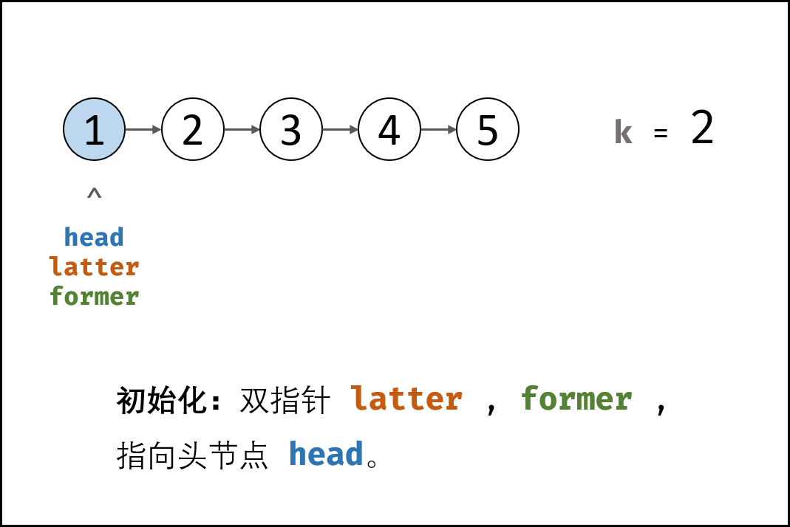
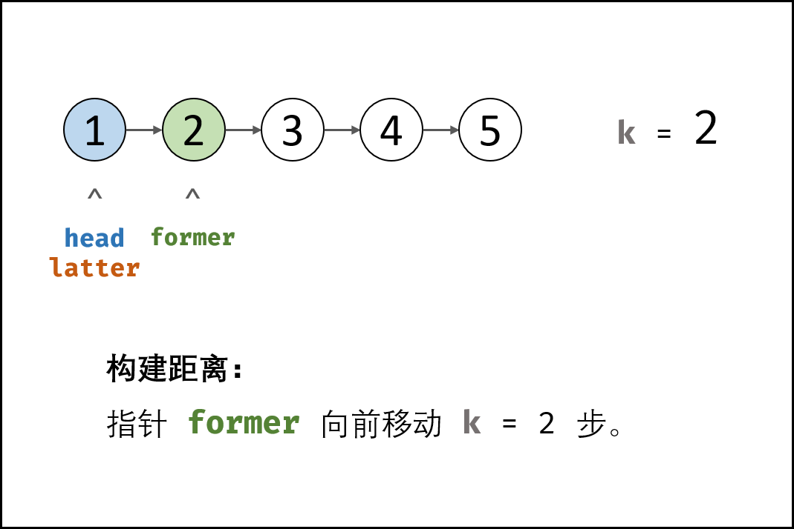
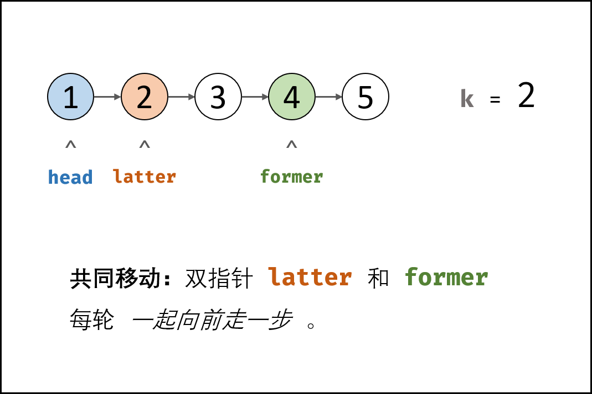
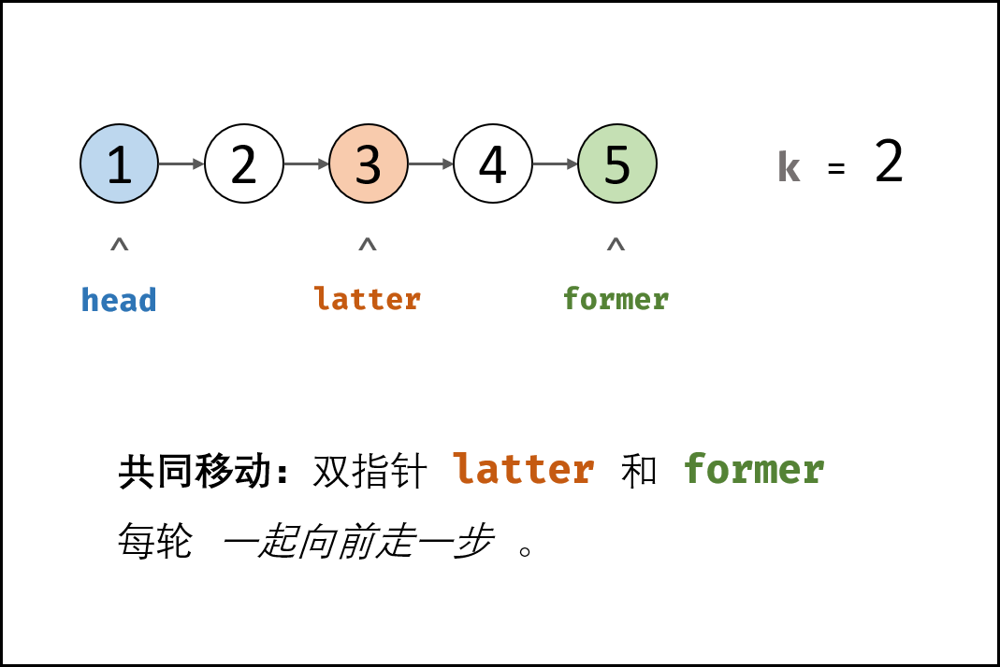
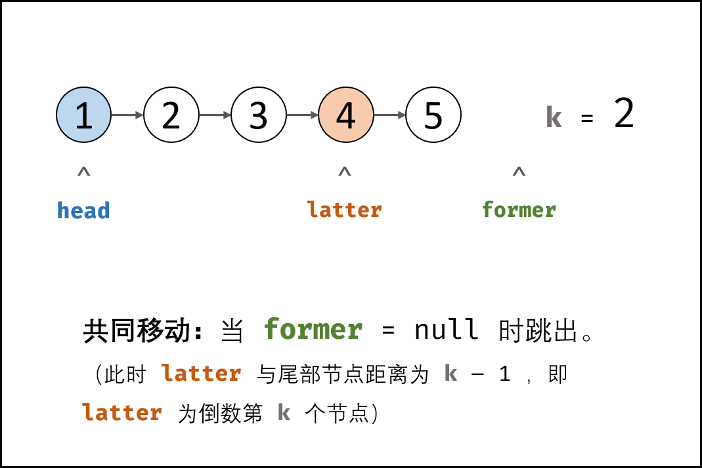
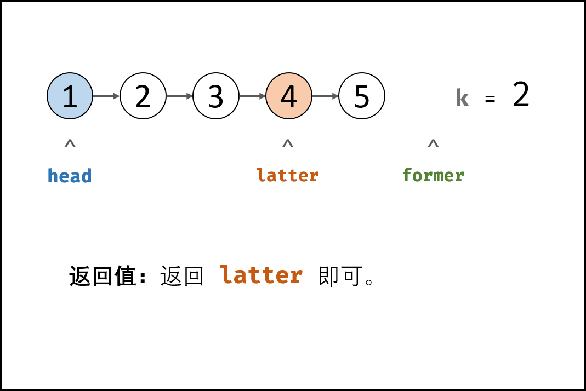

> 原文链接: https://leetcode-cn.com/problems/lian-biao-zhong-dao-shu-di-kge-jie-dian-lcof


## 中文题目
<div><p>输入一个链表，输出该链表中倒数第k个节点。为了符合大多数人的习惯，本题从1开始计数，即链表的尾节点是倒数第1个节点。</p>

<p>例如，一个链表有 <code>6</code> 个节点，从头节点开始，它们的值依次是 <code>1、2、3、4、5、6</code>。这个链表的倒数第 <code>3</code> 个节点是值为 <code>4</code> 的节点。</p>

<p> </p>

<p><strong>示例：</strong></p>

<pre>
给定一个链表: <strong>1->2->3->4->5</strong>, 和 <em>k </em><strong>= 2</strong>.

返回链表 4<strong>->5</strong>.</pre>
</div>

## 通过代码
<RecoDemo>
</RecoDemo>


## 高赞题解
#### 解题思路：

- 第一时间想到的解法：
    1. 先遍历统计链表长度，记为 $n$ ；
    2. 设置一个指针走 $(n-k)$ 步，即可找到链表倒数第 $k$ 个节点。
- 使用双指针则可以不用统计链表长度。

{:width=300}

##### 算法流程：

1. **初始化：** 前指针 `former` 、后指针 `latter` ，双指针都指向头节点 `head​` 。
2. **构建双指针距离：** 前指针 `former` 先向前走 $k$ 步（结束后，双指针 `former` 和 `latter` 间相距 $k$ 步）。
3. **双指针共同移动：** 循环中，双指针 `former` 和 `latter`  每轮都向前走一步，直至 `former` 走过链表 **尾节点** 时跳出（跳出后， `latter` 与尾节点距离为 $k-1$，即 `latter` 指向倒数第 $k$ 个节点）。
4. **返回值：** 返回 `latter` 即可。

<,,,,,,,>

##### 复杂度分析：

- **时间复杂度 $O(N)$ ：** $N$ 为链表长度；总体看， `former` 走了 $N$ 步， `latter` 走了 $(N-k)$ 步。
- **空间复杂度 $O(1)$ ：** 双指针 `former` , `latter` 使用常数大小的额外空间。

#### 代码：

> 本题没有 $k$ 大于链表长度的 case ，因此不用考虑越界问题。
> 考虑越界问题的代码请见第三、四栏。

```python []
class Solution:
    def getKthFromEnd(self, head: ListNode, k: int) -> ListNode:
        former, latter = head, head
        for _ in range(k):
            former = former.next
        while former:
            former, latter = former.next, latter.next
        return latter
```

```java []
class Solution {
    public ListNode getKthFromEnd(ListNode head, int k) {
        ListNode former = head, latter = head;
        for(int i = 0; i < k; i++)
            former = former.next;
        while(former != null) {
            former = former.next;
            latter = latter.next;
        }
        return latter;
    }
}
```

```python []
class Solution:
    def getKthFromEnd(self, head: ListNode, k: int) -> ListNode:
        former, latter = head, head
        for _ in range(k):
            if not former: return
            former = former.next
        while former:
            former, latter = former.next, latter.next
        return latter
```

```java []
class Solution {
    public ListNode getKthFromEnd(ListNode head, int k) {
        ListNode former = head, latter = head;
        for(int i = 0; i < k; i++) {
            if(former == null) return null;
            former = former.next;
        }
        while(former != null) {
            former = former.next;
            latter = latter.next;
        }
        return latter;
    }
}
```

## 统计信息
| 通过次数 | 提交次数 | AC比率 |
| :------: | :------: | :------: |
|    278131    |    348230    |   79.9%   |

## 提交历史
| 提交时间 | 提交结果 | 执行时间 |  内存消耗  | 语言 |
| :------: | :------: | :------: | :--------: | :--------: |
