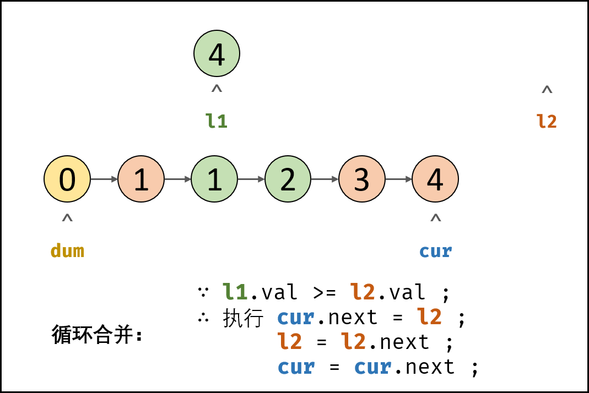

> 原文链接: https://leetcode-cn.com/problems/he-bing-liang-ge-pai-xu-de-lian-biao-lcof


## 中文题目
<div><p>输入两个递增排序的链表，合并这两个链表并使新链表中的节点仍然是递增排序的。</p>

<p><strong>示例1：</strong></p>

<pre><strong>输入：</strong>1-&gt;2-&gt;4, 1-&gt;3-&gt;4
<strong>输出：</strong>1-&gt;1-&gt;2-&gt;3-&gt;4-&gt;4</pre>

<p><strong>限制：</strong></p>

<p><code>0 &lt;= 链表长度 &lt;= 1000</code></p>

<p>注意：本题与主站 21 题相同：<a href="https://leetcode-cn.com/problems/merge-two-sorted-lists/">https://leetcode-cn.com/problems/merge-two-sorted-lists/</a></p>
</div>

## 通过代码
<RecoDemo>
</RecoDemo>


## 高赞题解
#### 解题思路：

- 根据题目描述， 链表 $l_1$ , $l_2$ 是 **递增** 的，因此容易想到使用双指针 $l_1$ 和 $l_2$ 遍历两链表，根据 $l_1.val$ 和 $l_2.val$ 的大小关系确定节点添加顺序，两节点指针交替前进，直至遍历完毕。

- **引入伪头节点：** 由于初始状态合并链表中无节点，因此循环第一轮时无法将节点添加到合并链表中。解决方案：初始化一个辅助节点 $dum$ 作为合并链表的伪头节点，将各节点添加至 $dum$ 之后。

{:width=400}

##### 算法流程：

1. **初始化：** 伪头节点 $dum$ ，节点 $cur$ 指向 $dum$ 。
2. **循环合并：** 当 $l_1$ 或 $l_2$ 为空时跳出；
   1. 当 $l_1.val < l_2.val$ 时： $cur$ 的后继节点指定为 $l_1$ ，并 $l_1$ 向前走一步；
   2. 当 $l_1.val \geq l_2.val$ 时： $cur$ 的后继节点指定为 $l_2$ ，并 $l_2$ 向前走一步 ；
   3. 节点 $cur$ 向前走一步，即 $cur = cur.next$ 。
3. **合并剩余尾部：** 跳出时有两种情况，即 $l_1$ 为空 **或** $l_2$ 为空。
   1. 若 $l_1 \ne null$ ： 将 $l_1$ 添加至节点 $cur$ 之后；
   2. 否则： 将 $l_2$ 添加至节点 $cur$ 之后。
4. **返回值：** 合并链表在伪头节点 $dum$ 之后，因此返回 $dum.next$ 即可。

<,,,,,,,,,,,,,,,>

##### 复杂度分析：

- **时间复杂度 $O(M+N)$ ：** $M, N$ 分别为链表 $l_1$, $l_2$ 的长度，合并操作需遍历两链表。
- **空间复杂度 $O(1)$ ：** 节点引用 $dum$ , $cur$ 使用常数大小的额外空间。

#### 代码：

> Python 三元表达式写法 `A if x else B` ，代表当 $x = True$ 时执行 $A$ ，否则执行 $B$ 。

```python []
class Solution:
    def mergeTwoLists(self, l1: ListNode, l2: ListNode) -> ListNode:
        cur = dum = ListNode(0)
        while l1 and l2:
            if l1.val < l2.val:
                cur.next, l1 = l1, l1.next
            else:
                cur.next, l2 = l2, l2.next
            cur = cur.next
        cur.next = l1 if l1 else l2
        return dum.next
```

```java []
class Solution {
    public ListNode mergeTwoLists(ListNode l1, ListNode l2) {
        ListNode dum = new ListNode(0), cur = dum;
        while(l1 != null && l2 != null) {
            if(l1.val < l2.val) {
                cur.next = l1;
                l1 = l1.next;
            }
            else {
                cur.next = l2;
                l2 = l2.next;
            }
            cur = cur.next;
        }
        cur.next = l1 != null ? l1 : l2;
        return dum.next;
    }
}
```

## 统计信息
| 通过次数 | 提交次数 | AC比率 |
| :------: | :------: | :------: |
|    200827    |    275861    |   72.8%   |

## 提交历史
| 提交时间 | 提交结果 | 执行时间 |  内存消耗  | 语言 |
| :------: | :------: | :------: | :--------: | :--------: |
