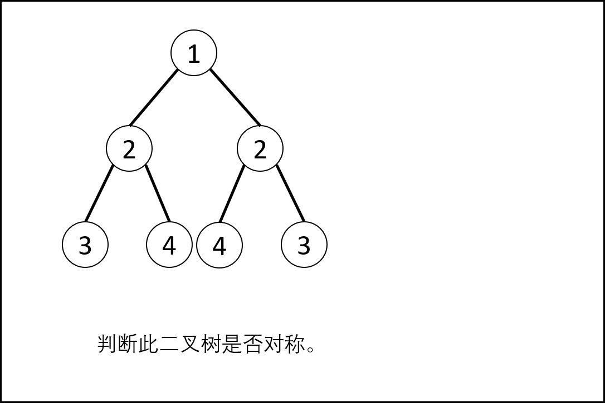
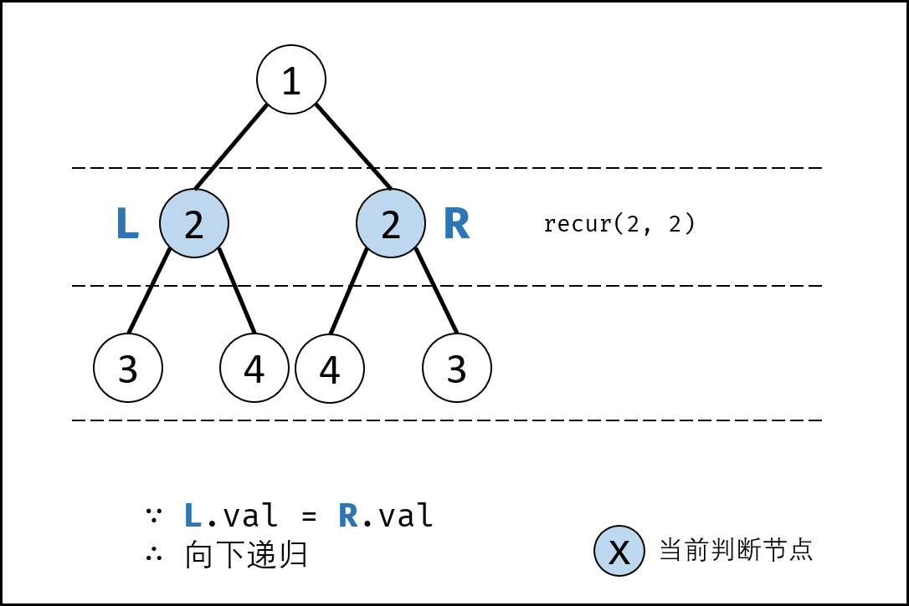
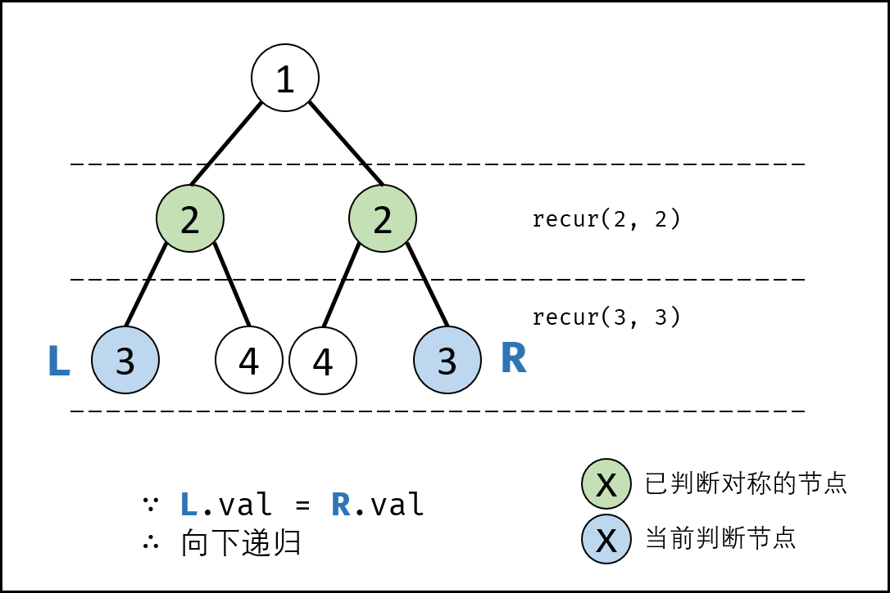
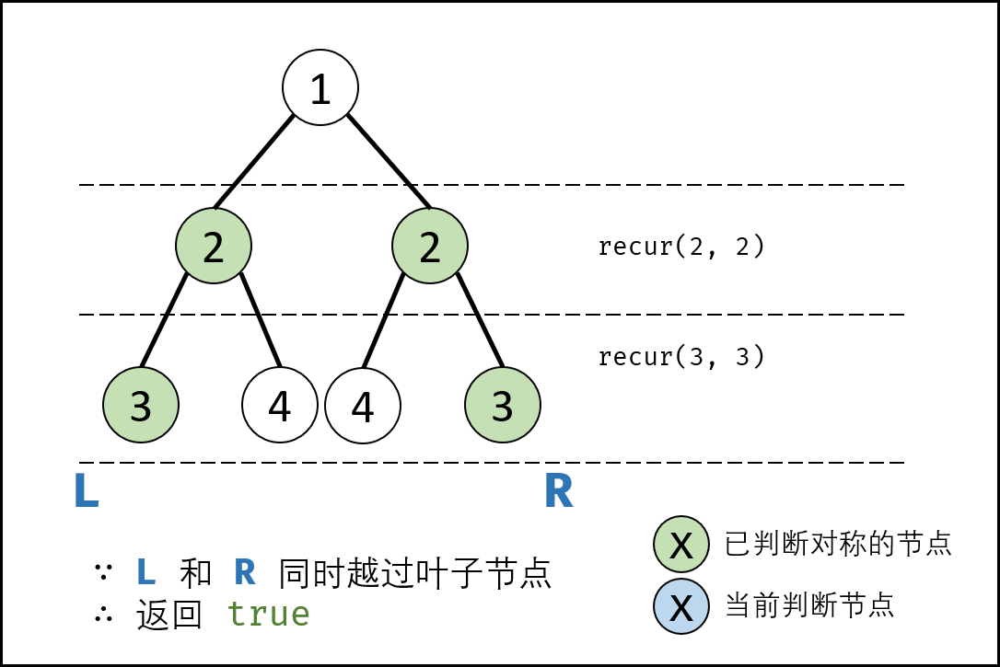
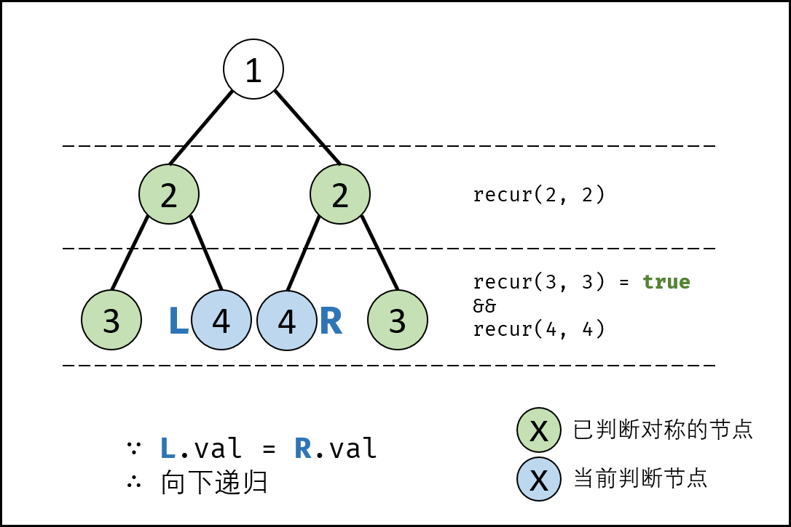
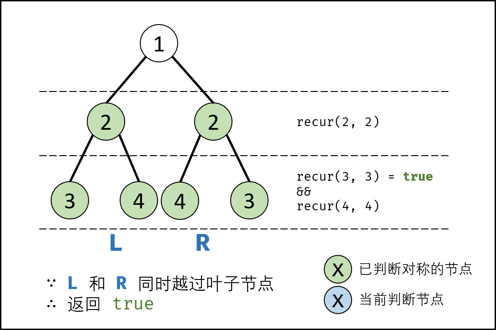
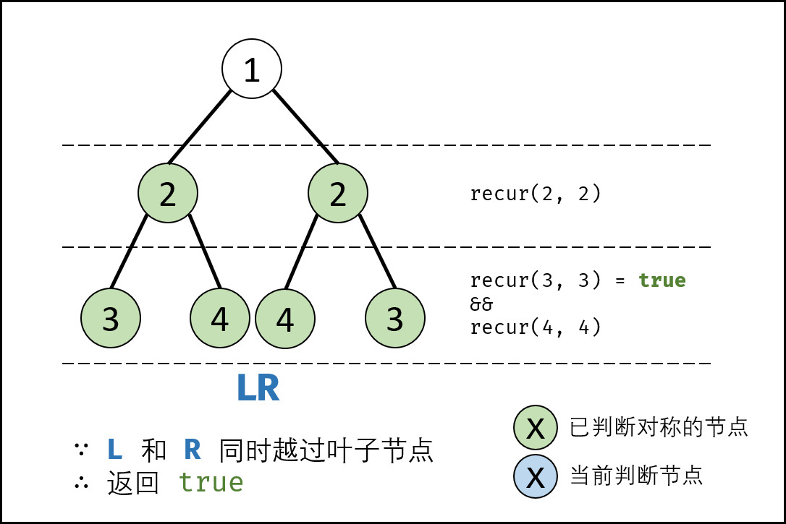
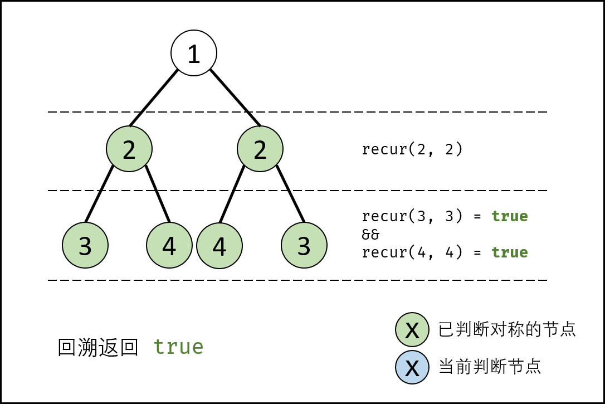
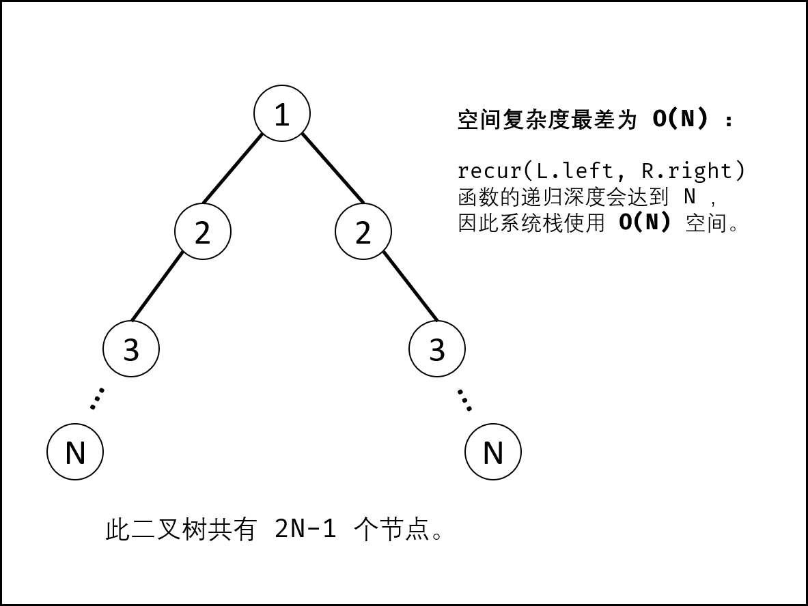

> 原文链接: https://leetcode-cn.com/problems/dui-cheng-de-er-cha-shu-lcof


## 中文题目
<div><p>请实现一个函数，用来判断一棵二叉树是不是对称的。如果一棵二叉树和它的镜像一样，那么它是对称的。</p>

<p>例如，二叉树&nbsp;[1,2,2,3,4,4,3] 是对称的。</p>

<p><code>&nbsp; &nbsp; 1<br>
&nbsp; &nbsp;/ \<br>
&nbsp; 2 &nbsp; 2<br>
&nbsp;/ \ / \<br>
3 &nbsp;4 4 &nbsp;3</code><br>
但是下面这个&nbsp;[1,2,2,null,3,null,3] 则不是镜像对称的:</p>

<p><code>&nbsp; &nbsp; 1<br>
&nbsp; &nbsp;/ \<br>
&nbsp; 2 &nbsp; 2<br>
&nbsp; &nbsp;\ &nbsp; \<br>
&nbsp; &nbsp;3 &nbsp; &nbsp;3</code></p>

<p>&nbsp;</p>

<p><strong>示例 1：</strong></p>

<pre><strong>输入：</strong>root = [1,2,2,3,4,4,3]
<strong>输出：</strong>true
</pre>

<p><strong>示例 2：</strong></p>

<pre><strong>输入：</strong>root = [1,2,2,null,3,null,3]
<strong>输出：</strong>false</pre>

<p>&nbsp;</p>

<p><strong>限制：</strong></p>

<p><code>0 &lt;= 节点个数 &lt;= 1000</code></p>

<p>注意：本题与主站 101 题相同：<a href="https://leetcode-cn.com/problems/symmetric-tree/">https://leetcode-cn.com/problems/symmetric-tree/</a></p>
</div>

## 通过代码
<RecoDemo>
</RecoDemo>


## 高赞题解
#### 解题思路：

- **对称二叉树定义：** 对于树中 **任意两个对称节点** $L$ 和 $R$ ，一定有：
  - $L.val = R.val$ ：即此两对称节点值相等。
  - $L.left.val = R.right.val$ ：即 $L$ 的 左子节点 和 $R$ 的 右子节点 对称；
  - $L.right.val = R.left.val$ ：即 $L$ 的 右子节点 和 $R$ 的 左子节点 对称。
- 根据以上规律，考虑从顶至底递归，判断每对节点是否对称，从而判断树是否为对称二叉树。

{:width=400}

##### 算法流程：

**`isSymmetric(root)` ：**

- **特例处理：** 若根节点 `root` 为空，则直接返回 $true$ 。
- **返回值：** 即 `recur(root.left, root.right)` ;

**`recur(L, R)` ：**

- **终止条件：**
  - 当 $L$ 和 $R$ 同时越过叶节点： 此树从顶至底的节点都对称，因此返回 $true$ ；
  - 当 $L$ 或 $R$ 中只有一个越过叶节点： 此树不对称，因此返回 $false$ ；
  - 当节点 $L$ 值 $\ne$ 节点 $R$ 值： 此树不对称，因此返回 $false$ ；
- **递推工作：**
  - 判断两节点 $L.left$ 和 $R.right$ 是否对称，即 `recur(L.left, R.right)` ；
  - 判断两节点 $L.right$ 和 $R.left$ 是否对称，即 `recur(L.right, R.left)` ；
- **返回值：** 两对节点都对称时，才是对称树，因此用与逻辑符 `&&` 连接。

<,,,,,,,,,>

**复杂度分析：**

- **时间复杂度 $O(N)$ ：** 其中 $N$ 为二叉树的节点数量，每次执行 `recur()` 可以判断一对节点是否对称，因此最多调用 $N/2$  次 `recur()` 方法。
- **空间复杂度 $O(N)$ ：** 最差情况下（见下图），二叉树退化为链表，系统使用 $O(N)$ 大小的栈空间。

{:width=400}

<br>

```python []
class Solution:
    def isSymmetric(self, root: TreeNode) -> bool:
        def recur(L, R):
            if not L and not R: return True
            if not L or not R or L.val != R.val: return False
            return recur(L.left, R.right) and recur(L.right, R.left)

        return recur(root.left, root.right) if root else True
```

```java []
class Solution {
    public boolean isSymmetric(TreeNode root) {
        return root == null ? true : recur(root.left, root.right);
    }
    boolean recur(TreeNode L, TreeNode R) {
        if(L == null && R == null) return true;
        if(L == null || R == null || L.val != R.val) return false;
        return recur(L.left, R.right) && recur(L.right, R.left);
    }
}
```

## 统计信息
| 通过次数 | 提交次数 | AC比率 |
| :------: | :------: | :------: |
|    163400    |    281973    |   57.9%   |

## 提交历史
| 提交时间 | 提交结果 | 执行时间 |  内存消耗  | 语言 |
| :------: | :------: | :------: | :--------: | :--------: |
