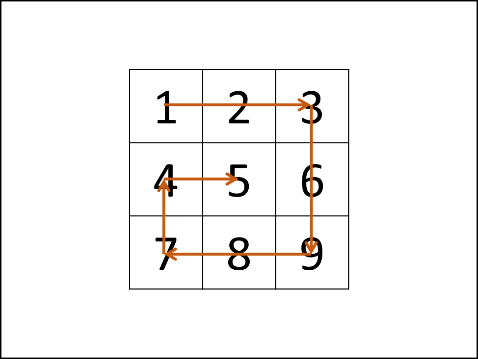
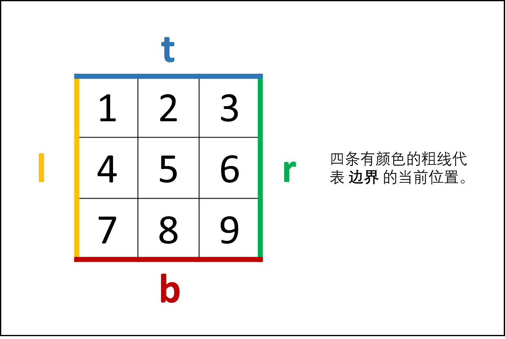
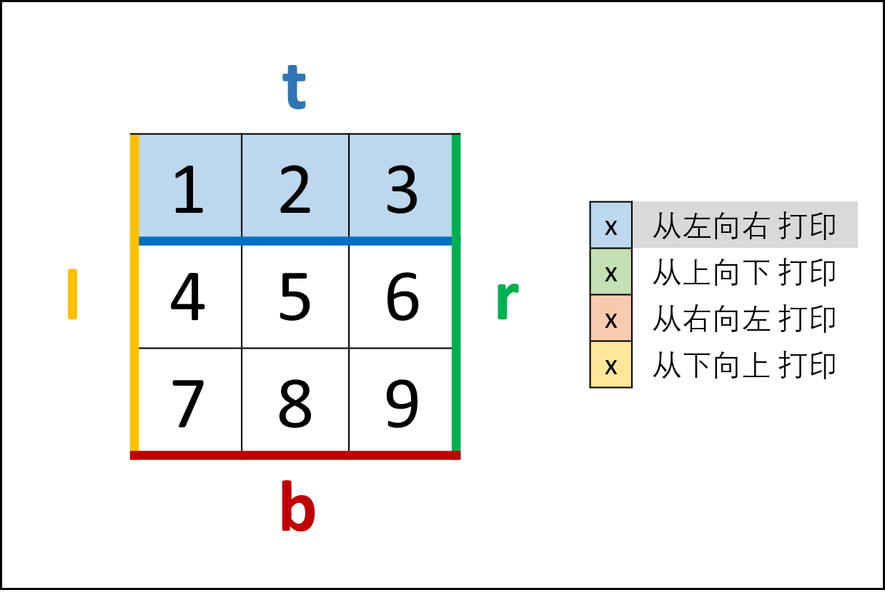
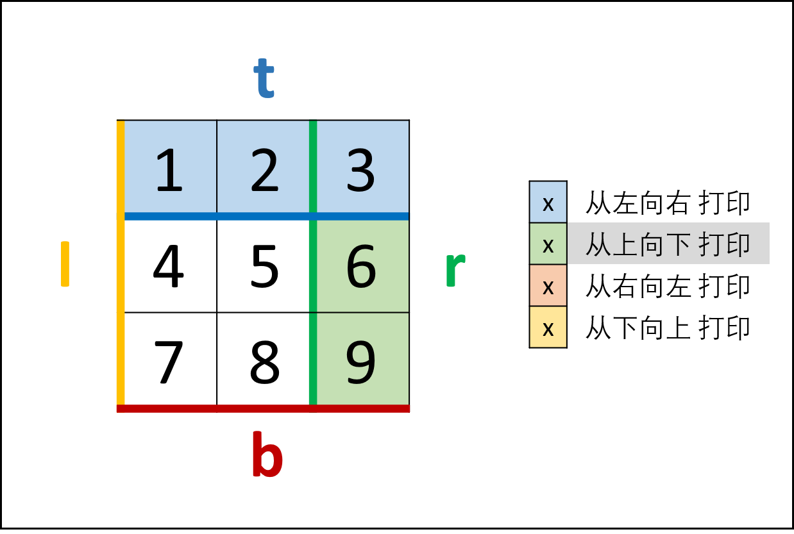
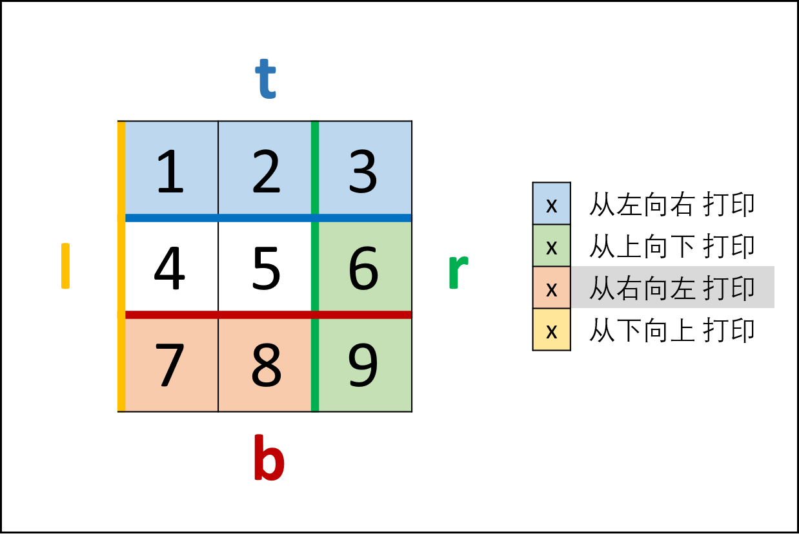
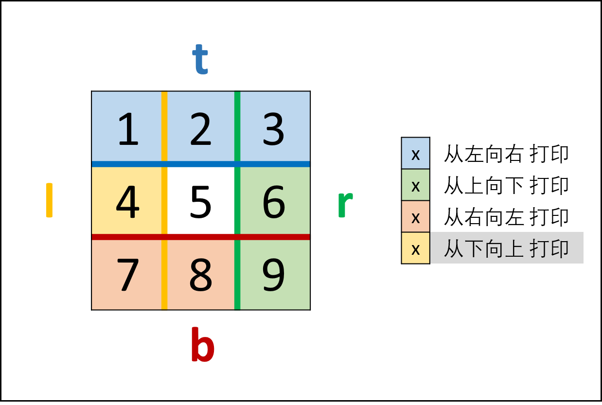
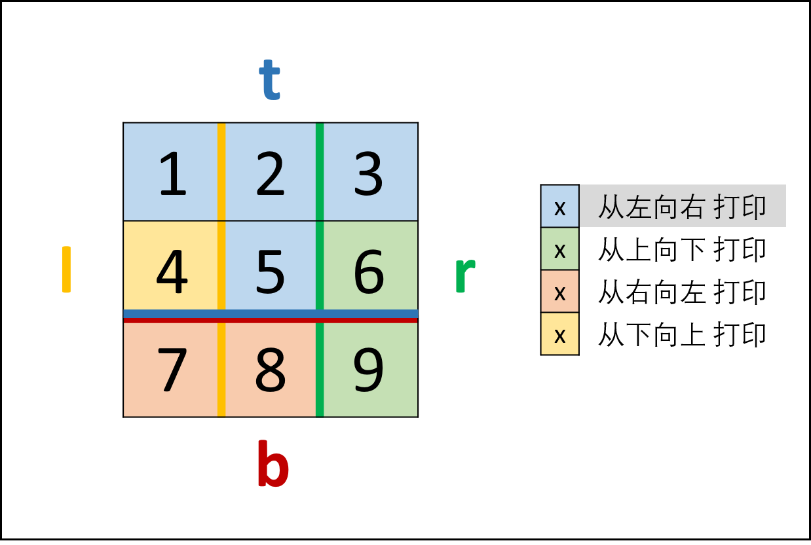

> 原文链接: https://leetcode-cn.com/problems/shun-shi-zhen-da-yin-ju-zhen-lcof


## 中文题目
<div><p>输入一个矩阵，按照从外向里以顺时针的顺序依次打印出每一个数字。</p>

<p>&nbsp;</p>

<p><strong>示例 1：</strong></p>

<pre><strong>输入：</strong>matrix = [[1,2,3],[4,5,6],[7,8,9]]
<strong>输出：</strong>[1,2,3,6,9,8,7,4,5]
</pre>

<p><strong>示例 2：</strong></p>

<pre><strong>输入：</strong>matrix =&nbsp;[[1,2,3,4],[5,6,7,8],[9,10,11,12]]
<strong>输出：</strong>[1,2,3,4,8,12,11,10,9,5,6,7]
</pre>

<p>&nbsp;</p>

<p><strong>限制：</strong></p>

<ul>
	<li><code>0 &lt;= matrix.length &lt;= 100</code></li>
	<li><code>0 &lt;= matrix[i].length&nbsp;&lt;= 100</code></li>
</ul>

<p>注意：本题与主站 54 题相同：<a href="https://leetcode-cn.com/problems/spiral-matrix/">https://leetcode-cn.com/problems/spiral-matrix/</a></p>
</div>

## 通过代码
<RecoDemo>
</RecoDemo>


## 高赞题解
#### 解题思路：

> 根据题目示例 `matrix = [[1,2,3],[4,5,6],[7,8,9]]` 的对应输出 `[1,2,3,6,9,8,7,4,5]` 可以发现，顺时针打印矩阵的顺序是 **“从左向右、从上向下、从右向左、从下向上”** 循环。

- 因此，考虑设定矩阵的“左、上、右、下”四个边界，模拟以上矩阵遍历顺序。

{:width=400}{:align=center}

##### 算法流程：

1. **空值处理：** 当 `matrix` 为空时，直接返回空列表 `[]` 即可。
2. **初始化：** 矩阵 左、右、上、下 四个边界 `l` ,  `r` ,  `t` ,  `b` ，用于打印的结果列表 `res` 。
3. **循环打印：** “从左向右、从上向下、从右向左、从下向上” 四个方向循环，每个方向打印中做以下三件事 *（各方向的具体信息见下表）* ；
   1. 根据边界打印，即将元素按顺序添加至列表 `res` 尾部；
   2. 边界向内收缩 $1$ （代表已被打印）；
   3. 判断是否打印完毕（边界是否相遇），若打印完毕则跳出。
4. **返回值：** 返回 `res` 即可。

| 打印方向 | 1. 根据边界打印        | 2. 边界向内收缩   | 3. 是否打印完毕 |
| -------- | ---------------------- | ----------------- | --------------- |
| 从左向右 | 左边界`l` ，右边界 `r` | 上边界 `t` 加 $1$ | 是否 `t > b`    |
| 从上向下 | 上边界 `t` ，下边界`b` | 右边界 `r` 减 $1$ | 是否 `l > r`    |
| 从右向左 | 右边界 `r` ，左边界`l` | 下边界 `b` 减 $1$ | 是否 `t > b`    |
| 从下向上 | 下边界 `b` ，上边界`t` | 左边界 `l` 加 $1$ | 是否 `l > r`    |

##### 复杂度分析：

- **时间复杂度 $O(MN)$ ：** $M, N$ 分别为矩阵行数和列数。
- **空间复杂度 $O(1)$ ：** 四个边界 `l` ,  `r` ,  `t` ,  `b` 使用常数大小的 **额外** 空间（ `res` 为必须使用的空间）。

<,,,,,>

#### 代码：

> Java 代码利用了 `++` 操作的便利性，详情可见 [++i 和 i++ 的区别](https://www.jianshu.com/p/b62eac216499) ；
> - `res[x++]` 等价于先给 `res[x]` 赋值，再给 `x` 自增 $1$ ；
> - `++t > b` 等价于先给 `t` 自增 $1$ ，再判断 `t > b` 逻辑表达式。

```python []
class Solution:
    def spiralOrder(self, matrix:[[int]]) -> [int]:
        if not matrix: return []
        l, r, t, b, res = 0, len(matrix[0]) - 1, 0, len(matrix) - 1, []
        while True:
            for i in range(l, r + 1): res.append(matrix[t][i]) # left to right
            t += 1
            if t > b: break
            for i in range(t, b + 1): res.append(matrix[i][r]) # top to bottom
            r -= 1
            if l > r: break
            for i in range(r, l - 1, -1): res.append(matrix[b][i]) # right to left
            b -= 1
            if t > b: break
            for i in range(b, t - 1, -1): res.append(matrix[i][l]) # bottom to top
            l += 1
            if l > r: break
        return res
```

```java []
class Solution {
    public int[] spiralOrder(int[][] matrix) {
        if(matrix.length == 0) return new int[0];
        int l = 0, r = matrix[0].length - 1, t = 0, b = matrix.length - 1, x = 0;
        int[] res = new int[(r + 1) * (b + 1)];
        while(true) {
            for(int i = l; i <= r; i++) res[x++] = matrix[t][i]; // left to right.
            if(++t > b) break;
            for(int i = t; i <= b; i++) res[x++] = matrix[i][r]; // top to bottom.
            if(l > --r) break;
            for(int i = r; i >= l; i--) res[x++] = matrix[b][i]; // right to left.
            if(t > --b) break;
            for(int i = b; i >= t; i--) res[x++] = matrix[i][l]; // bottom to top.
            if(++l > r) break;
        }
        return res;
    }
}
```

## 统计信息
| 通过次数 | 提交次数 | AC比率 |
| :------: | :------: | :------: |
|    154403    |    351374    |   43.9%   |

## 提交历史
| 提交时间 | 提交结果 | 执行时间 |  内存消耗  | 语言 |
| :------: | :------: | :------: | :--------: | :--------: |
