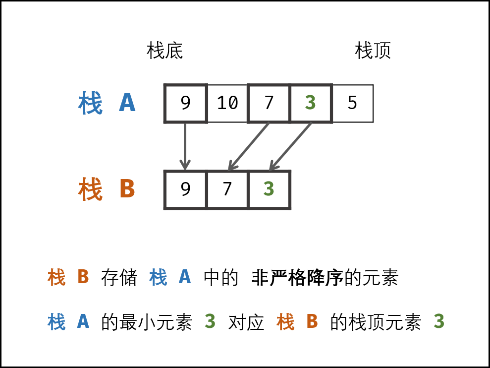
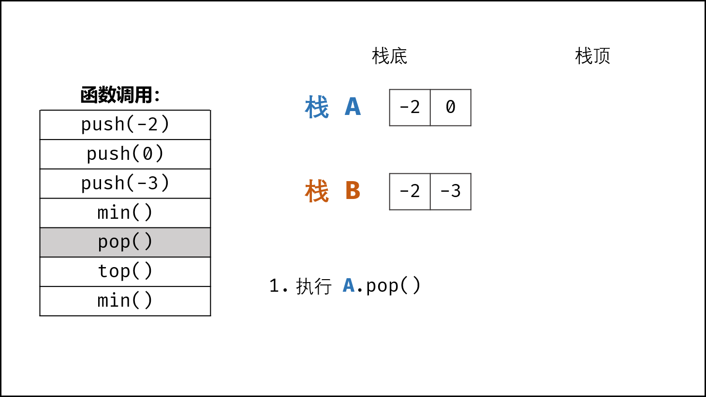

> 原文链接: https://leetcode-cn.com/problems/bao-han-minhan-shu-de-zhan-lcof


## 中文题目
<div><p>定义栈的数据结构，请在该类型中实现一个能够得到栈的最小元素的 min 函数在该栈中，调用 min、push 及 pop 的时间复杂度都是 O(1)。</p>

<p>&nbsp;</p>

<p><strong>示例:</strong></p>

<pre>MinStack minStack = new MinStack();
minStack.push(-2);
minStack.push(0);
minStack.push(-3);
minStack.min();   --&gt; 返回 -3.
minStack.pop();
minStack.top();      --&gt; 返回 0.
minStack.min();   --&gt; 返回 -2.
</pre>

<p>&nbsp;</p>

<p><strong>提示：</strong></p>

<ol>
	<li>各函数的调用总次数不超过 20000 次</li>
</ol>

<p>&nbsp;</p>

<p>注意：本题与主站 155 题相同：<a href="https://leetcode-cn.com/problems/min-stack/">https://leetcode-cn.com/problems/min-stack/</a></p>
</div>

## 通过代码
<RecoDemo>
</RecoDemo>


## 高赞题解
#### 解题思路：

> 普通栈的 `push()` 和 `pop()` 函数的复杂度为 $O(1)$ ；而获取栈最小值 `min()` 函数需要遍历整个栈，复杂度为 $O(N)$ 。

- **本题难点：** 将 `min()` 函数复杂度降为 $O(1)$ ，可通过建立辅助栈实现；
  - **数据栈 $A$ ：** 栈 $A$ 用于存储所有元素，保证入栈 `push()` 函数、出栈 `pop()` 函数、获取栈顶 `top()` 函数的正常逻辑。  
  - **辅助栈 $B$ ：** 栈 $B$ 中存储栈 $A$ 中所有 **非严格降序** 的元素，则栈 $A$ 中的最小元素始终对应栈 $B$ 的栈顶元素，即 `min()` 函数只需返回栈 $B$ 的栈顶元素即可。
- 因此，只需设法维护好 栈 $B$ 的元素，使其保持非严格降序，即可实现 `min()` 函数的 $O(1)$ 复杂度。

{:width=400}

##### 函数设计：

- **`push(x)` 函数：** 重点为保持栈 $B$ 的元素是 **非严格降序** 的。
  1. 将 $x$ 压入栈 $A$ （即 `A.add(x)` ）；
  2. 若 ① 栈 $B$ 为空 **或** ② $x$ **小于等于** 栈 $B$ 的栈顶元素，则将 $x$ 压入栈 $B$ （即 `B.add(x)` ）。

- **`pop()` 函数：** 重点为保持栈 $A, B$ 的 **元素一致性** 。
  1. 执行栈 $A$ 出栈（即 `A.pop()` ），将出栈元素记为 $y$ ；
  2. 若 $y$ 等于栈 $B$ 的栈顶元素，则执行栈 `B` 出栈（即 `B.pop()` ）。

- **`top()` 函数：** 直接返回栈 $A$ 的栈顶元素即可，即返回 `A.peek()` 。

- **`min()` 函数：** 直接返回栈 $B$ 的栈顶元素即可，即返回 `B.peek()` 。

<,,,,,,,,>

##### 复杂度分析：

- **时间复杂度 $O(1)$ ：** `push()`, `pop()`, `top()`, `min()` 四个函数的时间复杂度均为常数级别。
- **空间复杂度 $O(N)$ ：** 当共有 $N$ 个待入栈元素时，辅助栈 $B$ 最差情况下存储 $N$ 个元素，使用 $O(N)$ 额外空间。

#### 代码：

> Java 代码中，由于 Stack 中存储的是 `int` 的包装类 `Integer` ，因此需要使用 `equals()` 代替 `==` 来比较值是否相等。

```python []
class MinStack:
    def __init__(self):
        self.A, self.B = [], []

    def push(self, x: int) -> None:
        self.A.append(x)
        if not self.B or self.B[-1] >= x:
            self.B.append(x)

    def pop(self) -> None:
        if self.A.pop() == self.B[-1]:
            self.B.pop()

    def top(self) -> int:
        return self.A[-1]

    def min(self) -> int:
        return self.B[-1]
```

```java []
class MinStack {
    Stack<Integer> A, B;
    public MinStack() {
        A = new Stack<>();
        B = new Stack<>();
    }
    public void push(int x) {
        A.add(x);
        if(B.empty() || B.peek() >= x)
            B.add(x);
    }
    public void pop() {
        if(A.pop().equals(B.peek()))
            B.pop();
    }
    public int top() {
        return A.peek();
    }
    public int min() {
        return B.peek();
    }
}
```

## 统计信息
| 通过次数 | 提交次数 | AC比率 |
| :------: | :------: | :------: |
|    163100    |    289937    |   56.3%   |

## 提交历史
| 提交时间 | 提交结果 | 执行时间 |  内存消耗  | 语言 |
| :------: | :------: | :------: | :--------: | :--------: |
