> 原文链接: https://leetcode-cn.com/problems/cong-shang-dao-xia-da-yin-er-cha-shu-ii-lcof


## 中文题目
<div><p>从上到下按层打印二叉树，同一层的节点按从左到右的顺序打印，每一层打印到一行。</p>

<p>&nbsp;</p>

<p>例如:<br>
给定二叉树:&nbsp;<code>[3,9,20,null,null,15,7]</code>,</p>

<pre>    3
   / \
  9  20
    /  \
   15   7
</pre>

<p>返回其层次遍历结果：</p>

<pre>[
  [3],
  [9,20],
  [15,7]
]
</pre>

<p>&nbsp;</p>

<p><strong>提示：</strong></p>

<ol>
	<li><code>节点总数 &lt;= 1000</code></li>
</ol>

<p>注意：本题与主站 102 题相同：<a href="https://leetcode-cn.com/problems/binary-tree-level-order-traversal/">https://leetcode-cn.com/problems/binary-tree-level-order-traversal/</a></p>
</div>

## 通过代码
<RecoDemo>
</RecoDemo>


## 高赞题解
#### 解题思路：

> 建议先做 [面试题32 - I. 从上到下打印二叉树](https://leetcode-cn.com/problems/cong-shang-dao-xia-da-yin-er-cha-shu-lcof/solution/mian-shi-ti-32-i-cong-shang-dao-xia-da-yin-er-ch-4/) 再做此题，两题仅有微小区别，即本题需将 **每一层打印到一行** 。

**I. 按层打印：** 题目要求的二叉树的 **从上至下** 打印（即按层打印），又称为二叉树的 **广度优先搜索**（BFS）。BFS 通常借助 **队列** 的先入先出特性来实现。

**II. 每层打印到一行：** 将本层全部节点打印到一行，并将下一层全部节点加入队列，以此类推，即可分为多行打印。

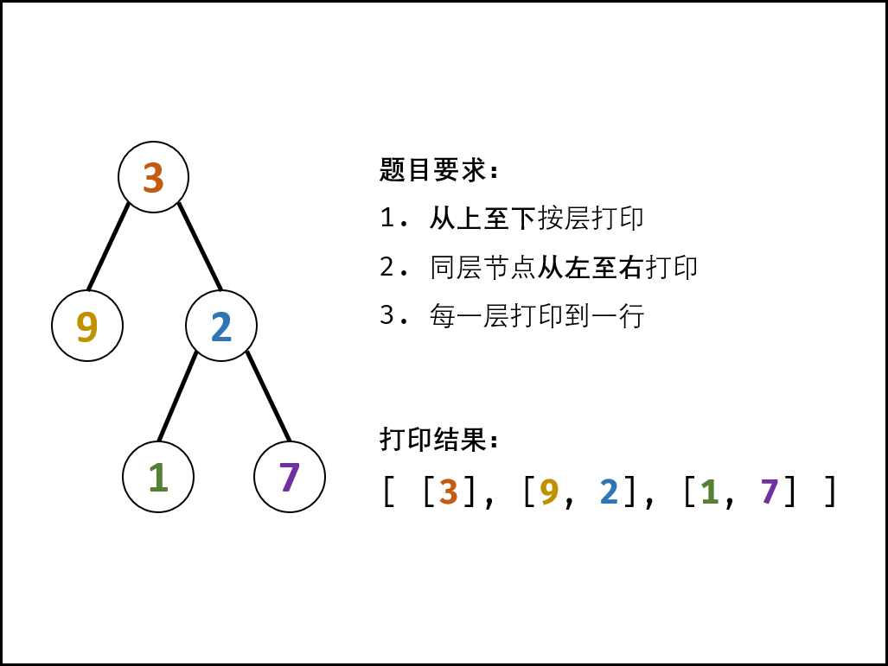{:width=400}

##### 算法流程：

1. **特例处理：** 当根节点为空，则返回空列表 `[]` ；
2. **初始化：** 打印结果列表 `res = []` ，包含根节点的队列 `queue = [root]` ；
3. **BFS 循环：** 当队列 `queue` 为空时跳出；
   1. 新建一个临时列表 `tmp` ，用于存储当前层打印结果；
   2. **当前层打印循环：** 循环次数为当前层节点数（即队列 `queue` 长度）；
      1. **出队：** 队首元素出队，记为 `node`；
      2. **打印：** 将 `node.val` 添加至 `tmp` 尾部；
      3. **添加子节点：** 若 `node` 的左（右）子节点不为空，则将左（右）子节点加入队列 `queue` ；
   3. 将当前层结果 `tmp` 添加入 `res` 。
4. **返回值：** 返回打印结果列表 `res` 即可。

<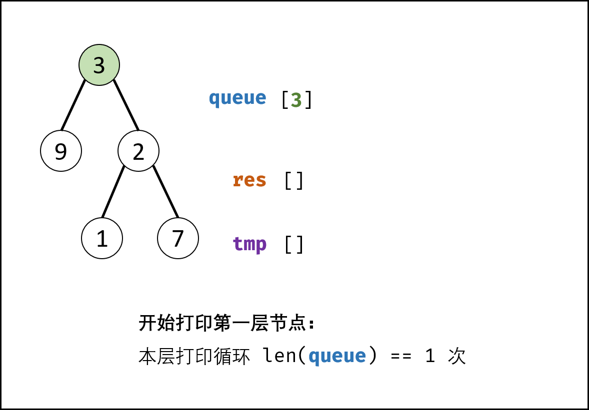,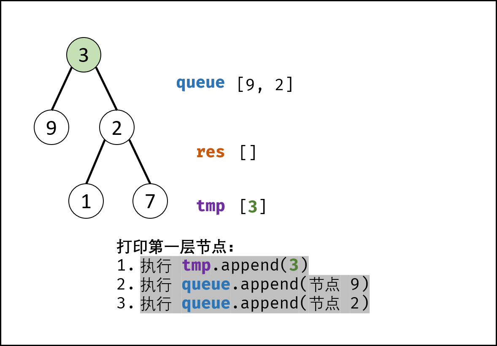,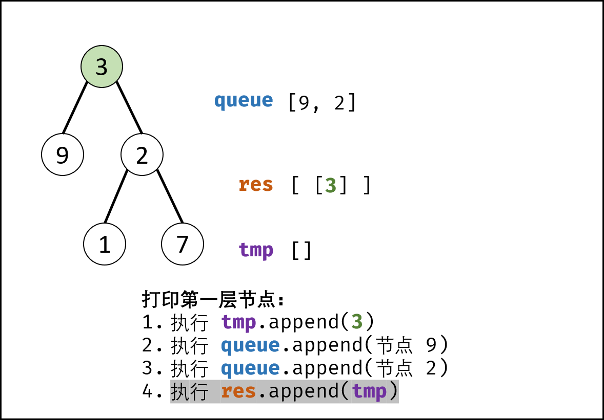,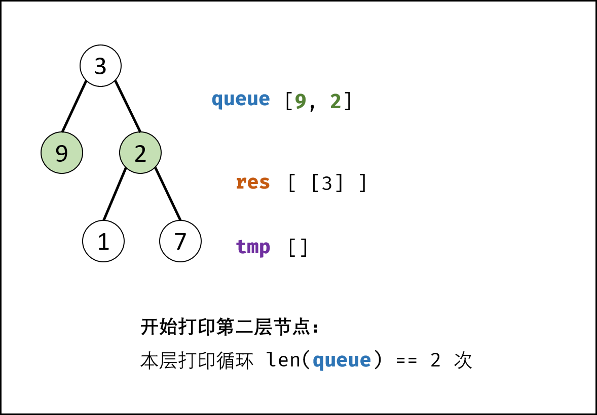,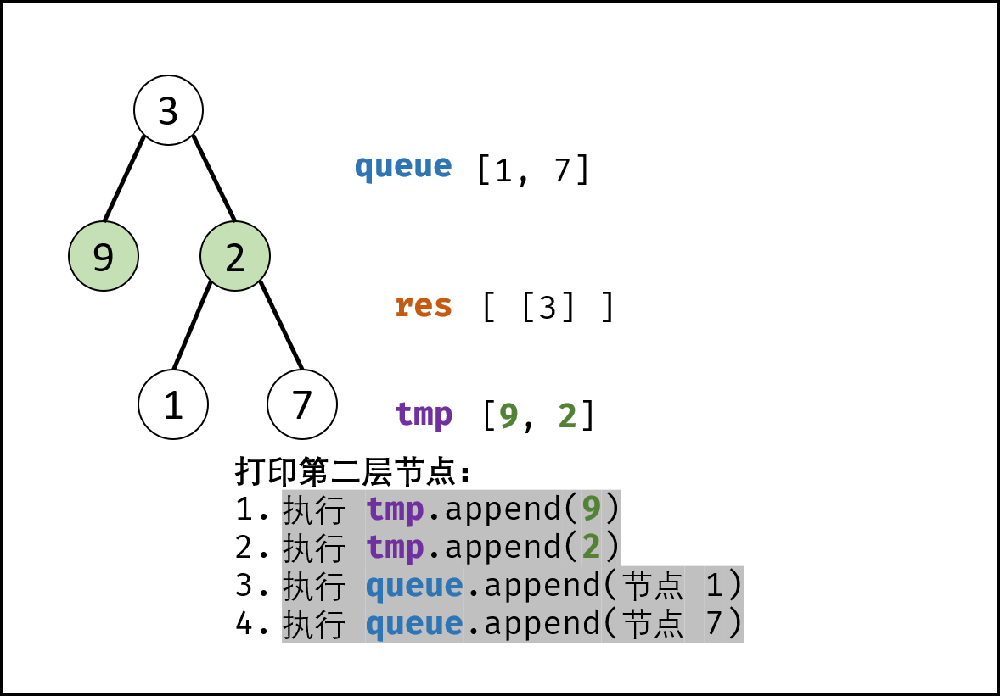,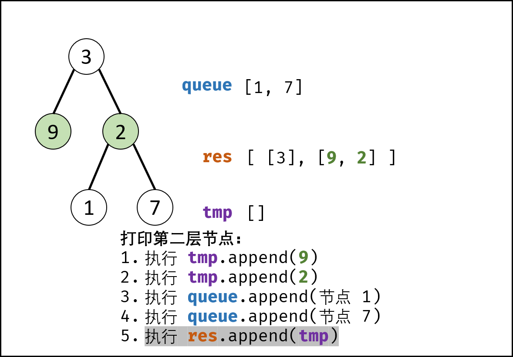,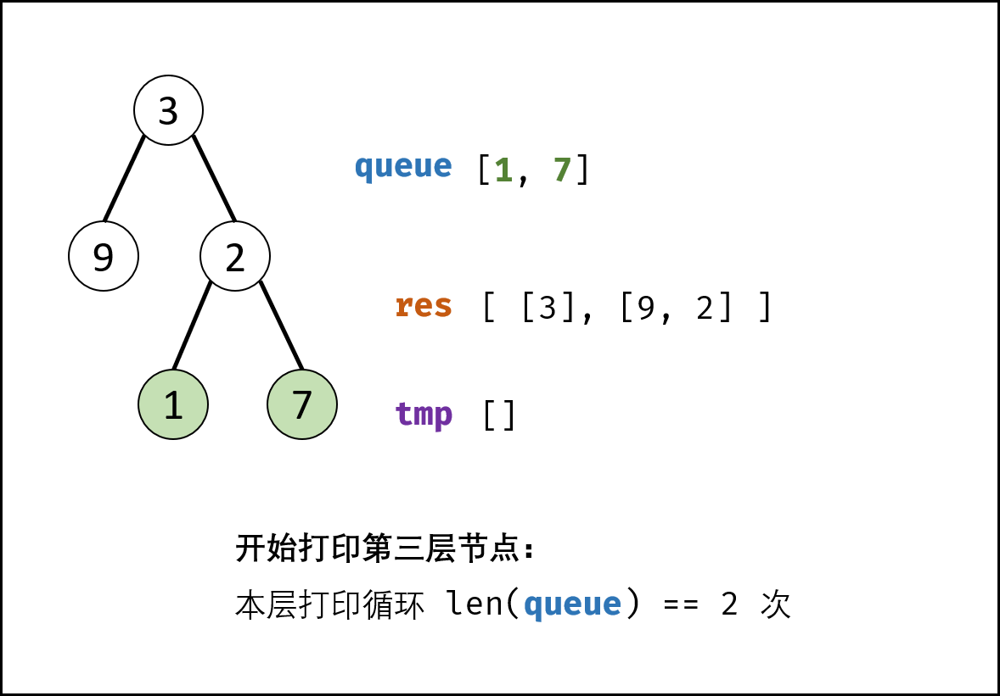,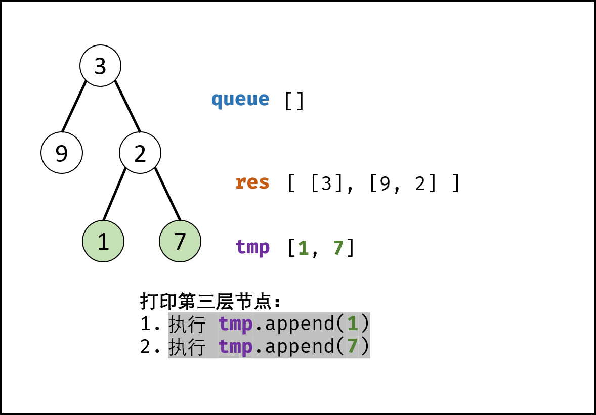,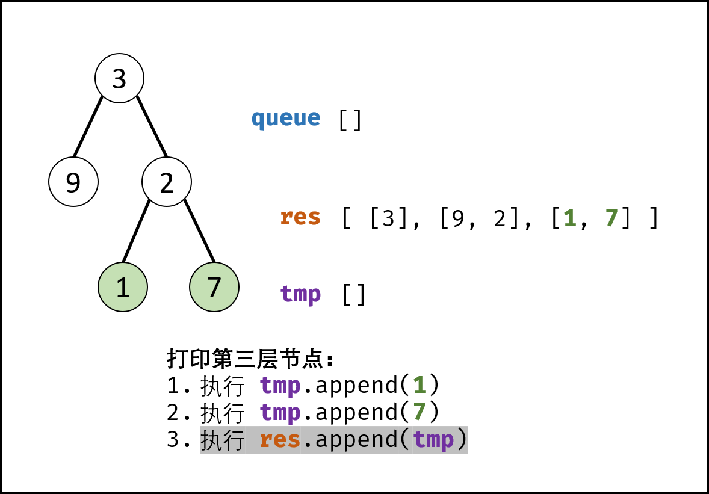,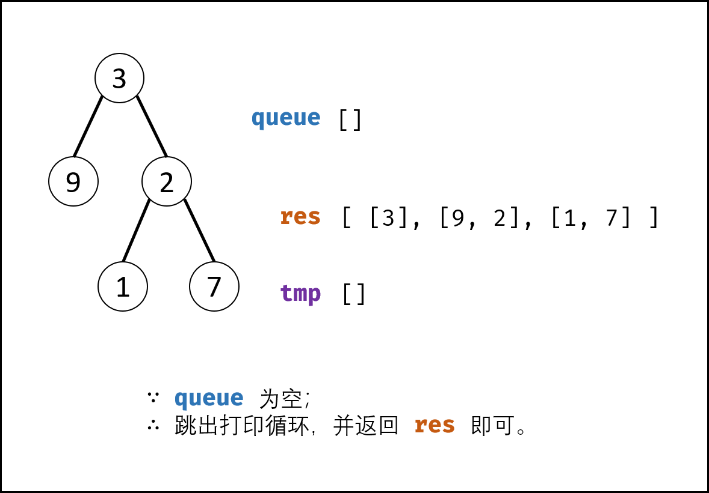>

##### 复杂度分析：

- **时间复杂度 $O(N)$ ：** $N$ 为二叉树的节点数量，即 BFS 需循环 $N$ 次。
- **空间复杂度 $O(N)$ ：** 最差情况下，即当树为平衡二叉树时，最多有 $N/2$ 个树节点**同时**在 `queue` 中，使用 $O(N)$ 大小的额外空间。

#### 代码：

> Python 中使用 collections 中的双端队列 `deque()` ，其 `popleft()` 方法可达到 $O(1)$ 时间复杂度；列表 list 的 `pop(0)` 方法时间复杂度为 $O(N)$ 。

```python []
class Solution:
    def levelOrder(self, root: TreeNode) -> List[List[int]]:
        if not root: return []
        res, queue = [], collections.deque()
        queue.append(root)
        while queue:
            tmp = []
            for _ in range(len(queue)):
                node = queue.popleft()
                tmp.append(node.val)
                if node.left: queue.append(node.left)
                if node.right: queue.append(node.right)
            res.append(tmp)
        return res
```

```java []
class Solution {
    public List<List<Integer>> levelOrder(TreeNode root) {
        Queue<TreeNode> queue = new LinkedList<>();
        List<List<Integer>> res = new ArrayList<>();
        if(root != null) queue.add(root);
        while(!queue.isEmpty()) {
            List<Integer> tmp = new ArrayList<>();
            for(int i = queue.size(); i > 0; i--) {
                TreeNode node = queue.poll();
                tmp.add(node.val);
                if(node.left != null) queue.add(node.left);
                if(node.right != null) queue.add(node.right);
            }
            res.add(tmp);
        }
        return res;
    }
}
```

## 统计信息
| 通过次数 | 提交次数 | AC比率 |
| :------: | :------: | :------: |
|    149656    |    217835    |   68.7%   |

## 提交历史
| 提交时间 | 提交结果 | 执行时间 |  内存消耗  | 语言 |
| :------: | :------: | :------: | :--------: | :--------: |
